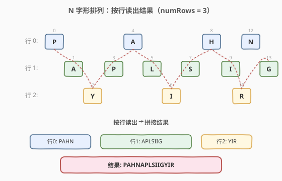
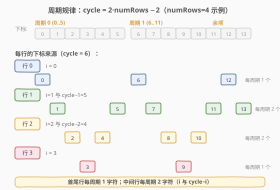
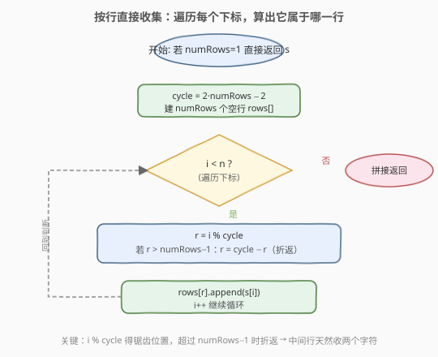
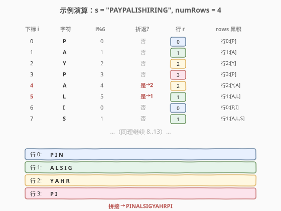

# LeetCode N 字形变换 题解

## 1. 题目概述

- **标题 / 题号**：N 字形变换（#6，medium）
- **链接**：https://leetcode.cn/problems/zigzag-conversion/
- **难度**：中等
- **标签**：字符串

**题意**：给定一个字符串 `s` 和一个整数 `numRows`，把 `s` 按「N 字形」（即先竖直向下、再斜向上）排列成 `numRows` 行，最后**按行从左到右、从上到下**依次读出，得到新字符串。

**示例 1**：

```text
输入：s = "PAYPALISHIRING", numRows = 3
输出："PAHNAPLSIIGYIR"
解释：排列如下，按行读出
P   A   H   N
A P L S I I G
Y   I   R
```

**示例 2**：

```text
输入：s = "PAYPALISHIRING", numRows = 4
输出："PINALSIGYAHRPI"
解释：
P     I    N
A   L S  I G
Y A   H R
P     I
```

**示例 3**：

```text
输入：s = "A", numRows = 1
输出："A"
```

**约束**：

- `1 <= s.length <= 1000`
- `s` 由英文字母（大小写）、`','` 和 `'.'` 组成
- `1 <= numRows <= 1000`

> 💡 本题的难点不在算法，而在**看破"Z 字形排列"背后的周期规律**。字符在行间的位置变化是一个固定长度的锯齿：先从第 0 行向下走到第 `numRows-1` 行，再折返向上回到第 0 行，如此循环。一旦算出周期 `cycle = 2·numRows − 2`，就能直接按下标确定每个字符属于哪一行，省去二维模拟。

## 2. 解题思路

### 2.1 暴力思路：二维矩阵模拟

开一个 `numRows × n` 的字符矩阵，按「下→右上→下」的方向逐字符填入，最后逐行拼接非空格子。

```text
matrix = [[''] * n for _ in range(numRows)]
方向 dir = +1，当前行 r = 0
for i, c in enumerate(s):
    matrix[r][i] = c
    if r == 0: dir = +1
    elif r == numRows-1: dir = -1
    r += dir
按行拼接 matrix
```

时间 `O(n)`，但空间 `O(numRows × n)`，且绝大多数格子是空的，浪费严重。

> ⚠️ 暴力模拟的问题是**空间浪费**——`numRows` 和 `n` 都可达 1000，矩阵开销 `O(n²)` 级。其实我们只需要每行的字符序列，不必记录每列的位置。

### 2.2 核心观察：周期规律直接定行

**关键性质**：字符在行间的走法是**周期性锯齿**。从第 0 行向下走到第 `numRows-1` 行（共 `numRows-1` 步），再斜向上回到第 0 行（又是 `numRows-1` 步），形成一个完整周期：

$$\text{cycle} = 2 \times \text{numRows} - 2$$

每个周期内，下标 `i` 在行间的位置由 `i % cycle` 决定：

- `i % cycle < numRows`：处于**竖直向下**阶段，行号 `r = i % cycle`
- `i % cycle >= numRows`：处于**斜向上**阶段，行号 `r = cycle - (i % cycle)`（折返）



**两种行**：

- **首行和尾行**（`r = 0` 或 `r = numRows-1`）：每个周期只贡献 **1 个**字符（竖直段那个）
- **中间行**：每个周期贡献 **2 个**字符——竖直段一个（位置 `r`）+ 斜向上段一个（位置 `cycle - r`）

> 💡 **为什么首尾行只有一个？** 首行只在周期起点（下标 `% cycle == 0`）出现，尾行只在 `% cycle == numRows-1` 出现；而中间行在下标 `% cycle == r` 和 `% cycle == cycle-r` 两个位置都出现（除非 `r == cycle-r`，那正是首尾行）。这个"每周期 1 个 vs 2 个"的差别是周期解法的关键。

### 2.3 周期规律图



上图以 `numRows = 4`（`cycle = 6`）为例，展示每个下标归属哪一行：

- **行 0**：下标 `0, 6, 12, …`（`i % 6 == 0`）
- **行 1**：下标 `1, 5, 7, 11, 13, …`（`i % 6 == 1` 或 `5`）
- **行 2**：下标 `2, 4, 8, 10, …`（`i % 6 == 2` 或 `4`）
- **行 3**：下标 `3, 9, …`（`i % 6 == 3`）

注意 `1` 和 `5` 都归行 1，`2` 和 `4` 都归行 2——这正是中间行每周期收 2 个字符的原因。

### 2.4 算法流程图



**完整步骤**：

1. **特判**：`numRows == 1` 时锯齿退化为原串，直接返回 `s`
2. **初始化**：`cycle = 2 * numRows - 2`，建 `numRows` 个空字符串 `rows[]`
3. **遍历下标** `i` **从 0 到 n-1**：
   - `r = i % cycle`
   - 若 `r >= numRows`：`r = cycle - r`（折返到斜向上段对应的行）
   - `rows[r].append(s[i])`
4. **拼接**：把 `rows[0..numRows-1]` 顺序连接，返回结果

> 💡 折返公式 `r = cycle - r` 的几何含义：`i % cycle` 落在 `[numRows, cycle)` 区间时，字符处于斜向上段，它所在行是从底部往上数。`cycle - r` 把斜向上段的位置映射回从顶部往下数的行号。例如 `numRows=4, cycle=6`，`i%6=5` 时 `r = 6-5 = 1`（行 1），`i%6=4` 时 `r = 6-4 = 2`（行 2）。

### 2.5 示例演算

以 `s = "PAYPALISHIRING", numRows = 4`（`cycle = 6`）为例：



下标 `0..5` 是第一个周期，`6..11` 是第二个周期：

| 下标 i | 字符 | i%6 | 折返? | 行 r | rows 累积 |
|--------|------|-----|-------|------|-----------|
| 0 | P | 0 | 否 | 0 | 行0:[P] |
| 1 | A | 1 | 否 | 1 | 行1:[A] |
| 2 | Y | 2 | 否 | 2 | 行2:[Y] |
| 3 | P | 3 | 否 | 3 | 行3:[P] |
| 4 | A | 4 | 是→2 | 2 | 行2:[Y,A] |
| 5 | L | 5 | 是→1 | 1 | 行1:[A,L] |
| 6 | I | 0 | 否 | 0 | 行0:[P,I] |
| 7 | S | 1 | 否 | 1 | 行1:[A,L,S] |
| … | … | … | … | … | （同理至 13） |

最终各行拼接：行0 `PIN` + 行1 `ALSIG` + 行2 `YAHR` + 行3 `PI` = `"PINALSIGYAHRPI"`。

> 💡 注意下标 `4` 和 `5` 触发了折返：`4%6=4 ≥ numRows=4`，所以 `r = 6-4 = 2`（归行 2）；`5%6=5`，`r = 6-5 = 1`（归行 1）。这正是斜向上段字符落入中间行的过程。

## 3. 参考代码

### C++（按行收集）

```cpp
// N字形变换.cpp —— 周期规律 + 按行收集
// 编译: g++ -O2 -std=c++17 N字形变换.cpp -o zigzag
#include <string>
#include <vector>
using namespace std;

class Solution {
  public:
    string convert(string s, int numRows) {
        if (numRows == 1 || numRows >= s.size())
            return s;

        int cycle = 2 * numRows - 2;
        vector<string> rows(numRows);

        for (int i = 0; i < s.size(); ++i) {
            int r = i % cycle;
            if (r >= numRows)
                r = cycle - r;   // 斜向上段折返
            rows[r].push_back(s[i]);
        }

        string ans;
        for (const auto& row : rows)
            ans += row;
        return ans;
    }
};
```

### Python

```python
class Solution:
    def convert(self, s: str, numRows: int) -> str:
        if numRows == 1 or numRows >= len(s):
            return s

        cycle = 2 * numRows - 2
        rows = [''] * numRows

        for i, c in enumerate(s):
            r = i % cycle
            if r >= numRows:
                r = cycle - r   # 斜向上段折返
            rows[r] += c

        return ''.join(rows)
```

> ⚠️ **必须特判** `numRows == 1`：此时 `cycle = 2*1 - 2 = 0`，取模 `i % 0` 会触发**除零异常**。`numRows == 1` 时 N 字形就是原串本身，直接返回。

## 4. 复杂度分析

| 维度 | 复杂度 | 说明 |
|------|--------|------|
| 时间复杂度 | `O(n)` | 遍历一次字符串，每个字符 `O(1)` 计算 `i % cycle` 并追加 |
| 空间复杂度 | `O(n)` | `rows[]` 共存 `n` 个字符；输出字符串 `O(n)` |

> ⚠️ 与暴力二维模拟的 `O(numRows × n)` 空间相比，按行收集只存非空字符，空间降到 `O(n)`。时间同为 `O(n)`，但常数更小（无空格子遍历）。

## 5. 扩展：按周期直接跳取

除了"遍历每个下标算行号"，还有一种**按行扫描、用周期直接跳取下标**的写法。它不依赖 `rows[]` 数组，直接按行构造结果：

```cpp
class Solution {
  public:
    string convert(string s, int numRows) {
        if (numRows == 1 || numRows >= s.size())
            return s;

        int n = s.size(), cycle = 2 * numRows - 2;
        string ans;
        for (int r = 0; r < numRows; ++r) {
            for (int i = r; i < n; i += cycle) {
                ans.push_back(s[i]);                  // 竖直段字符
                int j = i + cycle - 2 * r;            // 斜向上段字符
                if (r > 0 && r < numRows - 1 && j < n)
                    ans.push_back(s[j]);
            }
        }
        return ans;
    }
};
```

**思路**：对每一行 `r`，竖直段字符下标为 `r, r+cycle, r+2*cycle, …`；中间行还额外有斜向上段字符，其下标为 `竖直下标 + (cycle - 2*r)`。

> 💡 **两种写法对比**：
> - **按行收集**（遍历 `i` 算 `r`）：逻辑直观，一趟遍历，需 `rows[]` 辅助空间。
> - **按行跳取**（遍历 `r` 跳 `i`）：无需辅助数组，原地拼接，但中间行的第二个下标公式 `i + cycle - 2*r` 略绕。
>
> 面试推荐**按行收集**版，易讲易写；竞赛追求常数可选跳取版。

## 6. 面试要点

1. **`numRows == 1` 为什么要特判？**

   - `cycle = 2*numRows - 2`，`numRows=1` 时 `cycle=0`，`i % 0` 是除零错误。
   - 几何上 `numRows=1` 时 N 字形退化为单行原串，直接返回 `s` 即可。
   - 这是本题**最常见的坑**，面试官常借此考察边界意识。

2. **`cycle = 2*numRows - 2` 怎么来的？**

   - 一个完整周期 = 竖直向下 `numRows-1` 步（从行 0 到行 `numRows-1`）+ 斜向上 `numRows-1` 步（回到行 0）。
   - 总步数 `2*(numRows-1) = 2*numRows - 2`，即每 `cycle` 个字符重复一次行间走法。

3. **折返公式 `r = cycle - r` 的含义？**

   - `i % cycle` 落在 `[0, numRows)` 时是竖直段，行号就是 `i % cycle`。
   - 落在 `[numRows, cycle)` 时是斜向上段，此时字符在"往上走"。`cycle - r` 把斜向上段位置（从竖直段末尾起算）映射回行号（从顶部起算）。例如 `numRows=4, cycle=6`，`i%6=5` → `r=1`，`i%6=4` → `r=2`。

4. **中间行为什么每周期两个字符？**

   - 中间行 `r`（`0 < r < numRows-1`）在每个周期里出现两次：竖直段下标 `r`（`i%cycle==r`）和斜向上段下标 `cycle-r`（`i%cycle==cycle-r`），且 `r ≠ cycle-r`（因为 `r < numRows ≤ cycle-r` 当 `numRows>2`）。
   - 首行 `r=0` 和尾行 `r=numRows-1` 满足 `r == cycle-r`（首行 `0==cycle-0` 不成立，但首行只在 `i%cycle==0` 出现；尾行 `numRows-1 == cycle-(numRows-1)` 成立），所以每周期只一个字符。

5. **按行收集 vs 二维模拟，哪个好？**

   - **按行收集**：空间 `O(n)`，时间 `O(n)`，只存有效字符，是面试标准解法。
   - **二维模拟**：空间 `O(numRows × n)`，大量空格子浪费，且需处理方向切换，代码更繁琐。不推荐。

> 💡 **一句话总结**：N 字形变换是**周期规律题**的招牌——看破字符在行间走法的周期 `cycle = 2*numRows - 2`，就能用 `i % cycle` 直接定位每个字符属于哪一行，一趟遍历完成收集。特判 `numRows == 1`（防除零）是唯一易错点。与"模拟方向切换"的暴力法相比，周期法把空间从 `O(n²)` 降到 `O(n)`，体现了"找规律"在字符串变换题中的威力。

## 同类练习题

| # | 题目 | 与本题的关联 |
|---|------|-------------|
| 6 | [N 字形变换](https://leetcode.cn/problems/zigzag-conversion/)（题解） | 周期规律 + 按行收集 |
| 67 | [二进制求和](https://leetcode.cn/problems/add-binary/) | 字符串模拟进位，同属"字符串变换"系列 |
| 498 | [对角线遍历](https://leetcode.cn/problems/diagonal-traverse/) | 方向切换 + 边界折返，思路类似 N 字形的方向交替 |
| 54 | [螺旋矩阵](https://leetcode.cn/problems/spiral-matrix/)（[题解](54_螺旋矩阵.md)） | 按方向遍历矩阵，方向切换与边界处理同理 |
