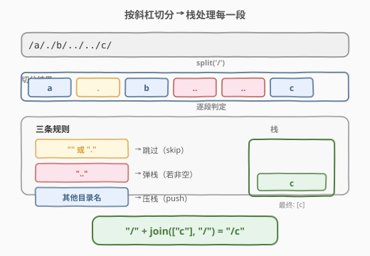
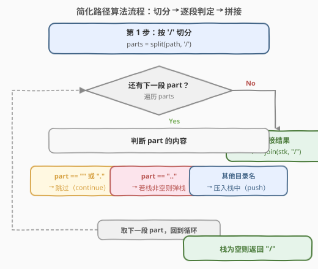
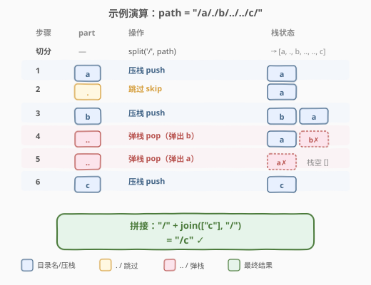

# LeetCode 简化路径 题解

## 1. 题目概述

- **标题 / 题号**：简化路径（#71，medium）
- **链接**：https://leetcode.cn/problems/simplify-path/
- **难度**：中等
- **标签**：栈、字符串、模拟

**题意**：给定一个字符串 `path`，表示一个 Unix 风格文件系统的**绝对路径**（以 `/` 开头），请将其转化为**规范路径**（canonical path）。

**规则**：

- 单个句号 `.` 表示**当前目录**，可忽略；
- 双句号 `..` 表示**上一级目录**，即「返回上一层」；
- 连续多个斜杠 `//` 等价于**单个斜杠** `/`；
- 其他字符串都是合法的文件/目录名。

**规范路径**的要求：

1. 以**单个 `/`** 开头；
2. 两个目录名之间**只有一个 `/`**；
3. **不以 `/` 结尾**（除非是根目录 `/` 本身）；
4. 不含 `.` 或 `..`（已全部解析）。

**示例 1**：

```text
输入：path = "/home/"
输出："/home"
解释：末尾斜杠去掉即可。
```

**示例 2**：

```text
输入：path = "/../"
输出："/"
解释：根目录无法再上一级，`..` 被丢弃。
```

**示例 3**：

```text
输入：path = "/a/./b/../../c/"
输出："/c"
解释：a →（. 忽略）→ b →（.. 回退到 a）→（.. 回退到根）→ c，最终只剩 c。
```

**约束**：

- $1 \leq \text{path.length} \leq 3000$
- `path` 由英文字母、数字、`.`、`/`、`_` 组成
- `path` 是一个有效的绝对路径

> 💡 **核心转化**：把路径按 `/` 切分成若干段，用**栈**模拟「进入目录」与「返回上级」——遇到普通目录名就**压栈**，遇到 `..` 就**弹栈**，遇到 `.` 或空串就**跳过**。最后栈中剩余的目录名按序拼接，即为规范路径。

## 2. 解题思路

### 2.1 暴力思路

逐字符扫描，维护一个目录名列表，遇到 `/` 时判断上一段是什么并做相应处理。问题在于：`..` 需要回退，而回退后可能又遇到新的 `/` 导致边界判断混乱，容易写出又长又容易出错的分支逻辑。

> 💡 暴力的困难在于「分隔符与语义处理混在一起」。换一个角度——**先把切分工作交给工具，再只关心每一段的语义**——问题立刻清晰。

### 2.2 核心观察：切分 + 栈模拟



关键洞察：**斜杠只是分隔符，不携带语义**。先用 `/` 把路径切成若干段（可能含空串、`.`、`..`、目录名），然后对每一段套用三条简单规则：

| 段内容 | 语义 | 栈操作 |
|--------|------|--------|
| `""`（空串） | 连续斜杠或末尾斜杠 | **跳过** |
| `"."` | 当前目录 | **跳过** |
| `".."` | 返回上一级 | **弹栈**（若栈非空） |
| 其他 | 合法目录名 | **压栈** |

> ⚠️ `..` 在**根目录**（栈为空）时无处可退，直接丢弃——这是示例 2 输出 `/` 的原因。

### 2.3 算法流程图



详细步骤：

1. **切分**：`split(path, '/')` 得到段数组 `parts`；
2. **遍历**每一段 `part`：
   - 若 `part` 为空或 `"."`：跳过；
   - 若 `part == ".."`：若栈非空则弹栈；
   - 否则：把 `part` 压入栈中；
3. **拼接**：`"/" + join(stack, "/")`，若栈为空则返回 `"/"`。

> 💡 **为什么用栈而不是双指针？** 栈的 LIFO 特性天然对应「返回上一级」——最近压入的目录名就是当前所在目录，弹栈即回退。双指针虽然也能实现，但语义不如栈直观。

### 2.4 示例演算

以 `path = "/a/./b/../../c/"` 为例：



| 步骤 | part | 语义 | 栈操作 | 栈状态（左→右 = 底→顶） |
|------|------|------|--------|--------------------------|
| 切分 | — | — | — | `["a", ".", "b", "..", "..", "c"]` |
| 1 | `a` | 目录名 | 压栈 | `[a]` |
| 2 | `.` | 当前目录 | 跳过 | `[a]` |
| 3 | `b` | 目录名 | 压栈 | `[a, b]` |
| 4 | `..` | 返回上级 | 弹栈（弹出 `b`） | `[a]` |
| 5 | `..` | 返回上级 | 弹栈（弹出 `a`） | `[]` |
| 6 | `c` | 目录名 | 压栈 | `[c]` |

最终栈为 `[c]`，拼接得 `"/c"` ✓。

再以 `path = "/home//foo/"` 为例（测试连续斜杠）：

| 步骤 | part | 语义 | 栈操作 | 栈状态 |
|------|------|------|--------|--------|
| 切分 | — | — | — | `["home", "", "foo", ""]` |
| 1 | `home` | 目录名 | 压栈 | `[home]` |
| 2 | `""` | 连续斜杠 | 跳过 | `[home]` |
| 3 | `foo` | 目录名 | 压栈 | `[home, foo]` |
| 4 | `""` | 末尾斜杠 | 跳过 | `[home, foo]` |

最终栈为 `[home, foo]`，拼接得 `"/home/foo"` ✓。

## 3. 参考代码

### C++

```cpp
class Solution {
  public:
    string simplifyPath(string path) {
        vector<string> stk;
        istringstream iss(path);
        string part;
        while (getline(iss, part, '/')) {
            if (part.empty() || part == ".") {
                continue;
            } else if (part == "..") {
                if (!stk.empty()) stk.pop_back();
            } else {
                stk.push_back(part);
            }
        }
        string result;
        for (const string& dir : stk) {
            result += "/" + dir;
        }
        return result.empty() ? "/" : result;
    }
};
```

### Python

```python
class Solution:
    def simplifyPath(self, path: str) -> str:
        stk = []
        for part in path.split("/"):
            if not part or part == ".":
                continue
            elif part == "..":
                if stk:
                    stk.pop()
            else:
                stk.append(part)
        return "/" + "/".join(stk)
```

> ⚠️ **C++ 细节**：`getline(iss, part, '/')` 以 `/` 为分隔符逐段读取，连续斜杠会产生空串 `part`，需靠 `part.empty()` 过滤。**Python 细节**：`"/".join([])` 得空串，`"/" + ""` = `"/"`，天然处理根目录。

## 4. 复杂度分析

| 维度 | 复杂度 | 说明 |
|------|--------|------|
| 时间复杂度 | $O(n)$ | 切分遍历一遍 $O(n)$，每段处理 $O(1)$，拼接 $O(n)$ |
| 空间复杂度 | $O(n)$ | 切分结果数组与栈最坏各存 $O(n)$ 个段 |

> 💡 这是该题的最优解：每个字符最多被扫描两遍（切分一遍、拼接一遍），无法更快。

## 5. 扩展：原地双指针写法（不依赖 split）

如果面试官要求**不使用 `split`**（考察底层字符串处理能力），可以用双指针逐段提取：

```python
class Solution:
    def simplifyPath(self, path: str) -> str:
        stk = []
        i, n = 0, len(path)
        while i < n:
            while i < n and path[i] == "/":   # 跳过连续斜杠
                i += 1
            if i == n:
                break
            j = i
            while j < n and path[j] != "/":   # 提取一段目录名
                j += 1
            part = path[i:j]
            if part == "..":
                if stk:
                    stk.pop()
            elif part != ".":
                stk.append(part)
            i = j
        return "/" + "/".join(stk)
```

> 💡 双指针写法省去了 `split` 产生的临时数组，空间从 $O(n)$ 降到 $O(k)$（$k$ 为目录数）。但逻辑等价，面试中 `split` 版本更清晰、不易出错——**先写对再优化**。

## 6. 面试要点

1. **为什么用栈而不是队列？**
   - `..` 表示「返回上一级」，即撤销最近进入的目录——这是 LIFO（后进先出）操作，天然对应栈。队列的 FIFO 无法实现「撤销最近一步」。

2. **根目录的 `..` 怎么处理？**
   - 栈为空时表示已在根目录，无处可退，直接丢弃 `..`。示例 2 `"/../"` 输出 `"/"` 即此规则。

3. **`split` 产生的空串有哪些来源？**
   - 三种：① 连续斜杠 `//` 之间的空串；② 末尾斜杠后的空串；③ 开头斜杠后的空串（但开头斜杠后若有目录名则非空）。统一用 `if part.empty()` / `if not part` 过滤即可。

4. **不使用 `split` 怎么做？**
   - 双指针：`i` 跳过斜杠定位段首，`j` 扫到下一个斜杠定位段尾，`path[i:j]` 即一段。见第 5 节。

5. **这题和 394（字符串解码）的栈用法有什么区别？**
   - [394. 字符串解码](https://leetcode.cn/problems/decode-string/)（[题解](../0301-0400/394_字符串解码.md)）用栈维护**嵌套层级**（遇到 `[` 压入当前状态，遇到 `]` 弹出并拼接）；本题用栈维护**路径层级**（遇到目录名压入，遇到 `..` 弹出）。两者同属「栈维护层级」骨架，但触发弹出的条件不同：394 靠 `]`，本题靠 `..`。

## 同类练习题

| # | 题目 | 与本题的关联 |
|---|------|-------------|
| 150 | [逆波兰表达式求值](https://leetcode.cn/problems/evaluate-reverse-polish-notation/)（[题解](../0101-0200/150_逆波兰表达式求值.md)） | 用栈处理运算符的压栈/弹栈，最后求值——同属「扫描 + 栈模拟」骨架 |
| 394 | [字符串解码](https://leetcode.cn/problems/decode-string/)（[题解](../0301-0400/394_字符串解码.md)） | 用栈维护嵌套层级（`[` 压入、`]` 弹出拼接），与本题的「路径层级」异曲同工 |
| 946 | [验证栈序列](https://leetcode.cn/problems/validate-stack-sequences/)（[题解](../0901-1000/946_验证栈序列.md)） | 栈模拟判定——压栈与弹栈的贪心配合，验证弹出序列是否可行 |
| 232 | [用栈实现队列](https://leetcode.cn/problems/implement-queue-using-stacks/)（[题解](../0201-0300/232_用栈实现队列.md)） | 双栈倒换实现队列，考察栈的灵活运用与摊还分析 |
| 20 | [有效的括号](https://leetcode.cn/problems/valid-parentheses/)（[题解](../0001-0100/20_有效括号.md)） | 栈的经典判定——遇到右括号弹栈匹配，与本题「遇到 `..` 弹栈」的弹出逻辑遥相呼应 |
