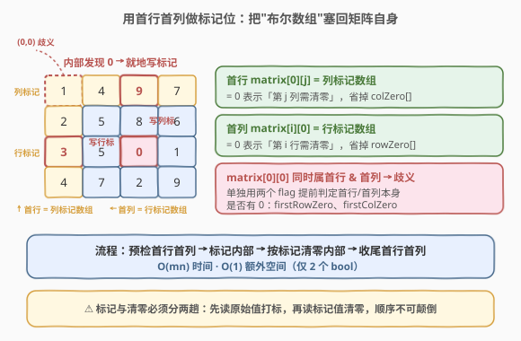
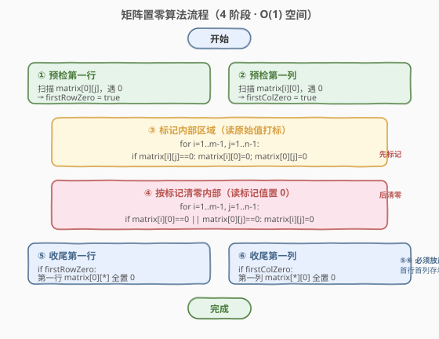
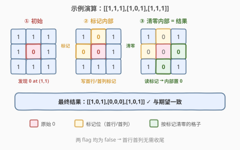

# LeetCode 矩阵置零 题解

## 1. 题目概述

- **标题 / 题号**：矩阵置零（#73，medium）
- **链接**：https://leetcode.cn/problems/set-matrix-zeroes/
- **难度**：中等
- **标签**：数组、哈希表、矩阵

**题意**：给定一个 `m × n` 的整数矩阵 `matrix`，如果某个元素为 `0`，则将其**所在行和列的所有元素**置为 `0`。要求**原地**修改。

**示例 1**：

```text
输入：matrix = [[1,1,1],[1,0,1],[1,1,1]]
输出：[[1,0,1],[0,0,0],[1,0,1]]
解释：位于 (1,1) 的 0，把第 1 行和第 1 列全部清零。
```

```text
处理前         处理后
1 1 1         1 0 1
1 0 1   →     0 0 0
1 1 1         1 0 1
```

**示例 2**：

```text
输入：matrix = [[0,1,2,0],[3,4,5,2],[1,3,1,5]]
输出：[[0,0,0,0],[0,4,5,0],[0,3,1,0]]
```

**约束**：

- `m == matrix.length`，`n == matrix[i].length`
- `1 <= m, n <= 200`
- `-2^31 <= matrix[i][j] <= 2^31 - 1`
- **进阶**：一个直观的解法是使用 $O(mn)$ 的额外空间，但这并不是最好的解法。一个简单的改进方案是使用 $O(m + n)$ 的额外空间，但这仍然不是最好的解法。你能想出一个仅使用**常量空间**的解决方案吗？

> 💡 这是一道经典的「**原地编码（in-place marking）**」模板题。核心矛盾是：置零会破坏原始信息，而判断某格该不该清零又依赖原始信息。破局点在于——**把"哪些行/列要清零"的信息就地编码进矩阵自己**，从而省掉额外数组。掌握这一思想可迁移到 289 生命游戏、41 缺失的第一个正数 等一整类「原地状态压缩」题。

## 2. 解题思路

### 2.1 暴力思路：记录所有 0 的位置

最直观的做法：第一遍扫描，把所有值为 `0` 的坐标 `(i, j)` 收集到一个列表里；第二遍遍历该列表，对每个坐标把第 `i` 行、第 `j` 列整体清零。

- 时间 $O(mn)$，空间 $O(mn)$（最坏每个元素都是 0）。
- 正确，但**违反进阶的 $O(1)$ 空间要求**。

> ⚠️ 一个常见错误是「边扫边置零」：扫到一个 0 就立刻把它的行列清零。这样会把**后来被清零产生的 0** 误当成**原始 0**，连锁反应把整个矩阵清成 0。因此必须**先记录、再置零**，分两阶段进行。

### 2.2 改进：两布尔数组 $O(m+n)$

注意到我们其实**不需要记每个 0 的坐标**，只需知道「第 `i` 行是否出现过 0」「第 `j` 列是否出现过 0」。于是开两个布尔数组 `rowZero[m]`、`colZero[n]`：

1. 第一遍扫描，遇到 `matrix[i][j] == 0` 就 `rowZero[i] = colZero[j] = true`。
2. 第二遍遍历，若 `rowZero[i] || colZero[j]` 则 `matrix[i][j] = 0`。

空间降到 $O(m+n)$。还能更省吗？能——这两个布尔数组的信息**完全可以塞回矩阵的第一行和第一列**。

### 2.3 核心观察：用首行首列做标记位 $O(1)$



关键洞察：**第一行和第一列本身就是两个天然的"布尔数组"**。当我们在内部区域 `(i, j)`（`i ≥ 1, j ≥ 1`）发现一个 0 时，不另开数组，而是直接把 `matrix[i][0]` 和 `matrix[0][j]` 置 0 作为「第 i 行、第 j 列需清零」的标记。最后根据这些标记统一清零即可。

唯一要小心的是：**`matrix[0][0]` 同时属于第一行和第一列**，一个格子无法同时表达两个独立信息，会产生歧义。解决办法是为「第一行本身是否有 0」「第一列本身是否有 0」各设一个独立的布尔变量 `firstRowZero`、`firstColZero`，提前单独判定，从而把首行/首列从"被标记"的角色中摘出来。

> 💡 为什么标记和清零必须分两趟？因为标记位 `matrix[i][0]` 一旦在清零阶段被改写，就再也无法判断「这一行原本该不该清零」。所以流程固定是：**先标记（读原始值）→ 再清零（读标记值）**，顺序不可颠倒。

### 2.4 算法流程图



四阶段总结：

1. **预检首行首列**：分别扫描，得到 `firstRowZero`、`firstColZero`。
2. **标记内部**：遍历 `i ≥ 1, j ≥ 1`，遇 0 则把 `matrix[i][0]` 与 `matrix[0][j]` 置 0。
3. **按标记清零内部**：遍历 `i ≥ 1, j ≥ 1`，若 `matrix[i][0] == 0 || matrix[0][j] == 0` 则置 0。
4. **收尾首行首列**：按 `firstRowZero`、`firstColZero` 分别把第一行、第一列整体清零。

> ⚠️ 第 4 步必须**放在最后**：若先清了第一行/第一列，就会破坏存放在其上的标记，导致第 3 步判错。

### 2.5 示例演算

以 `matrix = [[1,1,1],[1,0,1],[1,1,1]]` 为例：



**阶段一 · 预检**：第一行无 0 → `firstRowZero = false`；第一列无 0 → `firstColZero = false`。

**阶段二 · 标记内部**：扫描 `i ≥ 1, j ≥ 1`，发现 `matrix[1][1] == 0`，于是把 `matrix[1][0] = 0`、`matrix[0][1] = 0`：

| 标记动作 | 矩阵状态 |
|----------|----------|
| 初始 | [[1,1,1],[1,0,1],[1,1,1]] |
| (1,1)=0 → 标记首列(1)与首行(1) | [[1,**0**,1],[**0**,0,1],[1,1,1]] |

**阶段三 · 按标记清零内部**：`i ≥ 1, j ≥ 1`，若 `matrix[i][0]==0` 或 `matrix[0][j]==0` 则置 0：

| 位置 (i,j) | 触发标记 | 结果 |
|------------|----------|------|
| (1,1) | matrix[1][0]=0 | 0（已是 0） |
| (1,2) | matrix[1][0]=0 | → 0 |
| (2,1) | matrix[0][1]=0 | → 0 |
| (2,2) | 两个标记均非 0 | 保持 1 |

状态变为 `[[1,0,1],[0,0,0],[1,0,1]]`。

**阶段四 · 收尾**：两个 flag 均为 false，首行首列不动。

最终结果 `[[1,0,1],[0,0,0],[1,0,1]]`，与期望一致 ✓

## 3. 参考代码

### C++（首行首列标记 + 两个 flag）

```cpp
class Solution {
  public:
    void setZeroes(vector<vector<int>>& matrix) {
        int m = matrix.size(), n = matrix[0].size();
        bool firstRowZero = false, firstColZero = false;

        // 1. 预检：第一行 / 第一列本身是否含 0
        for (int j = 0; j < n; ++j)
            if (matrix[0][j] == 0) firstRowZero = true;
        for (int i = 0; i < m; ++i)
            if (matrix[i][0] == 0) firstColZero = true;

        // 2. 标记：用内部区域 (i>=1, j>=1) 的 0 给首行/首列打标
        for (int i = 1; i < m; ++i) {
            for (int j = 1; j < n; ++j) {
                if (matrix[i][j] == 0) {
                    matrix[i][0] = 0;
                    matrix[0][j] = 0;
                }
            }
        }

        // 3. 清零：根据首行/首列标记清零内部区域
        for (int i = 1; i < m; ++i) {
            for (int j = 1; j < n; ++j) {
                if (matrix[i][0] == 0 || matrix[0][j] == 0) {
                    matrix[i][j] = 0;
                }
            }
        }

        // 4. 收尾：单独处理首行 / 首列（必须最后做）
        if (firstRowZero)
            for (int j = 0; j < n; ++j) matrix[0][j] = 0;
        if (firstColZero)
            for (int i = 0; i < m; ++i) matrix[i][0] = 0;
    }
};
```

### Python

```python
class Solution:
    def setZeroes(self, matrix: List[List[int]]) -> None:
        m, n = len(matrix), len(matrix[0])
        first_row_zero = any(matrix[0][j] == 0 for j in range(n))
        first_col_zero = any(matrix[i][0] == 0 for i in range(m))

        # 用内部 0 给首行/首列打标
        for i in range(1, m):
            for j in range(1, n):
                if matrix[i][j] == 0:
                    matrix[i][0] = 0
                    matrix[0][j] = 0

        # 按标记清零内部
        for i in range(1, m):
            for j in range(1, n):
                if matrix[i][0] == 0 or matrix[0][j] == 0:
                    matrix[i][j] = 0

        # 收尾首行/首列
        if first_row_zero:
            for j in range(n):
                matrix[0][j] = 0
        if first_col_zero:
            for i in range(m):
                matrix[i][0] = 0
```

> 💡 **第 4 步顺序不能换**：必须先清内部（读标记）、最后清首行首列。若先清第一行，`matrix[0][j]` 上的列标记会被抹掉，内部清零就会漏判。

## 4. 复杂度分析

| 维度 | 复杂度 | 说明 |
|------|--------|------|
| 时间复杂度 | $O(m \times n)$ | 预检、标记、清零、收尾各遍历矩阵一次，常数趟 |
| 空间复杂度 | $O(1)$ | 仅用 `firstRowZero`、`firstColZero` 两个布尔变量，标记信息全部就地存于矩阵 |

> ⚠️ $O(mn)$ 时间是**下界**：每个元素都可能影响结果，至少要"看"一遍。

## 5. 扩展：只用一个 flag 的写法

`matrix[0][0]` 既然有歧义，可以让它**专职记录第一列**，第一行另用一个 flag：

```cpp
class Solution {
  public:
    void setZeroes(vector<vector<int>>& matrix) {
        int m = matrix.size(), n = matrix[0].size();
        bool firstRowZero = false;

        for (int j = 0; j < n; ++j)
            if (matrix[0][j] == 0) firstRowZero = true;
        // matrix[0][0] 专职标记第一列；第一行用 firstRowZero

        for (int i = 1; i < m; ++i) {
            for (int j = 1; j < n; ++j) {
                if (matrix[i][j] == 0) {
                    matrix[i][0] = 0;
                    matrix[0][j] = 0;          // 含 matrix[0][0] 作为列标记
                }
            }
        }

        for (int i = 1; i < m; ++i) {
            for (int j = 1; j < n; ++j) {
                if (matrix[i][0] == 0 || matrix[0][j] == 0)
                    matrix[i][j] = 0;
            }
        }

        if (firstRowZero)
            for (int j = 0; j < n; ++j) matrix[0][j] = 0;
        if (matrix[0][0] == 0)
            for (int i = 0; i < m; ++i) matrix[i][0] = 0;
    }
};
```

两种写法对比：

| 写法 | 额外变量 | 思路 | 特点 |
|------|----------|------|------|
| 双 flag | 2 个 bool | 首行首列各用一个独立 flag 判定 | **逻辑对称、最不易错**，面试首选 |
| 单 flag | 1 个 bool | `matrix[0][0]` 专职列标记，行用 flag | 极致省空间，但 `matrix[0][0]` 身兼数职，易写错边界 |

> 💡 面试推荐讲**双 flag** 版本：可读性最高。若面试官追问"能否再省一个变量"，再展示单 flag 版本，体现对 `matrix[0][0]` 歧义点的深入理解。

## 6. 面试要点

1. **为什么不能边扫边置零？**

   - 扫到一个 0 立刻清行清列，会让"被清出来的 0"在后续被当成"原始 0"，产生连锁反应把整个矩阵清零。正确做法是**先记录、后置零**，分阶段进行。

2. **为什么首行首列要用单独的 flag？**

   - `matrix[0][0]` 同时属于第一行和第一列，一个格子无法同时表达「第一行是否有 0」和「第一列是否有 0」两件事。把首行首列从"被标记"角色中摘出、用独立 flag 提前判定，就避免了这处歧义。

3. **标记阶段和清零阶段能合并成一趟吗？**

   - 不能。标记位存放在首行首列上，清零阶段要反复读取它们；若边标记边清零，会改写尚未使用的标记位，导致漏判或误判。两阶段顺序固定：**先标记 → 再清零 → 最后收尾首行首列**。

4. **为什么收尾首行首列要放最后？**

   - 首行首列上存着内部区域清零所需的标记。若先清掉它们，第 3 步清零就读不到列标记/行标记了。所以必须等内部清零完成，再依据 flag 处理首行首列。

5. **这种"原地编码"思想还在哪些题里出现？**

   - [289. 生命游戏](https://leetcode.cn/problems/game-of-life/) 用每个格子的**第 2 位**记录下一状态，避免覆盖当前状态；[41. 缺失的第一个正数](https://leetcode.cn/problems/first-missing-positive/) 把数组本身当哈希表做原地标记。核心都是「**输入数据自带存储空间，就地编码额外信息**」。

## 同类练习题

| # | 题目 | 与本题的关联 |
|---|------|-------------|
| 289 | [生命游戏](https://leetcode.cn/problems/game-of-life/) | 同样「原地编码」记录状态变更，用第 2 位存下一状态，思想完全同构 |
| 48 | [旋转图像](https://leetcode.cn/problems/rotate-image/) | 原地矩阵操作，把复杂变换拆成简单步骤的组合 |
| 54 | [螺旋矩阵](https://leetcode.cn/problems/spiral-matrix/) | 矩阵坐标与边界控制，同属矩阵思维训练 |
| 36 | [有效的数独](https://leetcode.cn/problems/valid-sudoku/) | 用标记位记录「某行/某列/某宫是否出现过某数字」，同属"标记位记录行列信息" |
| 41 | [缺失的第一个正数](https://leetcode.cn/problems/first-missing-positive/) | 把数组本身当哈希表原地标记，O(1) 空间技巧的另一经典应用 |
