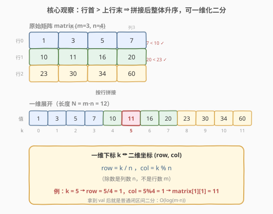
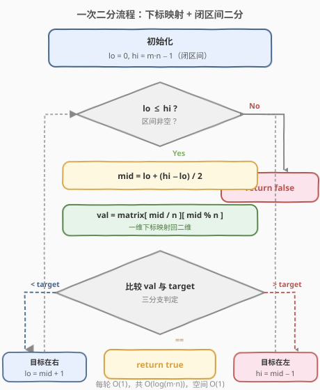
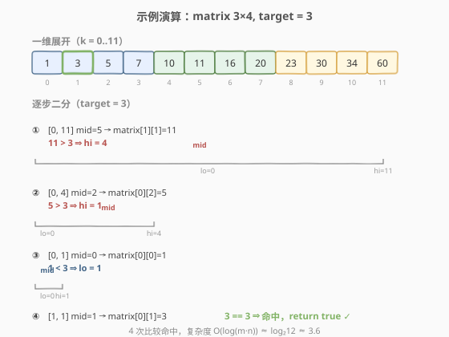

# LeetCode 搜索二维矩阵 题解

## 1. 题目概述

- **标题 / 题号**：搜索二维矩阵（#74，medium）
- **链接**：https://leetcode.cn/problems/search-a-2d-matrix/
- **难度**：中等
- **标签**：数组、二分查找

**题意**：给你一个 `m x n` 的整数矩阵 `matrix`，同时给定一个整数 `target`。该矩阵具有如下性质：

- 每行中的整数**从左到右升序**排列；
- 每行的**第一个整数大于上一行的最后一个整数**。

请你判断 `target` 是否在矩阵中出现，出现返回 `true`，否则返回 `false`。

> ⚠️ 进阶要求：必须设计一个 `O(log(m·n))` 时间复杂度的算法。这意味着线性扫描行不通，必须用**二分查找**。

**示例 1**：

```text
输入：matrix = [[1,3,5,7],[10,11,16,20],[23,30,34,60]], target = 3
输出：true
```

```text
矩阵：
 1   3   5   7
10  11  16  20
23  30  34  60

target = 3 出现在第 0 行第 1 列 → 返回 true
```

**示例 2**：

```text
输入：matrix = [[1,3,5,7],[10,11,16,20],[23,30,34,60]], target = 13
输出：false
```

**约束**：

- `m == matrix.length`，`n == matrix[i].length`
- `1 <= m, n <= 100`
- `-10^4 <= matrix[i][j], target <= 10^4`

## 2. 解题思路

### 2.1 暴力思路

逐个遍历矩阵所有 `m·n` 个元素，与 `target` 比较，时间 $O(m \times n)$、空间 $O(1)$。简单粗暴，但完全没利用「行升序 + 行间严格递进」这两条关键性质，且不满足 `O(log(m·n))` 的要求。

一个稍好的改进是**逐行二分**：对每一行单独做二分，时间 $O(m \log n)$。它利用了「行内升序」，但仍忽略了「行间也整体有序」这一更强条件。

> 💡 关键在于题目第二条性质：「每行首元素 > 上一行末元素」。它把矩阵的所有元素串成了一条**全局升序**的链。一旦看到「全局有序」，就该想到二分。

### 2.2 核心观察：二维一维化二分



把矩阵按行**首尾相接拼接**：第一行接第二行、第二行接第三行……因为「行首 > 上一行行尾」，拼接后的序列**整体严格升序**。于是：

- 矩阵被「摊平」成一个长度为 $N = m \times n$ 的升序一维数组。
- 在升序数组上找 `target`，正是**二分查找**的标准场景。

剩下唯一要解决的是：**一维下标 `k` 与二维坐标 `(row, col)` 的换算**。由于按行拼接，每行长度为 `n`：

$$
\text{row} = \lfloor k / n \rfloor,\qquad \text{col} = k \bmod n
$$

即 `matrix[k / n][k % n]`。这是本题唯一的「二维处理技巧」，之后完全是普通的闭区间二分。

> 💡 **识别信号**：凡是「矩阵行内升序 + 行首严格大于上一行行尾」的结构，都可视为「伪一维升序数组」直接二分。若仅「行升序、列升序」但行首不保证大于上一行行尾（如第 240 题），则不能一维化，需改用右上角线性搜索。

> ⚠️ **边界**：`m·n` 可能很大，但本题数据规模 `m, n <= 100`，`m·n <= 10^4`，不会溢出。若数据规模放大到 `m, n <= 10^5`，则 C++ 中 `m * n` 需用 `long long` 防溢出，但本题无需操心。

### 2.3 算法流程图



整体流程就是**标准闭区间二分**：维护 `[lo, hi]`，每轮取 `mid`，把 `mid` 映射回二维 `matrix[mid/n][mid%n]` 与 `target` 比较，相等返回，否则收缩区间。区间为空时返回 `false`。

### 2.4 示例演算



以 `matrix = [[1,3,5,7],[10,11,16,20],[23,30,34,60]]`, `target = 3` 为例，`m=3, n=4, N=12`。

一维展开：`[1, 3, 5, 7, 10, 11, 16, 20, 23, 30, 34, 60]`（下标 0~11）。

| 轮次 | lo | hi | mid | row=mid/4 | col=mid%4 | matrix值 | 判断 |
|------|----|----|-----|-----------|-----------|----------|------|
| 1 | 0 | 11 | 5 | 1 | 1 | 11 | 11 > 3 → hi=4 |
| 2 | 0 | 4 | 2 | 0 | 2 | 5 | 5 > 3 → hi=1 |
| 3 | 0 | 1 | 0 | 0 | 0 | 1 | 1 < 3 → lo=1 |
| 4 | 1 | 1 | 1 | 0 | 1 | 3 | 3 == 3 → 命中，返回 true |

仅 4 次比较命中，而线性扫描需要 2 次、逐行二分需要 $3 \times 2 = 6$ 次（最坏）。一维化二分将整个矩阵视为整体，比较次数严格为 $\log_2(m \cdot n) \approx \log_2 12 \approx 3.6$。

## 3. 参考代码

### C++

```cpp
class Solution {
  public:
    bool searchMatrix(vector<vector<int>>& matrix, int target) {
        int m = matrix.size(), n = matrix[0].size();
        int lo = 0, hi = m * n - 1;          // 闭区间 [0, m·n-1]
        while (lo <= hi) {
            int mid = lo + (hi - lo) / 2;     // 防溢出写法
            int val = matrix[mid / n][mid % n]; // 一维下标映射回二维
            if (val == target) {
                return true;
            } else if (val < target) {
                lo = mid + 1;                 // 目标在右半
            } else {
                hi = mid - 1;                 // 目标在左半
            }
        }
        return false;                         // 区间为空，未命中
    }
};
```

### Python

```python
class Solution:
    def searchMatrix(self, matrix: List[List[int]], target: int) -> bool:
        m, n = len(matrix), len(matrix[0])
        lo, hi = 0, m * n - 1                 # 闭区间 [0, m·n-1]
        while lo <= hi:
            mid = (lo + hi) // 2
            val = matrix[mid // n][mid % n]   # 一维下标映射回二维
            if val == target:
                return True
            elif val < target:
                lo = mid + 1                  # 目标在右半
            else:
                hi = mid - 1                  # 目标在左半
        return False                          # 区间为空，未命中
```

> ⚠️ **两个易错点**：
> 1. **除数用 `n` 不是 `m`**：按行拼接时每行长度为 `n`，故 `row = mid / n`、`col = mid % n`。若误写成 `mid / m` 会得到错误坐标。
> 2. **闭区间配 `lo <= hi`**：本解法用闭区间 `[lo, hi]` 模板，循环条件须为 `lo <= hi`，收缩用 `mid ± 1`。若改用左闭右开 `[lo, hi)`，则条件为 `lo < hi`、收缩写法不同，两者不要混用。

## 4. 复杂度分析

| 维度 | 复杂度 | 说明 |
|------|--------|------|
| 时间复杂度 | $O(\log(m \cdot n))$ | 在长度 $m \cdot n$ 的一维数组上二分，每轮 $O(1)$ 完成下标映射与比较 |
| 空间复杂度 | $O(1)$ | 仅用 `lo`、`hi`、`mid` 等常数个变量，无递归栈 |

> 💡 $O(\log(m \cdot n)) = O(\log m + \log n)$，与「两次二分」的渐进复杂度相同，但常数更小（一次循环、一组指针）。

## 5. 扩展：两次二分（先定行再定列）

除了一维化整体二分，也可**分两步**二分，逻辑同样清晰、复杂度相同：

1. **对首列二分**，找「最后一个首元素 `<= target`」的行 `r`（即 `target` 若存在只能在该行）。
2. **对该行二分**，判断 `target` 是否出现。

```cpp
class Solution {
  public:
    bool searchMatrix(vector<vector<int>>& matrix, int target) {
        int m = matrix.size(), n = matrix[0].size();
        // 1. 二分首列，定位 target 可能所在的行
        int lo = 0, hi = m - 1, row = -1;
        while (lo <= hi) {
            int mid = lo + (hi - lo) / 2;
            if (matrix[mid][0] <= target) {
                row = mid;          // 该行首元素 <= target，可能是答案行
                lo = mid + 1;       // 继续往下找更大的行
            } else {
                hi = mid - 1;
            }
        }
        if (row == -1) return false; // 所有行首元素都 > target
        // 2. 在该行内二分
        vector<int>& r = matrix[row];
        int l = 0, h = n - 1;
        while (l <= h) {
            int mid = l + (h - l) / 2;
            if (r[mid] == target) return true;
            else if (r[mid] < target) l = mid + 1;
            else h = mid - 1;
        }
        return false;
    }
};
```

> 💡 **两种写法对比**：
> - **一维化二分**：代码最短、最优雅，直接套用闭区间二分模板，适合面试快速写对。
> - **两次二分**：思路更贴近「先用行间有序定行、再用行内有序定列」的直觉，便于口头讲解，但代码稍长。
>
> 两者渐进复杂度相同 $O(\log m + \log n)$，面试任选其一即可，推荐主写一维化、口述两次二分作为备选。

## 6. 面试要点

1. **为什么能把矩阵当作一维数组二分？**

   - 题目保证「行内升序」且「每行首元素 > 上一行末元素」。把各行首尾相接拼接后，整个序列严格升序，因此具有二段性，可直接全局二分。

2. **一维下标 `k` 如何映射回二维坐标？**

   - 按行拼接时每行长度为 `n`，故 `row = k / n`、`col = k % n`。记忆口诀：**除数是列数 `n`**（不是行数 `m`）。

3. **本题与第 240 题「搜索二维矩阵 II」有什么区别？解法能互换吗？**

   - 第 74 题条件更强：行首 > 上一行末，可一维化做 $O(\log(m \cdot n))$ 二分。第 240 题只保证「行升序、列升序」，行首不一定大于上一行末，**不能**一维化，需用右上角线性搜索 $O(m+n)$。两题条件不同，解法不可混用。

4. **复杂度 $O(\log(m \cdot n))$ 与 $O(\log m + \log n)$ 是一回事吗？**

   - 是。$\log(m \cdot n) = \log m + \log n$。因此一维化二分与「两次二分」渐进相同，区别仅在常数（一次循环 vs 两次循环）。

5. **如果 `m·n` 很大，代码哪里可能出问题？**

   - `m * n` 在极端规模下（如 `m, n = 10^5`）会溢出 32 位 `int`，需用 `long long`。本题 `m, n <= 100`，无需担心。`mid / n` 与 `mid % n` 本身不会溢出。

## 同类练习题

| # | 题目 | 与本题的关联 |
|---|------|-------------|
| 240 | [搜索二维矩阵 II](https://leetcode.cn/problems/search-a-2d-matrix-ii/)（[题解](../0201-0300/240_搜索二维矩阵II.md)） | 条件更弱（仅行列分别升序），改用右上角 $O(m+n)$ 搜索，对照体会条件差异带来的解法切换 |
| 704 | [二分查找](https://leetcode.cn/problems/binary-search/) | 一维升序数组的二分母题，本题去掉下标映射即退化为此题 |
| 35 | [搜索插入位置](https://leetcode.cn/problems/search-insert-position/) | 闭区间二分找插入位置，本题二分模板的近亲应用 |
| 378 | [有序矩阵中第 K 小的元素](https://leetcode.cn/problems/kth-smallest-element-in-a-sorted-matrix/) | 行列均升序的矩阵，用二分答案 + 计数验证，进阶练习 |
