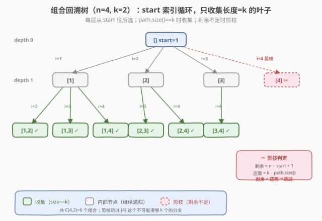
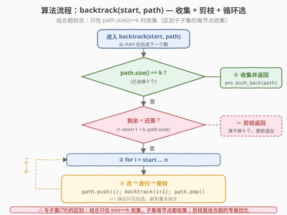
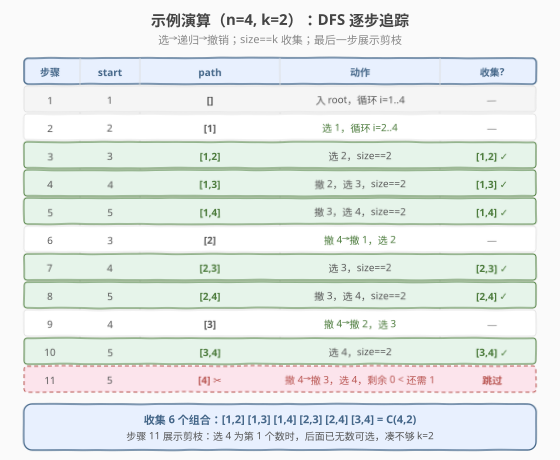

# LeetCode 组合 题解

## 1. 题目概述

- **标题 / 题号**：组合（#77，medium）
- **链接**：https://leetcode.cn/problems/combinations/
- **难度**：中等
- **标签**：回溯

**题意**：给定两个整数 `n` 和 `k`，返回范围 `[1, n]` 中所有可能的 `k` 个数的组合。你可以按**任何顺序**返回答案。

**组合的定义**：从 `n` 个不同元素中取出 `k` 个，**不考虑顺序**——即 `{1,2}` 和 `{2,1}` 视为同一个组合。组合总数为 $C_n^k = \binom{n}{k}$。

**示例 1**：

```text
输入：n = 4, k = 2
输出：[[1,2],[1,3],[1,4],[2,3],[2,4],[3,4]]
解释：共 C(4,2) = 6 种组合。
```

**示例 2**：

```text
输入：n = 1, k = 1
输出：[[1]]
```

**约束**：

- `1 <= n <= 20`
- `1 <= k <= n`

> 💡 这是 **回溯法"组合模板"的招牌题**。与 [78. 子集](78_子集.md)（每个元素选/不选、每节点都收集）和 [46. 全排列](46_全排列.md)（每个位置选哪个数、`used` 防重复）不同，组合的核心是「**用 `start` 索引控制只往后选**」——天然避免 `{1,2}` 和 `{2,1}` 重复，且只在 `path.size() == k` 时收集。掌握这个模板，216（组合总和 III）、39（组合总和）、40（组合总和 II）都能套用。

## 2. 解题思路

### 2.1 暴力思路：k 层嵌套循环

如果 `k` 固定（比如 `k=2`），最直观的做法是写两层 `for`：

```text
for i = 1 .. n:
    for j = i+1 .. n:
        收集 [i, j]
```

能过，但**完全无法推广**——`k=3` 要三层循环、`k=10` 要十层。面试官一句"如果 `k` 是变量呢？"就破功了。

> ⚠️ 嵌套循环的层数在编译期就必须确定，而题目里 `k` 是运行时参数。回溯的本质就是**把"层数不确定的嵌套循环"变成"递归"**——每层递归对应一层循环，递归深度就是 `k`。

### 2.2 核心观察：start 索引循环回溯

关键直觉：**把"选 k 个数"看作 k 次决策**——每次从"比上一个选的数更大的范围"里挑一个。用参数 `start` 标记"当前能选的最小值"，每选一个数 `i`，下一次从 `i+1` 开始选。

- **`start` 的作用**：保证选出的序列**严格递增**（`[1,2]` 而非 `[2,1]`），天然去重——因为 `{1,2}` 和 `{2,1}` 中只有递增的那个会被生成。
- **收集时机**：`path.size() == k` 时收集并返回（区别于子集的"每节点都收集"）。
- **剪枝优化**：如果剩余可选元素 `n - start + 1` 已经不够凑满 `k` 个（即 `< k - path.size()`），提前退出。



与子集、全排列的决策树对比：

| 维度 | 全排列 (46) | 子集 (78) | 组合 (77) |
|------|------------|-----------|-----------|
| 决策内容 | 每个位置放哪个数 | 每个元素选还是不选 | 从 start 往后选下一个数 |
| 去重方式 | `used` 数组防重复选 | `start` 索引只往后选 | `start` 索引只往后选 |
| 分支数 | 递减（n, n−1, …） | 恒为 2（选/不选） | 递减（n−start+1, …） |
| 收集时机 | 叶子（path 满 n 个） | **每个节点** | 叶子（path 满 k 个） |
| 结果数 | $n!$ | $2^n$ | $\binom{n}{k}$ |

> 💡 **组合 vs 子集的根本联系**：组合就是子集的"只取长度为 k 的那些"。如果把 78 子集的 `start` 循环版加上"只在 `path.size()==k` 时收集"，就变成了 77。两者共享同一个 `start` 索引模板，只是**收集条件不同**。

### 2.3 算法流程图



**完整步骤**：

1. **收集判定**：若 `path.size() == k`，把当前 `path` 拷贝存入答案，`return`。
2. **剪枝判定**（可选但推荐）：若剩余元素 `n - start + 1 < k - path.size()`，凑不够了，`return`。
3. **循环选数**：`for i = start … n`：
   - **选**：`path.push(i)`
   - **递归**：`backtrack(i + 1, path)` —— 下一个数只能从 `i+1` 往后选
   - **撤销**：`path.pop()`

> ⚠️ **剪枝能融入循环上界**：与其遍历 `i = start … n` 再在循环内判断剩余是否够，不如直接把上界收紧为 `i ≤ n − (k − path.size()) + 1`。这样不够的分支根本不会进入循环，更简洁。两种写法等价，下面参考代码采用上界收紧版。

### 2.4 示例演算

以 `n=4, k=2` 为例，DFS 从 `start=1`、`path=[]` 出发，逐步"选→递归→撤销"：



| 步骤 | start | path | 动作 | 收集? |
|------|-------|------|------|-------|
| 1 | 1 | `[]` | 入 root，循环 i=1..3 | — |
| 2 | 2 | `[1]` | 选 1，循环 i=2..4 | — |
| 3 | 3 | `[1,2]` | 选 2，size==2 | `[1,2]` ✓ |
| 4 | 4 | `[1,3]` | 撤 2，选 3，size==2 | `[1,3]` ✓ |
| 5 | 5 | `[1,4]` | 撤 3，选 4，size==2 | `[1,4]` ✓ |
| 6 | 3 | `[2]` | 撤 4→撤 1，选 2 | — |
| 7 | 4 | `[2,3]` | 选 3，size==2 | `[2,3]` ✓ |
| 8 | 5 | `[2,4]` | 撤 3，选 4，size==2 | `[2,4]` ✓ |
| 9 | 4 | `[3]` | 撤 4→撤 2，选 3 | — |
| 10 | 5 | `[3,4]` | 选 4，size==2 | `[3,4]` ✓ |
| 11 | 5 | `[4] ✂` | 撤 4→撤 3，选 4，剩余 0 < 还需 1 | 跳过 |

最终收集 6 个组合：`[1,2] [1,3] [1,4] [2,3] [2,4] [3,4]`，恰好 $C(4,2) = 6$。

> 💡 注意步骤 11：当 `path=[]`、`start=4` 时，尝试选 4 作为第一个数——但选完后 `start=5 > n=4`，后面一个数都选不出来，凑不够 `k=2`。**剪枝**让循环上界止于 `n - (k-0) + 1 = 4 - 2 + 1 = 3`，直接跳过 `i=4`，连 `[4]` 这个中间状态都不产生。

## 3. 参考代码

### C++

```cpp
// 组合.cpp —— 回溯：start 索引循环 + 剪枝上界收紧
// 编译: g++ -O2 -std=c++17 组合.cpp -o combine
#include <vector>
using namespace std;

class Solution {
  public:
    vector<vector<int>> combine(int n, int k) {
        vector<vector<int>> ans;
        vector<int> path;
        backtrack(n, k, 1, path, ans);
        return ans;
    }

  private:
    // start: 当前能选的最小值；path: 已选元素
    void backtrack(int n, int k, int start,
                   vector<int>& path, vector<vector<int>>& ans) {
        // ① 收集：已选够 k 个
        if ((int)path.size() == k) {
            ans.push_back(path);
            return;
        }
        // ② 循环选数，上界收紧剪枝：
        //    还需选 k - path.size() 个，所以 i 最多到
        //    n - (k - path.size()) + 1，再大就凑不够了
        int need = k - (int)path.size();
        for (int i = start; i <= n - need + 1; i++) {
            path.push_back(i);              // 选 i
            backtrack(n, k, i + 1, path, ans); // 只往后选
            path.pop_back();                // 撤销
        }
    }
};
```

### Python

```python
class Solution:
    def combine(self, n: int, k: int) -> list[list[int]]:
        ans: list[list[int]] = []
        path: list[int] = []

        def backtrack(start: int) -> None:
            if len(path) == k:          # ① 收集
                ans.append(path[:])     # 拷贝！
                return
            # ② 循环选数，上界收紧剪枝
            need = k - len(path)
            for i in range(start, n - need + 2):  # +2 因 range 右开
                path.append(i)           # 选 i
                backtrack(i + 1)         # 只往后选
                path.pop()               # 撤销

        backtrack(1)
        return ans
```

> ⚠️ **Python 必须** `ans.append(path[:])` **拷贝**：`path` 是同一个列表对象，回溯时 `pop()` 会改写它。若直接 `ans.append(path)`，最终 `ans` 里全是同一个引用（且被清空）。C++ 的 `ans.push_back(path)` 会自动拷贝 `vector`，无需额外处理。这与 [78. 子集](78_子集.md)、[46. 全排列](46_全排列.md) 的坑完全一致。

> 💡 **循环上界的推导**：当前已选 `path.size()` 个，还需 `need = k - path.size()` 个。如果本轮选了 `i`，后面还要从 `i+1` 往后选 `need - 1` 个，所以至少要保证 `i + (need - 1) ≤ n`，即 `i ≤ n - need + 1`。Python 的 `range` 右端开区间，所以写 `n - need + 2`。

## 4. 复杂度分析

| 维度 | 回溯 + 剪枝 | 不剪枝的回溯 |
|------|------------|-------------|
| **时间复杂度** | $O\!\left(\binom{n}{k} \cdot k\right)$ | $O\!\left(\binom{n}{k} \cdot k\right)$ 渐近相同 |
| **空间复杂度** | $O(k)$（递归栈 + path，不计结果） | $O(k)$ |
| **实际常数** | 更小（跳过无效分支） | 较大（多遍历凑不够的分支） |
| **结果数** | $\binom{n}{k}$ | $\binom{n}{k}$ |

> ⚠️ 时间 $O\!\left(\binom{n}{k} \cdot k\right)$ 的来源：共 $\binom{n}{k}$ 个组合，每个组合构造/拷贝需 $O(k)$。这是**组合枚举的理论下界**——因为答案本身就有 $\binom{n}{k}$ 个、每个长度为 $k$，无法更快。空间 $O(k)$ 指递归深度（最大 $k$ 层），结果数组 $O\!\left(\binom{n}{k} \cdot k\right)$ 不计入。

> 💡 **剪枝不改变渐近复杂度，但显著降低常数**。以 $n=20, k=10$ 为例：不剪枝的递归调用约 $616{,}666$ 次，剪枝后仅 $184{,}756$ 次（恰好等于 $\sum_{i=0}^{9}\binom{20}{i}$，即所有"长度 ≤ 9 的有效前缀"）。递归调用减少约 70%。

## 5. 扩展：剪枝写法对比与组合题族迁移

### 5.1 两种剪枝写法

| 写法 | 代码 | 说明 |
|------|------|------|
| **上界收紧**（推荐） | `for i ≤ n - need + 1` | 不够的分支不进循环，最简洁 |
| **显式判断** | `if (n-start+1 < need) return;` 在循环前 | 语义更直白，但多一次判断 |

两者完全等价。上界收紧版把剪枝条件融进 `for` 的终止条件，省掉一个 `if`，是竞赛和面试中更常见的写法。

### 5.2 组合题族模板迁移

77 的 `start` 索引循环是整个"组合题族"的母模板，只需调整三个旋钮即可迁移：

| 题号 | 题目 | 与 77 的差异 |
|------|------|-------------|
| 77 | 组合 | 基础模板：选 k 个，只收集 size==k |
| [216](https://leetcode.cn/problems/combination-sum-iii/) | 组合总和 III | 固定 k 个 + 和为 n → 多一个 `sum` 参数和剪枝 |
| [39](39_组合总和.md) | 组合总和 | 元素可重复选 → `backtrack(i)`（不是 `i+1`）+ 和剪枝 |
| [40](https://leetcode.cn/problems/combination-sum-ii/) | 组合总和 II | 含重复 + 每个数用一次 → 排序 + 同层去重 |
| [78](78_子集.md) | 子集 | 收集所有长度 → 去掉 size==k 条件，每节点都收集 |

> 💡 **一句话总结**：77 是"start 索引循环回溯"的招牌——用 `start` 保证只往后选（天然去重），只在 `path.size()==k` 时收集（区别于子集的每节点收集），剪枝把循环上界收紧到 `n−need+1`。这个模板是 216/39/40/78 的共同骨架，是面试必会的核心回溯模板。

## 6. 面试要点

1. **组合和全排列的回溯有什么本质区别？**

   - 排列关心顺序（`[1,2]` 和 `[2,1]` 是不同结果），所以每层要枚举所有**未选**候选，用 `used` 数组防重复选，分支数递减，结果 $n!$ 个。
   - 组合不关心顺序（`{1,2}` 和 `{2,1}` 是同一个），所以用 `start` 索引**只往后选**，天然只生成递增序列，分支数也递减但更少，结果 $\binom{n}{k}$ 个。
   - 代码上：排列 `for i in 0..n-1` + `if not used[i]`；组合 `for i in start..n`。一行之差，语义完全不同。

2. **为什么组合只在 `path.size()==k` 时收集，而不是像子集那样每节点都收集？**

   - 组合要求**恰好 k 个数**，长度不够的中间状态不是合法答案。子集要求"任意长度"，所以每个节点（不管选了几个）都是合法子集。
   - 如果照搬子集模板在每节点收集，会多出长度 0、1、…、k−1 的"半成品"，不符合题意。
   - 本质：**收集条件由问题定义决定**——求长度恰为 k 的组合就 `size==k` 收集；求所有子集就去掉这个条件。

3. **剪枝的原理是什么？能省多少？**

   - 当前已选 `path.size()` 个，还需 `need = k - path.size()` 个。如果当前位置 `start` 之后只剩 `n - start + 1` 个可选，且 `n - start + 1 < need`，无论怎么选都凑不够 k 个，直接退出。
   - 等价写法：循环上界从 `n` 收紧到 `n - need + 1`，让不够的分支不进循环。
   - 以 $n=20, k=10$ 为例，剪枝后递归调用从约 62 万降到 18 万，减少约 70%。渐近复杂度不变（仍是 $O\!\left(\binom{n}{k} \cdot k\right)$），但常数显著改善。

4. **为什么递归调用是 `backtrack(i + 1)` 而不是 `backtrack(i)`？**

   - `i + 1` 表示"下一个数只能从比 `i` 大的里面选"，保证序列严格递增，避免 `{1,2}` 和 `{2,1}` 同时出现。
   - 如果写成 `backtrack(i)`，同一个数可以被重复选（变成可重复组合），那就变成了 [39. 组合总和](39_组合总和.md) 的场景（元素可无限用）。
   - 一字之差：`i+1` → 不可重复选；`i` → 可重复选。这是组合题族最关键的一个参数。

5. **如果 `k` 很大（接近 `n`），有什么优化？**

   - 利用组合的对称性 $C(n, k) = C(n, n-k)$。当 $k > n/2$ 时，改为求 $C(n, n-k)$ 个"不选的"组合，再取补集——即从"选 k 个"转为"丢弃 n−k 个"，递归深度从 k 降到 n−k。
   - 例如 $n=20, k=18$：直接回溯深度 18，但等价于求 $C(20,2)=190$ 个"丢弃 2 个"的方案，深度仅 2。
   - 这是面试中常被追问的"还能优化吗？"的经典答案。

> 💡 **一句话总结**：77 是"start 索引循环回溯"的招牌——`start` 保证只往后选（天然去重），`size==k` 时收集（区别于子集的每节点收集），剪枝收紧上界到 `n−need+1`。时间 $O\!\left(\binom{n}{k} \cdot k\right)$ 是理论下界，空间 $O(k)$。模板可迁移到 216/39/40/78 整个组合题族，是回溯必会的核心。

## 同类练习题

| # | 题目 | 与本题的关联 |
|---|------|-------------|
| 216 | [组合总和 III](https://leetcode.cn/problems/combination-sum-iii/) | 固定 k 个数 + 和为 n，在 77 基础上加 `sum` 参数与剪枝 |
| 39 | [组合总和](39_组合总和.md) | 元素可重复选，把 `backtrack(i+1)` 改为 `backtrack(i)` + 和剪枝 |
| 78 | [子集](78_子集.md) | 收集所有长度，去掉 `size==k` 条件改为每节点收集 |
| 46 | [全排列](46_全排列.md) | 对比题——用 `used` 数组而非 `start` 索引去重，关心顺序 |
| 40 | [组合总和 II](https://leetcode.cn/problems/combination-sum-ii/) | 含重复元素 + 每个数用一次，排序后同层去重 |
