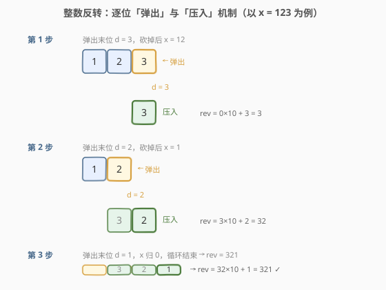
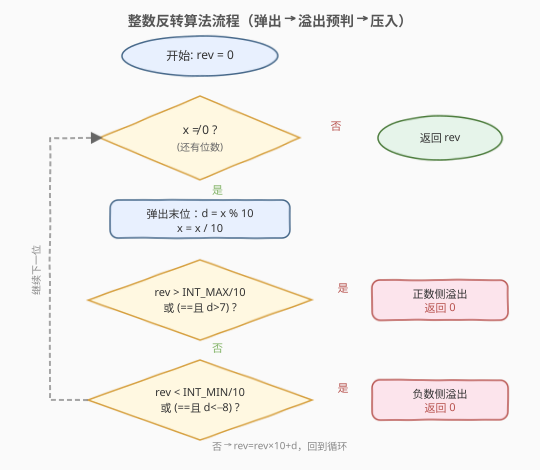
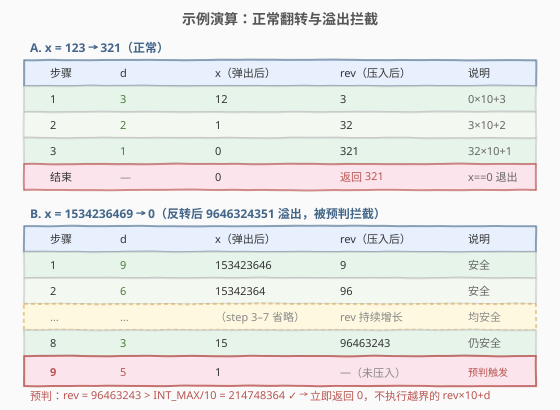

# 整数反转

- **题目名称**：整数反转
- **链接**：[7. 整数反转](https://leetcode.cn/problems/reverse-integer/)
- **难度**：中等
- **标签**：数学、模拟

## 1. 题目概述

给你一个 32 位的有符号整数 `x`，返回将 `x` 中的数字部分反转后的结果。

- 如果反转后的值超出 32 位有符号整数范围 $[-2^{31},\ 2^{31}-1]$（即 $[-2147483648,\ 2147483647]$），则返回 `0`。
- **假设环境不允许存储 64 位整数**（C++/Java 等不能用 `long`/`long long` 来绕过溢出检查）。

**示例 1**：

```text
输入：x = 123
输出：321
```

**示例 2**：

```text
输入：x = -123
输出：-321
```

**示例 3**：

```text
输入：x = 120
输出：21
```

**约束条件**：

- $-2^{31} \leq x \leq 2^{31} - 1$

> 💡 本题表面是「翻转数字」，真正的考点只有一个：**如何在只能用 32 位整数的前提下，检测「反转后溢出」**。符号随数字一起翻转、末尾 `0` 自然消失都不难，难的是每一步 `rev = rev * 10 + d` 都可能越过 32 位边界，而题目又禁止用更大的类型兜底。

---

## 2. 解题思路

### 2.1 暴力思路

最直觉的做法是转成字符串、翻转、再转回整数：

```python
rev = int(str(abs(x))[::-1])
ans = sign * rev
```

但在 **C++/Java** 里这条路行不通——`abs(INT_MIN)` 本身就会溢出（$|-2147483648| = 2147483648 > INT\_MAX$），而且题目明确**禁止使用 64 位整数**。因此必须用**数学方法**逐位弹出、压入，并在压入前做溢出预判。

### 2.2 核心观察：逐位弹出 + 压入 + 溢出预判



整个反转过程可以分解为两个原子动作反复执行：

| 动作 | 公式 | 说明 |
|------|------|------|
| **弹出末位** | `d = x % 10`；`x /= 10` | 取出 `x` 的个位 `d`，再把它从 `x` 中砍掉 |
| **压入结果** | `rev = rev * 10 + d` | 把 `d` 接到 `rev` 的末尾 |

> ⚠️ **C++ 的取模语义**：自 C++11 起，整数除法**向零截断**，`/` 和 `%` 的符号由被除数决定。于是 `-123 % 10 = -3`、`-123 / 10 = -12`，弹出的 `d` **与 `x` 同号**。这意味着我们可以**让 `x` 保持原符号一路弹到底**，`rev` 也会自然带上同号累积，省去「提取符号 → 处理绝对值 → 还原符号」的三段式，也绕开了 `abs(INT_MIN)` 的溢出陷阱。

**溢出预判**（关键）。在执行 `rev = rev * 10 + d` **之前**，必须确认这一步不会越界。因为 `INT_MAX = 2147483647`、`INT_MIN = -2147483648`，可得：

$$
\lfloor INT\_MAX / 10 \rfloor = 214748364,\quad INT\_MAX \bmod 10 = 7
$$
$$
\lceil INT\_MIN / 10 \rceil = -214748364,\quad INT\_MIN \bmod 10 = -8
$$

于是：

- **正数侧**（`d > 0`）：若 `rev > INT_MAX/10`，或 `rev == INT_MAX/10` 且 `d > 7`，则 `rev*10+d` 必然 $> INT\_MAX$，返回 `0`。
- **负数侧**（`d < 0`）：若 `rev < INT_MIN/10`，或 `rev == INT_MIN/10` 且 `d < -8`，则 `rev*10+d` 必然 $< INT\_MIN$，返回 `0`。

> 💡 **为什么是 `7` 和 `-8`？** 因为 `INT_MAX` 的末位是 `7`、`INT_MIN` 的末位是 `-8`（$-2147483648$ 的个位是 $-8$）。当 `rev` 已经等于 `INT_MAX/10 = 214748364` 时，再压入 `d`：若 `d ≤ 7`，结果 $\leq 2147483647$ 安全；若 `d = 8`，结果为 $2147483648$ 越界。负数侧同理：`rev == -214748364` 时 `d` 必须 $\geq -8$。

### 2.3 算法流程图



主循环只有三步：**弹出 `d` → 溢出预判 → 压入 `rev`**，直到 `x == 0`。流程图把正负两侧的预判画成两个判定菱形，实际编码时由于 `d` 与 `x` 同号，每次只有一侧的判定可能触发，互不干扰。

### 2.4 示例演算



- **示例 A `x = 123`（正常）**：
  - `d=3, x=12`，`rev=0*10+3=3`
  - `d=2, x=1`，`rev=3*10+2=32`
  - `d=1, x=0`，`rev=32*10+1=321`
  - `x==0` 结束，返回 `321`。

- **示例 B `x = -123`（负数，C++ 语义下 `d` 同号）**：
  - `d=-3, x=-12`，`rev=0*10+(-3)=-3`
  - `d=-2, x=-1`，`rev=-3*10+(-2)=-32`
  - `d=-1, x=0`，`rev=-32*10+(-1)=-321`
  - 返回 `-321`。符号被 `d` 自然带入了 `rev`，无需额外处理。

- **示例 C `x = 1534236469`（反转后溢出）**：反转结果为 `9646324351`，远超 `INT_MAX`。演算到 `rev = 96463243`、`d = 5` 时：`rev > INT_MAX/10`（$96463243 > 214748364$）成立，立即返回 `0`，**不会**执行越界的 `rev*10+d`。

- **示例 D `x = -2147483648`（即 `INT_MIN`）**：反转后应为 $-8463847412$，溢出。弹到第 10 位 `d=-2` 时，`rev=-846384741 < INT_MIN/10=-214748364` 成立，返回 `0`。

---

## 3. 参考代码

### C++（数学法 + 原位溢出预判，无 64 位整数）

```cpp
#include <climits>
class Solution {
  public:
    int reverse(int x) {
        int rev = 0;
        while (x != 0) {
            int d = x % 10;        // C++11: 向零截断，d 与 x 同号
            x /= 10;
            // 正数侧溢出预判（d > 0 时才可能触发）
            if (rev > INT_MAX / 10 || (rev == INT_MAX / 10 && d > 7)) return 0;
            // 负数侧溢出预判（d < 0 时才可能触发）
            if (rev < INT_MIN / 10 || (rev == INT_MIN / 10 && d < -8)) return 0;
            rev = rev * 10 + d;
        }
        return rev;
    }
};
```

### Python

```python
class Solution:
    def reverse(self, x: int) -> int:
        INT_MIN, INT_MAX = -2**31, 2**31 - 1

        # Python 取模对负数是「向负无穷取整」，与 C++ 不同，
        # 故先取绝对值再按正数处理；Python 大整数不会溢出，最后统一判定。
        sign = -1 if x < 0 else 1
        x_abs = abs(x)            # abs(-2**31) 在 Python 中安全
        rev = 0
        while x_abs != 0:
            d = x_abs % 10
            x_abs //= 10
            rev = rev * 10 + d

        ans = sign * rev
        return 0 if ans < INT_MIN or ans > INT_MAX else ans
```

> ⚠️ **C++ 与 Python 为何写法不同？**
> - **取模语义差异**：C++11 起 `-123 % 10 = -3`（向零截断），所以 C++ 可让 `x` 带号弹到底，`rev` 自然同号；Python 的 `%` 对负数是向负无穷取整，`-123 % 10 = 7`，若直接套用 C++ 写法会得到错误数字，因此 Python 版先取绝对值转成正数处理。
> - **溢出处理差异**：C++ 的 `int` 一越界就是未定义行为，必须**在乘法之前**预判；Python 整数精度无限，可以放心累加再一次性判定。
> - **`abs(INT_MIN)` 的陷阱**：在 C++ 中 `abs(-2147483648)` 会先转成 `int` 再取绝对值，结果 `2147483648` 溢出 `INT_MAX`，是未定义行为；这正是 C++ 版**不提取符号、让 `x` 保持负号**的根本原因。Python 没有此问题。
>
> 💡 **Python 的字符串一行版**（仅供对照，逻辑等价）：
> ```python
> class Solution:
>     def reverse(self, x: int) -> int:
>         INT_MIN, INT_MAX = -2**31, 2**31 - 1
>         sign = -1 if x < 0 else 1
>         ans = sign * int(str(abs(x))[::-1])
>         return 0 if ans < INT_MIN or ans > INT_MAX else ans
> ```

---

## 4. 复杂度分析

| 维度 | 复杂度 | 说明 |
|------|--------|------|
| 时间复杂度 | $O(\log_{10}|x|)$ | 循环次数等于 `x` 的十进制位数，至多 10 位（32 位整数最多 10 位） |
| 空间复杂度 | $O(1)$ | 只用常数个变量 `rev`、`d`，无额外结构 |

> 💡 32 位有符号整数最多 10 位十进制数字，循环最多 10 次，时间毫无压力。本题考点完全在**溢出预判的正确性**。

---

## 5. 扩展：用字符串翻转实现（Pythonic 写法）

数学法与 C++ 一一对应，最贴近面试官期望的「不依赖大整数」解法。但在 Python 中，更地道、更不易出错的写法是**字符串翻转**——因为 Python 的整数本来就是任意精度，不存在中途溢出，只需在最后做一次范围判定：

```python
class Solution:
    def reverse(self, x: int) -> int:
        INT_MIN, INT_MAX = -2**31, 2**31 - 1
        s = str(abs(x))
        ans = int(s[::-1]) * (-1 if x < 0 else 1)
        return ans if INT_MIN <= ans <= INT_MAX else 0
```

> 💡 **何时用哪种？**
> - **面试 C++/Java 岗**：必须用数学法，并讲清「为什么不能 `abs(INT_MIN)`」「为什么预判用 `INT_MAX/10` 和末位 `7`」。
> - **面试 Python 岗 / 日常刷题**：字符串法更简洁、更 Pythonic，且天然规避取模语义差异，推荐优先；若面试官追问「不用字符串怎么做」，再切换到数学法。
> - 两种方法的复杂度一致，区别只在**是否依赖语言的大整数特性**。

---

## 6. 面试要点

1. **为什么题目要求「不允许存储 64 位整数」？**

   - 若允许用 `long`/`long long`，本题就退化成「翻转 + 末尾 clamp」，毫无区分度。禁止大整数的目的是强迫你**在 32 位范围内**检测溢出——这考察的是对**整数表示边界**的理解与**预防式编程**的习惯。

2. **`rev > INT_MAX / 10` 这个预判是怎么推导的？为什么不是 `rev * 10 > INT_MAX`？**

   - 我们要判断 `rev * 10 + d > INT_MAX` 是否成立，但**直接算左式会先溢出**（在 32 位 `int` 下未定义行为）。把不等式移项：`rev > (INT_MAX - d) / 10`。本题中 `d ∈ [1,9]`（正数侧），最宽松的边界是 `d = 0` 时的 `INT_MAX / 10`，故用 `rev > INT_MAX / 10` 先拦掉「必然溢出」的情况；剩余 `rev == INT_MAX / 10` 时再单独比较 `d` 与末位 `7`。这是把「可能溢出的乘法」化成「安全的除法比较」的标准技巧。

3. **`INT_MIN` 的个位为什么是 `-8` 而不是 `8`？**

   - `INT_MIN = -2147483648`。在 C++ 的向零截断语义下，`INT_MIN % 10 = -8`（余数与被除数同号）。所以负数侧预判的末位阈值是 `-8`，而非 `8`。如果你误写成 `d < 8`，当 `rev == INT_MIN/10`、`d = -8` 时会被错判为溢出（实际上 $-214748364 \times 10 + (-8) = -2147483648 = INT\_MIN$，恰好不溢出）。

4. **C++ 为什么不先提取符号、处理绝对值？**

   - 因为 `abs(INT_MIN)` 在 32 位 `int` 下会溢出：$|-2147483648| = 2147483648 > INT\_MAX$，是未定义行为。让 `x` 保持负号一路弹到底，`d` 与 `x` 同号（C++11 保证），`rev` 自然累积出负值，巧妙绕开这个陷阱。这是本题最容易被忽略的边界。

5. **输入 `x = 0` 怎么处理？末尾的 `0`（如 `120`）呢？**

   - `x = 0`：循环条件 `x != 0` 不成立，直接返回 `rev = 0`。
   - `x = 120`：依次弹出 `0 → 2 → 1`，`rev = 0 → 2 → 21`，前导的 `0` 在「压入第一个非零位之前」自然被「挤掉」（因为 `0*10+0=0`），无需特判。这正是数学法相对字符串法的优雅之处——前导零自动消失。

---

## 7. 同类练习题

- [8. 字符串转换整数 (atoi)](https://leetcode.cn/problems/string-to-integer-atoi/)（[题解](../0001-0100/8_字符串转换整数atoi.md)）：同样是「边累加边判断 32 位溢出」，`ans > (INT_MAX - d) / 10` 的预判技巧直接复用，本题的姊妹篇
- [9. 回文数](https://leetcode.cn/problems/palindrome-number/)：反转一半数字即可判断回文，复用本题的「弹出 / 压入」机制，且只需翻一半巧妙规避溢出
- [12. 整数转罗马数字](https://leetcode.cn/problems/integer-to-roman/)（[题解](../0001-0100/12_整数转罗马数字.md)）：整数的另一种「逐位 / 逐面值」拆解，贪心配面值的思路与本题逐位弹出对照
- [50. Pow(x, n)](https://leetcode.cn/problems/powx-n/)（[题解](../0001-0100/50_Powx_n.md)）：同样是「32 位整数边界 + 不能用更大类型」的陷阱题（`n = INT_MIN` 时 `-n` 溢出），边界处理思路一致
- [29. 两数相除](https://leetcode.cn/problems/divide-two-integers/)（[题解](../0001-0100/29_两数相除.md)）：禁止用乘除模，用位运算模拟除法并处理 `INT_MIN / -1` 的溢出，与本题同属「32 位边界感知」训练
