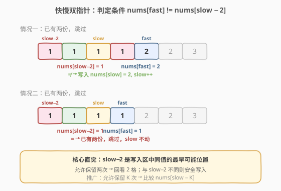
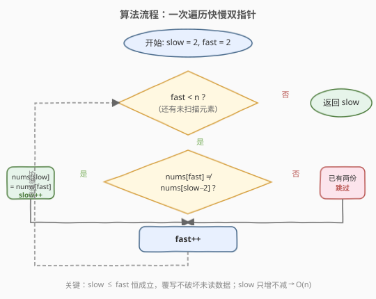

# LeetCode 删除有序数组中的重复项 II 题解

## 1. 题目概述

- **标题 / 题号**：删除有序数组中的重复项 II（#80，medium）
- **链接**：https://leetcode.cn/problems/remove-duplicates-from-sorted-array-ii/
- **难度**：中等
- **标签**：数组、双指针

**题意**：给定一个 **已按非递减顺序排列** 的整数数组 `nums`，请你**原地**删除重复元素，使每个元素最多出现两次。最终结果的前 `k` 个位置应存放去重后的元素，`k` 之后的元素忽略。返回 `k`。

**不要使用额外的数组空间**，必须在原地修改输入数组并用 `O(1)` 额外空间完成。

**示例 1**：

```text
输入：nums = [1,1,1,2,2,3]
输出：5, nums = [1,1,2,2,3,_]
解释：函数应返回新的长度 5，并且原数组的前五个元素被修改为 1, 1, 2, 2, 3。
     不需要考虑数组中超出新长度后面的元素。
```

**示例 2**：

```text
输入：nums = [0,0,1,1,1,1,2,3,3]
输出：7, nums = [0,0,1,1,2,3,3,_,_]
解释：函数应返回新的长度 7，并且原数组的前七个元素被修改为 0, 0, 1, 1, 2, 3, 3。
```

**约束**：

- `1 <= nums.length <= 3 * 10^4`
- `-10^4 <= nums[i] <= 10^4`
- `nums` 已按非递减顺序排列

> 💡 本题是 [26. 删除有序数组中的重复项](https://leetcode.cn/problems/remove-duplicates-from-sorted-array/) 的进阶版——从"每个元素最多保留一次"升级到"最多保留两次"。核心套路完全一致：**快慢双指针 + 原地覆写**。

## 2. 解题思路

### 2.1 暴力思路

用哈希表统计每个元素的出现次数，再按顺序把每个元素最多写两遍。虽然能出结果，但需要 `O(n)` 额外空间，不满足题目的原地要求。更根本的问题是——**数组已排序**这一性质没有被利用：相同元素必然相邻，完全不需要哈希表。

### 2.2 核心观察：快慢双指针 + 与 slow−2 比较



关键直觉是维护两个指针：

- **`slow`**：指向下一个**写入位置**（已保留部分的尾部）。
- **`fast`**：扫描每个元素（读取位置）。

由于数组已排序，重复元素一定相邻。我们只需判断当前元素 `nums[fast]` 是否应该被写入——**而判断依据是与 `nums[slow - 2]` 比较**：

> 如果 `nums[fast] != nums[slow - 2]`，说明在写入位置 `slow` 之前，`nums[fast]` 这个值**最多出现了一次**（即 `nums[slow - 2]`），再写入一次也不会超过两次，所以可以安全写入。反之如果相等，说明已经写入了两次，跳过。

**为什么只需看 `slow - 2` 而不是 `slow - 1`？** 因为允许保留两次。`slow - 2` 是写入区中"同一值的最早可能位置"——如果 `nums[fast]` 与 `nums[slow - 2]` 不同，则 `nums[slow - 2]`、`nums[slow - 1]`、`nums[fast]` 三者不可能全相同（数组有序），所以写入 `nums[fast]` 后最多两份。

### 2.3 算法流程图



整个流程只有一重循环，`fast` 从 `2` 走到 `n - 1`，`slow` 只增不减，时间复杂度 `O(n)`。

### 2.4 示例演算

![示例演算：nums = [1,1,1,2,2,3]](../images/rdsa2_example_walkthrough.svg)

以 `nums = [1,1,1,2,2,3]` 为例：

- 前 2 个元素 `1, 1` 直接保留，`slow = fast = 2`。
- 第 3 步：`fast = 2`，`nums[2] = 1`，而 `nums[slow-2] = nums[0] = 1`，相等 → **跳过**（已有两份 `1`）。
- 第 4 步：`fast = 3`，`nums[3] = 2`，而 `nums[slow-2] = nums[0] = 1`，不等 → 写入 `nums[2] = 2`，`slow = 3`。
- 第 5 步：`fast = 4`，`nums[4] = 2`，而 `nums[slow-2] = nums[1] = 1`，不等 → 写入 `nums[3] = 2`，`slow = 4`。
- 第 6 步：`fast = 5`，`nums[5] = 3`，而 `nums[slow-2] = nums[2] = 2`，不等 → 写入 `nums[4] = 3`，`slow = 5`。
- 最终 `slow = 5`，前 5 个元素为 `[1, 1, 2, 2, 3]`。

## 3. 参考代码

### C++

```cpp
class Solution {
  public:
    int removeDuplicates(vector<int>& nums) {
        int n = nums.size();
        if (n <= 2) return n;

        int slow = 2; // 下一个写入位置（前两个元素直接保留）
        for (int fast = 2; fast < n; ++fast) {
            if (nums[fast] != nums[slow - 2]) {
                nums[slow] = nums[fast];
                ++slow;
            }
        }
        return slow;
    }
};
```

### Python

```python
class Solution:
    def removeDuplicates(self, nums: list[int]) -> int:
        n = len(nums)
        if n <= 2:
            return n

        slow = 2
        for fast in range(2, n):
            if nums[fast] != nums[slow - 2]:
                nums[slow] = nums[fast]
                slow += 1
        return slow
```

> ⚠️ **边界**：当 `n <= 2` 时直接返回 `n`，因为最多两个元素不可能超过两次。面试时主动提及这个边界处理，体现严谨性。

## 4. 复杂度分析

| 维度 | 复杂度 | 说明 |
|------|--------|------|
| 时间复杂度 | O(n) | `fast` 从 `2` 遍历到 `n - 1`，每个元素只访问一次 |
| 空间复杂度 | O(1) | 仅使用 `slow`、`fast` 两个指针变量，原地覆写 |

## 5. 扩展：通用化——允许保留 K 次

如果题目改为"每个元素最多保留 `K` 次"，只需把初始值和比较下标改为 `slow - K`：

```cpp
int removeDuplicates(vector<int>& nums, int K) {
    int n = nums.size();
    if (n <= K) return n;
    int slow = K;
    for (int fast = K; fast < n; ++fast) {
        if (nums[fast] != nums[slow - K]) {
            nums[slow++] = nums[fast];
        }
    }
    return slow;
}
```

- `K = 1` → 即 [26. 删除有序数组中的重复项](https://leetcode.cn/problems/remove-duplicates-from-sorted-array/)。
- `K = 2` → 本题。

## 6. 面试要点

1. **为什么比较** `nums[slow - 2]` **而不是** `nums[fast - 2]`**？**

   - `slow` 是写入位置，`nums[0..slow-1]` 才是已保留的结果区。我们要判断的是"结果区中是否已有两份当前值"，所以必须看写入区。如果看 `fast - 2`，可能指向尚未覆写的旧数据，判断无效。

2. **如果数组无序怎么办？**

   - 先排序再使用本方法，或者用哈希表统计计数后重建。但题目保证有序，面试时可以主动说明"利用有序性是本题 O(1) 空间的前提"。

3. **`slow` 和 `fast` 的关系？会不会覆写未读数据？**

   - 不会。因为 `slow <= fast` 恒成立（`slow` 初始等于 `fast`，且 `slow` 只在 `fast` 前进时前进，跳过时 `slow` 不动）。所以写入位置永远在读取位置之前或重合，不会覆盖尚未读取的值。

4. **与 [26. 删除有序数组中的重复项](https://leetcode.cn/problems/remove-duplicates-from-sorted-array/) 的区别？**

   - 26 题允许保留一次，比较 `nums[slow - 1]`；本题允许保留两次，比较 `nums[slow - 2]`。核心套路完全相同，只是"回看窗口"从 1 变成 2。

5. **为什么不需要额外处理前两个元素？**

   - 前 `K` 个元素（本题 `K = 2`）天然满足"最多出现两次"，直接作为结果区起点。从第 `K + 1` 个元素开始才需要判断。

## 同类练习题

| # | 题目 | 与本题的关联 |
|---|------|-------------|
| 26 | [删除有序数组中的重复项](https://leetcode.cn/problems/remove-duplicates-from-sorted-array/) | 允许保留一次的版本，比较 `nums[slow - 1]`，是本题的基础版 |
| 27 | [移除元素](https://leetcode.cn/problems/remove-element/) | 原地移除等于给定值的元素，同样是快慢双指针覆写 |
| 83 | [删除排序链表中的重复元素](https://leetcode.cn/problems/remove-duplicates-from-sorted-list/)（[站内题解](../0001-0100/83_删除排序链表中的重复元素.md)） | 链表版的去重，双指针思路迁移到指针操作 |
| 283 | [移动零](https://leetcode.cn/problems/move-zeroes/)（[站内题解](../0201-0300/283_移动零.md)） | 快慢双指针原地覆写的另一经典应用 |
| 905 | [按奇偶排序数组](https://leetcode.cn/problems/sort-array-by-parity/) | 快慢双指针原地分区，思路同源 |
