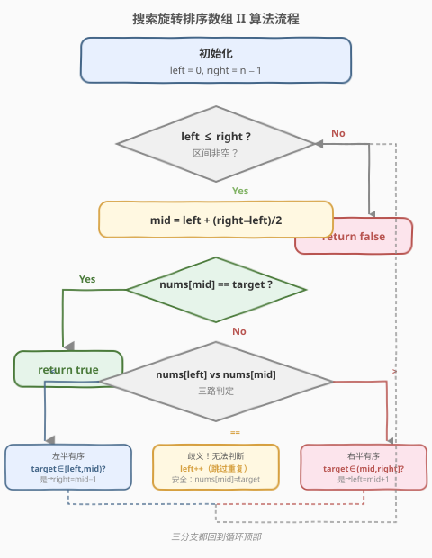
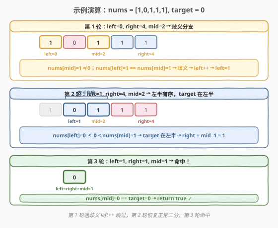

# 搜索旋转排序数组II

- **题目名称**：搜索旋转排序数组 II
- **链接**：[81. 搜索旋转排序数组 II](https://leetcode.cn/problems/search-in-rotated-sorted-array-ii/)
- **难度**：中等
- **标签**：数组、二分查找

## 1. 题目概述

整数数组 `nums` 按**非降序**排列（**可能包含重复值**）。在传递给函数之前，`nums` 在预先未知的某个下标 `k`（`0 <= k < nums.length`）上进行了**旋转**，使数组变为 `[nums[k], nums[k+1], ..., nums[n-1], nums[0], nums[1], ..., nums[k-1]]`。

给你旋转后的数组 `nums` 和一个整数 `target`，如果 `nums` 中存在 `target`，返回 `true`，否则返回 `false`。

> ⚠️ **与 [33 题](33_搜索旋转排序数组.md) 的唯一区别**：33 题保证值**互不相同**，本题允许**重复值**。返回值也从下标改为布尔（因重复值时下标不唯一）。

**示例 1**：

```text
输入：nums = [2,5,6,0,0,1,2], target = 0
输出：true
解释：0 在下标 3 或 4 处。
```

**示例 2**：

```text
输入：nums = [2,5,6,0,0,1,2], target = 3
输出：false
解释：3 不在数组中。
```

**约束条件**：

- `1 <= nums.length <= 5000`
- `-10^4 <= nums[i] <= 10^4`
- `nums` 已按升序排列并旋转（**可能含重复值****）

> 💡 **关键变化**：重复值会让 33 题的「判断哪半有序」失效——当 `nums[left] == nums[mid] == nums[right]` 时，旋转点既可能在左半也可能在右半，无法通过比较确定。这是本题的核心难点。

---

## 2. 解题思路

### 2.1 暴力思路

**线性扫描**：遍历 `nums` 找 `target`，时间 `O(n)`、空间 `O(1)`。简单直接，且本题**不要求** `O(log n)`，线性扫描完全可过。但面试中通常期望能用二分思想优化平均情况。

### 2.2 核心观察：重复值导致的歧义

![含重复值时 nums[left]==nums[mid] 无法判断哪半有序](../images/search_rotated_ii_ambiguous.svg)

在 33 题中，`nums[left]`、`nums[mid]`、`nums[right]` 三者互异，比较一次就能唯一确定哪半有序。但本题允许重复值，会出现一种**歧义情形**：

- 当 `nums[left] == nums[mid] == nums[right]` 时，旋转点既可能在左半（如 `[1,0,1,1,1]`，`k=1`），也可能在右半（如 `[1,1,1,0,1]`，`k=3`）。单凭三者相等**无法分辨**。

> 💡 **对策**：既然 `nums[mid] != target`（已先判断），而 `nums[left] == nums[mid]`，故 `nums[left] != target` 也成立——**安全地 `left++` 跳过它**，缩小区间后重新二分。每轮只跳一个元素，最坏全相同时退化为 `O(n)`，但平均仍接近 `O(log n)`。

### 2.3 三路判定

基于上述观察，把 33 题的「两路判定」升级为**三路**：

| 条件 | 含义 | 动作 |
|------|------|------|
| `nums[left] < nums[mid]` | 左半严格升序 | 判 `target` 是否落在 `[left, mid)` → 收缩左半或右半 |
| `nums[left] > nums[mid]` | 右半有序（旋转点在左半） | 判 `target` 是否落在 `(mid, right]` → 收缩右半或左半 |
| `nums[left] == nums[mid]` | **歧义**，无法判断 | `left++`（安全跳过，因 `nums[left] == nums[mid] != target`） |

> ⚠️ **为什么用 `<` / `>` 而非 `<=` / `>=`？** 33 题用 `<=` 是因为值互异时 `left == mid` 才会相等，需归入「左半有序」。但本题中 `nums[left] == nums[mid]` 可能是**真歧义**（两端值相同），必须单独处理为第三路，所以改用严格 `<` / `>`。

### 2.4 算法流程图



### 2.5 示例演算

以 `nums = [1,0,1,1,1], target = 0` 为例（此例刻意触发歧义分支）：



| 轮次 | left | right | mid | nums[mid] | 判定 | 动作 |
|------|------|-------|-----|-----------|------|------|
| 1 | 0 | 4 | 2 | 1 | nums[0]==nums[2]==1 → 歧义 | left++ → left=1 |
| 2 | 1 | 4 | 2 | 1 | nums[1]=0 < nums[2]=1 → 左半有序 | 0∈[0,1) → right=mid−1=1 |
| 3 | 1 | 1 | 1 | 0 | nums[1]==0 命中 | return true ✓ |

三轮完成。第 1 轮遇歧义仅 `left++`（未砍半），第 2 轮恢复正常二分砍半，第 3 轮命中。这正是本题与 33 题的典型差异——**歧义轮退化为线性步进，非歧义轮仍享二分对数**。

---

## 3. 参考代码

### C++

```cpp
class Solution {
  public:
    bool search(vector<int>& nums, int target) {
        int left = 0, right = nums.size() - 1;
        while (left <= right) {
            int mid = left + (right - left) / 2;
            if (nums[mid] == target) return true;

            if (nums[left] < nums[mid]) {              // 左半严格升序
                if (nums[left] <= target && target < nums[mid]) {
                    right = mid - 1;                   // target 在左半
                } else {
                    left = mid + 1;                    // target 在右半
                }
            } else if (nums[left] > nums[mid]) {       // 右半有序
                if (nums[mid] < target && target <= nums[right]) {
                    left = mid + 1;                    // target 在右半
                } else {
                    right = mid - 1;                   // target 在左半
                }
            } else {                                   // nums[left] == nums[mid]，歧义
                left++;                                // 安全跳过（nums[left] != target）
            }
        }
        return false;
    }
};
```

### Python

```python
class Solution:
    def search(self, nums: List[int], target: int) -> bool:
        left, right = 0, len(nums) - 1
        while left <= right:
            mid = (left + right) // 2
            if nums[mid] == target:
                return True

            if nums[left] < nums[mid]:                # 左半严格升序
                if nums[left] <= target < nums[mid]:
                    right = mid - 1                   # target 在左半
                else:
                    left = mid + 1                    # target 在右半
            elif nums[left] > nums[mid]:              # 右半有序
                if nums[mid] < target <= nums[right]:
                    left = mid + 1                    # target 在右半
                else:
                    right = mid - 1                   # target 在左半
            else:                                     # nums[left] == nums[mid]，歧义
                left += 1                             # 安全跳过
        return False
```

---

## 4. 复杂度分析

| 维度 | 复杂度 | 说明 |
|------|--------|------|
| 时间复杂度（平均） | $O(\log n)$ | 无歧义时每轮砍半，与 33 题一致 |
| 时间复杂度（最坏） | $O(n)$ | 全相同值（如 `[1,1,1,1,1]`）时每轮都走歧义分支 `left++`，退化为线性 |
| 空间复杂度 | $O(1)$ | 仅 `left`、`right`、`mid` 三指针 |

> 💡 **最坏 `O(n)` 不可避免**：当所有元素相同时，任何基于比较的算法都无法利用「旋转」结构来砍半——因为每次比较得到的信息量为零。线性扫描 `O(n)` 是此情形的信息论下界。但此类输入极罕见，实际评测中二分法远快于线性扫描。

---

## 5. 扩展：同时收缩两端

上述代码在歧义时只做 `left++`。也可以同时收缩两端——当 `nums[left] == nums[mid] && nums[mid] == nums[right]` 时执行 `left++; right--`，跳过两端各一个重复值。这样在两端都堆满相同值时收敛快一倍：

```cpp
if (nums[left] == nums[mid] && nums[mid] == nums[right]) {
    left++;
    right--;
} else if (nums[left] <= nums[mid]) {
    // ... 同 33 题
}
```

> ⚠️ 双端收缩需注意：`right--` 前要确认 `nums[right] != target`。由于已先判 `nums[mid] == target`，而 `nums[right] == nums[mid]`，故 `nums[right] != target` 成立，安全。但若只用 `nums[left] == nums[mid]` 单端收缩，逻辑更简洁、不易出错，面试中推荐单端版。

---

## 6. 面试要点

1. **与 33 题的核心区别是什么？**
   - 33 题值互异，`nums[left] <= nums[mid]` 能唯一确定左半有序；本题允许重复，当 `nums[left] == nums[mid]` 时无法判断旋转点在哪侧，需额外 `left++` 跳过歧义。返回值也从下标改为布尔。

2. **为什么 `left++` 是安全的？不会跳过 target 吗？**
   - 安全。进入歧义分支前已判断 `nums[mid] != target`，而 `nums[left] == nums[mid]`，故 `nums[left] != target`。跳过 `nums[left]` 不会丢失目标。

3. **为什么最坏是 `O(n)`？能避免吗？**
   - 全相同值时每次都走歧义分支，只前进一格不砍半，`n` 轮才结束。这是信息论下界——所有元素相同意味着每次比较零信息量，任何算法都无法更快。实际中此类输入极罕见。

4. **用 `<` / `>` 还是 `<=` / `>=`？**
   - 本题用严格 `<` / `>`，把 `==` 单独作为歧义分支。33 题用 `<=` 是因为值互异时相等只在 `left==mid` 出现，可安全归入左半有序。二者条件划分不同，不可混用。

5. **能否先找旋转点再二分？**
   - 可以：先用 [154 题](https://leetcode.cn/problems/find-minimum-in-rotated-sorted-array-ii/) 的方法找最小值下标 `k`（同样需处理重复），再在对应半段普通二分。但找旋转点本身最坏也是 `O(n)`，且两步代码更繁，不如一趟二分简洁。

---

## 7. 同类练习题

- [33. 搜索旋转排序数组](https://leetcode.cn/problems/search-in-rotated-sorted-array/)（[题解](33_搜索旋转排序数组.md)）：无重复值的母题，掌握「判断有序半段」核心模板后再看本题
- [153. 寻找旋转排序数组中的最小值](https://leetcode.cn/problems/find-minimum-in-rotated-sorted-array/)：找旋转点而非 target，同款二分模板的变体
- [154. 寻找旋转排序数组中的最小值 II](https://leetcode.cn/problems/find-minimum-in-rotated-sorted-array-ii/)：含重复值找最小值，153 + 81 的结合，同样需 `left++` 处理歧义
- [剑指 Offer 11. 旋转数组的最小数字](https://leetcode.cn/problems/xuan-zhuan-shu-zu-de-zui-xiao-shu-zi-lcof/)：154 的中文版，含重复值，面试高频
