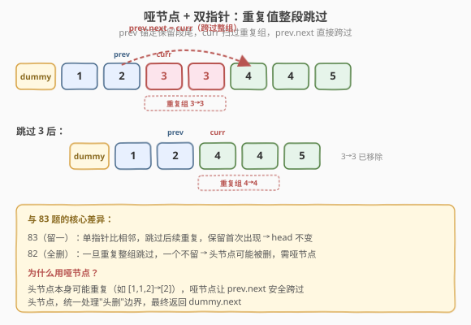
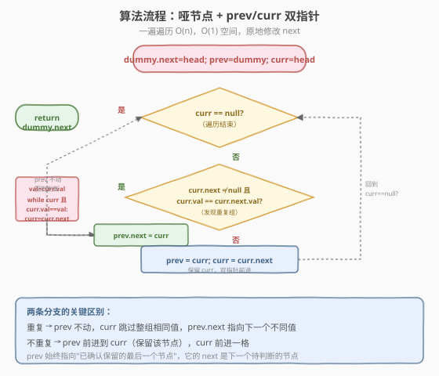
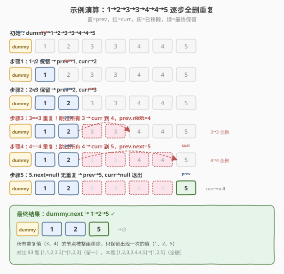

# 删除排序链表中的重复元素 II

- **题目名称**：删除排序链表中的重复元素 II
- **链接**：[82. 删除排序链表中的重复元素 II](https://leetcode.cn/problems/remove-duplicates-from-sorted-list-ii/)
- **难度**：中等
- **标签**：链表、双指针

## 1. 题目概述

给定一个**已排序**的单链表的头节点 `head`，删除所有含有**重复数字**的节点，只保留原始链表中**没有重复出现**的数字。返回结果链表的头节点。

**与 [83 题](../0001-0100/83_删除排序链表中的重复元素.md) 的关键区别**：83 题重复的**留一个**，本题重复的**全删**。

**示例 1**：

```text
输入：head = [1,2,3,3,4,4,5]
输出：[1,2,5]
解释：3 出现两次、4 出现两次，这些重复值的节点全部删除；1、2、5 各出现一次，保留。
```

**示例 2**：

```text
输入：head = [1,1,1,2,3]
输出：[2,3]
解释：1 出现三次，全部删除；2、3 各出现一次，保留。
```

**约束条件**：

- 链表节点数目范围 `[0, 300]`
- `-100 <= Node.val <= 100`
- 题目数据保证链表**已经按升序排列**

> 💡 本题的前提同样是**链表已排序**——重复值必相邻。但与 83 题不同：一旦某个值出现 ≥ 2 次，该值的**所有节点**都要删除，一个不留。这意味着**头节点本身也可能被删**（如示例 2 的 `1→1→1→2→3`，头节点 1 就是重复值），因此不能像 83 题那样直接返回 `head`——需要**哑节点**统一处理。

---

## 2. 解题思路

### 2.1 暴力思路：哈希计数 + 重建

遍历一遍链表，用哈希表统计每个值的出现次数，再遍历一遍挑出只出现一次的值重建链表。

- 需要 `O(n)` 额外空间（哈希表 + 新链表）。
- 没有利用"已排序"这一前提——有序链表重复值必相邻，根本不需要哈希表。
- 题目要求**原地修改** `next` 指针，重建新链表不符合题意。

> ⚠️ 暴力法把问题复杂化了：和 83 题一样，"已排序"意味着重复值天然聚在一起。只要发现 `curr.val == curr.next.val`，就能确定 `curr` 是某个重复组的开头，**一次性跳过所有相同值的节点**即可。无需额外空间。

### 2.2 核心观察：哑节点 + prev/curr 双指针整段跳过

**关键定义**：引入**哑节点** `dummy`，令 `dummy.next = head`。用两个指针：

- `prev`：始终指向**已确认保留的最后一个节点**（它的 `next` 是下一个待判断的节点）。
- `curr`：当前正在扫描的节点。

**两条分支**：

1. **发现重复**（`curr.next` 非空且 `curr.val == curr.next.val`）：记录 `val = curr.val`，然后**循环跳过所有** `val` 值的节点（`curr = curr.next` 直到 `curr.val != val` 或 `curr` 为空），最后令 `prev.next = curr`——把整组重复节点从链表中摘除。注意 `prev` **不前进**，因为新的 `curr` 可能又是一个新重复组的开头。

2. **无重复**（`curr.next` 为空，或 `curr.val != curr.next.val`）：`curr` 是唯一值，保留它。`prev = curr`（prev 前进到这个保留节点），`curr = curr.next`。



**为什么需要哑节点？** 头节点本身可能就是重复值（如 `[1,1,2,3]`→`[2,3]`，头节点 `1` 要被删）。没有哑节点时，删除头节点需要特殊处理 `head` 指针；有了哑节点，`prev` 一开始指向 `dummy`，`prev.next` 可以安全跨过任何节点（包括头节点），最终返回 `dummy.next` 即可——**统一了"头删"和"非头删"的边界**。

> 💡 **prev 的角色**：`prev` 是"安全锚点"——它指向的节点已经确定不会重复（要么是哑节点，要么是刚确认唯一的节点）。`prev.next` 则是"待定区"的入口，随时可能被修改指向更后面的节点。这种"已确定 + 待定"的双指针结构在链表删除题中很常见（如 [21. 合并两个有序链表](https://leetcode.cn/problems/merge-two-sorted-lists/) 的哑节点 + tail 尾指针）。

### 2.3 算法流程图



**完整步骤**：

1. **建哑节点**：`dummy = ListNode(0, head)`，`prev = dummy`，`curr = head`。
2. **循环**：当 `curr != null`：
   - 若 `curr.next != null` 且 `curr.val == curr.next.val`：
     - `val = curr.val`
     - 内层循环：`while curr != null and curr.val == val`：`curr = curr.next`（跳过整组）
     - `prev.next = curr`（摘除整组，`prev` 不动）
   - 否则：
     - `prev = curr`（保留，`prev` 前进）
     - `curr = curr.next`
3. **返回** `dummy.next`。

> ⚠️ **内层循环判 `curr` 而非 `curr.next`**：因为要跳过**所有**等于 `val` 的节点，包括最后一个。如 `[1,1,1,2]`，从第一个 `1` 开始跳，要跳过三个 `1` 直到 `curr` 指向 `2`。若只判 `curr.next`，会漏掉最后一个 `1`。跳完后 `prev.next = curr` 把整组 `1` 全部摘除。

### 2.4 示例演算

以 `head = [1,2,3,3,4,4,5]`（示例 1）为例：



| 步骤 | prev 位置 | curr 位置 | 判断 | 动作 | 链表状态 |
|------|-----------|-----------|------|------|---------|
| 初始 | dummy | 1 | — | — | dummy→1→2→3→3→4→4→5 |
| 步骤 1 | 1 | 2 | 1≠2 | 保留 1，prev→1，curr→2 | dummy→1→2→3→3→4→4→5 |
| 步骤 2 | 2 | 3（第1个） | 2≠3 | 保留 2，prev→2，curr→3 | dummy→1→2→3→3→4→4→5 |
| 步骤 3 | 2 | 4（第1个） | 3==3 | 重复！跳过所有 3，curr→4，prev.next=4 | dummy→1→2→4→4→5 |
| 步骤 4 | 2 | 5 | 4==4 | 重复！跳过所有 4，curr→5，prev.next=5 | dummy→1→2→5 |
| 步骤 5 | 5 | null | 5.next=null | 保留 5，prev→5，curr→null | dummy→1→2→5 |
| 结束 | — | null | curr==null | 返回 dummy.next | **1→2→5** |

注意步骤 3 和 4：发现重复后 `prev` **始终停在 2**（最后保留的节点），只有 `curr` 跳过整组重复值。直到步骤 5 遇到唯一值 5，`prev` 才从 2 跳到 5。最终 `dummy.next` 指向 `1→2→5`。

> 💡 **对比 83 题的同示例**：83 题处理 `[1,2,3,3,4,4,5]` 的结果是 `[1,2,3,4,5]`（每个值留一个），本题结果是 `[1,2,5]`（重复的全删）。83 题用单指针 `curr` 停在首次出现处只跳后续重复；本题用 `prev/curr` 双指针，一旦发现重复就整组跳过。

---

## 3. 参考代码

### C++

```cpp
/**
 * Definition for singly-linked list.
 * struct ListNode {
 *     int val;
 *     ListNode *next;
 *     ListNode() : val(0), next(nullptr) {}
 *     ListNode(int x) : val(x), next(nullptr) {}
 *     ListNode(int x, ListNode *next) : val(x), next(next) {}
 * };
 */
class Solution {
  public:
    ListNode* deleteDuplicates(ListNode* head) {
        ListNode* dummy = new ListNode(0, head);   // 哑节点统一头删
        ListNode* prev = dummy;
        ListNode* curr = head;

        while (curr != nullptr) {
            if (curr->next != nullptr && curr->val == curr->next->val) {
                int val = curr->val;
                while (curr != nullptr && curr->val == val) {
                    curr = curr->next;             // 跳过整组重复
                }
                prev->next = curr;                 // 摘除整组，prev 不动
            } else {
                prev = curr;                       // 保留，prev 前进
                curr = curr->next;
            }
        }

        return dummy->next;
    }
};
```

### Python

```python
# Definition for singly-linked list.
# class ListNode:
#     def __init__(self, val=0, next=None):
#         self.val = val
#         self.next = next
class Solution:
    def deleteDuplicates(self, head: Optional[ListNode]) -> Optional[ListNode]:
        dummy = ListNode(0, head)                  # 哑节点统一头删
        prev = dummy
        curr = head

        while curr:
            if curr.next and curr.val == curr.next.val:
                val = curr.val
                while curr and curr.val == val:
                    curr = curr.next               # 跳过整组重复
                prev.next = curr                   # 摘除整组，prev 不动
            else:
                prev = curr                        # 保留，prev 前进
                curr = curr.next

        return dummy.next
```

> 💡 两版代码逻辑完全一致。核心是 `if` 分支的**两步操作**：先内层 `while` 把 `curr` 推过整组重复值，再 `prev.next = curr` 把整组摘除。`prev` 在重复分支中**不前进**——它守在最后一个保留节点处，等待 `curr` 扫到下一个不重复的值再接上。Python 中 `while curr:` 直接用节点真值判空，`if curr.next and ...` 先判 `curr.next` 非空再取 `val`，避免 `AttributeError`。

---

## 4. 复杂度分析

| 维度 | 复杂度 | 说明 |
|------|--------|------|
| **时间复杂度** | `O(n)` | `curr` 从头到尾遍历一次，每个节点至多被访问两次（外层一次 + 内层跳过时一次） |
| **空间复杂度** | `O(1)` | 只用 `dummy`、`prev`、`curr` 三个指针，常数额外空间 |

> ⚠️ 虽然 `if` 分支内有嵌套 `while`，但**均摊分析**：`curr` 在内层循环中跳过的节点不会被外层再次访问（它们已被摘除）。所以 `curr` 总共前进的步数 ≤ `n`，整体 `O(n)`。与 83 题同为 `O(n)` 时间 `O(1)` 空间，但本题多了一个哑节点和一个 `prev` 指针。

---

## 5. 扩展：递归解法

除了迭代，本题也可以用**递归**优雅地解决。递归的思路：把"删除重复"看作对子链表的操作——

```python
def deleteDuplicates(self, head):
    if head is None or head.next is None:
        return head                              # 不足两节点，无重复

    if head.val == head.next.val:
        # head 是重复值，跳过所有相同值，递归处理后续
        val = head.val
        while head and head.val == val:
            head = head.next
        return self.deleteDuplicates(head)       # 返回后续去重结果
    else:
        # head 不重复，保留 head，递归处理 next
        head.next = self.deleteDuplicates(head.next)
        return head
```

递归解法的时间复杂度同为 `O(n)`，但空间复杂度为 `O(n)`（递归栈深度最坏 `n`）。面试中**推荐迭代解法**（`O(1)` 空间更优），但递归解法思路简洁，适合作为"另一种视角"提及。

> 💡 递归的本质：`head.val == head.next.val` 时 head 必须被删，所以返回值不是 `head` 而是子链表去重后的结果；不重复时 head 保留，只需把 `head.next` 接上子链表去重结果。这和迭代的"prev.next = curr"是同一思想——重复时跳过，不重复时接上。

---

## 6. 面试要点

1. **为什么需要哑节点？83 题不需要？**

   - 83 题保留每个值的**首次出现**，头节点必然保留，所以直接返回 `head`。
   - 本题一旦重复**全删**，头节点可能本身是重复值（如 `[1,1,2]→[2]`），需要被删除。哑节点让 `prev.next` 可以安全跨过头节点，统一处理"头删"和"非头删"，最终返回 `dummy.next`。

2. **prev 在重复分支中为什么不前进？**

   - 跳过整组重复后，新的 `curr` 可能又是一个**新重复组的开头**（如 `[1,1,2,2,3]`，跳过 `1` 后 `curr` 到 `2`，而 `2` 也是重复值）。
   - 若 `prev` 前进到这个新 `curr`，而它恰好是重复值要被删，`prev` 就指向了一个要被删除的节点——逻辑出错。
   - `prev` 守在最后一个**确认保留**的节点处，等 `curr` 确认不重复后 `prev` 才前进。

3. **内层 while 为什么判 `curr != null` 而非 `curr.next != null`？**

   - 要跳过**所有**等于 `val` 的节点，包括重复组中的最后一个。如 `[1,1,1,2]`，从第一个 `1` 开始跳，要跳到 `curr` 指向 `2` 为止。
   - 若只判 `curr.next`，会在最后一个 `1` 处停下（因为 `curr.next` 是 `2`，`val` 不同），漏掉这个 `1`。
   - 判 `curr` 本身保证 `curr` 最终停在第一个不等于 `val` 的节点（或 `null`）。

4. **和 83 题的核心差异是什么？**

   - **83（留一）**：单指针 `curr` 比相邻，`curr.val == curr.next.val` 时跳过 `curr.next`（`curr` 不动），保留 `curr`。头节点不变，直接返回 `head`。
   - **82（全删）**：双指针 `prev/curr`，`curr.val == curr.next.val` 时跳过**所有**相同值节点，`prev.next = curr`。头节点可能被删，需哑节点，返回 `dummy.next`。
   - 记法：**83 留一首个、82 重复全删**；83 单指针、82 哑节点 + 双指针。

5. **如果链表无序怎么做？**

   - 无序时重复值不相邻，相邻比较会漏判。需要用哈希表统计每个值的出现次数（第一遍遍历），再第二遍遍历挑出只出现一次的值。时间 `O(n)`，空间 `O(n)`。
   - 但题目保证**已排序**，所以面试中只需强调"利用有序性 → 相邻比较 → `O(1)` 空间"即可。

> 💡 **一句话总结**：82 是 83 的进阶版——同样的"有序 → 重复相邻"前提，但要求重复值**全删**而非留一。解法是**哑节点 + prev/curr 双指针**：发现 `curr.val == curr.next.val` 时内层循环跳过整组相同值、`prev.next = curr`（prev 不动）；不重复时 `prev` 前进。哑节点统一了头删边界，一遍遍历 `O(n)` 时间 `O(1)` 空间。核心是"**prev 守锚点、curr 扫重复组**"的分工。

---

## 7. 同类练习题

- [83. 删除排序链表中的重复元素](https://leetcode.cn/problems/remove-duplicates-from-sorted-list/)（[题解](../0001-0100/83_删除排序链表中的重复元素.md)）：重复留一，单指针相邻比较，本题的前置题
- [21. 合并两个有序链表](https://leetcode.cn/problems/merge-two-sorted-lists/)：哑节点 + 双指针的另一个经典应用，同样用"prev/tail 锚定 + 逐节点调整 next"
- [203. 移除链表元素](https://leetcode.cn/problems/remove-linked-list-elements/)：删除等于给定值的所有节点，哑节点统一头删，比本题更简单（不需判断重复组）
- [92. 反转链表 II](https://leetcode.cn/problems/reverse-linked-list-ii/)：哑节点 + 区间操作，哑节点处理头节点边界的另一用法
- [19. 删除链表的倒数第 N 个节点](https://leetcode.cn/problems/remove-nth-node-from-end-of-list/)：哑节点防止删除头节点时的空指针，同一哑节点模式
