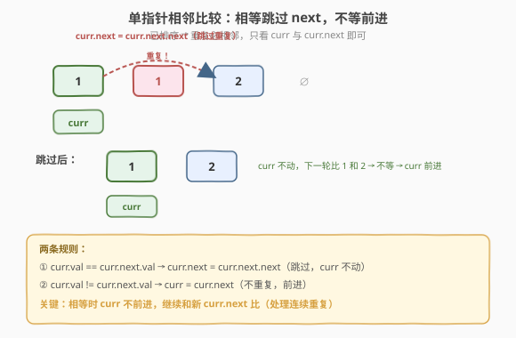
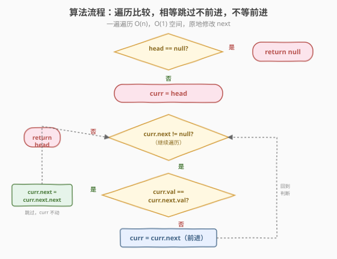
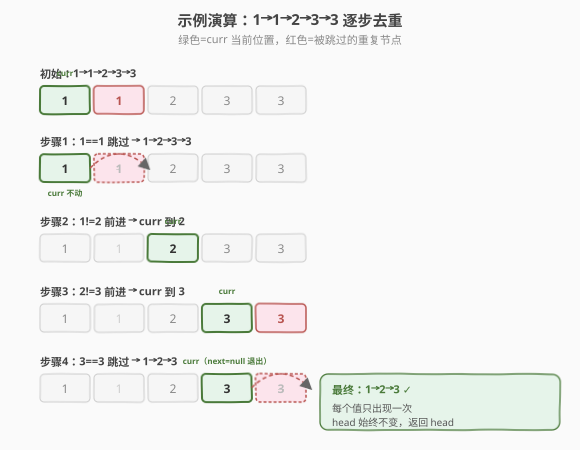

# 删除排序链表中的重复元素

- **题目名称**：删除排序链表中的重复元素
- **链接**：[83. 删除排序链表中的重复元素](https://leetcode.cn/problems/remove-duplicates-from-sorted-list/)
- **难度**：简单
- **标签**：链表

## 1. 题目概述

给定一个**已排序**的单链表的头节点 `head`，删除所有**重复的元素**，使每个元素**只出现一次**。返回已排序的链表头节点（原地删除，不创建新节点）。

**示例 1**：

```text
输入：head = [1,1,2]
输出：[1,2]
解释：第一个和第二个节点值都是 1，删除第二个，保留第一个。
```

**示例 2**：

```text
输入：head = [1,1,2,3,3]
输出：[1,2,3]
解释：删除重复的 1 和重复的 3，每个值只留一个。
```

**约束条件**：

- 链表节点数目范围 `[0, 300]`
- `-100 <= Node.val <= 100`
- 题目数据保证链表**已经按升序排列**

> 💡 本题的关键前提是**链表已排序**——所有重复值一定**相邻**排列。这样只需用单指针顺序遍历，比较相邻两节点是否相等即可，遇到相等就跳过（删除）后一个。如果链表无序，就要用哈希集合记录见过的值，复杂度不变但思路不同。这是链表"相邻比较"的经典入门题。

---

## 2. 解题思路

### 2.1 暴力思路：把值存进集合去重再重建

把链表所有值存入数组或集合去重，再按顺序新建链表。能过但：

- 需要 `O(n)` 额外空间存集合 / 新链表。
- 题目要求**原地删除**（修改 `next` 指针跳过重复节点），新建链表不符合题意。
- 没有利用"已排序"这一前提——有序链表的重复值必相邻，根本不需要哈希集合。

> ⚠️ 暴力法把问题复杂化了：题目已保证升序，重复元素天然聚在一起。顺序遍历比相邻值就能定位所有重复，无需额外空间。**用好题目给的前提**是写最优解的第一步。

### 2.2 核心观察：单指针相邻比较

**关键定义**：用一个指针 `curr` 从 `head` 开始遍历。每一步比较 `curr` 和 `curr.next` 的值：

- 若 `curr.val == curr.next.val`：`curr.next` 是重复节点，**跳过它**：`curr.next = curr.next.next`。注意此时 `curr` **不前进**——因为新的 `curr.next` 可能还是同样的值（连续多个重复），要继续和 `curr` 比。
- 若 `curr.val != curr.next.val`：不重复，`curr` **前进一格**：`curr = curr.next`。



**为什么 `curr` 不前进时不会漏判？** 跳过 `curr.next` 后，新接上来的节点（原 `curr.next.next`）如果还等于 `curr`，下一轮循环会继续跳过它；直到接上一个不等的，`curr` 才前进。这样保证 `curr` 停在每个值的"第一个出现位置"，把它后面所有相同值的节点全部跳过。

> 💡 **已排序是关键**：因为升序，重复值必相邻，所以只看 `curr` 和 `curr.next` 就能找出所有重复。若链表无序，相同值可能分散在各处，相邻比较会漏判——那时才需要哈希集合。**判断用单指针还是哈希集合，看链表是否有序**。

### 2.3 算法流程图



**完整步骤**：

1. **边界**：若 `head` 为空，直接返回 `null`。
2. **初始化**：`curr = head`
3. **循环**：当 `curr.next != null`：
   - 若 `curr.val == curr.next.val`：`curr.next = curr.next.next`（跳过重复，`curr` 不动）
   - 否则：`curr = curr.next`（不重复，前进）
4. **返回** `head`（头节点永远不被删，原 head 就是结果头）

> ⚠️ 循环条件只判 `curr.next != null`，**不判 `curr != null`**：因为 `curr` 一开始就是 `head`，题目保证 `head` 非空（边界已处理），且 `curr` 只在 `curr.next` 非空时才前进，所以 `curr` 永远不会变空。判 `curr.next` 是为了访问 `curr.next.val` 时不解引用空指针。

### 2.4 示例演算

以 `head = [1,1,2,3,3]` 为例：



| 步骤 | curr 位置 | curr.next | 比较 | 动作 | 链表状态 |
|------|-----------|-----------|------|------|---------|
| 初始 | 1（第1个） | 1（第2个） | 相等 | 跳过第2个 | 1→2→3→3 |
| 第 2 步 | 1（第1个） | 2 | 不等 | curr 前进到 2 | 1→2→3→3 |
| 第 3 步 | 2 | 3（第1个） | 不等 | curr 前进到 3 | 1→2→3→3 |
| 第 4 步 | 3（第1个） | 3（第2个） | 相等 | 跳过第2个 3 | 1→2→3 |
| 第 5 步 | 3（第1个） | null | — | 退出循环 | 1→2→3 |

最终链表 `1→2→3`，每个值只出现一次，与示例 2 一致。

> 💡 注意第 1 步：跳过第 2 个 1 后 `curr` **不前进**，新 `curr.next` 是 2，下一轮才比较 1 和 2 不等、`curr` 前进。这正是"相等则跳过、不前进"的妙处——一次循环处理掉连续重复，不会漏判。

---

## 3. 参考代码

### C++

```cpp
/**
 * Definition for singly-linked list.
 * struct ListNode {
 *     int val;
 *     ListNode *next;
 *     ListNode() : val(0), next(nullptr) {}
 *     ListNode(int x) : val(x), next(nullptr) {}
 *     ListNode(int x, ListNode *next) : val(x), next(next) {}
 * };
 */
class Solution {
  public:
    ListNode* deleteDuplicates(ListNode* head) {
        if (head == nullptr) return nullptr;       // 空链表直接返回
        ListNode* curr = head;
        while (curr->next != nullptr) {
            if (curr->val == curr->next->val) {
                curr->next = curr->next->next;     // 跳过重复，curr 不动
            } else {
                curr = curr->next;                 // 不重复，前进
            }
        }
        return head;                               // 头节点不变
    }
};
```

### Python

```python
# Definition for singly-linked list.
# class ListNode:
#     def __init__(self, val=0, next=None):
#         self.val = val
#         self.next = next
class Solution:
    def deleteDuplicates(self, head: Optional[ListNode]) -> Optional[ListNode]:
        if head is None:
            return head
        curr = head
        while curr.next:
            if curr.val == curr.next.val:
                curr.next = curr.next.next         # 跳过重复，curr 不动
            else:
                curr = curr.next                   # 不重复，前进
        return head
```

> 💡 两版代码逻辑一致：`if` 分支只改 `next` 指针不前进，`else` 分支才前进。Python 的 `while curr.next:` 直接用节点的真值判断非空，比 C++ 的 `!= nullptr` 更简洁。注意 `curr.next = curr.next.next` 会让被跳过的节点失去引用，Python 自动回收；C++ 若要严谨可 `delete` 掉被跳过的节点，但 LeetCode 不强制。

---

## 4. 复杂度分析

| 维度 | 复杂度 | 说明 |
|------|--------|------|
| **时间复杂度** | `O(n)` | `curr` 从头遍历到尾，每个节点访问一次（被跳过的节点只比较一次） |
| **空间复杂度** | `O(1)` | 只用 `curr` 一个指针，原地修改 `next` 指针，常数额外空间 |

> ⚠️ 虽然 `curr` 在"跳过"分支不前进，但每个节点至多被比较一次：被跳过的节点直接脱离链表不再访问，未被跳过的节点让 `curr` 前进。总比较次数 ≤ `n-1`，整体 `O(n)`。

---

## 5. 扩展：无序链表去重 / 保留一个 vs 全删

### 5.1 若链表无序怎么办？

如果链表**没有排序**，相同值可能分散，相邻比较会漏判。这时需用**哈希集合**记录已出现的值：

```python
def deleteDuplicates_unsorted(head):
    if not head:
        return head
    seen = {head.val}
    curr = head
    while curr.next:
        if curr.next.val in seen:        # 见过，跳过
            curr.next = curr.next.next
        else:                            # 没见过，记下并前进
            seen.add(curr.next.val)
            curr = curr.next
    return head
```

时间仍 `O(n)`，但空间升到 `O(n)`（哈希集合）。所以**有序用相邻比较省空间，无序用哈希集合换正确性**。

### 5.2 [82. 删除排序链表中的重复元素 II](https://leetcode.cn/problems/remove-duplicates-from-sorted-list-ii/)

本题是"重复的**留一个**"，82 题是"重复的**全删**"。区别在于：本题 `curr` 停在第一个出现的节点，82 题需要用**哑节点** + 双指针，把所有出现 ≥ 2 次的值整段跳过。思路类似但边界更绕，是本题的进阶版。

> 💡 记这个对照：**83 = 重复留一（保留首次出现），82 = 重复全删（一旦重复全部移除）**。83 用单指针比相邻，82 用哑节点 + 三指针整段跳过。先吃透 83，82 就是在它基础上加"计数 + 哑节点"。

---

## 6. 面试要点

1. **为什么能用单指针，不需要快慢或哈希？**

   - 题目保证链表**已排序**，所有重复值**相邻**。只需比较 `curr` 和 `curr.next` 就能找出所有重复。
   - 若无序，相邻比较会漏判分散的重复，必须用哈希集合记录见过的值。**有序 → 相邻比较，无序 → 哈希集合**。

2. **相等时为什么 `curr` 不前进？**

   - 跳过 `curr.next` 后，新接上来的节点可能还是同样的值（连续多个重复，如 `1→1→1→2`）。若 `curr` 前进，就会漏判后面的重复。
   - 不前进让 `curr` 继续和新 `curr.next` 比较，直到接上一个不等的值才前进，保证所有重复都被跳过。

3. **循环条件为什么只判 `curr.next` 不判 `curr`？**

   - 边界已处理 `head` 为空的情况，`curr` 一开始非空。
   - `curr` 只在 `curr.next` 非空（即 `else` 分支）时才前进，所以 `curr` 永远不会变空。
   - 判 `curr.next` 是为了安全访问 `curr.next.val`，避免解引用空指针。

4. **头节点会被删除吗？为什么直接返回 `head`？**

   - 不会。本题保留每个值的"第一个出现"，头节点是第一个值的首个出现，必然保留。
   - 所以 `head` 始终指向结果链表的头，直接返回即可。若题目改成"重复全删"（82 题），头节点可能被删，那时需要**哑节点**统一处理。

5. **和 82 题（重复全删）的核心差异？**

   - 83 保留首次出现，用单指针比相邻；82 一旦重复全删，用**哑节点** + 指向"待保留段尾"的指针，整段跳过重复值。
   - 82 必须用哑节点：因为头节点可能本身就是重复值要被删，没有哑节点难以统一处理头删情况。

> 💡 **一句话总结**：83 是有序链表去重的入门题——利用"已排序 → 重复必相邻"，单指针顺序遍历，`curr.val == curr.next.val` 就跳过 `curr.next`（`curr` 不动），不等才前进。一遍遍历 `O(n)`、`O(1)` 空间，原地修改 `next` 指针。核心是"**相等跳过不前进**"——保证连续重复都被处理。掌握它，82 题（全删）只是加哑节点 + 整段跳过的升级。

---

## 7. 同类练习题

- [82. 删除排序链表中的重复元素 II](https://leetcode.cn/problems/remove-duplicates-from-sorted-list-ii/)：重复全删，哑节点 + 整段跳过
- [203. 移除链表元素](https://leetcode.cn/problems/remove-linked-list-elements/)：删除等于给定值的所有节点，哑节点统一头删
- [21. 合并两个有序链表](https://leetcode.cn/problems/merge-two-sorted-lists/)（[题解](../../week2/day4/合并两个有序链表.md)）：哑节点 + 双指针，同样是"按值调整 next"
- [206. 反转链表](https://leetcode.cn/problems/reverse-linked-list/)（[题解](../../week1/day4/反转链表.md)）：链表指针操作基础题
