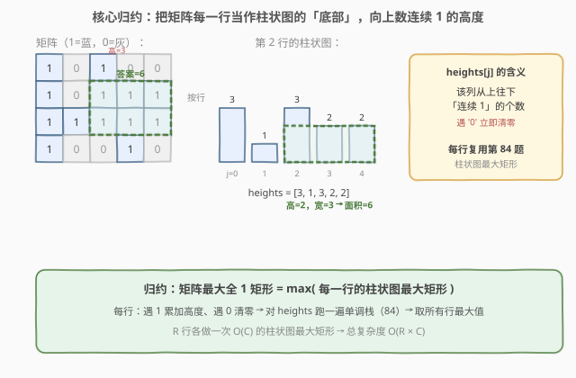
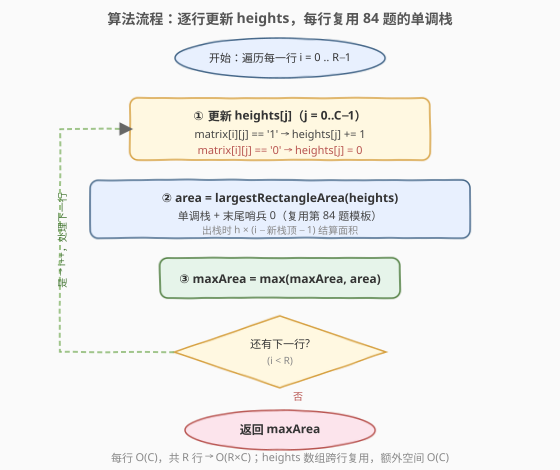
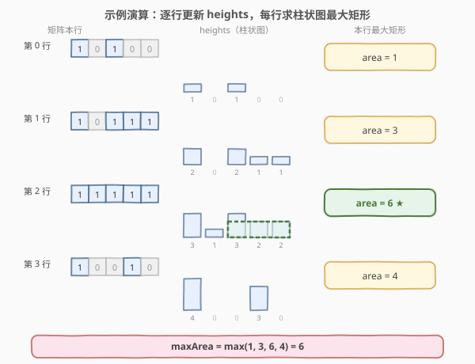

# 最大矩形

- **题目名称**：最大矩形
- **链接**：[85. 最大矩形](https://leetcode.cn/problems/maximal-rectangle/)
- **难度**：困难
- **标签**：栈、数组、动态规划、单调栈、矩阵

## 1. 题目概述

给定一个仅包含 `'0'` 和 `'1'` 的 `rows × cols` 二维字符矩阵，找出其中**只包含 `'1'` 的最大矩形**，并返回其面积。

**示例 1**：

```text
输入：matrix = [["1","0","1","0","0"],
               ["1","0","1","1","1"],
               ["1","1","1","1","1"],
               ["1","0","0","1","0"]]
输出：6
解释：最大矩形位于第 1~2 行、第 2~4 列，是一个 2×3 的全 1 块，面积为 6。
```

**示例 2**：

```text
输入：matrix = [["0"]]
输出：0
```

**约束条件**：

- `rows == matrix.length`
- `cols == matrix[i].length`
- `1 <= rows, cols <= 200`
- `matrix[i][j]` 为 `'0'` 或 `'1'`

---

## 2. 解题思路

### 2.1 暴力思路

枚举所有左上角 `(r1,c1)` 和右下角 `(r2,c2)`，检查子矩阵是否全为 `'1'`，更新最大面积。子矩阵个数 `O(R^2·C^2)`，每个检查 `O(R·C)`，总复杂度 `O(R^3·C^3)`，对 `200×200` 完全不可行。

需要把"二维矩形面积"问题**降维**。关键观察：任意一个全 1 矩形的**底部**一定落在某一行的若干连续列上，而这些列在该行往上的高度（连续 1 的个数）恰好构成一个**柱状图**。于是问题被归约为："对每一行，求以该行为底部的柱状图最大矩形"——这正是 [84. 柱状图中最大的矩形](84_柱状图中最大的矩形.md)。

### 2.2 核心观察：矩阵 → 柱状图归约



定义 `heights[j]` 为**第 `j` 列从上往下、到当前行为止的连续 `'1'` 的个数**：

- 当 `matrix[i][j] == '1'`：`heights[j] += 1`（柱子长高一截）；
- 当 `matrix[i][j] == '0'`：`heights[j] = 0`（柱子被截断，清零）。

这样每处理完一行，`heights[]` 就是一张柱状图。对该柱状图跑一遍 [84 题](84_柱状图中最大的矩形.md) 的单调栈，得到"以该行为底"的最大矩形面积；对所有行取最大值即为答案。

> 💡 **为什么这样不遗漏？** 任意最大全 1 矩形的底边必落在某一行 `i`，其高度由底边所在列的连续 1 决定。当我们以第 `i` 行的 `heights[]` 求柱状图最大矩形时，该矩形必然被考虑（柱子高度恰等于矩形高度，宽度由单调栈向左右扩展得到）。枚举所有行作为"底"，就覆盖了所有可能的最大矩形。

### 2.3 算法流程图



整体骨架只有一重外层循环（遍历行），内部 `① 更新高度 → ② 跑单调栈 → ③ 取最大值`。`heights` 数组**跨行复用**（同一份 `vector<int>` 不断累加/清零），无需每行重建。

### 2.4 示例演算



以示例 1 为例，逐行追踪 `heights` 与本行最大矩形：

- **第 0 行**：`matrix[0]="10100"` → `heights=[1,0,1,0,0]`，柱状图最大矩形 = 1。
- **第 1 行**：`matrix[1]="10111"` → `heights=[2,0,2,1,1]`（第 1 列遇 0 清零，其余累加），柱状图最大矩形 = 3（高 1 跨 3 根）。
- **第 2 行**：`matrix[2]="11111"` → `heights=[3,1,3,2,2]`，柱状图最大矩形 = **6**（高 2 跨第 2~4 列，即 2×3 块）⭐。
- **第 3 行**：`matrix[3]="10010"` → `heights=[4,0,0,3,0]`（第 1、2、4 列遇 0 清零），柱状图最大矩形 = 4（高 4 跨 1 根）。

最终 `maxArea = max(1, 3, 6, 4) = 6`，与示例一致。

---

## 3. 参考代码

### 方法一：单调栈归约（推荐，复用 84 题模板）

### C++

```cpp
class Solution {
  public:
    int maximalRectangle(vector<vector<char>>& matrix) {
        if (matrix.empty() || matrix[0].empty()) return 0;
        int rows = matrix.size(), cols = matrix[0].size();
        vector<int> heights(cols, 0);
        int maxArea = 0;

        for (int i = 0; i < rows; i++) {
            for (int j = 0; j < cols; j++) {
                // 遇 1 累加高度，遇 0 清零
                heights[j] = (matrix[i][j] == '1') ? heights[j] + 1 : 0;
            }
            maxArea = max(maxArea, largestRectangleArea(heights));
        }
        return maxArea;
    }

  private:
    // 84 题模板：单调栈 + 末尾哨兵 0
    int largestRectangleArea(vector<int>& heights) {
        heights.push_back(0);              // 哨兵，强制清栈
        stack<int> st;                     // 存下标，高度递增
        int maxArea = 0;
        for (int i = 0; i < (int)heights.size(); i++) {
            while (!st.empty() && heights[st.top()] > heights[i]) {
                int top = st.top(); st.pop();
                int h = heights[top];
                int w = st.empty() ? i : i - st.top() - 1;
                maxArea = max(maxArea, h * w);
            }
            st.push(i);
        }
        heights.pop_back();                // 恢复，供下一行继续累加
        return maxArea;
    }
};
```

### Python

```python
class Solution:
    def maximalRectangle(self, matrix: List[List[str]]) -> int:
        if not matrix or not matrix[0]:
            return 0
        cols = len(matrix[0])
        heights = [0] * cols
        max_area = 0

        for row in matrix:
            for j in range(cols):
                # 遇 1 累加高度，遇 0 清零
                heights[j] = heights[j] + 1 if row[j] == "1" else 0
            max_area = max(max_area, self._largest_rectangle_area(heights))
        return max_area

    def _largest_rectangle_area(self, heights: List[int]) -> int:
        heights = heights + [0]            # 哨兵，不修改原数组
        stack = []                         # 存下标，高度递增
        max_area = 0
        for i, h in enumerate(heights):
            while stack and heights[stack[-1]] > h:
                top = stack.pop()
                height = heights[top]
                width = i if not stack else i - stack[-1] - 1
                max_area = max(max_area, height * width)
            stack.append(i)
        return max_area
```

> ⚠️ **两个细节**：
> 1. **`heights` 跨行复用**：C++ 中 `largestRectangleArea` 内部 `push_back(0)` 后必须 `pop_back()` 恢复，否则哨兵残留会让下一行的高度数组多一个 0、长度错位。Python 版用 `heights + [0]` 产生新列表，天然不影响原数组。
> 2. **遇 0 清零是关键**：`heights[j]` 必须在 `matrix[i][j] == '0'` 时**归零**而非"不变"，因为 0 切断了该列的连续 1，柱子被截断。

---

## 4. 复杂度分析

| 维度 | 复杂度 | 说明 |
|------|--------|------|
| 时间复杂度 | O(R × C) | 共 R 行，每行更新 `heights` 为 O(C)、单调栈求最大矩形为 O(C)（每下标入栈出栈各一次） |
| 空间复杂度 | O(C) | `heights` 数组长度为 C，单调栈最坏存 C 个下标 |

> ⚠️ 本题的 `O(R×C)` 已是该问题下界级别——最坏情况下答案矩形需要读取所有 `R×C` 个格子才能确定，所以单调栈归约解法是**渐近最优**的。

---

## 5. 扩展：悬线法 DP（不用单调栈）

除了"归约到 84 + 单调栈"，还可用纯 DP 在每行内维护三个一维数组，避免显式栈操作。思想是对每个格子维护一条**悬线**（向上能延伸多高）及其能左右扩展的左右边界：

- `height[j]`：第 `j` 列到当前行为止的连续 1 高度（同前）。
- `left[j]`：在高度 `height[j]` 下，第 `j` 列往左最远能延伸到的下标（含 `j`）。
- `right[j]`：在高度 `height[j]` 下，第 `j` 列往右最远能延伸到的下标（不含，开区间）。

转移时若本格为 `'1'`，则 `left[j] = max(left[j], cur_left)`、`right[j] = min(right[j], cur_right)`，分别与上一行边界取交（保证高度抬升后边界不越界）；若为 `'0'`，重置 `height[j]=0`、`left[j]=0`、`right[j]=n`。面积 `= height[j] * (right[j] - left[j])`。

```cpp
class Solution {
  public:
    int maximalRectangle(vector<vector<char>>& matrix) {
        if (matrix.empty() || matrix[0].empty()) return 0;
        int n = matrix[0].size();
        vector<int> height(n, 0), left(n, 0), right(n, n);
        int maxArea = 0;

        for (auto& row : matrix) {
            int cur_left = 0, cur_right = n;
            for (int j = 0; j < n; j++) {            // 从左往右更新 height/left
                if (row[j] == '1') {
                    height[j]++;
                    left[j] = max(left[j], cur_left);
                } else {
                    height[j] = 0;
                    left[j] = 0;  cur_left = j + 1;
                }
            }
            for (int j = n - 1; j >= 0; j--) {       // 从右往左更新 right
                if (row[j] == '1') {
                    right[j] = min(right[j], cur_right);
                } else {
                    right[j] = n;  cur_right = j;
                }
            }
            for (int j = 0; j < n; j++) {            // 统一行内面积
                maxArea = max(maxArea, height[j] * (right[j] - left[j]));
            }
        }
        return maxArea;
    }
};
```

**对比**：两种方法同为 `O(R×C)` 时间、`O(C)` 空间。单调栈归约**思路最直观**（直接复用 84）、面试好讲；悬线法 DP **常数更小**（每行只扫两遍，无栈操作），但转移细节（`cur_left`/`cur_right` 与上一行取交）容易写错。面试推荐归约法，能体现"把新问题转化为已解决问题"的能力。

---

## 6. 面试要点

1. **怎么想到把矩阵问题转化为柱状图问题？**

   - 抓住"最大矩形必有底边落在某一行"这一性质。以第 `i` 行为底，每一列向上连续的 `'1'` 个数恰好是一根柱子的高度，于是"以第 `i` 行为底的最大矩形" = "第 `i` 行 `heights[]` 的柱状图最大矩形"（84 题）。枚举所有行即覆盖全部情况。这种"固定一维、降维到经典问题"的思路在**最大正方形（221）**中也有体现（固定右下角、用 DP）。

2. **`heights[j]` 的更新规则是什么？为什么遇 0 要清零？**

   - `matrix[i][j] == '1'`：`heights[j] += 1`，柱子继续往上长；`matrix[i][j] == '0'`：`heights[j] = 0`，因为 0 切断了该列的连续 1，柱子从这一行起被截断、高度归零。若不清零，会把断开的上半段误算进当前行的柱高，导致面积虚大。

3. **为什么 C++ 版要在单调栈函数里 `push_back(0)` 再 `pop_back()`？**

   - 哨兵 `0` 用于在遍历结束时强制清空栈、结算所有剩余柱子（同 84 题）。但 `heights` 是跨行复用的同一份 `vector`，若不 `pop_back()` 恢复，哨兵会残留、下一行长度多 1 且末尾恒为 0，导致后续累加错位。Python 用 `heights + [0]` 生成新列表，无此问题。

4. **本题和 84 题、42 题（接雨水）的单调栈有何异同？**

   - 三者都靠单调栈找"边界"。84（最大矩形）找"左右第一个更矮"、栈**递增**，结算面积 `h × w`；42（接雨水）找"左右第一个更高"、栈**递减**，结算一横层水量。本题只是把 84 的单调栈原样套到"每一行的 `heights`"上，外层加一行循环，**没有新的单调栈技巧**，价值在于"归约"这一思维。

5. **如果不允许 `O(C)` 额外空间，能优化到 `O(1)` 吗？**

   - 单调栈解法本身需要 `O(C)` 栈空间，难以降到 `O(1)`（除非允许修改输入矩阵，把 `heights` 直接写在矩阵里，但仍需栈）。悬线法 DP 同样需 `O(C)` 的 `height/left/right`。`O(C)` 已是渐近最优空间，`C ≤ 200` 完全可接受，无需强行优化。

6. **如果题目改成"最大全 1 正方形"呢？**

   - 那就是 [221. 最大正方形](../0201-0300/221_最大正方形.md)：用 `dp[i][j]` 表示以 `(i,j)` 为右下角的全 1 正方形边长，`dp[i][j] = min(dp[i-1][j], dp[i][j-1], dp[i-1][j-1]) + 1`（当 `matrix[i][j]=='1'`）。本题求"任意比例矩形"，正方形 DP 不适用，需用柱状图归约。

---

## 7. 同类练习题

- [84. 柱状图中最大的矩形](https://leetcode.cn/problems/largest-rectangle-in-histogram/)（[题解](84_柱状图中最大的矩形.md)）：本题的直接前置，单调栈 + 哨兵模板
- [221. 最大正方形](https://leetcode.cn/problems/maximal-square/)（[题解](../0201-0300/221_最大正方形.md)）：同为矩阵求最大全 1 图形，改用 DP（固定右下角）
- [42. 接雨水](https://leetcode.cn/problems/trapping-rain-water/)（[题解](42_接雨水.md)）：单调栈求"左右第一个更高"，与 84 互为对偶
- [854. 矩阵中的最大矩形（LCP 39）](https://leetcode.cn/problems/0jxxkn/)：同类二维最大矩形变体
- [1504. 统计全 1 子矩形](https://leetcode.cn/problems/count-submatrices-with-all-ones/)：把"求最大面积"换成"计数"，同样可用 `heights` + 单调栈统计
