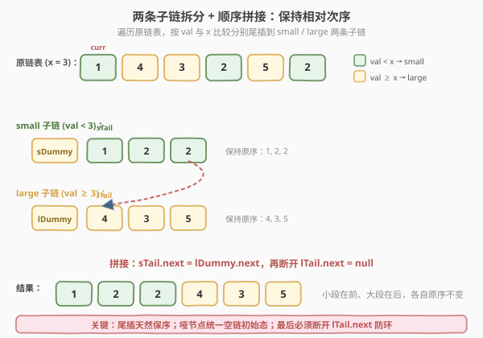
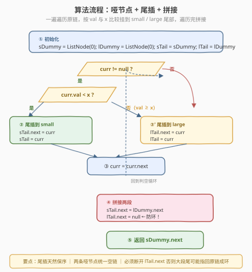
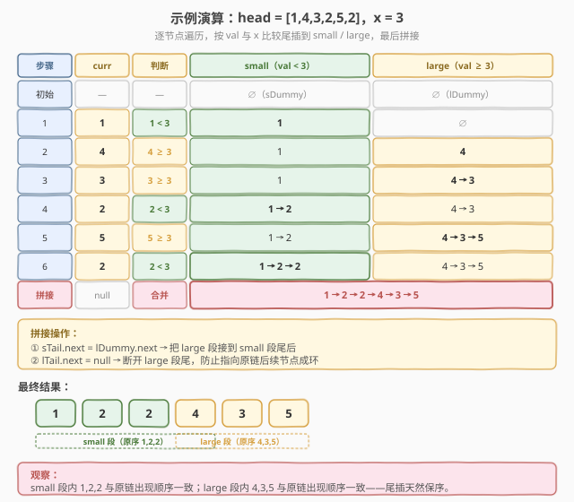

# 分隔链表

- **题目名称**：分隔链表
- **链接**：[86. 分隔链表](https://leetcode.cn/problems/partition-list/)
- **难度**：中等
- **标签**：链表、双指针

## 1. 题目概述

给定单链表的头节点 `head` 和一个特定值 `x`，请对链表进行**分隔**，使得**所有小于 `x` 的节点**都出现在**大于或等于 `x` 的节点之前**。

**关键要求**：分隔后，**两个分区中各节点的初始相对顺序必须保持不变**（即稳定分区，不是简单交换）。

**示例 1**：

```text
输入：head = [1,4,3,2,5,2], x = 3
输出：[1,2,2,4,3,5]
解释：小于 3 的节点 1,2,2 放到前面，大于等于 3 的节点 4,3,5 放到后面；
      各自保持原链表中的出现顺序（small 段内 1→2→2 与原序一致，large 段内 4→3→5 与原序一致）。
```

**示例 2**：

```text
输入：head = [2,1], x = 2
输出：[1,2]
解释：小于 2 的节点 1 放到前面，大于等于 2 的节点 2 放到后面，得 1→2。
```

**约束条件**：

- 链表中节点数目范围 `[0, 200]`
- `-100 <= Node.val <= 100`
- `-200 <= x <= 200`

> 💡 本题的核心难点不是"分开"——遍历一遍按值分类即可；难点是**保序**。若允许交换，用类似 [75. 颜色分类](https://leetcode.cn/problems/sort-colors/) 的三向切分（前后双指针交换）就行，但交换会打乱相对次序。要稳定分区，最干净的思路是**拆成两条子链**分别收集，再首尾相接——尾插天然保序，一遍遍历 `O(n)` 时间 `O(1)` 空间。

---

## 2. 解题思路

### 2.1 暴力思路：存数组分类再重建

遍历链表把节点值存入数组，过滤出 `<x` 和 `≥x` 两组，拼起来再重建链表。能过但：

- 只改值不改指针，**不符合"分隔链表"的语义**（节点带随机指针时失效）。
- 需要 `O(n)` 额外空间存数组。
- 面试官会要求"用指针操作真正分隔"。

> ⚠️ 链表题的正解永远是**改 `next` 指针**。本题的精髓在于"在不申请新节点的前提下，仅靠指针重连完成稳定分区"。

### 2.2 核心观察：两条子链 + 尾插拼接

**整体思路**：维护**两条独立的子链**——`small` 收集所有 `val < x` 的节点，`large` 收集所有 `val >= x` 的节点。遍历原链表，**按值尾插**到对应子链。遍历结束后，把 `large` 接到 `small` 尾部即可。

**为什么用尾插？** 尾插把新节点挂在链表尾部，**先来后到**——遍历原链时先遇到的节点先被插入，天然保持原相对次序。这是"稳定分区"的充要条件：只要每条子链按原序构建，拼接后两段内部必然原序。

**为什么用两个哑节点？** 一开始 `small` 和 `large` 都是空链，第一个节点该挂哪边取决于值。引入 `sDummy` 和 `lDummy` 两个哑节点，让 `sTail`/`lTail` 一开始就有"落脚点"，**统一空链与非空链的尾插逻辑**——无需特判"第一个节点"。最终返回 `sDummy.next` 即结果头。



**单步细节**（设 `curr` 为当前遍历节点）：

1. 比较 `curr.val` 与 `x`：
   - 若 `curr.val < x`：`sTail.next = curr; sTail = curr`（尾插到 small）
   - 否则：`lTail.next = curr; lTail = curr`（尾插到 large）
2. `curr = curr.next`（推进到下一个节点）

> 💡 **重要前置：先记 `next` 再断开**。注意 `sTail.next = curr` 后，`curr` 仍然连着原链后续节点（因为只改了 `sTail.next`，没动 `curr.next`）。所以可以直接 `curr = curr.next` 推进。但遍历结束后，`lTail`（large 段尾）的 `next` 可能还指向原链的某个节点——这正是成环隐患，**必须显式 `lTail.next = null` 断开**（详见 2.4）。

### 2.3 算法流程图



**完整步骤**：

1. **建哑节点**：`sDummy = ListNode(0)`，`lDummy = ListNode(0)`，`sTail = sDummy`，`lTail = lDummy`。
2. **遍历**：`curr = head`，当 `curr != null`：
   - 若 `curr.val < x`：`sTail.next = curr`，`sTail = curr`
   - 否则：`lTail.next = curr`，`lTail = curr`
   - `curr = curr.next`
3. **拼接**：
   - `sTail.next = lDummy.next`（small 尾接 large 头）
   - `lTail.next = null`（**断开 large 尾，防环**）
4. **返回** `sDummy.next`。

> ⚠️ **第 3 步两行顺序无关但缺一不可**。`lTail.next = null` 是防环关键：遍历时 `lTail` 是原链最后某个 `≥x` 节点，它的 `next` 可能仍指向后续节点（甚至，若最后一个节点是 `≥x`，`lTail` 就是原链尾，`next` 本就是 `null`，但若最后一个节点是 `<x`，`lTail` 之后的 `≥x` 段被 `small` 段节点"穿过"，`lTail.next` 可能指向 `small` 段节点 → 拼接后成环）。显式置空是最稳妥的保险。

### 2.4 示例演算

以 `head = [1,4,3,2,5,2]`，`x = 3`（示例 1）为例：



| 步骤 | curr | 判断 | small 段 | large 段 |
|------|------|------|---------|----------|
| 初始 | — | — | ∅ | ∅ |
| 1 | 1 | 1 < 3 | 1 | ∅ |
| 2 | 4 | 4 ≥ 3 | 1 | 4 |
| 3 | 3 | 3 ≥ 3 | 1 | 4 → 3 |
| 4 | 2 | 2 < 3 | 1 → 2 | 4 → 3 |
| 5 | 5 | 5 ≥ 3 | 1 → 2 | 4 → 3 → 5 |
| 6 | 2 | 2 < 3 | 1 → 2 → 2 | 4 → 3 → 5 |
| 拼接 | null | sTail.next = lDummy.next; lTail.next = null | 1 → 2 → 2 → 4 → 3 → 5 |

注意步骤 3：`3 ≥ 3` 走 large 分支——**等于 `x` 的节点归到 large 段**（题目要求 `≥x` 的节点在后）。最终 `small = [1,2,2]`、`large = [4,3,5]`，拼接得 `[1,2,2,4,3,5]`，两段内部均保持原序。

> 💡 **防环场景演示**：若去掉 `lTail.next = null`，考虑 `head = [1,2,3]`，`x = 5`（全部 `< x`）。遍历后 `small = [1,2,3]`、`large = ∅`（`lTail` 仍是 `lDummy`），`sTail`（节点 3）的 `next` 仍指向原链 `null`，看似无事。但若 `head = [3,1,2]`，`x = 2`：遍历后 `small = [1]`、`large = [3]`，此时 `lTail`（节点 3）的 `next` 仍指向原链节点 1（它现在也在 `small` 段里）。拼接 `sTail.next = lDummy.next` 后，`large` 段尾（节点 3）的 `next` 指向 `small` 段的节点 1 → **成环**。`lTail.next = null` 一刀切断这个隐患。

---

## 3. 参考代码

### C++

```cpp
/**
 * Definition for singly-linked list.
 * struct ListNode {
 *     int val;
 *     ListNode *next;
 *     ListNode() : val(0), next(nullptr) {}
 *     ListNode(int x) : val(x), next(nullptr) {}
 *     ListNode(int x, ListNode *next) : val(x), next(next) {}
 * };
 */
class Solution {
  public:
    ListNode* partition(ListNode* head, int x) {
        ListNode* sDummy = new ListNode(0);          // small 段哑节点
        ListNode* lDummy = new ListNode(0);          // large 段哑节点
        ListNode* sTail = sDummy;
        ListNode* lTail = lDummy;
        ListNode* curr = head;

        while (curr != nullptr) {
            if (curr->val < x) {
                sTail->next = curr;                  // 尾插到 small
                sTail = curr;
            } else {
                lTail->next = curr;                  // 尾插到 large
                lTail = curr;
            }
            curr = curr->next;
        }

        sTail->next = lDummy->next;                  // small 尾接 large 头
        lTail->next = nullptr;                       // 断开 large 尾，防环
        return sDummy->next;
    }
};
```

### Python

```python
# Definition for singly-linked list.
# class ListNode:
#     def __init__(self, val=0, next=None):
#         self.val = val
#         self.next = next
class Solution:
    def partition(self, head: Optional[ListNode], x: int) -> Optional[ListNode]:
        s_dummy = ListNode(0)                        # small 段哑节点
        l_dummy = ListNode(0)                        # large 段哑节点
        s_tail = s_dummy
        l_tail = l_dummy
        curr = head

        while curr:
            if curr.val < x:
                s_tail.next = curr                   # 尾插到 small
                s_tail = curr
            else:
                l_tail.next = curr                   # 尾插到 large
                l_tail = curr
            curr = curr.next

        s_tail.next = l_dummy.next                   # small 尾接 large 头
        l_tail.next = None                           # 断开 large 尾，防环
        return s_dummy.next
```

> 💡 两版代码逻辑完全一致。核心是 `if/else` 两分支尾插 + 遍历后两步拼接。注意 `curr = curr->next` 在 `sTail = curr` / `lTail = curr` 之后执行——此时 `curr` 的 `next` 还未被修改（我们只改了 `sTail.next`/`lTail.next`，没动 `curr.next`），所以能正确推进到原链的下一个节点。`lTail.next = null` 是全题最易漏的一行，务必收尾。

---

## 4. 复杂度分析

| 维度 | 复杂度 | 说明 |
|------|--------|------|
| **时间复杂度** | `O(n)` | `curr` 从头到尾遍历一次，每个节点 `O(1)` 尾插 + 一次 `O(1)` 拼接 |
| **空间复杂度** | `O(1)` | 只用 `sDummy`、`lDummy`、`sTail`、`lTail`、`curr` 五个指针，常数额外空间（哑节点本身是 2 个临时头，不计入"复制链表"） |

> ⚠️ 严格说 C++ 中 `new ListNode(0)` 申请了 2 个哑节点，若不释放会有微小内存占用，但这是链表题的惯例开销，不计入空间复杂度（算法本身只用 `O(1)` 指针变量）。若追求零分配，可改用栈上 `ListNode sDummyNode(0)` 取地址，但 LeetCode 评测环境不要求。

---

## 5. 扩展：原地交换法（不稳定）与稳定法的取舍

若题目**不要求保序**，可以用类似 [75. 颜色分类](https://leetcode.cn/problems/sort-colors/) 的前后双指针交换法：

- 用 `left` 指针从前往后找第一个 `≥x` 的位置，`right` 指针从后往前找 `<x` 的节点，交换值。
- 直到 `left` 与 `right` 相遇。

**对比**：

| 维度 | 双子链尾插（本题解） | 前后交换法 |
|------|---------------------|-----------|
| **稳定性** | ✅ 保序 | ❌ 打乱相对次序 |
| **操作对象** | 改 `next` 指针（真链表操作） | 交换节点值（取巧） |
| **空间** | `O(1)` | `O(1)` |
| **时间** | `O(n)` | `O(n)`（需先求长度/尾节点） |
| **适用** | 要求稳定分区 | 仅要求分区不保序 |

> 💡 本题明确要求"保留每个分区中节点的初始相对顺序"，**必须用稳定法**。前后交换法虽然常数更小，但破坏了次序，不符合题意。双子链尾插是此题的标准解法。

---

## 6. 面试要点

1. **为什么用两个哑节点而不是一个？**

   - 本题要分出 `small` 和 `large` **两段**，每段独立构建。两个哑节点各自作为一条子链的"虚拟头"，让 `sTail`/`lTail` 一开始就有落脚点，无需特判"该段第一个节点"。
   - 最终 `sDummy.next` 是结果头，`lDummy.next` 是 large 段头（供拼接用）。两个哑节点各司其职，逻辑清晰。

2. **为什么尾插能保序？**

   - 尾插把新节点挂在链表**尾部**，"先来后到"——遍历原链时先遇到的节点先被插入。
   - 设原链中 `<x` 的节点依次为 $a_1, a_2, \ldots, a_k$，则它们按顺序被尾插到 `small` 段，结果仍是 $a_1 \to a_2 \to \cdots \to a_k$，相对次序不变。`large` 段同理。

3. **`lTail.next = null` 这行能省吗？**

   - **不能**。遍历过程中 `lTail` 是原链最后某个 `≥x` 节点，它的 `next` 仍指向原链后续节点（这些节点可能已经被挂到 `small` 段）。
   - 若不置空，拼接 `sTail.next = lDummy.next` 后，`large` 段尾的 `next` 可能指回 `small` 段节点 → **成环**，导致遍历结果链表时死循环。
   - 这是本题**最易漏的边界**，面试时主动提"防环"是加分项。

4. **`curr = curr.next` 为什么在赋值之后还能正确推进？**

   - 尾插只改了 `sTail.next = curr`（或 `lTail.next = curr`），**没有动 `curr.next`**。所以 `curr` 仍然连着原链的下一个节点，`curr = curr.next` 能正确取到原链后续。
   - 若先 `curr = curr.next` 再赋值，会丢失当前节点引用——顺序必须是"先挂后移"。

5. **等于 `x` 的节点归哪段？**

   - 题目要求"所有**小于** `x` 的节点在前，**大于或等于** `x` 的节点在后"。所以 `val == x` 归 `large` 段。
   - 代码中 `if (curr.val < x)` 走 small，`else` 走 large，`else` 包含了 `>= x` 的情况，逻辑正确。

> 💡 **一句话总结**：86 是链表稳定分区的招牌题——两个哑节点各建一条子链，遍历原链按 `val < x` 与否**尾插**到对应子链（尾插天然保序），遍历结束 `sTail.next = lDummy.next` 拼接 + `lTail.next = null` 防环，返回 `sDummy.next`。一遍 `O(n)`、`O(1)` 空间。核心是"**拆-收-拼**"三步：拆成两段分类、尾插收集、首尾相接。

---

## 7. 同类练习题

- [328. 奇偶链表](https://leetcode.cn/problems/odd-even-linked-list/)：按节点**位置奇偶**分组拼接，同样是双子链尾插 + 拼接，本题的变体
- [21. 合并两个有序链表](https://leetcode.cn/problems/merge-two-sorted-lists/)（[题解](../0001-0100/21_合并两个有序链表.md)）：哑节点 + 双指针逐节点调整 `next`，哑节点模式的另一经典应用
- [82. 删除排序链表中的重复元素 II](https://leetcode.cn/problems/remove-duplicates-from-sorted-list-ii/)（[题解](../0001-0100/82_删除排序链表中的重复元素II.md)）：哑节点统一头删边界，prev/curr 双指针重连 `next`
- [725. 分隔链表](https://leetcode.cn/problems/split-linked-list-in-parts/)：按**段数**均分链表，另一类"分隔"，对比按值分组的差异
- [203. 移除链表元素](https://leetcode.cn/problems/remove-linked-list-elements/)：哑节点 + 遍历重连，比本题更简单的单链指针操作基础题
