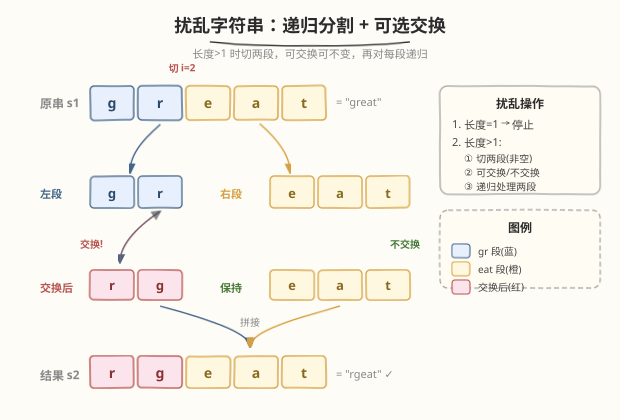
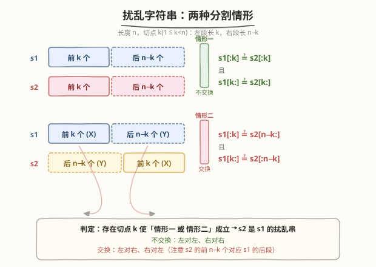
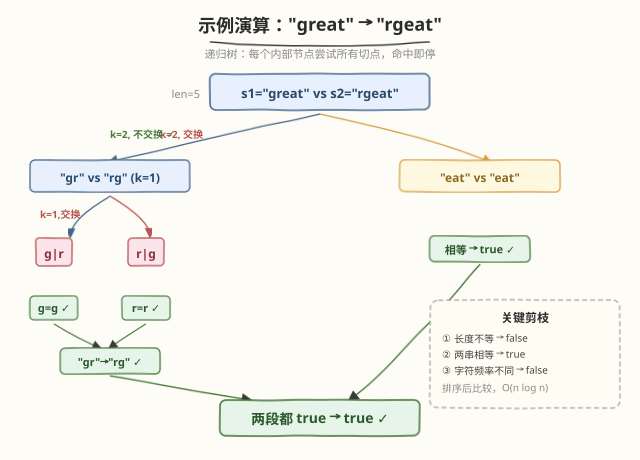

# 扰乱字符串

- **题目名称**：扰乱字符串
- **链接**：[87. 扰乱字符串](https://leetcode.cn/problems/scramble-string/)
- **难度**：困难
- **标签**：动态规划、三维 DP、字符串、递归、记忆化搜索

## 1. 题目概述

给定两个长度相同的字符串 `s1` 和 `s2`，判断 `s2` 是否是 `s1` 的**扰乱字符串**（Scramble String）。

**扰乱操作**（对 `s1` 递归进行）：

1. 若字符串长度为 1，停止。
2. 若长度 > 1，执行：
   - **切分**：在某个下标 `i`（`1 <= i < n`）处将字符串切成两段非空子串 `X` 和 `Y`（`s = X + Y`）。
   - **可选交换**：决定是否交换两段的位置，得到 `X + Y`（不交换）或 `Y + X`（交换）。
   - **递归**：对得到的每一段继续执行上述操作。

**示例 1**：

```text
输入：s1 = "great", s2 = "rgeat"
输出：true
解释：如下操作可由 s1 得到 s2：
  great
  ├── 切 i=2，不交换 → "gr" | "eat"
  │     ├── "gr" 切 i=1，交换 → "r" | "g" = "rg"
  │     └── "eat" 保持不变     = "eat"
  └── 拼接 → "rg" + "eat" = "rgeat"
```

**示例 2**：

```text
输入：s1 = "abcde", s2 = "caebd"
输出：false
```

**示例 3**：

```text
输入：s1 = "a", s2 = "a"
输出：true
```

**约束条件**：

- `s1.length == s2.length`
- `1 <= s1.length <= 30`
- `s1`、`s2` 由小写英文字母组成

> 💡 本题是经典的**区间 DP / 递归 + 记忆化**问题。难点不在实现，而在于想清楚「交换」这一步如何映射到子问题——切点 `k` 既要枚举切在哪，又要枚举换不换，共 $2(n-1)$ 种分支。

---

## 2. 解题思路

### 2.1 暴力思路：递归枚举所有切点

对 `s1`、`s2`（长度均为 `n`），枚举切点 `k`（`1 <= k < n`），将 `s1` 分成 `s1[:k]`（长 `k`）和 `s1[k:]`（长 `n-k`）。对应地 `s2` 有两种对齐方式：

- **不交换**：`s1[:k]` 对 `s2[:k]`、`s1[k:]` 对 `s2[k:]`
- **交换**：`s1[:k]` 对 `s2[n-k:]`、`s1[k:]` 对 `s2[:n-k]`

两种情形只要有一种的两段子问题都成立，即返回 true。最坏情况每层有 `2(n-1)` 个分支，递归树深 `O(n)`，总复杂度 `O(n!)` 级别，严重超时。

### 2.2 核心观察：递归 + 记忆化（两道剪枝）



**关键直觉**：两个子串是否互为扰乱串，**只取决于它们本身的内容**，与上层怎么切无关——具备**最优子结构**。同时大量子问题会重复（同一段子串在不同切法下被反复求解），适合**记忆化**去重。

在此基础上加两道**剪枝**（判断前先查）：

| 剪枝 | 条件 | 作用 |
|------|------|------|
| **相等剪枝** | `s1 == s2` → 直接 true | 递归到底最常见的情况，避免继续切分 |
| **频率剪枝** | `sorted(s1) != sorted(s2)` → 直接 false | 字符频率不同绝不可能互为扰乱（扰乱只换位置不换字符） |

> ⚠️ 频率剪枝是本题的「杀手锏」：扰乱操作**只重新排列字符位置，不改变字符集合**，因此任意扰乱串与原串的**字符多重集必相同**。排序后比较即可，`O(n log n)` 但 `n ≤ 30` 可忽略。

**两种分割情形**：



- **情形一（不交换）**：`s1[:k]` 与 `s2[:k]` 互为扰乱串 **且** `s1[k:]` 与 `s2[k:]` 互为扰乱串
- **情形二（交换）**：`s1[:k]` 与 `s2[n-k:]` 互为扰乱串 **且** `s1[k:]` 与 `s2[:n-k]` 互为扰乱串

> 💡 **交换情形的理解**：交换意味着 `s1` 的前段 `X`（长 `k`）在结果中跑到了**末尾**，因此它对应 `s2` 的**后 `k` 个字符** `s2[n-k:]`；同理 `s1` 的后段 `Y`（长 `n-k`）对应 `s2` 的**前 `n-k` 个字符** `s2[:n-k]`。

### 2.3 示例演算

`s1 = "great"`、`s2 = "rgeat"`（`n = 5`）：



递归树从根 `(great, rgeat)` 出发：

1. 尝试 `k=2`，**不交换**：左子问题 `(gr, rg)` + 右子问题 `(eat, eat)`
2. 右子问题 `"eat" == "eat"` → 相等剪枝命中，直接 true
3. 左子问题 `(gr, rg)`：尝试 `k=1`，**交换**：`s1[:1]="g"` 对 `s2[1:]="g"`（相等）且 `s1[1:]="r"` 对 `s2[:1]="r"`（相等）→ true
4. 两段都 true → 根返回 true

### 2.4 自底向上：三维 DP

记忆化是自顶向下，也可写成自底向上的三维 DP。**定义**：

$$\text{dp}[i][j][\text{len}] = \text{true} \iff s_1[i..i+\text{len}] \text{ 与 } s_2[j..j+\text{len}] \text{ 互为扰乱串}$$

**边界**（`len = 1`）：

$$\text{dp}[i][j][1] = (s_1[i] == s_2[j])$$

**转移**（`len >= 2`，枚举切点 `k`，`1 <= k < len`）：

$$\text{dp}[i][j][\text{len}] = \bigvee_{k=1}^{\text{len}-1} \left\{ \underbrace{\text{dp}[i][j][k] \wedge \text{dp}[i+k][j+k][\text{len}-k]}_{\text{不交换}} \;\vee\; \underbrace{\text{dp}[i][j+\text{len}-k][k] \wedge \text{dp}[i+k][j][\text{len}-k]}_{\text{交换}} \right\}$$

**答案**：`dp[0][0][n]`。

**维度说明**：

| 维度 | 含义 | 范围 |
|------|------|------|
| `i` | `s1` 的起始下标 | `0 ~ n-1` |
| `j` | `s2` 的起始下标 | `0 ~ n-1` |
| `len` | 子串长度 | `1 ~ n` |

- **外层按 `len` 从小到大枚举**（保证转移时更短的子问题已就绪）
- **内层枚举 `i`、`j`、`k`**
- 交换情形的下标对应：`s1` 从 `i` 起取 `k` 个 → 对应 `s2` 从 `j + (len - k)` 起取 `k` 个（即 `s2` 的**后段**）

> 💡 **三维 DP vs 记忆化搜索**：两者复杂度同阶，但记忆化有频率剪枝加持、实际跑得更快；三维 DP 无剪枝但常数稳定。面试中**先讲记忆化（思路直观 + 剪枝）**，再提三维 DP（展示 DP 功底）。

---

## 3. 参考代码

### C++

```cpp
// 方法一：递归 + 记忆化（推荐，有剪枝实际最快）
class Solution {
public:
    bool isScramble(string s1, string s2) {
        unordered_map<string, char> memo;
        return dfs(s1, s2, memo);
    }
private:
    char dfs(const string& a, const string& b, unordered_map<string, char>& memo) {
        string key = a + "#" + b;
        auto it = memo.find(key);
        if (it != memo.end()) return it->second;

        if (a == b) { memo[key] = 1; return 1; }          // 相等剪枝
        string ta = a, tb = b;
        sort(ta.begin(), ta.end());
        sort(tb.begin(), tb.end());
        if (ta != tb) { memo[key] = 0; return 0; }        // 频率剪枝

        int n = a.size();
        char res = 0;
        for (int k = 1; k < n && !res; k++) {
            // 情形一：不交换
            if (dfs(a.substr(0, k), b.substr(0, k), memo) &&
                dfs(a.substr(k), b.substr(k), memo)) { res = 1; break; }
            // 情形二：交换
            if (dfs(a.substr(0, k), b.substr(n - k), memo) &&
                dfs(a.substr(k), b.substr(0, n - k), memo)) { res = 1; break; }
        }
        memo[key] = res;
        return res;
    }
};

// 方法二：三维 DP（自底向上，无剪枝但常数稳定）
class Solution2 {
public:
    bool isScramble(string s1, string s2) {
        int n = s1.size();
        if (n != (int)s2.size()) return false;
        // dp[i][j][len]
        vector dp(n, vector(n, vector<char>(n + 1, 0)));
        for (int i = 0; i < n; i++)
            for (int j = 0; j < n; j++)
                dp[i][j][1] = (s1[i] == s2[j]);

        for (int len = 2; len <= n; len++) {
            for (int i = 0; i + len <= n; i++) {
                for (int j = 0; j + len <= n; j++) {
                    for (int k = 1; k < len; k++) {
                        // 不交换：左对左、右对右
                        if (dp[i][j][k] && dp[i + k][j + k][len - k]) {
                            dp[i][j][len] = 1; break;
                        }
                        // 交换：左对右、右对左
                        if (dp[i][j + len - k][k] && dp[i + k][j][len - k]) {
                            dp[i][j][len] = 1; break;
                        }
                    }
                }
            }
        }
        return dp[0][0][n];
    }
};
```

### Python

```python
# 方法一：递归 + 记忆化（推荐，有剪枝实际最快）
from functools import lru_cache


def isScramble(s1: str, s2: str) -> bool:
    @lru_cache(None)
    def dfs(a: str, b: str) -> bool:
        if a == b:                                  # 相等剪枝
            return True
        if sorted(a) != sorted(b):                  # 频率剪枝
            return False
        n = len(a)
        for k in range(1, n):
            # 情形一：不交换
            if dfs(a[:k], b[:k]) and dfs(a[k:], b[k:]):
                return True
            # 情形二：交换
            if dfs(a[:k], b[n - k:]) and dfs(a[k:], b[:n - k]):
                return True
        return False

    return dfs(s1, s2)


# 方法二：三维 DP（自底向上，无剪枝但常数稳定）
def isScramble_dp(s1: str, s2: str) -> bool:
    n = len(s1)
    if n != len(s2):
        return False
    # dp[i][j][len]：s1[i:i+len] 与 s2[j:j+len] 是否互为扰乱串
    dp = [[[False] * (n + 1) for _ in range(n)] for _ in range(n)]
    for i in range(n):
        for j in range(n):
            dp[i][j][1] = (s1[i] == s2[j])

    for length in range(2, n + 1):
        for i in range(n - length + 1):
            for j in range(n - length + 1):
                for k in range(1, length):
                    # 不交换
                    if dp[i][j][k] and dp[i + k][j + k][length - k]:
                        dp[i][j][length] = True
                        break
                    # 交换
                    if dp[i][j + length - k][k] and dp[i + k][j][length - k]:
                        dp[i][j][length] = True
                        break
    return dp[0][0][n]
```

---

## 4. 复杂度分析

| 维度 | 记忆化搜索 | 三维 DP |
|------|-----------|---------|
| **时间** | `O(n^4)` 最坏（有剪枝实际远低） | `O(n^4)` |
| **空间** | `O(n^3)`（记忆表键数上界） | `O(n^3)` |
| **剪枝** | ✓ 相等 + 频率双剪枝 | ✗ 无剪枝 |
| **常数** | 小（剪枝命中率高时极快） | 中（四重循环固定开销） |
| **适用场景** | `n ≤ 30`，面试首选 | 需要稳定无栈深限制时 |

> 💡 **为什么是 `O(n^4)`？** 三维 DP 有三重外循环 `(len, i, j)` 共 `O(n^3)` 个状态，每个状态内再枚举切点 `k` 耗 `O(n)`，合计 `O(n^4)`。记忆化搜索的状态数同阶，但频率剪枝能砍掉大量不可达分支，实际运行往往快一个量级。

---

## 5. 扩展：字符串哈希加速频率剪枝

频率剪枝每次 `sorted(a) != sorted(b)` 耗 `O(n log n)`。若 `n` 更大（本题 `n ≤ 30` 无所谓，但推广场景下），可用**计数排序**（字符集仅 26 个小写字母）将频率比较降到 `O(n)`：

```python
def same_freq(a: str, b: str) -> bool:
    cnt = [0] * 26
    for ch in a: cnt[ord(ch) - 97] += 1
    for ch in b: cnt[ord(ch) - 97] -= 1
    return all(c == 0 for c in cnt)
```

进一步可用**滚动哈希**预处理前缀频率向量，使任意子串的频率比较变为 `O(26) = O(1)`，整体降到 `O(n^3)`。但本题数据规模小，无需如此优化。

---

## 6. 面试要点

1. **扰乱操作的本质是什么？为什么可以用递归 + 记忆化？**

   - 扰乱 = 递归地「切两段 + 可选交换」，**只改变字符位置，不改变字符集合**
   - 子问题「`a` 与 `b` 是否互为扰乱串」只取决于 `a`、`b` 本身内容，与上层切法无关 → 最优子结构
   - 同一子问题会被不同切法反复求解 → 记忆化去重

2. **频率剪枝为什么是对的？**

   - 扰乱操作只**重新排列**字符（切分 + 交换都是位置变换），**不增删不改字符**
   - 因此任意扰乱串与原串的**字符多重集（频率表）必相同**
   - 排序后比较 = 频率表的规范化比较，不同则直接 false

3. **交换情形的下标为什么是 `s2[n-k:]` 和 `s2[:n-k]`？**

   - 切点 `k` 把 `s1` 分成前段 `X`（长 `k`）和后段 `Y`（长 `n-k`）
   - **交换**意味着结果顺序是 `Y + X`，即 `s2` 的前 `n-k` 个对应 `Y`、后 `k` 个对应 `X`
   - 所以 `X`（`s1[:k]`）对 `s2[n-k:]`（后 `k` 个），`Y`（`s1[k:]`）对 `s2[:n-k]`（前 `n-k` 个）

4. **三维 DP 的状态为什么是三维 `(i, j, len)` 而不是两维？**

   - 扰乱是**子串级别**的关系，不像编辑距离/LCS 只看前缀
   - 需要刻画「`s1` 从 `i` 起长 `len` 的子串」与「`s2` 从 `j` 起长 `len` 的子串」是否互为扰乱
   - 起点两个 (`i`, `j`) + 长度一个 (`len`) = 三维；若用「终点」代替「长度」也可，但 `len` 更自然对应递归的「同长」约束

5. **记忆化和三维 DP 哪个更好？**

   - 数据小（`n ≤ 30`）：记忆化更直观、有剪枝实际更快，面试首选
   - 数据大或担心栈溢出：三维 DP 无递归开销、复杂度稳定
   - 两者状态定义等价，可互相印证

---

## 7. 同类练习题

- [97. 交错字符串](https://leetcode.cn/problems/interleaving-string/)（[题解](../0001-0100/97_交错字符串.md)）：字符串 DP，子问题由前缀长度决定，对照本题的「子串 + 切点」维度
- [72. 编辑距离](https://leetcode.cn/problems/edit-distance/)（[题解](../0001-0100/72_编辑距离.md)）：二维字符串 DP，`min` 取最值，对照本题 `or` 取可行性
- [10. 正则表达式匹配](https://leetcode.cn/problems/regular-expression-matching/)（[题解](../0001-0100/10_正则表达式匹配.md)）：二维 DP + `*` 两分支，更复杂的字符串匹配 DP
- [312. 戳气球](https://leetcode.cn/problems/burst-balloons/)：区间 DP，「枚举最后一步」的思路与本题「枚举切点」异曲同工
- [1000. 合并石头的最低成本](https://leetcode.cn/problems/minimum-cost-to-merge-stones/)：区间 DP + 分段合并，切点枚举 + 子区间合并的结构与本题神似
