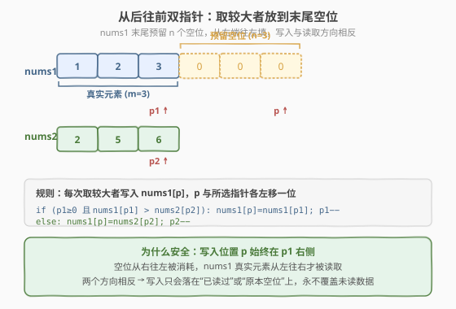
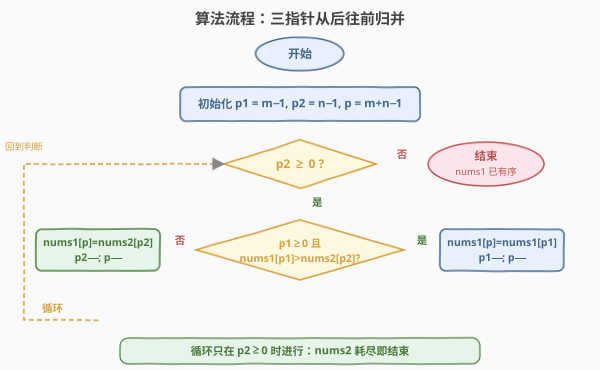
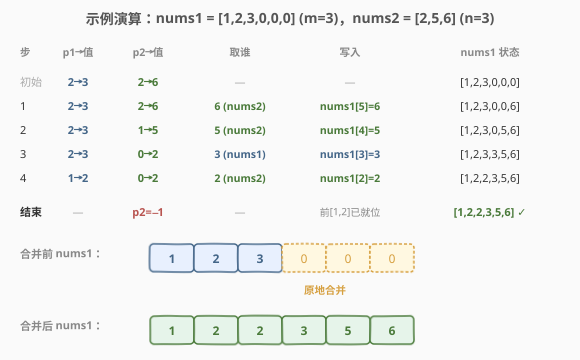

# 合并两个有序数组

- **题目名称**：合并两个有序数组
- **链接**：[88. 合并两个有序数组](https://leetcode.cn/problems/merge-sorted-array/)
- **难度**：简单
- **标签**：数组、双指针

## 1. 题目概述

给你两个按**非递减顺序**排列的整数数组 `nums1` 和 `nums2`，另有两个整数 `m` 和 `n`，分别表示 `nums1` 和 `nums2` 中的元素数目。

请你**合并** `nums2` 到 `nums1` 中，使合并后的数组同样按**非递减顺序**排列。

注意：最终合并后的数组**不应由函数返回**，而是**原地**修改 `nums1`。`nums1` 的初始长度为 `m + n`，其中前 `m` 个元素表示应合并的元素，后 `n` 个元素为 `0`（占位符），应忽略；`nums2` 的长度为 `n`。

**示例 1**：

```text
输入：nums1 = [1,2,3,0,0,0], m = 3, nums2 = [2,5,6], n = 3
输出：[1,2,2,3,5,6]
解释：需要合并 [1,2,3] 和 [2,5,6]，合并结果是 [1,2,2,3,5,6]。
```

**示例 2**：

```text
输入：nums1 = [1], m = 1, nums2 = [], n = 0
输出：[1]
```

**示例 3**：

```text
输入：nums1 = [0], m = 0, nums2 = [1], n = 1
输出：[1]
```

**约束条件**：

- `nums1.length == m + n`
- `nums2.length == n`
- `0 <= m, n <= 200`
- `1 <= m + n <= 200`
- `-10^9 <= nums1[i], nums2[i] <= 10^9`
- `nums1` 和 `nums2` 均按**非递减顺序**排列

> ⚠️ **两个隐含优势**：① `nums1` 末尾已经预留了 `n` 个空位（占位的 `0`），可直接原地写入；② 两个数组都已升序。结合这两点，从后往前"取较大者放到末尾"即可，既不用移动元素，也不用开额外数组。

---

## 2. 解题思路

### 2.1 暴力思路

**辅助数组法**：把 `nums1` 前 `m` 个和 `nums2` 全部拷到一个新数组，排序或归并后写回 `nums1`。时间 `O((m+n) log(m+n))` 或 `O(m+n)`，空间 `O(m+n)`。能过但违背"原地"精神——开了 `O(m+n)` 额外空间。

**前向归并 + 整体后移**：模仿 [21. 合并两个有序链表](合并两个有序链表.md) 从前向后归并，但只要 `nums2` 的元素要插入 `nums1` 前部，就得先把 `nums1` 后续元素整体后移，最坏 `O(m·n)` 次移动。问题出在"从前向后写"会覆盖 `nums1` 中尚未处理的元素。

> ⚠️ **前向写入的矛盾**：写入位置和待读取位置都在 `nums1` 的前段，写新值会冲掉还没读的旧值。要解决就得开辅助数组或反复搬移。

### 2.2 核心观察：从后往前双指针



关键在于利用 `nums1` 末尾**预留的 `n` 个空位**。从后往前填：

- `p1 = m - 1`：`nums1` 真实元素的末尾。
- `p2 = n - 1`：`nums2` 的末尾。
- `p = m + n - 1`：合并后数组的末尾（也就是空位的末尾）。

每步比较 `nums1[p1]` 与 `nums2[p2]`，**较大者**放入 `nums1[p]`，然后 `p` 与被选中一侧的指针各左移一位。

> 💡 **为什么从后往前安全？** 写入位置 `p` 始终在两个读指针 `p1`、`p2` 的**右侧**。任一时刻从 `nums1` 读取过的格子数为 `(m-1) - p1`，而写入过的格子数为 `(m+n-1) - p`；由于 `nums1` 自身要贡献 `m` 个元素中的若干个，可证 `p1 < p` 始终成立。于是 `nums1[p1]` 永远不会在被读到之前被覆盖——写入的只会是"已读过的 `nums1` 位置"或"原本的空位"。这就是"反向填"避开数据竞争的本质。

> 💡 **一个等价直觉**：`nums1` 末尾的 `n` 个 `0` 是"无人区"，从最右端开始往左填，等于把空位从右往左消耗；而 `nums1` 的真实元素从左往右才需要被读，二者方向相反，不会撞车。

### 2.3 算法流程图



步骤：

1. 初始化 `p1 = m-1`、`p2 = n-1`、`p = m+n-1`。
2. 当 `p2 >= 0`（`nums2` 还有未处理元素）时循环：
   - 若 `p1 >= 0` 且 `nums1[p1] > nums2[p2]`：`nums1[p] = nums1[p1]`，`p1 -= 1`。
   - 否则：`nums1[p] = nums2[p2]`，`p2 -= 1`。
   - `p -= 1`。
3. 循环结束时 `nums1` 已是有序合并结果（无需额外处理 `nums1` 剩余——它们本就在正确位置）。

> ⚠️ **循环条件用 `p2 >= 0` 而非 `p1 >= 0`**：当 `nums2` 先耗尽，`nums1` 前缀的剩余元素本就在最终位置，直接结束即可；反之若 `nums1` 先耗尽，还需把 `nums2` 剩余拷到 `nums1` 前部，所以必须继续循环直到 `p2 < 0`。

### 2.4 示例演算

以 `nums1 = [1,2,3,0,0,0]`（`m=3`）、`nums2 = [2,5,6]`（`n=3`）为例：



| 步骤 | p1→值 | p2→值 | 取谁 | 写入 | nums1 状态 |
|------|-------|-------|------|------|------------|
| 初始 | 2→3 | 2→6 | — | — | [1,2,3,0,0,0] |
| 1 | 2→3 | 2→6 | 6 (nums2) | nums1[5]=6 | [1,2,3,0,0,6] |
| 2 | 2→3 | 1→5 | 5 (nums2) | nums1[4]=5 | [1,2,3,0,5,6] |
| 3 | 2→3 | 0→2 | 3 (nums1) | nums1[3]=3 | [1,2,3,3,5,6] |
| 4 | 1→2 | 0→2 | 2 (nums2) | nums1[2]=2 | [1,2,2,3,5,6] |
| 结束 | — | p2=−1 | — | nums2 耗尽，nums1 前 [1,2] 已就位 | **[1,2,2,3,5,6]** ✓ |

最终 `nums1 = [1,2,2,3,5,6]`。注意步骤 4 之后 `p2` 已为 `−1`（`nums2` 耗尽），循环直接结束，`nums1` 前缀的 `1,2` 无需移动——它们本就在正确位置。

---

## 3. 参考代码

### C++

```cpp
class Solution {
  public:
    void merge(vector<int>& nums1, int m, vector<int>& nums2, int n) {
        int p1 = m - 1, p2 = n - 1, p = m + n - 1;
        while (p2 >= 0) {
            if (p1 >= 0 && nums1[p1] > nums2[p2]) {
                nums1[p--] = nums1[p1--];
            } else {
                nums1[p--] = nums2[p2--];
            }
        }
    }
};
```

### Python

```python
class Solution:
    def merge(self, nums1: List[int], m: int, nums2: List[int], n: int) -> None:
        p1, p2, p = m - 1, n - 1, m + n - 1
        while p2 >= 0:
            if p1 >= 0 and nums1[p1] > nums2[p2]:
                nums1[p] = nums1[p1]
                p1 -= 1
            else:
                nums1[p] = nums2[p2]
                p2 -= 1
            p -= 1
```

> 💡 **代码极简的秘诀**：循环条件只看 `p2 >= 0`。这样 `nums2` 一旦耗尽就立刻退出，`nums1` 剩余前缀无需处理；而把 `p1 >= 0` 放进 `if` 条件里，既处理了 `nums1` 先耗尽的情况（此时只能取 `nums2`），又借助短路求值避免了 `nums1[-1]` 越界。

---

## 4. 复杂度分析

| 维度 | 复杂度 | 说明 |
|------|--------|------|
| 时间复杂度 | `O(m+n)` | 每次循环写入一格，至多 `m+n` 次 |
| 空间复杂度 | `O(1)` | 仅用 `p1`、`p2`、`p` 三个指针，原地修改 |

---

## 5. 扩展：正向归并与"反向填"的通用性

### 5.1 为什么不直接从前向后归并？

若 `nums1` 没有预留空位（空位在别处），前向归并需要先把 `nums1` 后段整体后移腾位置，最坏 `O(m·n)`。本题恰好把空位放在 `nums1` **末尾**，"反向填"正是利用这一结构把 `O(m·n)` 降为 `O(m+n)`。核心思想一句话：**写入方向应朝向空位，读取方向应背离空位**，二者相反就不会覆盖未读数据。

### 5.2 同款模板：有序数组的平方（977）

[977. 有序数组的平方](https://leetcode.cn/problems/squares-of-a-sorted-array/) 给定非递减数组（含负数），求平方后的有序数组。平方后数组呈"山谷形"（两端大、中间小），最大值必在两端。于是套用同样的"从后往前取较大者填末尾"模板：双指针从两端往中间走，把较大平方值填到结果数组末尾。这是"反向填双指针"模板的又一经典应用。

> 💡 **判断能否用"反向填"模板的信号**：① 结果数组有明确的"末端"可作为写入起点；② 待选元素中"下一个最大值"易于由两端比较得到；③ 写入区与读取区不重叠。满足这三条，就能套用本题模板。

---

## 6. 面试要点

1. **为什么从后往前而不是从前往后？**

   - 从前往后写入会覆盖 `nums1` 中尚未读取的元素，必须开辅助数组或反复后移。从后往前利用 `nums1` 末尾预留的空位，写入位置始终在读取位置右侧，永不覆盖未读数据，从而原地 `O(m+n)` 完成。

2. **循环条件为什么是 `p2 >= 0` 而不是 `p1 >= 0`？**

   - `nums2` 还有元素就必须继续填（可能要拷到 `nums1` 前部）；而 `nums2` 一旦耗尽，`nums1` 的剩余前缀本就在最终位置，直接结束即可。若用 `p1 >= 0` 作条件，`nums1` 先耗尽时会提前退出，留下 `nums2` 的元素没填进去。

3. **`p1 >= 0` 这个判断能去掉吗？**

   - 不能。当 `nums1` 先耗尽（`p1 = -1`），`nums1[p1]` 越界；`p1 >= 0` 守卫此时强制走 `else` 分支取 `nums2`。`&&` 的短路求值保证了安全。

4. **若 `nums1` 的空位不在末尾而在开头呢？**

   - 那么"反向填"就不再安全（写入区与读取区可能重叠）。此时应改用"正向填"——从前往后比较、写入开头的空位；或开辅助数组。模板的选择取决于空位相对读取区的方向。

5. **能否不开额外空间合并两个等长满数组到任一数组？**

   - 若两数组都满（无空位）且要求原地，需用"块交换/旋转"技巧（类似内部归并排序的 in-place merge），较复杂，面试一般不要求。本题之所以简单，正是因为空位已就位。

> 💡 **一句话总结**：合并两个有序数组的精髓是"反向填"——利用 `nums1` 末尾预留的空位，从后往前取较大者放入，写入与读取方向相反从而互不干扰，实现原地 `O(m+n)`。这一模板可直接迁移到 977 有序数组平方等"两端取大填末尾"的场景。

---

## 7. 同类练习题

- [21. 合并两个有序链表](https://leetcode.cn/problems/merge-two-sorted-lists/)：链表版归并，用哑节点 + 正向双指针（链表无需移动元素，改 `next` 即可）
- [977. 有序数组的平方](https://leetcode.cn/problems/squares-of-a-sorted-array/)：同款"反向填"模板，平方后山谷形，两端取大填末尾
- [23. 合并 K 个升序链表](https://leetcode.cn/problems/merge-k-sorted-lists/)：归并的 K 路扩展，用最小堆每次取全局最小
- [148. 排序链表](https://leetcode.cn/problems/sort-list/)：归并排序链表，复用 21 的两路归并
- [56. 合并区间](https://leetcode.cn/problems/merge-intervals/)：另一种"合并"——按左端点排序后线性扫描重叠区间，思路不同但同属"利用已有序性"
