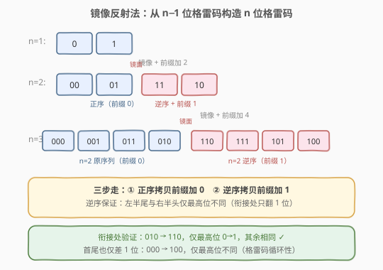
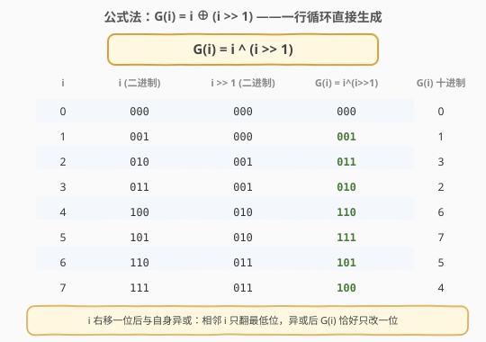
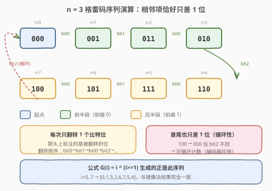

# LeetCode 格雷编码 题解

## 1. 题目概述

- **标题 / 题号**：格雷编码（#89，medium）
- **链接**：https://leetcode.cn/problems/gray-code/
- **难度**：中等
- **标签**：位运算、回溯、数学、分治

**题意**：`n` 位格雷码（Gray Code）是一个包含 $2^n$ 个整数的序列，其中：

1. 每个整数都在 $[0, 2^n - 1]$ 范围内（含边界）；
2. 序列中**没有重复**元素；
3. **相邻**两个整数的二进制表示恰好有**一位**不同；
4. **首尾**两个整数的二进制表示也恰好有一位不同（循环性）。

给定整数 `n`，返回**任意一个**有效的 `n` 位格雷码序列。

**示例 1**：

```text
输入：n = 2
输出：[0,1,3,2]
解释：
  [0,1,3,2] 的二进制表示是 [00,01,11,10]
  00 和 01 差 1 位
  01 和 11 差 1 位
  11 和 10 差 1 位
  10 和 00 差 1 位（循环）
  这也是题目示例的答案；[0,2,3,1] 也是合法格雷码序列
```

**示例 2**：

```text
输入：n = 1
输出：[0,1]
```

**约束**：

- $1 \le n \le 16$

> 💡 **关键信号**：$2^n$ 个数的排列、相邻只差一位——这是经典的**构造问题**。`n ≤ 16` 意味着结果最多 $2^{16} = 65536$ 个元素，$O(2^n)$ 的构造算法完全可行。题目只要求返回**任意一个**合法序列，因此不需要搜索全部解，直接用公式或镜像法**构造**即可。

## 2. 解题思路

### 2.1 暴力思路：全排列 + 验证

枚举 $0$ 到 $2^n - 1$ 的所有排列，逐一检查相邻（含首尾）是否只差一位。$2^{16}$ 个数的全排列是天文数字，显然不可行。

退一步：用**回溯搜索**逐位放置，每次只选与上一个数差一位的候选数。这能大幅剪枝，但最坏情况下仍可能走很多死路。对于构造题，**与其搜索，不如直接构造**——格雷码有优美的数学结构，可以直接生成。

### 2.2 核心观察一：镜像反射法



`n` 位格雷码可以从 `n-1` 位格雷码**递推**构造，只需三步：

1. 取 `n-1` 位格雷码序列 `G(n-1)`；
2. 将 `G(n-1)` **逆序**得到 `reverse(G(n-1))`；
3. 拼接：`G(n) = G(n-1) + [每个元素加 2^(n-1)]`。

> **为什么可行？** 关键在于「衔接处只差一位」：
> - `G(n-1)` 内部相邻项差一位（归纳假设）；
> - `reverse(G(n-1))` 内部也差一位（逆序不改变相邻关系）；
> - **衔接处**：`G(n-1)` 的末尾与 `reverse(G(n-1))` 的开头是**同一个数**，但后者加了 $2^{n-1}$（即最高位从 0 变 1），所以恰好差最高位这一位；
> - **首尾循环**：`G(n)` 的首（`G(n-1)` 的首，最高位 0）与尾（`reverse(G(n-1))` 的末尾加 $2^{n-1}$，即 `G(n-1)` 的首个数加 $2^{n-1}$，最高位 1）也只差最高位。

从 `n=1` 的 `[0, 1]` 出发，逐层镜像，即可生成任意 `n` 的格雷码。

### 2.3 核心观察二：公式法 G(i) = i ⊕ (i >> 1)



镜像法虽然直观，但代码略繁。格雷码有一个**极其优雅的闭式公式**：

$$G(i) = i \oplus (i \gg 1), \quad i = 0, 1, \dots, 2^n - 1$$

即：把 `i` 右移一位后与自己异或，按 `i` 从 0 到 $2^n-1$ 依次计算，得到的序列就是格雷码。

> **为什么这个公式等价于镜像法？** 考察相邻的 `G(i)` 和 `G(i+1)`：
> - `i` 和 `i+1` 在二进制中只差最低若干位（进位链）；
> - `i >> 1` 和 `(i+1) >> 1` 也只差进位传播影响的那些位；
> - 异或后，进位链中的中间位相互抵消（同变 → 异或为 0），**只有进位链的两端各翻一位**——但其中一端恰好抵消，最终**只翻转一个比特**。
>
> 严格证明可用数学归纳法：$G(2^k + j) = 2^k + G(2^k - 1 - j)$，这正是镜像法的递推关系。

### 2.4 算法流程图（公式法）

公式法的流程极其简单：

1. 计算总数 `N = 1 << n`；
2. 对 `i` 从 `0` 到 `N - 1`，依次计算 `i ^ (i >> 1)`；
3. 将结果依次加入答案数组，返回。

镜像法的流程则是递归/迭代：

1. 初始 `ans = [0]`；
2. 对 `k` 从 `0` 到 `n-1`：遍历 `ans` 的**逆序**，每个元素加上 `1 << k`，追加到 `ans` 末尾；
3. 返回 `ans`。

### 2.5 示例演算（n = 3）



以 `n = 3` 为例，`N = 8`，用公式法逐项计算：

| 步骤 | i | i (二进制) | i >> 1 (二进制) | G(i) = i ^ (i>>1) | 说明 |
|------|---|------------|------------------|-------------------|------|
| 1 | 0 | 000 | 000 | 000 = **0** | 起点 |
| 2 | 1 | 001 | 000 | 001 = **1** | 翻 bit0 |
| 3 | 2 | 010 | 001 | 011 = **3** | 翻 bit1 |
| 4 | 3 | 011 | 001 | 010 = **2** | 翻 bit0 |
| 5 | 4 | 100 | 010 | 110 = **6** | 翻 bit2 |
| 6 | 5 | 101 | 010 | 111 = **7** | 翻 bit0 |
| 7 | 6 | 110 | 011 | 101 = **5** | 翻 bit1 |
| 8 | 7 | 111 | 011 | 100 = **4** | 翻 bit0 |

最终序列 `[0, 1, 3, 2, 6, 7, 5, 4]`，与镜像法的结果完全一致。验证首尾循环：`100` 与 `000` 仅 bit2 不同 ✓

## 3. 参考代码

### 方法一：公式法（最简，推荐）

### Python

```python
class Solution:
    def grayCode(self, n: int) -> List[int]:
        return [i ^ (i >> 1) for i in range(1 << n)]
```

### C++

```cpp
class Solution {
  public:
    vector<int> grayCode(int n) {
        int N = 1 << n;
        vector<int> ans(N);
        for (int i = 0; i < N; ++i) {
            ans[i] = i ^ (i >> 1);
        }
        return ans;
    }
};
```

> 💡 **一行 Python，两行 C++**——这是本题最优解。公式法不需要递归、不需要额外空间（除了答案数组），且按 `i` 顺序生成，天然有序。面试中先写出公式法，再口述镜像法的思路即可。

### 方法二：镜像反射法（迭代）

### Python

```python
class Solution:
    def grayCode(self, n: int) -> List[int]:
        ans = [0]
        for k in range(n):
            for j in range(len(ans) - 1, -1, -1):
                ans.append(ans[j] | (1 << k))
        return ans
```

### C++

```cpp
class Solution {
  public:
    vector<int> grayCode(int n) {
        vector<int> ans = {0};
        for (int k = 0; k < n; ++k) {
            int size = ans.size();
            for (int j = size - 1; j >= 0; --j) {
                ans.push_back(ans[j] | (1 << k));
            }
        }
        return ans;
    }
};
```

> 💡 **关键细节**：内层循环必须**逆序**遍历（`j` 从大到小），这样才能把当前序列的镜像正确追加。`ans[j] | (1 << k)` 等价于 `ans[j] + (1 << k)`（因为第 `k` 位原来一定是 0）。

### 方法三：回溯搜索（通用但较慢）

### Python

```python
class Solution:
    def grayCode(self, n: int) -> List[int]:
        N = 1 << n
        used = [False] * N
        path = []

        def diff_one(a: int, b: int) -> bool:
            return (a ^ b).bit_count() == 1

        def dfs() -> bool:
            if len(path) == N:
                return diff_one(path[0], path[-1])
            for x in range(N):
                if used[x]:
                    continue
                if not path or diff_one(path[-1], x):
                    used[x] = True
                    path.append(x)
                    if dfs():
                        return True
                    path.pop()
                    used[x] = False
            return False

        path.append(0)
        used[0] = True
        dfs()
        return path
```

> ⚠️ **回溯法的适用场景**：当题目要求「返回所有合法序列」或附加额外约束（如字典序最小、必须经过特定中间状态）时，回溯才有用武之地。本题只要求任意一个解，回溯反而做了大量无用的搜索尝试。**面试中回溯法仅作为备选方案提及，不作为主解。**

## 4. 复杂度分析

| 维度 | 复杂度 | 说明 |
|------|--------|------|
| 时间复杂度 | $O(2^n)$ | 生成 $2^n$ 个数，每个数 $O(1)$ 计算 |
| 空间复杂度 | $O(2^n)$ | 答案数组存储 $2^n$ 个元素（不含输出则 $O(1)$） |

$n = 16$ 时 $2^{16} = 65536$，毫秒级完成。三种方法的时间复杂度相同（回溯法在最坏情况下可能更高，但本题总能很快找到解）。

## 5. 扩展：格雷码的工程应用

格雷码并非纯粹的算法题，它在工程中有广泛用途：

1. **旋转编码器**：机械转盘用格雷码盘片读数，即使读到「半位」也只差一个单位，避免了大跳变错误。这是格雷码最经典的物理应用。
2. **异步 FIFO 跨时钟域**：多比特计数器跨时钟域传递时，用格雷码编码可以保证任意时刻只有一位在翻转，避免亚稳态导致的错误值。承接 [数字电路设计] 课程。
3. **汉明距离与纠错码**：格雷码最大化了相邻码字之间的汉明距离利用率，是纠错编码的基础概念之一。
4. **卡诺图**：逻辑化简中的卡诺图坐标轴就是用格雷码排列的，保证相邻格子只差一位。

> 💡 **面试加分点**：如果面试官追问「格雷码有什么用」，提到**旋转编码器**或**异步 FIFO 跨时钟域**会让面试官眼前一亮——这说明你不只是背了公式，还理解了它的工程价值。

## 6. 面试要点

1. **公式 $G(i) = i \oplus (i \gg 1)$ 怎么记忆？**

   把 `i` 和 `i` 右移一位后异或。可以理解为：`i` 的第 `j` 位和第 `j+1` 位异或后得到 `G(i)` 的第 `j` 位——如果相邻两位不同则为 1，相同则为 0。这正是「只翻一位」的本质。

2. **为什么相邻的 G(i) 和 G(i+1) 只差一位？**

   `i` 和 `i+1` 的二进制差异是：最低的若干个连续 1 变成 0、再进一位把 0 变成 1（进位链）。右移后异或，进位链中间的位相互抵消（都变了 → 异或为 0），只有链的两端各产生一次翻转，但其中一个恰好落在 `G(i)` 和 `G(i+1)` 的同位置而抵消，最终**只有一个比特位不同**。

3. **镜像法和公式法哪个更好？**

   公式法代码最短、最不易出错，**面试首选**。镜像法更直观，适合用来解释「为什么格雷码相邻只差一位」的直觉。两者生成的序列完全相同（都是标准反射格雷码）。

4. **题目说「返回任意一个」，如果要求字典序最小怎么办？**

   标准格雷码 `[0, 1, 3, 2, ...]` 的前几项已经是最小字典序（以 0 开头、第二项尽量小）。公式法生成的就是字典序最小的反射格雷码。若要求其他排列，可用回溯搜索。

5. **如何验证一个序列是合法格雷码？**

   三个条件：① 无重复元素；② 每个元素在 $[0, 2^n)$ 范围内；③ 相邻（含首尾）的异或结果的 `popcount` 恰好为 1。用 `(a ^ b).bit_count() == 1` 逐对检查即可。

## 同类练习题

| # | 题目 | 与本题的关联 |
|---|------|-------------|
| 1238 | [循环码排列](https://leetcode.cn/problems/circular-permutation-in-binary-representation/) | 给定起点 `start`，返回从 `start` 开始的格雷码循环排列——公式法稍作变形：`G(i) = i ^ (i>>1) ^ start` |
| 191 | [位 1 的个数](https://leetcode.cn/problems/number-of-1-bits/)（[站内题解](../0001-0100/191_位1的个数.md)） | `popcount` 是验证格雷码相邻性的核心工具 |
| 46 | [全排列](https://leetcode.cn/problems/permutations/)（[站内题解](../0001-0100/46_全排列.md)） | 回溯生成排列的母题，对比可体会「构造问题中搜索 vs 直接构造」的效率差距 |
| 371 | [两整数之和](https://leetcode.cn/problems/sum-of-two-integers/)（[站内题解](../0301-0400/371_两整数之和.md)） | 位运算模拟加法，与本题的异或操作同属位运算基础 |
| 78 | [子集](https://leetcode.cn/problems/subsets/)（[站内题解](../0001-0100/78_子集.md)） | 二进制枚举 `$2^n$` 个子集，与格雷码枚举 `$2^n$` 个码字共享「位向量空间」的思想 |
