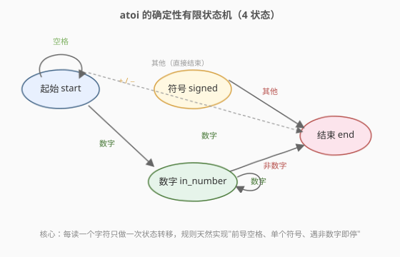
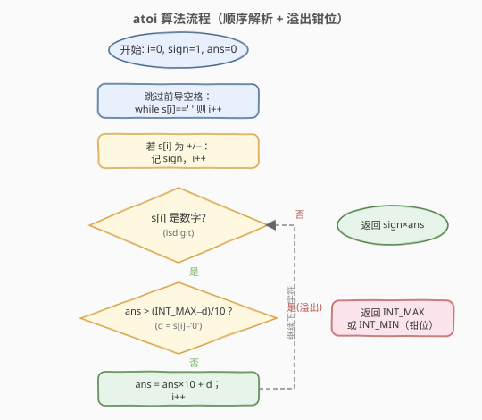
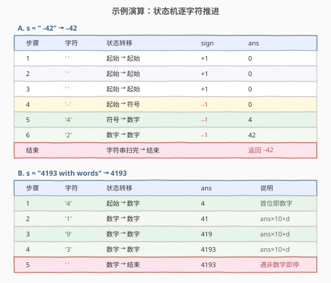

# LeetCode 字符串转换整数 (atoi) 题解

## 1. 题目概述

- **标题 / 题号**：字符串转换整数 (atoi)（#8，medium）
- **链接**：https://leetcode.cn/problems/string-to-integer-atoi/
- **难度**：中等
- **标签**：字符串、自动机、模拟

**题意**：请你实现一个 `myAtoi(string s)` 函数，使其能将字符串转换成 32 位有符号整数。转换规则如下：

1. **丢弃前导空格**：从最左侧开始，忽略任何前导空白字符 `' '`（仅空格，不含制表符等）。
2. **判断正负**：检查下一个字符是否为 `'-'` 或 `'+'`，确定正负号；若两者都不存在则视为正数。
3. **读取数字**：连续读取数字字符直到遇到非数字字符或到达字符串末尾，其余部分忽略；若没有读到任何数字，结果为 `0`。
4. **溢出钳位**：若整数超出 32 位有符号整数范围 $[-2^{31},\ 2^{31}-1]$，则将其**钳位（clamp）**到最近的边界值。
5. 返回最终整数。

> ⚠️ 除前导空格与读取数字后剩余字符外，**不要忽略**任何其他字符。例如 `"-+12"` 由于 `'-'` 后紧跟 `'+'` 非数字，读到符号后立即停止，结果为 `0`；`"3.14159"` 读到 `"3"` 后遇到 `'.'` 停止，结果为 `3`。

**示例 1**：

```text
输入：s = "42"
输出：42
解释：加粗的字符串为已经读入的字符，插入符号 ^ 是当前读取的字符。
第 1 步："42"（当前字符没有前导空格）
第 2 步："42"（当前字符 '+'/'-' 不存在，跳过，默认正数）
第 3 步："42"（读入 "42"，遇到末尾结束）→ 解析得到 42
```

**示例 2**：

```text
输入：s = "   -42"
输出：-42
解释：
第 1 步："   -42"（读入前导空格，忽略）
第 2 步："   -42"（读入 '-'，确定为负数）
第 3 步："   -42"（读入 "42"，遇到末尾结束）→ 解析得到 -42
```

**示例 3**：

```text
输入：s = "4193 with words"
输出：4193
解释：
第 1 步："4193 with words"（当前字符没有前导空格）
第 2 步："4193 with words"（当前字符 '+'/'-' 不存在，默认正数）
第 3 步："4193 with words"（读入 "4193"；由于下一字符 ' ' 非数字，读取结束）→ 解析得到 4193
```

**示例 4**：

```text
输入：s = "words and 987"
输出：0
解释：
第 1 步："words and 987"（当前字符没有前导空格）
第 2 步："words and 987"（当前字符 '+'/'-' 不存在，默认正数）
第 3 步："words and 987"（当前字符 'w' 非数字，读到 0 个数字）→ 解析得到 0
```

**约束**：

- `0 <= s.length <= 200`
- `s` 由英文字母（大写和小写）、数字（`0-9`）、`' '`、`'+'`、`'-'` 和 `'.'` 组成

> 💡 本题考察的不是某种精巧的算法，而是**规则的精确实现**与**整数溢出的边界处理**。它的本质是一个字符串识别过程，用「确定性有限状态机」描述最为自然；而真正容易出错的，是边累加边判断溢出。

## 2. 解题思路

### 2.1 暴力思路

最偷懒的做法是直接调用 `stoi(s)` / `int(s)`：但它**不符合题目语义**——`stoi` 在遇到非数字时会抛异常而非截断，且无法精确控制「只允许前导空格、单个符号」的规则；更要命的是溢出时会抛 `out_of_range` 而非返回边界值。因此必须**自己模拟**这套规则。

### 2.2 核心观察：确定性有限状态机（DFA）



把整个解析过程看作一个**自动机**在字符流上推进：任一时刻处于某个**状态**，读入一个字符后，依据「字符类型」跳到下一个状态。本题只需 4 个状态：

| 状态 | 含义 | 何时进入 |
|------|------|----------|
| `start` | 起始，还在读前导空格 | 初始 |
| `signed` | 刚读完符号，等待数字 | `start` 下读到 `'+'`/`'-'` |
| `in_number` | 正在累加数字 | 读到数字字符 |
| `end` | 终止，停止解析 | 读到不符合规则的字符 |

**转移规则**（按字符类型分四类：空格、符号、数字、其他）：

| 当前状态 \ 字符 | 空格 | `+`/`-` | 数字 | 其他 |
|-----------------|------|---------|------|------|
| `start` | `start` | `signed` | `in_number` | `end` |
| `signed` | `end` | `end` | `in_number` | `end` |
| `in_number` | `end` | `end` | `in_number` | `end` |
| `end` | `end` | `end` | `end` | `end` |

> 💡 这张表天然编码了所有边界规则：**只有 `start` 接受空格**（所以非前导空格会触发 `end`，实现「遇空格即停」）；**符号只在 `start` 之后出现一次有效**（`signed` 下再遇符号直接 `end`，所以 `"-+12"` = 0）；**一旦进入 `in_number`，任何非数字都终止**（所以 `"4193 with words"` = 4193）。用状态机写代码，规则不会遗漏。

### 2.3 算法流程图



实际编码时不必显式建表，按状态机的语义**顺序写三段**即可：跳过前导空格 → 读符号 → 循环读数字。难点只剩**溢出钳位**：在 `in_number` 状态累加 `ans = ans * 10 + d` 之前，必须先判断「这一步乘 10 加 `d` 是否会越过 32 位上界」。

> ⚠️ **为什么必须「边累加边判断」？** 因为 `s.length` 可达 200，若一路累加到 `long` 末尾再钳位，虽然 Python 不会溢出（大整数），但 C++ 的 `long long` 也撑不住 200 位数字；更重要的是题目要求**一旦溢出就返回边界值并停止**。正确做法是：每加入一个数字前，检查 `ans > (INT\_MAX - d) / 10`，若成立说明 `ans * 10 + d` 必然越界，直接按符号返回 `INT_MAX` 或 `INT_MIN`。

### 2.4 示例演算



- **示例 A `"   -42"`**：前 3 个空格在 `start` 状态被跳过；第 4 步 `'-'` 把状态推进到 `signed`、`sign = -1`；第 5、6 步在 `in_number` 累加得到 `ans = 42`；字符串结束，返回 $-1 \times 42 = -42$。
- **示例 B `"4193 with words"`**：首位即数字，`start` 直接跳到 `in_number`，依次累加 `4 → 41 → 419 → 4193`；第 5 步遇到空格，状态转为 `end` 停止，返回 `4193`，后面 `"with words"` 全部忽略。

## 3. 参考代码

### C++（顺序模拟 + 边累加边钳位）

```cpp
#include <climits>
class Solution {
  public:
    int myAtoi(string s) {
        int i = 0, n = s.size();
        // 1. 跳过前导空格
        while (i < n && s[i] == ' ') i++;

        // 2. 读取符号
        int sign = 1;
        if (i < n && (s[i] == '+' || s[i] == '-')) {
            sign = (s[i] == '-') ? -1 : 1;
            i++;
        }

        // 3. 读取数字，边累加边判断溢出
        int ans = 0;
        while (i < n && isdigit(s[i])) {
            int d = s[i] - '0';
            if (ans > (INT_MAX - d) / 10) {   // ans*10+d 必然越界
                return sign == 1 ? INT_MAX : INT_MIN;
            }
            ans = ans * 10 + d;
            i++;
        }
        return sign * ans;
    }
};
```

### Python

```python
class Solution:
    def myAtoi(self, s: str) -> int:
        INT_MIN, INT_MAX = -2**31, 2**31 - 1

        i, n = 0, len(s)
        # 1. 跳过前导空格
        while i < n and s[i] == ' ':
            i += 1

        # 2. 读取符号
        sign = 1
        if i < n and s[i] in '+-':
            sign = -1 if s[i] == '-' else 1
            i += 1

        # 3. 读取数字（Python 无溢出，最后统一钳位）
        ans = 0
        while i < n and s[i].isdigit():
            ans = ans * 10 + int(s[i])
            i += 1

        return max(INT_MIN, min(sign * ans, INT_MAX))
```

> ⚠️ **C++ 与 Python 的溢出处理为何不同？**
> - C++ 的 `int` 是 32 位，`ans * 10 + d` 一旦越界就是**未定义行为**，所以必须**在乘法之前**用 `ans > (INT_MAX - d) / 10` 提前拦截，让 `ans` 永不越界。该式等价于判断 `ans * 10 + d > INT_MAX`，但把乘法移项为除法，避免溢出。
> - Python 整数**精度无限**，200 位也不会溢出，所以可以放心累加，最后用 `max/min` 一次性钳到 $[-2^{31}, 2^{31}-1]$。
>
> ⚠️ **负数边界 `-2147483648` 的巧合**：`INT_MIN = -2147483648` 比 `INT_MAX = 2147483647` 的绝对值大 1。当输入恰为 `"-2147483648"` 时，累加到 `214748364` 后读 `d = 8`，判定 `214748364 > (2147483647 - 8) / 10 = 214748363` 成立，触发钳位返回 `INT_MIN`——恰好就是 $-2147483648$，结果正确。正数 `"2147483648"` 同样触发钳位返回 `INT_MAX = 2147483647`，也正确。所以「按符号返回两端边界」这一条规则同时覆盖了正负边界。

## 4. 复杂度分析

| 维度 | 复杂度 | 说明 |
|------|--------|------|
| 时间复杂度 | $O(n)$ | 至多扫一遍字符串，每个字符做 $O(1)$ 判断与转移 |
| 空间复杂度 | $O(1)$ | 只用常数个变量 `i`、`sign`、`ans`，无额外结构 |

> 💡 $n \leq 200$，时间毫无压力。本题考点完全在**边界正确性**而非性能：能否想到状态机、能否在乘法前判断溢出、能否正确处理正负边界。

## 5. 扩展：显式状态机（表驱动写法）

上面的代码把状态机「拍扁」成了三段顺序逻辑，可读性最佳。若想体现状态机的**可扩展性**，可以用显式的状态转移表来写——当规则更复杂（例如还要支持小数、科学计数法）时，只需在表里加状态和列，主循环不动：

```cpp
class Solution {
  public:
    int myAtoi(string s) {
        // 0:start, 1:signed, 2:in_number, 3:end
        int table[4][4] = {
            {0, 1, 2, 3},   // start
            {3, 3, 2, 3},   // signed
            {3, 3, 2, 3},   // in_number
            {3, 3, 3, 3}    // end
        };
        auto col = [](char c) {
            if (c == ' ') return 0;
            if (c == '+' || c == '-') return 1;
            if (isdigit(c)) return 2;
            return 3;
        };
        int state = 0, sign = 1;
        long ans = 0;                  // 用 long 仅规避乘法越界，仍提前钳位
        for (char c : s) {
            state = table[state][col(c)];
            if (state == 2) {
                int d = c - '0';
                if (ans > (INT_MAX - d) / 10) return sign == 1 ? INT_MAX : INT_MIN;
                ans = ans * 10 + d;
            } else if (state == 1) {
                sign = (c == '-') ? -1 : 1;
            } else if (state == 3) {
                break;
            }
        }
        return (int)(sign * ans);
    }
};
```

> 💡 **何时用表驱动？** 当解析规则有 5 个以上状态、或同一状态在不同字符下有纷繁去向时，表驱动比 `if-else` 嵌套更不易出错。本题只有 4 状态，三段顺序写法反而更直观——面试中两种都能讲，推荐先用顺序版快速 AC，再用状态机版展示「可扩展性」的工程意识。

## 6. 面试要点

1. **为什么不能直接用 `stoi` / `int()`？**

   - 语义不符：`stoi` 遇非数字抛异常而非截断；溢出抛 `out_of_range` 而非返回边界值。题目要求「读到非数字即停」「溢出钳位」，必须自己模拟。

2. **`ans > (INT_MAX - d) / 10` 这个判断是怎么来的？**

   - 要判断 `ans * 10 + d > INT_MAX` 是否成立，但直接算左式会先溢出。把不等式移项：`ans > (INT_MAX - d) / 10`。因为 `d ∈ [0,9]`，`INT_MAX - d` 不会下溢，除以 10 也不溢出，于是把「可能溢出的乘法」化成了「安全的除法比较」。

3. **为什么负数边界 `-2147483648` 也能正确处理？**

   - `INT_MIN` 的绝对值比 `INT_MAX` 大 1。输入恰为 `"-2147483648"` 时，最后一步 `d=8` 会触发 `ans > (INT_MAX - d) / 10`，按符号返回 `INT_MIN`，而 `INT_MIN` 本身就等于 $-2147483648$，结果恰好正确。正数侧同理钳到 `INT_MAX`。

4. **`"-+12"`、`"3.14159"`、`"words and 987"` 分别返回什么？为什么？**

   - `"-+12"` → `0`：`'-'` 进入 `signed` 后，下一个 `'+'` 非数字，直接终止，未读到任何数字。
   - `"3.14159"` → `3`：读到 `'3'` 后遇到 `'.'` 非数字，停止。
   - `"words and 987"` → `0`：首位 `'w'` 既非空格也非符号也非数字，`start` 直接转 `end`，读到 0 个数字。
   - 三者都体现了「状态机一旦离开数字状态就不再回来」的特性。

5. **状态机写法相比顺序 `if-else` 有什么优势？**

   - 把「字符类型 × 当前状态」的规则集中成一张表，新增规则只改表不改主循环，扩展性强、不易漏边界；缺点是 4 状态的小问题显得「重」。面试可先写顺序版，再口头扩展状态机思路。

## 同类练习题

| # | 题目 | 与本题的关联 |
|---|------|-------------|
| 415 | [字符串相加](https://leetcode.cn/problems/add-strings/)（[题解](../0401-0500/415_字符串相加.md)） | 字符串模拟 + 逐位进位，同为「模拟 + 边界处理」套路 |
| 165 | [比较版本号](https://leetcode.cn/problems/compare-version-numbers/)（[题解](../0101-0200/165_比较版本号.md)） | 字符串切分 + 逐段解析，字符串解析的另一种形态 |
| 468 | [验证 IP 地址](https://leetcode.cn/problems/validate-ip-address/) | 分段 + 规则校验，状态机/规则模拟的进阶 |
| 65 | [有效数字](https://leetcode.cn/problems/valid-number/) | 更复杂的状态机，本题 DFA 思路的直接延伸 |
| 13 | [罗马数字转整数](https://leetcode.cn/problems/roman-to-integer/) | 字符串按规则解析累加，另一类「规则驱动」模拟 |
