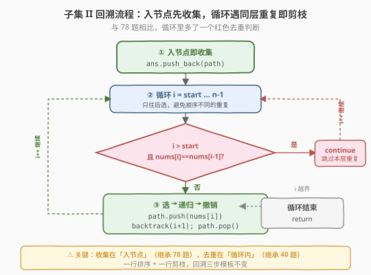

# 子集 II

- **题目名称**：子集 II
- **链接**：[90. 子集 II](https://leetcode.cn/problems/subsets-ii/)
- **难度**：中等
- **标签**：位运算、数组、回溯、排序

## 1. 题目概述

给定一个**可能包含重复元素**的整数数组 `nums`，返回该数组所有可能的子集（幂集）。解集**不能包含重复的子集**，返回的解集中子集可以按任意顺序排列。

**与 [78. 子集](78_子集.md) 的唯一区别**：`nums` 中可能含有重复元素，而 78 题保证元素互不相同。

**示例 1**：

```text
输入：nums = [1,2,2]
输出：[[],[1],[1,2],[1,2,2],[2],[2,2]]
```

**示例 2**：

```text
输入：nums = [0]
输出：[[],[0]]
```

**约束条件**：

- `1 <= nums.length <= 10`
- `-10 <= nums[i] <= 10`

> 💡 本题 = [78. 子集](78_子集.md) 的「每节点收集」框架 + [40. 组合总和 II](40_组合总和II.md) 的「排序 + 同层剪枝」去重。掌握 78 的决策树与 47/40 的去重套路后，本题只需把两者拼起来。难点不在写代码，而在**理解为什么去重条件是 `i > start` 而非 `i > 0`**。

---

## 2. 解题思路

### 2.1 暴力思路：回溯 + HashSet 去重

直接套用 78 题的回溯模板生成所有子集，再用 `HashSet`（把子集转为元组作键）过滤重复。能过，但把「先生成重复子集再过滤」的浪费全吃了——`nums=[2,2,2,2]` 会生成 $2^4=16$ 个子集，去重后只剩 5 个。

> ⚠️ 面试官会追问：「能不能在生成阶段就跳过重复分支？」这就引出**排序 + 同层剪枝**。

### 2.2 核心观察：重复子集的根源——同层选了同值

**重复从哪来？** 以 `nums=[1,2,2]`（排序后，下标 1、2 都是 2）为例，套用 78 题的 `start` 循环版：

- 在根节点（`start=0`），循环依次选 `nums[0]=1`、`nums[1]=2`、`nums[2]=2` 作为子集的第一个元素。
- 选 `nums[1]=2` 时，后续还能选 `nums[2]=2`，产生 `[2]`、`[2,2]`。
- 选 `nums[2]=2` 时，后面没有元素了，只能产生 `[2]`——与上面**重复**了。

根因：**同一层循环里，先后选了值相同的不同元素**。先选的那个（`nums[1]`）剩余候选更多，它的子树是后选那个（`nums[2]`）子树的**超集**——后者完全多余。

![子集 II 去重原理：排序 + 同层剪枝（nums=[1,2,2]）](../images/subsets2_dedup_tree.svg)

**去重核心原则**：同一层中，值相同的元素**只选第一个**。实现两步：

1. **排序**：让相同值的元素相邻，才能用「与前一个相同」判定。
2. **剪枝条件**：`i > start && nums[i] == nums[i-1]` 时 `continue` 跳过。

> 💡 **为什么是 `i > start` 而不是 `i > 0`？** 这是本题最关键的理解点：
>
> - `i > start` 表示「当前元素不是本层第一个」——只对**同一层**的重复去重。
> - 不同层（递归更深处）允许相同值：`[1,2,2]` 里两个 `2` 分布在相邻两层（`start=1` 选 `nums[1]=2`，`start=2` 选 `nums[2]=2`），这是「多选一个相同的 2」，合法，必须保留。
> - 若写成 `i > 0`，会把纵深方向的合法相同值也跳过，漏掉 `[2,2]`。
>
> 本质：去重要区分「**同层并列重复**」（要去）和「**递归纵深重复**」（要留）。`start` 正好是「本层起点」的标记，`i > start` 精确锁定「本层非首个」。

### 2.3 算法流程图



与 78 题的流程几乎一致，唯一区别是循环里多了一步**同层去重判断**（红色菱形）。通过这一步，重复分支在进入递归前就被跳过，避免了无效搜索。

### 2.4 示例演算

以 `nums=[1,2,2]`（已排序）为例，追踪关键步骤，重点看两次剪枝如何各挡掉一个重复子集：

![示例演算：nums=[1,2,2] 的回溯过程，两次剪枝各挡掉一个重复子集](../images/subsets2_walkthrough.svg)

| 步骤 | start | i | 动作 | path | 收集 | 说明 |
|------|-------|---|------|------|------|------|
| ① | 0 | — | 入根收集 | [] | [] ⭐ | 空集 |
| ② | 0 | 0 | 选 1 | [1] | — | 进入子树 |
| ③ | 1 | — | 收集 | [1] | [1] ⭐ | |
| ④ | 1 | 1 | 选 2(nums[1]) | [1,2] | — | 第一个 2 |
| ⑤ | 2 | — | 收集 | [1,2] | [1,2] ⭐ | |
| ⑥ | 2 | 2 | 选 2(nums[2]) | [1,2,2] | — | 纵深同值，合法 |
| ⑦ | 3 | — | 收集 | [1,2,2] | [1,2,2] ⭐ | 回溯返回 |
| ⑧ | 1 | 2 | **剪枝** ✂ | [1] | — | i>start 且 nums[2]==nums[1]，跳过 |
| ⑨ | 0 | 1 | 选 2(nums[1]) | [2] | — | 根层选第一个 2 |
| ⑩ | 2 | — | 收集 | [2] | [2] ⭐ | |
| ⑪ | 2 | 2 | 选 2(nums[2]) | [2,2] | — | 纵深同值，合法 |
| ⑫ | 3 | — | 收集 | [2,2] | [2,2] ⭐ | |
| ⑬ | 0 | 2 | **剪枝** ✂ | [] | — | i>start 且 nums[2]==nums[1]，跳过 |

最终 6 个子集：`[], [1], [1,2], [1,2,2], [2], [2,2]`。两次剪枝分别挡掉了：根层以「第二个 2」开头的分支（会产生重复的 `[2]`），以及 `[1]` 子树里以「第二个 2」开头的分支（会产生重复的 `[1,2]`）。

> 💡 注意 `[2,2]` 没被误杀：两个 `2` 处于**不同层**（步骤⑨在根层选 `nums[1]`，步骤⑪在 `start=2` 层选 `nums[2]`），`i==start` 不触发剪枝。这正是 `i > start` 而非 `i > 0` 的意义。

---

## 3. 参考代码

### C++（排序 + start 索引 + 同层剪枝）

```cpp
// 子集II.cpp —— 回溯：排序 + 同层剪枝去重
// 编译: g++ -O2 -std=c++17 子集II.cpp -o subsets2
#include <vector>
#include <algorithm>
using namespace std;

class Solution {
  public:
    vector<vector<int>> subsetsWithDup(vector<int>& nums) {
        sort(nums.begin(), nums.end()); // ① 排序：让相同元素相邻
        vector<vector<int>> ans;
        vector<int> path;
        backtrack(nums, 0, path, ans);
        return ans;
    }

  private:
    void backtrack(vector<int>& nums, int start, vector<int>& path,
                   vector<vector<int>>& ans) {
        ans.push_back(path); // ② 入节点即收集（继承 78 题）
        for (int i = start; i < (int)nums.size(); i++) {
            // ③ 同层去重：非本层首个 且 与前一个同值，跳过
            if (i > start && nums[i] == nums[i - 1])
                continue;
            path.push_back(nums[i]);            // 选
            backtrack(nums, i + 1, path, ans);  // 只往后选
            path.pop_back();                    // 撤销
        }
    }
};
```

### Python

```python
class Solution:
    def subsetsWithDup(self, nums: list[int]) -> list[list[int]]:
        nums.sort()  # ① 排序：让相同元素相邻
        ans: list[list[int]] = []
        path: list[int] = []

        def backtrack(start: int) -> None:
            ans.append(path[:])  # ② 入节点即收集（拷贝！）
            for i in range(start, len(nums)):
                # ③ 同层去重：非本层首个 且 与前一个同值，跳过
                if i > start and nums[i] == nums[i - 1]:
                    continue
                path.append(nums[i])        # 选
                backtrack(i + 1)            # 只往后选
                path.pop()                  # 撤销

        backtrack(0)
        return ans
```

> ⚠️ **Python 必须** `ans.append(path[:])` **拷贝**：`path` 是同一个列表对象，回溯时 `pop()` 会改写它。若直接 `ans.append(path)`，最终 `ans` 里全是同一个引用（且被清空）。这与 [78. 子集](78_子集.md) 的坑完全一致。

---

## 4. 复杂度分析

| 维度 | 复杂度 | 说明 |
|------|--------|------|
| 时间复杂度 | $O(n \cdot 2^n)$ | 最坏（无重复）与 78 题相同；有重复时剪枝减少实际搜索量，但渐近界不变 |
| 空间复杂度 | $O(n)$ | 递归栈深度 $n$ + `path` $O(n)$（不计结果数组）；排序另需 $O(\log n)$ 栈空间 |

> 💡 排序的 $O(n \log n)$ 相比 $O(2^n)$ 可忽略。最坏情况（元素全不同）退化为 78 题，仍需生成全部 $2^n$ 个子集、每个拷贝 $O(n)$，这是幂集问题的理论下界。当元素大量重复时剪枝效果显著——`nums=[2,2,2,2]` 只产生 5 个子集而非 $2^4=16$ 个。

---

## 5. 扩展：三种去重写法对比 + 迭代扩张去重

### 5.1 `i > start`（90）vs `!used[i-1]`（47）

90 和 47 都是「含重复元素的回溯去重」，但去重条件不同，源于**候选控制方式**不同：

| 维度 | 90 子集 II | 47 全排列 II |
|------|-----------|-------------|
| 候选控制 | `start` 索引，只往后选 | `used` 数组，可往前选（排任意位置） |
| 去重条件 | `i > start && nums[i]==nums[i-1]` | `i > 0 && nums[i]==nums[i-1] && !used[i-1]` |
| 区分层级依据 | `start`（本层起点） | `!used[i-1]`（前一个是否已回溯） |
| 收集时机 | 每个节点 | 只在叶子 |

> 💡 **本质一致**：两者都靠「排序 + 同层只选第一个同值元素」去重，只是「同层」的判定标记不同——子集用 `start`（只往后选，`i==start` 即本层首个），排列用 `!used[i-1]`（可任意选，需靠 used 状态区分「同层已回溯」与「纵深在路径中」）。

### 5.2 迭代扩张 + 跳过重复

78 题的迭代扩张法（每来一个元素，拼到所有现有子集末尾）也能处理重复，但要小心：**连续相同元素只对「上一轮新产生的子集」扩张**，否则会重复。

```python
class Solution:
    def subsetsWithDup(self, nums: list[int]) -> list[list[int]]:
        nums.sort()
        ans = [[]]
        new_cnt = 0  # 上一轮新增的子集数
        for i in range(len(nums)):
            # 和前一个相同：只对上一轮新增的扩张（避免重复）
            start = len(ans) - new_cnt if (i > 0 and nums[i] == nums[i - 1]) else 0
            new_cnt = len(ans) - start
            for j in range(start, len(ans)):
                ans.append(ans[j] + [nums[i]])
        return ans
```

> ⚠️ 这版逻辑较绕：维护「上一轮新增了多少子集」，遇连续相同元素时只对这些新增子集再拼一次。能过但易写错，面试中**推荐回溯版**——思路清晰、可剪枝、可迁移。

### 5.3 一句话定位

本题是 **78 题的收集框架 + 40 题的去重条件**的拼装题。若已熟练 78（子集）和 40/47（同层剪枝），本题几乎没有新东西——唯一的「新」是理解 `i > start` 中 `start` 如何精确标记「本层起点」，从而区分同层重复与纵深重复。

---

## 6. 面试要点

1. **重复子集的根源是什么？**

   - 同一层循环里先后选了**值相同的不同元素**。先选的那个剩余候选更多，子树是后选那个的**超集**——后者产生的子集全是重复，应剪掉。

2. **为什么去重条件是 `i > start` 而不是 `i > 0`？**

   - `i > start` 表示当前元素不是本层第一个，只对**同一层**去重。纵深方向（递归更深处）的相同值是合法的（如 `[2,2]` 两个 2 在不同层），必须保留。
   - `start` 是「本层循环起点」，`i == start` 即本层首个（必选，不剪）；`i > start` 才可能是同层重复。
   - 写成 `i > 0` 会误杀纵深方向的合法同值，漏掉 `[2,2]`。

3. **为什么必须先排序？**

   - 剪枝条件依赖 `nums[i] == nums[i-1]`（相邻相同）。不排序则相同值不相邻，条件无法正确触发。

4. **本题和 78 题的区别在哪里？**

   - 仅多了**一行排序**和**一行剪枝条件**。回溯三步（选-递归-撤销）和「入节点即收集」完全不变。这说明回溯框架的扩展性——加一个剪枝就能处理新约束。

5. **和 47 全排列 II 的去重有什么异同？**

   - 同：都「排序 + 同层只选第一个同值」。
   - 异：47 用 `used` 数组（可任意选位置），靠 `!used[i-1]` 区分同层/纵深；90 用 `start` 索引（只往后选），靠 `i > start` 区分。本质都是「同层去重」，标记不同。

6. **如果不用排序+剪枝，还有什么方案？**

   - `HashSet` 存已生成子集的元组，收集时去重——「先生成再过滤」，效率差。或迭代扩张 + 跳过连续重复（5.2），逻辑较绕。面试推荐回溯版。

> 💡 **一句话总结**：90 子集 II = 78 的「每节点收集」框架 + 40 的「排序 + `i > start` 同层剪枝」去重。核心理解点：`start` 标记本层起点，`i > start` 精确区分「同层并列重复」（要去）与「递归纵深重复」（要留）。一行排序 + 一行剪枝，回溯模板不变。

---

## 7. 同类练习题

- [78. 子集](https://leetcode.cn/problems/subsets/)（[题解](78_子集.md)）：不含重复元素的子集，本题的基础框架（选/不选二叉决策树 + 每节点收集）
- [47. 全排列 II](https://leetcode.cn/problems/permutations-ii/)（[题解](47_全排列II.md)）：含重复元素的全排列，`used` 数组版同层剪枝，对比 `!used[i-1]` 与 `i > start`
- [40. 组合总和 II](https://leetcode.cn/problems/combination-sum-ii/)：含重复 + 每数用一次，与本题为**完全相同**的去重条件（`i > start && nums[i]==nums[i-1]`）
- [39. 组合总和](https://leetcode.cn/problems/combination-sum/)（[题解](39_组合总和.md)）：无重复 + 可无限复用，对比理解去重场景的差异
- [216. 组合总和 III](https://leetcode.cn/problems/combination-sum-iii/)：固定 k 个数 + 和为 n，回溯 + 剪枝综合练习
