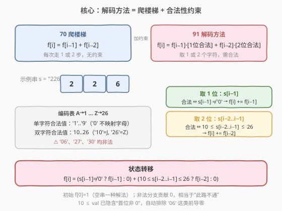
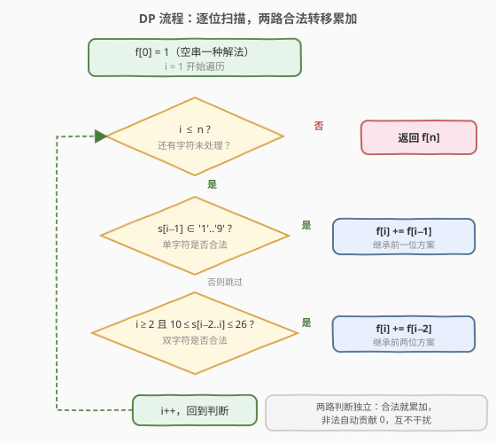
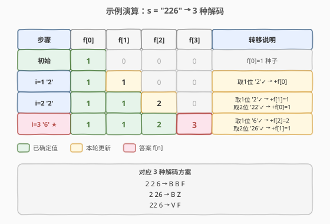

# LeetCode 解码方法 题解

## 1. 题目概述

- **标题 / 题号**：解码方法（#91，medium）
- **链接**：https://leetcode.cn/problems/decode-ways/
- **难度**：中等
- **标签**：动态规划、字符串

**题意**：包含字母 `A` 到 `Z` 的消息可以按如下映射编码成数字：`'A' -> "1"`、`'B' -> "2"`、…、`'Z' -> "26"`。给定一个**只含数字**的字符串 `s`，返回**解码方法的总数**。如果整个字符串无法被解码，返回 `0`。

> ⚠️ 题目保证「没有前导零」的合法编码方式才有效：单独一个 `'0'` 不映射任何字母；两位组合 `'06'` 也非法（只能当 `6`，但两位解码要求首字符非 `'0'`）。

**示例 1**：

```text
输入：s = "12"
输出：2
解释："12" 可以解码为 "AB"（1 2）或者 "L"（12）。
```

**示例 2**：

```text
输入：s = "226"
输出：3
解释："226" 可以解码为 "BBF"（2 2 6）、"BZ"（2 26）、"VF"（22 6）。
```

**示例 3**：

```text
输入：s = "06"
输出：0
解释："06" 无法解码：'0' 单独非法，'06' 作为两位也非法。
```

**约束**：

- $1 \leq \text{s.length} \leq 100$
- `s` 仅包含数字字符

> 💡 **进阶思考**：长度达 100 意味着答案可能很大，但题目只要求 `int` 范围内返回（实际测试数据保证答案在 `int` 内）。$O(n)$ 的一次扫描即可，关键在于**如何处理 `'0'` 带来的合法性约束**。

## 2. 解题思路

### 2.1 暴力思路：枚举所有切分

从左到右，每个位置决定「单独取 1 位」还是「与下一位合并取 2 位」，递归枚举所有切分方式，统计合法的（全程不出现非法 `'0'`、两位值在 $[10,26]$）数目。这是 $O(2^n)$ 指数级，$n=100$ 必然超时。但「在位置 $i$ 处的剩余子问题」只依赖下标 $i$，存在大量重复子问题，可用 DP 优化到 $O(n)$。

### 2.2 核心观察：爬楼梯 + 合法性约束



这题的结构与 [70. 爬楼梯](70_爬楼梯.md) 高度同构：爬楼梯每步走 1 或 2 阶，方案数满足 $f[i] = f[i-1] + f[i-2]$；解码方法每步**取 1 或 2 个字符**，方案数同样是「取 1 位的方案」+「取 2 位的方案」。唯一区别是：**解码的每一步必须满足映射合法性**，否则该分支贡献为 0。

定义 $f[i]$ 为「前 $i$ 个字符（即 $s[0..i-1]$）的解码方法数」。对位置 $i$（前缀长度），有两种转移：

- **取 1 位**（字符 $s[i-1]$）：合法当且仅当 $s[i-1] \neq \text{'0'}$，转移 $f[i] \mathrel{+}= f[i-1]$；
- **取 2 位**（字符 $s[i-2..i-1]$）：合法当且仅当 $10 \leq s[i-2..i-1] \leq 26$（下界 $10$ 已隐含「首位非 `'0'`」，自动排除 `'06'`），转移 $f[i] \mathrel{+}= f[i-2]$。

> 💡 **关键洞察**：非法分支「贡献 0」而非「报错」。把 $f[i-1]$、$f[i-2]$ 乘上对应的合法指示函数（0 或 1）再相加即可，无需特判分支是否可行——这正是爬楼梯递推的优雅之处。

> ⚠️ **初始值是难点**：$f[0] = 1$（空串有 1 种解码方式，作为递推种子，与「空集凑 0 和算 1 种」同理）。$f[1]$ 不显式赋值，由循环用「取 1 位」分支自然得出：若首位是 `'0'` 则 $f[1]=0$，否则 $f[1]=f[0]=1$。**不要**写成 $f[1]=1$，否则 `s="0"` 会得到错误答案 1。

### 2.3 算法流程



1. 令 $n = \text{len}(s)$，开长度 $n+1$ 的数组 $f$，全 0；
2. $f[0] = 1$（种子）；
3. 对 $i$ 从 $1$ 到 $n$：
   - 若 $s[i-1] \neq \text{'0'}$：$f[i] \mathrel{+}= f[i-1]$（取 1 位合法）；
   - 若 $i \geq 2$ 且 $s[i-2] \neq \text{'0'}$ 且 $s[i-2..i-1]$ 的数值 $\leq 26$：$f[i] \mathrel{+}= f[i-2]$（取 2 位合法）；
4. 返回 $f[n]$。

> 💡 **两路判断相互独立**：取 1 位和取 2 位是「或」的关系，各自合法就各自累加，互不干扰。即使某一位两种都不合法（如 `s="30"` 的 `'0'` 处），$f[i]$ 自然为 0，最终 $f[n]=0$，无需提前 return。

### 2.4 示例演算

以 `s = "226"` 为例，$n=3$，$f$ 数组长度 4，初始 $f[0]=1$，其余 0。



| 步骤     | $f[0]$ | $f[1]$ | $f[2]$ | $f[3]$ | 转移说明                                  |
|----------|--------|--------|--------|--------|-------------------------------------------|
| 初始     | 1      | 0      | 0      | 0      | $f[0]=1$ 种子                             |
| $i=1$ '2' | 1      | 1      | 0      | 0      | 取 1 位 '2'✓ → $+f[0]=1$                   |
| $i=2$ '2' | 1      | 1      | 2      | 0      | 取 1 位 '2'✓ → $+f[1]=1$；取 2 位 '22'✓ → $+f[0]=1$ |
| $i=3$ '6' | 1      | 1      | 2      | **3** ⭐ | 取 1 位 '6'✓ → $+f[2]=2$；取 2 位 '26'✓ → $+f[1]=1$ |

最终 $f[3] = 3$，对应解码 `BBF`、`BZ`、`VF` 三种。

> 💡 **规律观察**：没有 `'0'` 干扰时，$f$ 的增长形如「带约束的斐波那契」——只要每位单字符都合法，$f[i] \geq f[i-1]$；当出现 `'1'`/`'2'` 后跟合适数字时，两位转移再叠加 $f[i-2]$。`'0'` 的出现会「掐断」单字符分支，强制依赖前一位的两字符组合。

## 3. 参考代码

### C++

```cpp
class Solution {
  public:
    int numDecodings(string s) {
        int n = s.size();
        vector<int> f(n + 1, 0);
        f[0] = 1;                                  // 空串一种解法（种子）
        for (int i = 1; i <= n; ++i) {
            if (s[i - 1] != '0') f[i] += f[i - 1];               // 取 1 位
            if (i >= 2 && s[i - 2] != '0' &&
                (s[i - 2] - '0') * 10 + (s[i - 1] - '0') <= 26)  // 取 2 位
                f[i] += f[i - 2];
        }
        return f[n];
    }
};
```

### Python

```python
class Solution:
    def numDecodings(self, s: str) -> int:
        n = len(s)
        f = [0] * (n + 1)
        f[0] = 1                                   # 空串一种解法（种子）
        for i in range(1, n + 1):
            if s[i - 1] != '0':                    # 取 1 位
                f[i] += f[i - 1]
            if i >= 2 and s[i - 2] != '0' and s[i - 2:i] <= '26':   # 取 2 位
                f[i] += f[i - 2]
        return f[n]
```

> ⚠️ **易错点**：
> - **取 2 位的判断必须先查 $s[i-2] \neq \text{'0'}$**。否则 `'06'` 这类前导零组合会被误判：`'06' <= '26'` 在字符串字典序下为真（`'0' < '2'`），但 `'06'` 不是合法两位编码。加上首位非零的约束后，候选范围缩小到 `'10'..'99'`，此时字典序比较与数值比较等价，`<= '26'` 才正确。
> - **$f[0]=1$ 不可省略**。它是两位转移 $f[i] \mathrel{+}= f[i-2]$ 在 $i=2$ 时的依赖来源；漏掉会让所有「首两位合并」的方案少算 1。
> - **不要预判 $f[1]$**。让循环自己算，能自然处理 `s="0"` 返回 0 的边界。

## 4. 复杂度分析

| 维度 | 复杂度 | 说明 |
|------|--------|------|
| 时间复杂度 | $O(n)$ | 一次遍历，每个位置 $O(1)$ 的两路判断 |
| 空间复杂度 | $O(n)$ | 长度 $n+1$ 的 dp 数组；可滚动数组优化到 $O(1)$ |

> 💡 $n \leq 100$，$O(n)$ 绰绰有余。若题目改成流式输入或要求 $O(1)$ 额外空间，只需保留最近的两个状态 $f[i-1]$、$f[i-2]$ 即可（见下节）。

## 5. 扩展：$O(1)$ 滚动数组

由于 $f[i]$ 只依赖 $f[i-1]$ 和 $f[i-2]$，可用两个变量滚动，把空间降到 $O(1)$：

```cpp
class Solution {
  public:
    int numDecodings(string s) {
        int n = s.size(), prev2 = 1, prev1 = (s[0] != '0');   // prev2=f[0], prev1=f[1]
        for (int i = 2; i <= n; ++i) {
            int cur = 0;
            if (s[i - 1] != '0') cur += prev1;
            if (s[i - 2] != '0' &&
                (s[i - 2] - '0') * 10 + (s[i - 1] - '0') <= 26) cur += prev2;
            prev2 = prev1;
            prev1 = cur;
        }
        return prev1;
    }
};
```

> 💡 注意这里 $f[1]$ 显式取 `(s[0] != '0')`，把首字符为 `'0'` 的边界在循环外处理掉，循环从 $i=2$ 开始，逻辑与数组版完全一致。

### 记忆化搜索（自顶向下）

把「从下标 $i$ 开始的解码方法数」作为子问题 `dfs(i)`，从 $0$ 出发：

```python
class Solution:
    def numDecodings(self, s: str) -> int:
        @lru_cache(None)
        def dfs(i):
            if i == len(s):
                return 1                       # 走到末尾，算 1 种
            if s[i] == '0':
                return 0                       # '0' 开头无法解码
            res = dfs(i + 1)                   # 取 1 位
            if i + 1 < len(s) and s[i:i+2] <= '26':
                res += dfs(i + 2)             # 取 2 位
            return res
        return dfs(0)
```

> 💡 记忆化与递推等价，都是「选 1 位 / 选 2 位」的决策树压缩。面试中递推版更省栈、常数更小；记忆化版更贴近「人脑思考顺序」，便于先讲清思路再优化。

## 6. 面试要点

1. **为什么说这题是「带约束的爬楼梯」？**
   - 爬楼梯每步走 1/2 阶，方案数 $f[i]=f[i-1]+f[i-2]$；解码每步取 1/2 个字符，方案数同为两路之和。区别仅在于解码的每步要满足映射合法性——把不合法分支的贡献置 0 即可，递推骨架完全一致。

2. **`f[0] = 1` 的含义和必要性？**
   - $f[0]$ 表示「空串的解码方法数」，设为 1 是递推的种子。必要性体现在两位转移 $f[i] \mathrel{+}= f[i-2]$：当 $i=2$ 且首两位合法（如 `'12'`）时，需要 $f[0]=1$ 来计入「把前两位整体合并」这一种方案。漏掉它会让所有首两位合并的方案少算 1。

3. **为什么取 2 位的判断要先查 `s[i-2] != '0'`？**
   - 字符串字典序比较 `'06' <= '26'` 为真，会误判前导零组合合法。先确保首位非 `'0'`，候选范围缩到 `'10'..'99'`，此时同长字符串的字典序与数值序一致，`<= '26'` 才等价于数值 $\leq 26$。也可以直接转 int 比较 `10 <= val <= 26`，一步到位。

4. **`s = "0"`、`s = "10"`、`s = "06"` 各返回多少？为什么？**
   - `"0"` → 0：首位 `'0'` 单字符非法、无两位可组。`"10"` → 1：`'1'` 单字符合法（$f[1]=1$），`'0'` 处单字符非法但 `'10'` 两位合法，$f[2]=f[0]=1$，对应 `J`。`"06"` → 0：`'0'` 单字符非法，`'06'` 两位首位为 `'0'` 也非法。三者都靠「非法分支贡献 0」自动得出，无需特判。

5. **能否提前剪枝返回 0？**
   - 可以但不必要。一个常见剪枝：若出现 `'0'` 且其前一位不是 `'1'`/`'2'`，则必然无解可提前 return 0。但 DP 本身 $O(n)$，靠「非法分支贡献 0」让 $f[n]$ 自然为 0 更简洁、更不易出错。剪枝仅作为「面试官追问时」的优化点。

## 同类练习题

| # | 题目 | 与本题的关联 |
|---|------|-------------|
| 70 | [爬楼梯](https://leetcode.cn/problems/climbing-stairs/)（[题解](70_爬楼梯.md)） | 本题的**无约束原型**，$f[i]=f[i-1]+f[i-2]$，先理解它再给解码加合法性 |
| 639 | [解码方法 II](https://leetcode.cn/problems/decode-ways-ii/) | 本题的**进阶版**，字符串含 `'*'` 通配符，状态转移需分类讨论更多情况 |
| 509 | [斐波那契数](https://leetcode.cn/problems/fibonacci-number/) | 同源递推骨架，可作为热身熟悉 $f[i]=f[i-1]+f[i-2]$ |
| 1137 | [第 N 个泰波那契数](https://leetcode.cn/problems/n-th-tribonacci-number/) | 递推扩展到三项 $f[i]=f[i-1]+f[i-2]+f[i-3]$，巩固线性 DP 滚动写法 |
