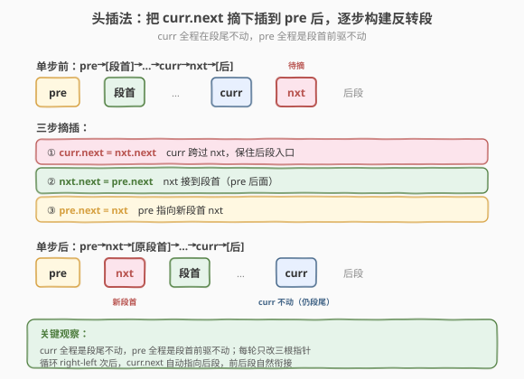
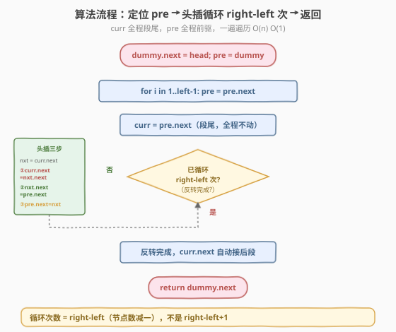

# 反转链表 II

- **题目名称**：反转链表 II
- **链接**：[92. 反转链表 II](https://leetcode.cn/problems/reverse-linked-list-ii/)
- **难度**：中等
- **标签**：链表

## 1. 题目概述

给定单链表的头节点 `head` 和两个整数 `left` 和 `right`（`left <= right`），其中 `left` 和 `right` 是**从 1 开始**编号的位置。请**反转从位置 `left` 到位置 `right` 的节点**，并返回反转后的链表头节点。

**示例 1**：

```text
输入：head = [1,2,3,4,5], left = 2, right = 4
输出：[1,4,3,2,5]
解释：反转位置 2 到 4 的节点（2,3,4 → 4,3,2），其余不动，得 1→4→3→2→5。
```

**示例 2**：

```text
输入：head = [5], left = 1, right = 1
输出：[5]
解释：只有一个节点，反转区间长度 1，结果不变。
```

**约束条件**：

- 链表节点数目范围 `[1, 500]`
- `-500 <= Node.val <= 500`
- `1 <= left <= right <= n`

> 💡 这是 [反转链表（206）](../0201-0300/206_反转链表.md) 的区间版：不是反转整条链，而是反转其中 `[left, right]` 一段。核心仍是**三指针掉头**，难点在于**定位区间 + 接回前后段**。引入哑节点统一处理 `left=1` 的头删情况，用"头插法"在区间内逐个把节点插到段首，一遍遍历完成反转。

---

## 2. 解题思路

### 2.1 暴力思路：把区间值存数组反转再回填

遍历链表把 `[left, right]` 区间的值存入数组，反转数组后依次写回对应节点。能过但：

- 只改值不改指针，**不符合"反转链表"的语义**（节点带随机指针时失效）。
- 需要 `O(right-left+1)` 额外空间存数组。
- 面试官会要求"用指针操作真正反转"。

> ⚠️ 链表反转题的正解永远是**改 `next` 指针**，换值是取巧。本题的核心价值在于练习"区间内指针操作 + 前后段衔接"，必须用指针法。

### 2.2 核心观察：哑节点 + 头插法

**整体思路**：把链表分成三段——**前段**（位置 1 到 `left-1`）、**反转段**（`left` 到 `right`）、**后段**（`right+1` 到末尾）。反转中间段，再和前后段接上。

**为什么用哑节点？** 若 `left=1`，反转段从原 `head` 开始，反转后头节点会变。引入哑节点 `dummy.next = head`，则 `left` 位置的前驱永远是 `dummy` 或其后继，统一处理。

**头插法反转区间**：设 `pre` 是反转段的前驱（位置 `left-1`），`curr` 是反转段的第一个节点（位置 `left`）。每轮把 `curr.next`（即下一个节点）**摘下来插到 `pre` 后面**（成为反转段的新头），`curr` 自身向后推进。重复 `right - left` 次。



**单步细节**（设 `curr` 当前在反转段第一个未动节点，`nxt = curr.next` 待摘下）：

1. `curr.next = nxt.next`（curr 跨过 nxt，接上后一个）
2. `nxt.next = pre.next`（nxt 接到反转段头，即 pre 后面）
3. `pre.next = nxt`（pre 指向新头 nxt）

> 💡 **关键**：`curr` 在整个反转过程中**位置不变**——它始终是"反转段的最后一个节点"（因为后续节点都被插到它前面）。每轮只是把它后面的节点摘一个插到段首，`curr` 自己一步步变成段尾。`pre` 也**不变**，始终是段首前驱。变的是 `pre.next`（段首不断更新）和 `curr.next`（每次跨过一个被摘走的节点）。

### 2.3 算法流程图



**完整步骤**：

1. **建哑节点**：`dummy.next = head`，`pre = dummy`
2. **定位 `pre`**：`pre` 从 `dummy` 走 `left - 1` 步，停在第 `left-1` 个节点（反转段前驱）
3. **`curr = pre.next`**（反转段第一个节点，整个反转中 `curr` 始终是段尾）
4. **头插循环**（`right - left` 次）：
   - `nxt = curr.next`（待摘节点）
   - `curr.next = nxt.next`（curr 跨过 nxt）
   - `nxt.next = pre.next`（nxt 接到段首）
   - `pre.next = nxt`（pre 指向新段首）
5. **返回** `dummy.next`

> ⚠️ 循环次数是 `right - left` 而非 `right - left + 1`：反转段有 `right-left+1` 个节点，第一个节点 `curr` 天然在段首（也是段尾），剩下 `right-left` 个节点要逐个头插。每轮插一个，共 `right-left` 轮。

### 2.4 示例演算

以 `head = [1,2,3,4,5]`，`left = 2`，`right = 4` 为例，反转位置 2~4（节点 2,3,4 → 4,3,2）：

![示例演算：1→2→3→4→5 反转 [2,4] 得到 1→4→3→2→5](../images/reverse_ii_example_walkthrough.svg)

| 阶段 | 操作 | 链表状态（反转段加粗） |
|------|------|----------------------|
| 定位 | pre 走 1 步到节点 1，curr=2 | 1→**2**→3→4→5 |
| 第 1 轮 | 摘 3 插到 pre 后 | 1→**3→2**→4→5 |
| 第 2 轮 | 摘 4 插到 pre 后 | 1→**4→3→2**→5 |
| 结束 | 循环 2 次（right-left=2）完成 | 1→4→3→2→5 |

最终 `dummy.next` 指向 1，返回 `1→4→3→2→5`，与示例 1 一致。

> 💡 注意 `curr` 始终是节点 2：第 1 轮把 3 摘到 pre 后，链表变 `1→3→2→4→5`，`curr`（节点 2）的 `next` 从 3 变成 4；第 2 轮把 4 摘到 pre 后，`curr`（节点 2）的 `next` 变成 5（原 4 的下一个）。`curr` 自身没动，但它后面被摘空的节点越来越多，最后 `curr.next=5` 自然接上后段。

---

## 3. 参考代码

### C++

```cpp
/**
 * Definition for singly-linked list.
 * struct ListNode {
 *     int val;
 *     ListNode *next;
 *     ListNode() : val(0), next(nullptr) {}
 *     ListNode(int x) : val(x), next(nullptr) {}
 *     ListNode(int x, ListNode *next) : val(x), next(next) {}
 * };
 */
class Solution {
  public:
    ListNode* reverseBetween(ListNode* head, int left, int right) {
        ListNode* dummy = new ListNode(0);
        dummy->next = head;
        ListNode* pre = dummy;
        // ① pre 走 left-1 步，定位反转段前驱
        for (int i = 1; i < left; ++i) {
            pre = pre->next;
        }
        ListNode* curr = pre->next;             // 反转段第一个节点（全程段尾）
        // ② 头插法，循环 right-left 次
        for (int i = 0; i < right - left; ++i) {
            ListNode* nxt = curr->next;         // 待摘节点
            curr->next = nxt->next;             // curr 跨过 nxt
            nxt->next = pre->next;              // nxt 接到段首
            pre->next = nxt;                    // pre 指向新段首
        }
        return dummy->next;
    }
};
```

### Python

```python
# Definition for singly-linked list.
# class ListNode:
#     def __init__(self, val=0, next=None):
#         self.val = val
#         self.next = next
class Solution:
    def reverseBetween(self, head: Optional[ListNode], left: int, right: int) -> Optional[ListNode]:
        dummy = ListNode(0)
        dummy.next = head
        pre = dummy
        # ① pre 走 left-1 步，定位反转段前驱
        for _ in range(left - 1):
            pre = pre.next
        curr = pre.next                         # 反转段第一个节点（全程段尾）
        # ② 头插法，循环 right-left 次
        for _ in range(right - left):
            nxt = curr.next                     # 待摘节点
            curr.next = nxt.next                # curr 跨过 nxt
            nxt.next = pre.next                 # nxt 接到段首
            pre.next = nxt                      # pre 指向新段首
        return dummy.next
```

> 💡 两版代码逻辑完全一致，是头插法的标准写法。核心是 `curr` **不动**、`pre` **不动**，每轮只改三根指针把 `curr.next` 摘到段首。循环次数 `right-left` 精确控制反转段长度。注意三步赋值顺序：先 `curr.next = nxt.next`（保住后段），再 `nxt.next = pre.next`（nxt 接段首），最后 `pre.next = nxt`（更新段首）。

---

## 4. 复杂度分析

| 维度 | 复杂度 | 说明 |
|------|--------|------|
| **时间复杂度** | `O(n)` | 定位 `pre` 走 `left-1` 步，头插循环 `right-left` 次，最坏走 `n-1` 步，整体 `O(n)` |
| **空间复杂度** | `O(1)` | 只用 `dummy`、`pre`、`curr`、`nxt` 四个指针，常数额外空间 |

> ⚠️ 本题一遍遍历完成定位 + 反转，无需先遍历数长度。头插法每轮 `O(1)`，共 `right-left` 轮，加上定位的 `left-1` 步，总步数 ≤ `n-1`，严格 `O(n)`。

---

## 5. 扩展：三指针法与头插法对比

反转区间有两种常见写法：

| 维度 | 头插法（本题解） | 三指针法（标准反转 + 接回） |
|------|----------------|---------------------------|
| **思路** | 逐个把节点摘到段首 | 先用 206 的三指针反转整段，再接回前后 |
| **`curr` 行为** | 始终在段尾不动 | 每轮前进，走完整个反转段 |
| **代码量** | 一个循环搞定 | 需先反转再接回，两段逻辑 |
| **衔接** | 自然衔接（curr.next 自动接后段） | 需手动把反转段头尾接到前段后段 |

头插法的优势在于**衔接自动化**：`curr` 全程是段尾，它的 `next` 在最后一轮被设为后段第一个节点，无需额外接回操作。三指针法反转完 `[left, right]` 后，还要手动 `pre.next = 反转后段头`、`原段尾.next = 后段头`，容易出错。

> 💡 推荐用**头插法**：一个循环内完成"反转 + 衔接"，逻辑紧凑、不易错。三指针法思路直观（套用 206）但接回步骤绕，面试时若想快速写对，头插法更稳。

---

## 6. 面试要点

1. **为什么用哑节点？**

   - 若 `left=1`，反转段从原 `head` 开始，反转后头节点变成原 `right` 位置的节点。没有哑节点要特判"换头"。
   - 引入哑节点后，`pre` 从 `dummy` 走 `left-1` 步，`left=1` 时 `pre=dummy`，第一段为空，处理统一。最后返回 `dummy.next` 自动是结果头。**链表题可能改头时优先用哑节点**。

2. **头插法中 `curr` 为什么不动？**

   - `curr` 是反转段的第一个节点，反转后变成段尾。头插法每轮把 `curr.next` 摘到段首，`curr` 自身位置不变（仍是段尾），只是它前面的节点越来越多、`curr.next` 不断跳过被摘走的节点。
   - 这样设计让"段尾接后段"自动化：最后一轮 `curr.next = nxt.next` 恰好把 `curr`（段尾）接到后段第一个节点，无需额外衔接。

3. **三步赋值顺序能换吗？**

   - 不能。必须先 `curr.next = nxt.next`（保住后段入口），否则 `nxt` 后面的节点会丢。
   - 然后 `nxt.next = pre.next`（nxt 接段首），最后 `pre.next = nxt`（更新段首）。后两步顺序可换，但第一步必须在最前——它保存了 `nxt` 原本指向的信息。

4. **循环次数为什么是 `right - left`？**

   - 反转段共 `right-left+1` 个节点。第一个节点 `curr` 天然在段首（也是初始段尾），无需动。剩下 `right-left` 个节点要逐个头插到 `curr` 前面。
   - 写成 `right-left+1` 会多插一次，把 `curr` 自己也摘走，逻辑出错。精确记：**节点数减一是循环次数**。

5. **和 206 反转链表的关系？**

   - 206 反转整条链，相当于 `left=1, right=n` 的特例。但 206 用三指针逐个掉头更直观，本题用头插法是为了**衔接前后段**方便。
   - 掌握 206 的三指针掉头是基础，本题的头插法是"区间反转"的优化写法。两者本质都是改 `next` 指针，只是组织方式不同。

> 💡 **一句话总结**：92 是反转链表的区间版——哑节点统一 `left=1` 边界，`pre` 走 `left-1` 步定位前驱，`curr=pre.next` 全程作段尾，头插法循环 `right-left` 次把 `curr.next` 逐个摘到段首。三步赋值 `curr.next=nxt.next` → `nxt.next=pre.next` → `pre.next=nxt`，一遍遍历 `O(n)`、`O(1)` 空间，前后段自动衔接。它是 206 的进阶，也是 [25. K 个一组翻转](25_K个一组翻转链表.md) 的基础原子操作。

---

## 7. 同类练习题

- [206. 反转链表](https://leetcode.cn/problems/reverse-linked-list/)（[题解](../0201-0300/206_反转链表.md)）：整条反转，三指针掉头基础题
- [25. K 个一组翻转链表](https://leetcode.cn/problems/reverse-nodes-in-k-group/)（[题解](25_K个一组翻转链表.md)）：分段反转，本题的批量版
- [24. 两两交换链表中的节点](https://leetcode.cn/problems/swap-nodes-in-pairs/)（[题解](24_两两交换链表中的节点.md)）：K=2 的分段交换，哑节点统一边界
- [2. 两数相加](https://leetcode.cn/problems/add-two-numbers/)（[题解](2_两数相加.md)）：链表模拟进位，指针操作综合题
