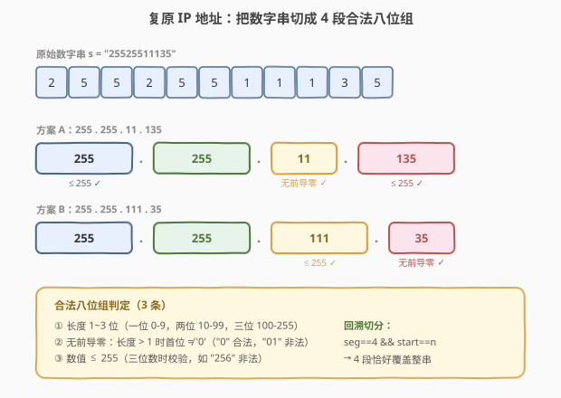
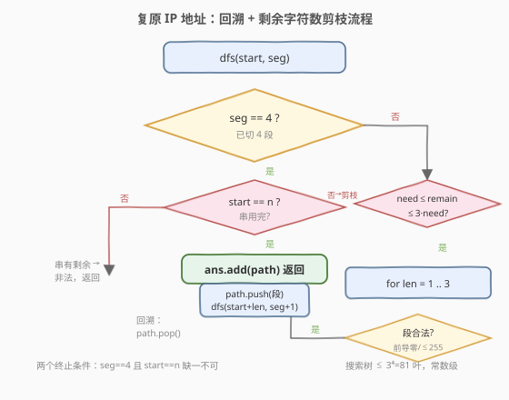
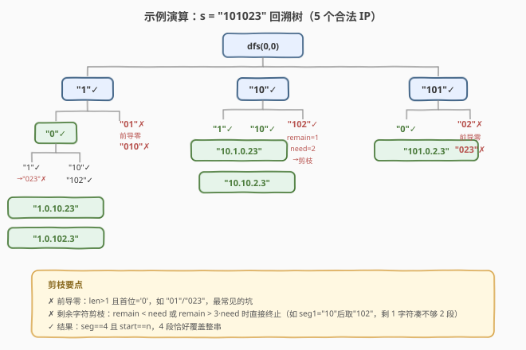

# LeetCode 复原 IP 地址 题解

## 1. 题目概述

- **标题 / 题号**：复原 IP 地址（#93，medium）
- **链接**：https://leetcode.cn/problems/restore-ip-addresses/
- **难度**：中等
- **标签**：字符串、回溯

**题意**：给定一个只包含数字的字符串 `s`，在 `s` 中插入三个点使其成为一个**有效的 IP 地址**，返回所有可能的有效 IP 地址。不能重新排序或删除 `s` 中的任何数字。

**有效 IP 地址** 的规则：

1. 由 **4 个整数**组成，整数之间用单个 `.` 分隔；
2. 每个整数在 `0` 到 `255` 之间；
3. 整数**不含前导零**（单独一个 `0` 是允许的，但 `01`、`00` 不允许）。

**示例 1**：

```text
输入：s = "25525511135"
输出：["255.255.11.135","255.255.111.35"]
解释：两种切分都满足 4 段、每段 0-255、无前导零。
```

**示例 2**：

```text
输入：s = "0000"
输出：["0.0.0.0"]
```

**示例 3**：

```text
输入：s = "101023"
输出：["1.0.10.23","1.0.102.3","10.1.0.23","10.10.2.3","101.0.2.3"]
```

**约束**：

- `1 <= s.length <= 20`
- `s` 仅由数字组成

> 💡 本题和 [131. 分割回文串](../0101-0200/131_分割回文串.md) 是同一骨架：「从左到右依次切出一段，递归处理剩余」。131 的段约束是「回文」，本题的段约束是「合法八位组」+「恰好 4 段」。换一个判定函数，回溯模板完全复用。

## 2. 解题思路

### 2.1 暴力思路：四重循环枚举三个切点

字符串 `s` 要插入 3 个点分成 4 段，等价于在 `n-1` 个间隙里选 3 个切点。用四重循环枚举每段长度（1~3），共最多 $3^4 = 81$ 种组合，逐一校验 4 段是否合法。可行但代码冗长，且没有利用「不合法前缀应及早剪掉」的回溯优势。

### 2.2 核心观察：回溯 + 分段合法性剪枝



把问题看作「依次切出 4 段」的决策过程：站在位置 `start`，已切好 `seg` 段，尝试把接下来的 1~3 个数字作为第 `seg+1` 段。**一段是否合法**的判定只需三条：

| 条件 | 说明 |
|------|------|
| 长度 1~3 | 一段最多 3 位数字（≤ 255） |
| 无前导零 | 长度 > 1 时首位不能是 `'0'`（`"0"` 合法，`"01"` 非法） |
| 数值 ≤ 255 | 三位数时校验，如 `"256"` 非法 |

当 `seg == 4` 且 `start == n`（正好切完整串）时，得到一个合法 IP。

> 💡 **回溯三要素**：
> - **路径**：已切好的段列表 `path`。
> - **选择**：在当前 `start` 处，长度 `len` 取 1/2/3 的合法段。
> - **终止**：`seg == 4`，若 `start == n` 则记录答案。

### 2.3 算法流程图



**关键剪枝——剩余字符数约束**：

进入 `dfs(start, seg)` 时，剩余字符 `remain = n - start`，还需切 `need = 4 - seg` 段。每段至少 1 位、至多 3 位，因此：

$$
\text{need} \le \text{remain} \le 3 \times \text{need}
$$

不满足直接 `return`，不进入循环。这个剪枝能砍掉大量无效分支——例如 `s = "25525511135"` 切到第 3 段时若剩余 5 个字符但只剩 1 段（`5 > 3×1`），立刻终止。

> ⚠️ **两个终止条件的顺序**：先判 `seg == 4`，再判 `start == n`。`seg == 4` 但 `start < n` 说明 4 段切完了串还有剩余，非法；`seg < 4` 但 `start == n` 说明串用完了段数不够，也非法——后者由剩余字符剪枝在更上层就已拦住。

### 2.4 示例演算

以 `s = "101023"`（`n = 6`）为例，回溯决策树（✗ 表示剪枝或非法段）：

```text
dfs(0,0)
├─ "1"✓ → dfs(1,1)
│   ├─ "0"✓ → dfs(2,2)
│   │   ├─ "1"✓ → dfs(3,3)        remain=3,need=1
│   │   │   └─ "023"✗ 前导零 → 无解
│   │   ├─ "10"✓ → dfs(4,3)       remain=2,need=1
│   │   │   └─ "23"✓ → dfs(6,4) start==n ✓ 记录 "1.0.10.23"
│   │   └─ "102"✓ → dfs(5,3)      remain=1,need=1
│   │       └─ "3"✓ → dfs(6,4) ✓ 记录 "1.0.102.3"
│   ├─ "01"✗ 前导零
│   └─ "010"✗ 前导零
├─ "10"✓ → dfs(2,1)
│   ├─ "1"✓ → dfs(3,2) ... → "10.1.0.23"
│   ├─ "10"✓ → dfs(4,2) ... → "10.10.2.3"
│   └─ "102"✓ → dfs(5,2)         remain=1,need=2 → 1<2 剪枝 ✗
└─ "101"✓ → dfs(3,1)
    ├─ "0"✓ → dfs(4,2) ... → "101.0.2.3"
    ├─ "02"✗ 前导零
    └─ "023"✗ 前导零
```

共得到 5 种方案，与示例一致。



## 3. 参考代码

### C++

```cpp
class Solution {
public:
    vector<string> restoreIpAddresses(string s) {
        vector<string> ans;
        string path;
        dfs(s, 0, 0, path, ans);
        return ans;
    }
private:
    void dfs(const string& s, int start, int seg, string& path, vector<string>& ans) {
        int n = s.size();
        if (seg == 4) {                       // 已切 4 段
            if (start == n) ans.push_back(path); // 且正好用完整串
            return;
        }
        int remain = n - start, need = 4 - seg;
        if (remain < need || remain > need * 3) return;   // 剩余字符数剪枝
        for (int len = 1; len <= 3 && start + len <= n; ++len) {
            if (len > 1 && s[start] == '0') continue;      // 前导零
            int val = stoi(s.substr(start, len));
            if (val > 255) continue;                       // 超出范围
            string saved = path;
            path += s.substr(start, len);
            if (seg < 3) path += '.';
            dfs(s, start + len, seg + 1, path, ans);
            path = saved;                                  // 回溯
        }
    }
};
```

### Python

```python
class Solution:
    def restoreIpAddresses(self, s: str) -> List[str]:
        ans = []
        path = []
        n = len(s)

        def dfs(start: int, seg: int):
            if seg == 4:
                if start == n:
                    ans.append(".".join(path))
                return
            remain = n - start
            need = 4 - seg
            if remain < need or remain > need * 3:   # 剩余字符数剪枝
                return
            for l in range(1, 4):
                if start + l > n:
                    break
                part = s[start:start + l]
                if len(part) > 1 and part[0] == '0':  # 前导零
                    continue
                if int(part) > 255:                   # 超出范围
                    continue
                path.append(part)
                dfs(start + l, seg + 1)
                path.pop()                            # 回溯

        dfs(0, 0)
        return ans
```

> 💡 **回溯模板复用**：`path.append(part)` → `dfs(下一段)` → `path.pop()`，与 [131. 分割回文串](../0101-0200/131_分割回文串.md)、[78. 子集](78_子集.md) 完全同构。本题多了两处剪枝：① 段长度限 1~3 且判前导零/越界；② 剩余字符数必须能凑够剩余段数。

## 4. 复杂度分析

| 维度 | 复杂度 | 说明 |
|------|--------|------|
| 时间复杂度 | $O(3^4 \cdot n)$ | 每段长度 3 选 1，共 4 段，叶节点数 $\le 3^4 = 81$；每叶拼串 $O(n)$。常数级 |
| 空间复杂度 | $O(n)$ | 递归栈深度 4 + path 长度 $n$（不计答案存储） |

> 💡 与「分割回文串」$O(n \cdot 2^n)$ 相比，本题因**段数固定为 4、每段至多 3 位**，搜索树规模被压到常数级 $3^4$，是回溯题中罕见的「常数时间」题。剪枝让实际分支数远小于 81。

## 5. 扩展：迭代三重循环写法

回溯是递归实现，本题段数固定为 4，也可直接用**三重循环**枚举前三段的长度，第四段取剩余部分：

```python
class Solution:
    def restoreIpAddresses(self, s: str) -> List[str]:
        n = len(s)
        ans = []
        for i in range(1, 4):           # 第 1 段末尾
            for j in range(i + 1, i + 4):
                for k in range(j + 1, j + 4):
                    if k >= n:
                        continue
                    a, b, c, d = s[:i], s[i:j], s[j:k], s[k:]
                    if all(self.valid(x) for x in (a, b, c, d)):
                        ans.append(f"{a}.{b}.{c}.{d}")
        return ans

    def valid(self, x: str) -> bool:
        return len(x) > 0 and len(x) <= 3 and \
               (len(x) == 1 or x[0] != '0') and int(x) <= 255
```

> 💡 **递归回溯 vs 迭代循环**：段数固定时迭代更直观、常数更小；段数可变时（如分割回文串）递归回溯更通用。面试中递归写法更能体现回溯模板的迁移能力，推荐优先掌握。

## 6. 面试要点

1. **段合法性判定的三个条件是什么？**

   > ① 长度 1~3（一位数 0~9，两位数 10~99，三位数 100~255）；② 长度 > 1 时首位不能是 `'0'`（杜绝 `"01"`、`"00"`）；③ 数值 $\le 255$。三者合并：长度 1 总合法；长度 2 要求首位非 0；长度 3 要求首位非 0 且 $\le 255$。

2. **剩余字符数剪枝怎么写？为什么有效？**

   > `remain = n - start`，`need = 4 - seg`。合法要求 `need ≤ remain ≤ 3·need`：剩余字符太少凑不齐 `need` 段（每段至少 1 位），太多则必然超长（每段最多 3 位）。这个剪枝在进入循环前就终止，避免对不可能的分支逐段尝试。

3. **为什么 `seg == 4` 和 `start == n` 要同时满足？**

   > `seg == 4` 保证段数正确，`start == n` 保证恰好用完整串无剩余。只满足其一都非法：4 段但串有剩余（如 `"00001"` 切 `0.0.0.0` 剩 `"1"`），或串用完但不足 4 段。两个条件缺一不可，合在一起才是「4 段恰好覆盖整串」。

4. **和「分割回文串」（131）的异同？**

   > 同：都是回溯切字符串，`path.append` → `dfs` → `path.pop` 骨架一致。异：① 段约束不同——131 判回文（需预处理 `isPal` 表），93 判八位组合法性（`O(1)` 直接判定）；② 段数不同——131 段数任意（`start==n` 即终止），93 恰好 4 段（`seg==4 && start==n`）；③ 复杂度不同——131 是 $O(n \cdot 2^n)$，93 因段数固定为 $O(3^4 \cdot n)$。

5. **前导零为什么单独处理而不是靠 `int()` 转换？**

   > `"01"` 的 `int` 值是 1，在 0~255 内，会被误判合法。必须显式检查 `len > 1 && s[start] == '0'`。这是本题最常见的边界陷阱，面试官常以此考察细节。

> 💡 **一句话总结**：93 题是「回溯切分字符串」的招牌题，和分割回文串同构。核心是三条件段合法性判定 + 剩余字符数剪枝，搜索树因段数固定被压到 $3^4$ 常数级。前导零处理是最易踩的坑。

## 同类练习题

| # | 题目 | 与本题的关联 |
|---|------|-------------|
| 131 | [分割回文串](https://leetcode.cn/problems/palindrome-partitioning/)（[题解](../0101-0200/131_分割回文串.md)） | 同样回溯切分字符串，段约束换成回文判定 |
| 22 | [括号生成](https://leetcode.cn/problems/generate-parentheses/)（[题解](22_括号生成.md)） | 回溯 + 剪枝构造合法序列，模板同构 |
| 17 | [电话号码的字母组合](https://leetcode.cn/problems/letter-combinations-of-a-phone-number/)（[题解](17_电话号码的字母组合.md)） | 回溯枚举所有组合，分段思想的另一形态 |
| 468 | [验证 IP 地址](https://leetcode.cn/problems/validate-ip-address/) | 判定给定串是否合法 IP，与本题的段合法性判定互补 |
