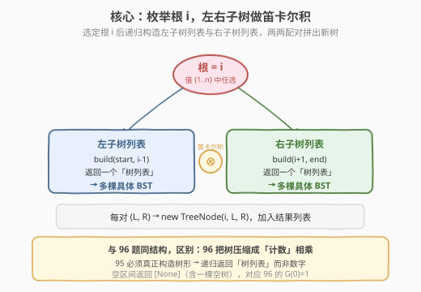
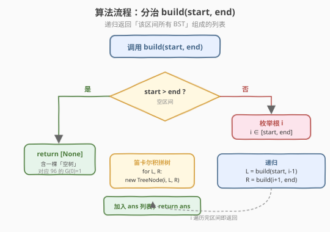
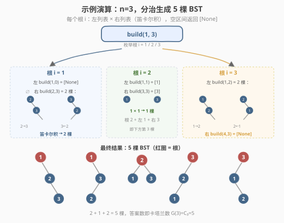

# 不同的二叉搜索树 II

- **题目名称**：不同的二叉搜索树 II
- **链接**：[95. 不同的二叉搜索树 II](https://leetcode.cn/problems/unique-binary-search-trees-ii/)
- **难度**：中等
- **标签**：树、二叉搜索树、分治、回溯

## 1. 题目概述

给你一个整数 `n`，请你生成并返回**所有**由 `n` 个节点组成且节点值从 `1` 到 `n` 互不相同的**二叉搜索树（BST）**。可以按**任意顺序**返回答案。

**示例 1**：

```text
输入：n = 3
输出：[[1,null,2,null,3],[1,null,3,2],[2,1,3],[3,1,null,null,2],[3,2,null,1]]
解释：n = 3 时共有 5 种不同结构的 BST（见 2.4 节示例演算）
```

**示例 2**：

```text
输入：n = 1
输出：[[1]]
```

**约束条件**：

- `1 <= n <= 8`

> 💡 这是 [96. 不同的二叉搜索树](96_不同的二叉搜索树.md) 的**枚举版**：96 题「把树形压缩成计数」用 DP 算种数 $G(n)$，95 题必须**真正构造出每一棵树**。两者共享「按根切分 + 左右独立」的递推骨架，只是 95 题递归返回的是「树列表」而非数字，组合方式从「相乘」升级为「笛卡尔积」。先做 96 理解计数结构，再做 95 落地构造最顺畅。

---

## 2. 解题思路

### 2.1 暴力思路：枚举全排列逐个插入

最直觉的暴力是：生成 `{1,…,n}` 的所有排列，对每个排列按 BST 规则逐个插入，最后去重。问题显而易见——`n!` 个排列中大量排列会构造出**同一棵 BST**（BST 结构只依赖相对大小，与插入顺序的某些置换无关），去重代价极高，`n=8` 时 $8!=40320$ 且每棵树需序列化对比，效率极差。

> ⚠️ 暴力法把「同一棵树」反复构造了很多遍——根因是没利用 BST「按根切分、左右独立」的结构。分治法直接在结构空间里枚举，天然无重复。

### 2.2 核心观察：按根切分 + 笛卡尔积

沿用 96 题的核心切分：在区间 `[start, end]` 中枚举根 `i`：

- **左子树**：值小于 `i`，即区间 `[start, i-1]` → 递归 `build(start, i-1)` 返回一个**树列表** `L`
- **右子树**：值大于 `i`，即区间 `[i+1, end]` → 递归 `build(i+1, end)` 返回一个**树列表** `R`
- 左右独立 → 对 `L` 和 `R` 做**笛卡尔积**：每对 `(l, r)` 拼出一棵新树 `TreeNode(i, l, r)`
- 不同根 `i` 互斥 → 把每个根产出的树都并入总结果列表



> 💡 **与 96 题的本质区别**：96 题递归返回「种数」$G(k)$，组合用**乘法** $G(i-1)\times G(n-i)$；95 题递归返回「树列表」，组合用**笛卡尔积**——遍历左列表每个 `l`、右列表每个 `r`，两两配对造新树。乘法是笛卡尔积的「计数投影」：$|L \times R| = |L| \times |R|$。

> 💡 **区间而非前缀**：注意递归参数是 `[start, end]` 而非「前 `k` 个值」。因为选根 `i` 后，右子树的值是 `{i+1,…,end}` 而非 `{1,…,n-i}`——具体数值必须正确填入节点。但**结构数**只依赖区间长度，所以 96 题能退化成 $G(k)$ 计数。

### 2.3 算法流程图



**递归函数 `build(start, end)`**：

1. **基准**：`start > end`（空区间）→ 返回 `[None]`，即「含一棵空树」的列表
2. **枚举根** `i` 从 `start` 到 `end`：
   - `L = build(start, i-1)`（左子树列表）
   - `R = build(i+1, end)`（右子树列表）
   - 双重遍历 `l ∈ L, r ∈ R`：`new TreeNode(i, l, r)` 加入答案
3. 返回答案列表

> ⚠️ **空区间返回 `[None]` 而非 `[]`**！这是本题最易错的点。若返回空列表，笛卡尔积 `L × R` 必为空（任意集合与空集的笛卡尔积是空集），整条递归将构造不出任何树。`[None]` 表示「有一种选择：子树为空」，对应 96 题的 $G(0)=1$。叶节点 `i` 的左右子树都是 `build(i,i-1)` 与 `build(i+1,i)` → 都返回 `[None]` → 笛卡尔积 `[None × None]` 产出一棵 `TreeNode(i, None, None)`，正是单个叶子。

> 💡 **每次都 new 新节点**：循环里 `new TreeNode(i, l, r)` 为每对 `(l, r)` 独立建根，左右子树指针直接复用递归返回的节点。由于不同根 `i` 产出的树互不共享子树对象（同一 `(l, r)` 在不同根下会被多次引用，但 `l`/`r` 本身是只读结构），不存在别名修改问题。LeetCode 判题只比较序列化结果，共享子树对象完全合法。

### 2.4 示例演算



以 `n=3` 为例，`build(1, 3)` 枚举根 `i = 1/2/3`：

| 根 i | 左子树 build(...) | 右子树 build(...) | 笛卡尔积 | 产出树数 |
|------|-------------------|-------------------|----------|----------|
| 1 | `build(1,0) = [None]`（1 棵空树） | `build(2,3)` = 2 棵（`2→3`、`3←2`） | 1 × 2 | 2 |
| 2 | `build(1,1) = [节点1]` | `build(3,3) = [节点3]` | 1 × 1 | 1 |
| 3 | `build(1,2)` = 2 棵（`1→2`、`2←1`） | `build(4,3) = [None]` | 2 × 1 | 2 |

合计 $2+1+2=5$ 棵，与 96 题算出的 $G(3)=5$ 完全一致——95 题是把 96 题的「计数」展开成「具体树形」。

> 💡 **递归展开的子结构**：以根 `i=1` 为例，右子树 `build(2,3)` 又是一棵「2 个节点的 BST 枚举」，它内部枚举根 `2`（右子树 `build(3,3)=[3]`）和根 `3`（左子树 `build(2,2)=[2]`），分别产出 `2→3` 和 `3←2`。这种「自相似」正是分治的力量：同样的 `build` 函数处理任意区间。

---

## 3. 参考代码

### C++

```cpp
// 不同的二叉搜索树 II.cpp —— 分治 + 笛卡尔积
// 编译: g++ -O2 -std=c++17 不同的二叉搜索树II.cpp -o ubst2
#include <vector>
using namespace std;

class Solution {
  public:
    vector<TreeNode*> generateTrees(int n) {
        return build(1, n);
    }

  private:
    vector<TreeNode*> build(int start, int end) {
        if (start > end) return {nullptr};   // 空区间 → 含一棵空树
        vector<TreeNode*> ans;
        for (int i = start; i <= end; ++i) {           // 枚举根 i
            auto lefts  = build(start, i - 1);         // 左子树列表
            auto rights = build(i + 1, end);           // 右子树列表
            for (auto l : lefts) {
                for (auto r : rights) {
                    ans.push_back(new TreeNode(i, l, r));  // 笛卡尔积拼新树
                }
            }
        }
        return ans;
    }
};
```

### Python

```python
class Solution:
    def generateTrees(self, n: int) -> List[Optional[TreeNode]]:
        def build(start: int, end: int) -> List[Optional[TreeNode]]:
            if start > end:
                return [None]                # 空区间 → 含一棵空树
            ans = []
            for i in range(start, end + 1):          # 枚举根 i
                lefts  = build(start, i - 1)         # 左子树列表
                rights = build(i + 1, end)           # 右子树列表
                for l in lefts:
                    for r in rights:
                        ans.append(TreeNode(i, l, r))  # 笛卡尔积拼新树
            return ans

        return build(1, n)
```

> 💡 代码极简，三个要点：① `start > end` 返回 `[None]`；② 双重循环遍历左右列表做笛卡尔积；③ 每次 `new TreeNode(i, l, r)` 独立建根。无去重、无剪枝——分治直接在结构空间枚举，天然不重复。

---

## 4. 复杂度分析

| 维度 | 复杂度 | 说明 |
|------|--------|------|
| **时间复杂度** | $O(n \cdot G(n))$ | 输出本身含 $G(n)=C_n$ 棵树（卡塔兰数），每棵 `n` 个节点；构造代价与输出规模同阶，**输出敏感** |
| **空间复杂度** | $O(n \cdot G(n))$ | 存储全部 $G(n)$ 棵树共 $n\cdot G(n)$ 个节点；递归栈深 $O(n)$ |

> 💡 **时间复杂度下界就是输出规模**。$n=8$ 时 $G(8)=C_8=1430$，总节点数 $8\times1430=11440$，规模很小。即便不带记忆化，递归虽会重复展开某些子区间，但总工作量仍是 $G(n)$ 的常数倍（每个最终树的每个节点都被构造一次），渐近上界 $O(n\cdot G(n))$ 已是最优。$G(n)$ 随 $n$ 指数增长（$G(n)\approx 4^n/(n^{3/2}\sqrt\pi)$），这正是题目把 $n$ 限制在 `≤ 8` 的原因——$G(19)$ 已达 $1.77\times10^9$，枚举所有树不现实。

> ⚠️ 不要误以为复杂度是 $O(n!)$。$n!$ 是全排列数，远大于卡塔兰数 $C_n$（$n=8$ 时 $8!=40320$ 而 $C_8=1430$）。分治直接在 BST 结构空间枚举，避开了全排列的冗余。

---

## 5. 扩展：记忆化与按个数构造模板

### 5.1 区间记忆化

同一 `(start, end)` 子问题会在不同根的选择下被重复展开。例如 `build(1,5)` 选根 `3` 时调用 `build(4,5)`，选根 `1` 时进入 `build(2,5)` 再选根 `3` 又调用 `build(4,5)`。用字典缓存 `(start, end)` 的结果可避免重算：

```python
def generateTrees(self, n: int) -> List[Optional[TreeNode]]:
    memo = {}
    def build(start, end):
        if (start, end) in memo:
            return memo[(start, end)]
        if start > end:
            return [None]
        ans = []
        for i in range(start, end + 1):
            for l in build(start, i - 1):
                for r in build(i + 1, end):
                    ans.append(TreeNode(i, l, r))
        memo[(start, end)] = ans
        return ans
    return build(1, n)
```

> ⚠️ **不能按「个数」记忆化**！`build(1,3)` 与 `build(2,4)` 区间长度都是 3，结构集合相同，但**节点值不同**（前者值 `{1,2,3}`，后者 `{2,3,4}`）。直接共享会把值搞错。必须按 `(start, end)` 缓存。

### 5.2 按个数构造 + 偏移克隆（进阶）

由于结构只依赖个数 `k`，可先用值 `{1,…,k}` 构造「形状模板」`shapes[k]`，需要 `build(start, end)`（长度 `k`）时克隆 `shapes[k]` 并把每个节点值加上 `start-1`。这样子问题降到 `O(n)` 个（每个 `k` 只算一次），但克隆每棵树仍 $O(k)$，渐近不变，仅常数优化。面试中上述递归 / 区间记忆化已足够。

---

## 6. 面试要点

1. **空区间为什么返回 `[None]` 而不是 `[]`？**

   - `[None]` 表示「有一种合法选择：子树为空」。笛卡尔积要求左右列表都非空才能配对：若返回 `[]`，`L × [] = []`，整条递归产不出任何树。叶节点 `i` 的左右都是空区间，需各返回 `[None]` → `[None] × [None] = [TreeNode(i,None,None)]` 才能造出叶子。这与 [96 题](96_不同的二叉搜索树.md) 的 $G(0)=1$ 同源——计数 DP 中「空对象记 1」。

2. **和 96 题的递推结构完全一样吗？区别在哪？**

   - 骨架相同：都是「枚举根 `i` → 左 `[start,i-1]`、右 `[i+1,end]` 独立 → 组合」。区别在「返回值类型与组合算子」：96 返回**整数**（种数），用**乘法** $G(i-1)\times G(n-i)$；95 返回**树列表**，用**笛卡尔积**（双重循环两两配对）。96 能按个数 DP 是因为计数与具体值无关；95 必须带具体区间，因为节点值要正确填入。

3. **会不会生成重复的树？需要去重吗？**

   - 不会，无需去重。分治在「结构空间」枚举：每个根 `i` 对应一组互异结构，不同根产出的树根值不同必异。同一根下，左列表每棵树结构不同、右列表每棵树结构不同，笛卡尔积配对出的树两两不同。这正是分治优于「全排列插入 + 去重」的根本原因。

4. **时间复杂度是 $O(n!)$ 还是 $O(n\cdot C_n)$？**

   - 是 $O(n\cdot C_n)$（$C_n$ 为卡塔兰数）。输出含 $C_n$ 棵树、每棵 $n$ 节点，构造代价与输出同阶。$n! \gg C_n$（$n=8$ 时 $40320 \gg 1430$），全排列思路才有 $O(n!)$ 冗余。带或不带区间记忆化，渐近都是 $O(n\cdot C_n)$，记忆化只是常数优化。

5. **`n ≤ 8` 的约束为什么这么小？**

   - $G(n)=C_n$ 随 $n$ 指数增长：$G(8)=1430$、$G(12)=208012$、$G(19)\approx1.77\times10^9$。枚举所有树并序列化返回，规模受 $C_n$ 限制。96 题只计数，可放到 `n≤19`（卡在 32-bit `int`）；95 题要构造具体树，必须严格限 `n`。

> 💡 **一句话总结**：95 题是「按根切分 + 笛卡尔积」的分治枚举模板——`build(start,end)` 递归返回「树列表」，空区间返回 `[None]` 是地基。与 96 题同构，只是把「计数相乘」换成「树形配对」。$O(n\cdot C_n)$ 输出敏感复杂度，天然无重复。

---

## 7. 同类练习题

- [96. 不同的二叉搜索树](https://leetcode.cn/problems/unique-binary-search-trees/)（[题解](96_不同的二叉搜索树.md)）：本题的计数版，$G(n)=\sum G(i-1)\cdot G(n-i)$ 卡塔兰数 DP
- [108. 将有序数组转换为二叉搜索树](https://leetcode.cn/problems/convert-sorted-array-to-binary-search-tree/)（[题解](../0101-0200/108_将有序数组转换为二叉搜索树.md)）：同样「取根 + 左右分治」构造 BST，但只求一棵平衡树
- [22. 括号生成](https://leetcode.cn/problems/generate-parentheses/)（[题解](22_括号生成.md)）：答案数同为卡塔兰数 $C_n$，回溯枚举所有合法括号序列
- [241. 为运算表达式设计优先级](https://leetcode.cn/problems/different-ways-to-add-parentheses/)：按运算符切分、左右子表达式递归后笛卡尔积，分治思路与本题完全同构
