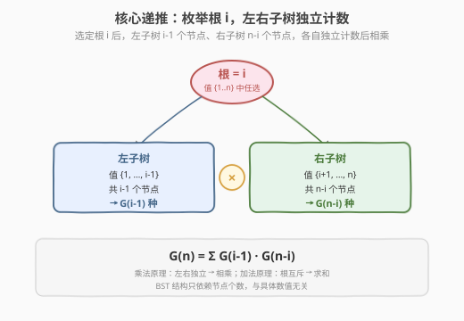
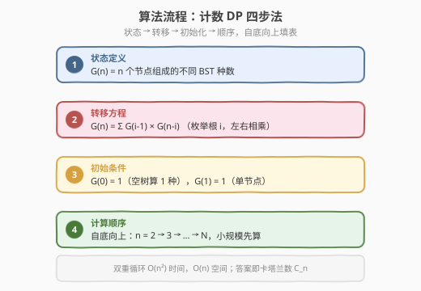
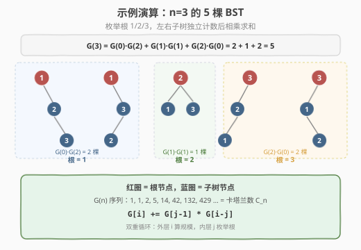

# 不同的二叉搜索树

- **题目名称**：不同的二叉搜索树
- **链接**：[96. 不同的二叉搜索树](https://leetcode.cn/problems/unique-binary-search-trees/)
- **难度**：中等
- **标签**：动态规划、二叉搜索树、数学

## 1. 题目概述

给你一个整数 `n`，求恰由 `n` 个节点组成且节点值从 `1` 到 `n` 互不相同的 **二叉搜索树** 有多少种？返回满足题意的二叉搜索树的种数。

**示例 1**：

```text
输入：n = 3
输出：5
解释：n = 3 时共有 5 种不同的二叉搜索树（见 2.4 节示例演算）
```

**示例 2**：

```text
输入：n = 1
输出：1
```

**约束条件**：

- `1 <= n <= 19`

> 💡 这是**计数型动态规划**的经典模板题，答案是著名的**卡塔兰数（Catalan number）**。它的递推 $G(n) = \sum G(i-1)\cdot G(n-i)$ 把「枚举根 + 左右子树独立」的组合计数结构展现得最清晰。掌握它，你就拿到了所有「按根切分、左右独立」计数题（括号生成、出栈序列、矩阵链乘法）的通用钥匙。它与 [22. 括号生成](22_括号生成.md) 同源——两者答案都是卡塔兰数。

---

## 2. 解题思路

### 2.1 暴力思路：递归枚举所有树形

最直觉的做法是递归枚举：对 `n` 个节点 `{1,...,n}`，枚举每个值 `i` 作根，再递归构造左子树（`1..i-1`）和右子树（`i+1..n`）的所有组合，把两边结果做笛卡尔积。

问题在于**重复子问题**：求 `n=5` 时会反复计算 `G(3)`、`G(2)` 等子结构——同一个 `G(k)` 在不同根的选择下被重复求值。纯递归的时间复杂度是指数级 $O(C_n)$（卡塔兰数本身随 `n` 指数增长），`n=19` 时 $G(19) \approx 1.77\times10^9$，递归展开量是天文数字，**严重超时**。

> ⚠️ 暴力法把同一个 `G(k)` 算了很多遍——这正是「重叠子问题」的信号，也是动态规划出场的时机。

### 2.2 核心观察：按根切分 + 左右独立

**关键定义**：设 $G(n)$ = 由 `n` 个节点值（任意 `n` 个互不相同的有序值）能组成的**不同结构** BST 的种数。

**核心思考**：在 `n` 个节点 `{1, 2, ..., n}` 中，枚举根节点 `i`（`i` 从 `1` 到 `n`）：

- **左子树**：值小于 `i` 的节点 `{1, ..., i-1}`，共 `i-1` 个 → 有 $G(i-1)$ 种结构
- **右子树**：值大于 `i` 的节点 `{i+1, ..., n}`，共 `n-i` 个 → 有 $G(n-i)$ 种结构
- 左右子树**独立**选择 → 该根 `i` 贡献 $G(i-1) \times G(n-i)$ 种（乘法原理）
- 不同根 `i` 互斥 → 累加所有根（加法原理）

$$G(n) = \sum_{i=1}^{n} G(i-1) \cdot G(n-i)$$



> 💡 **为什么只看个数，不看具体值？** BST 的结构只取决于节点值的**相对大小**，与具体数值无关。`{1,2,3}` 和 `{10,20,30}` 能组成的 BST 结构数完全相同——都是 $G(3)=5$。所以左子树虽有特定值 `{1,...,i-1}`，但它的结构数就是 $G(i-1)$。这是本题最关键的观察，它把「具体值」抽象成「个数」，递推才得以成立。

> 💡 **为什么用乘法？** 选定根 `i` 后，左子树任选一种结构、右子树任选一种结构，两者**互不影响**地拼成一棵完整 BST——这是乘法原理（独立事件的总数 = 各自数量之积）。再对所有根求和，是加法原理（互斥情况的总数 = 各自数量之和）。

### 2.3 算法流程图

有了递推关系，按「四步法」自底向上填表：



**四步法**（所有 DP 题通用）：

1. **状态定义**：$G(n)$ = `n` 个节点组成的不同 BST 种数
2. **转移方程**：$G(n) = \sum_{i=1}^{n} G(i-1) \times G(n-i)$
3. **初始条件**：$G(0) = 1$（空树算 1 种），$G(1) = 1$（单节点 1 种）
4. **计算顺序**：从 `n=2` 到目标 `n`，**自底向上**（小规模先算，大规模复用）

> ⚠️ **$G(0) = 1$ 不是 0**！空树是一种合法结构（叶节点的「空子树」）。若令 $G(0)=0$，则 $G(1)=G(0)\times G(0)=0$，整条递推全为 0，彻底错误。这与 [22. 括号生成](22_括号生成.md) 里「空串算 1 种」是一回事——计数 DP 的空对象通常记 1。

### 2.4 示例演算

以 `n=3` 为例，先看 DP 如何算出 $G(3)=5$：

$$G(3) = G(0)\cdot G(2) + G(1)\cdot G(1) + G(2)\cdot G(0) = 1\times2 + 1\times1 + 2\times1 = 5$$

对应的 5 棵 BST（根分别为 1、2、3）：



| 根 i | 左子树（i-1 个） | 右子树（n-i 个） | 贡献 | 对应树形 |
|------|------------------|------------------|------|----------|
| 1 | $G(0)=1$（空） | $G(2)=2$ | $1\times2=2$ | 根 1，右子树两种形态 |
| 2 | $G(1)=1$（节点 1） | $G(1)=1$（节点 3） | $1\times1=1$ | 根 2，左右各一节点 |
| 3 | $G(2)=2$（节点 1、2） | $G(0)=1$（空） | $2\times1=2$ | 根 3，左子树两种形态 |

合计 $2+1+2 = 5$。

> 💡 观察 $G(n)$ 序列：$G(0)=1, G(1)=1, G(2)=2, G(3)=5, G(4)=14, G(5)=42, G(6)=132\dots$——这正是**卡塔兰数** $C_0, C_1, C_2, \dots$。本题答案 $G(n) = C_n$。

完整 DP 表填充过程：

| n | 计算过程 | G(n) |
|---|---------|------|
| 0 | 空树 | 1 |
| 1 | $G(0)\times G(0)$ | 1 |
| 2 | $G(0)\times G(1) + G(1)\times G(0) = 1+1$ | 2 |
| 3 | $G(0)\times G(2) + G(1)\times G(1) + G(2)\times G(0) = 2+1+2$ | 5 |
| 4 | $G(0)\times G(3) + G(1)\times G(2) + G(2)\times G(1) + G(3)\times G(0) = 5+2+2+5$ | 14 |

最终 $G(n)$ 即为答案。

---

## 3. 参考代码

### C++

```cpp
// 不同的二叉搜索树.cpp —— 计数 DP（卡塔兰数）
// 编译: g++ -O2 -std=c++17 不同的二叉搜索树.cpp -o numtrees
#include <vector>
using namespace std;

class Solution {
  public:
    int numTrees(int n) {
        vector<int> G(n + 1, 0);
        G[0] = 1; // 空树
        G[1] = 1; // 单节点
        for (int i = 2; i <= n; ++i) {
            for (int j = 1; j <= i; ++j) {     // 枚举根 j
                G[i] += G[j - 1] * G[i - j];   // 左 × 右
            }
        }
        return G[n];
    }
};
```

### Python

```python
class Solution:
    def numTrees(self, n: int) -> int:
        G = [0] * (n + 1)
        G[0] = G[1] = 1
        for i in range(2, n + 1):
            for j in range(1, i + 1):        # 枚举根 j
                G[i] += G[j - 1] * G[i - j]  # 左 × 右
        return G[n]
```

> 💡 注意双重循环：外层 `i` 是当前要算的规模（从 2 到 `n`），内层 `j` 是枚举的根。`G[i]` 累加所有根的贡献。`G[0]=1` 是整条递推的地基，必须初始化对。

---

## 4. 复杂度分析

| 维度 | 复杂度 | 说明 |
|------|--------|------|
| **时间复杂度** | `O(n²)` | 双重循环，`G[i]` 的内层循环 `i` 次，总计 $\sum_{i=2}^{n} i = O(n^2)$ |
| **空间复杂度** | `O(n)` | `G` 数组长度 `n+1` |

> ⚠️ `n ≤ 19` 时 $G(19) = 1767263190$，刚好在 32-bit `int`（上限约 $2.1\times10^9$）范围内。若 `n` 放宽到 20，$G(20) = 6564120420$ 就溢出 `int`，需改 `long long`。

---

## 5. 扩展：卡塔兰数闭式公式与相关题

### 5.1 卡塔兰数闭式公式

$G(n)$ 有数学闭式解（卡塔兰数公式）：

$$G(n) = C_n = \frac{1}{n+1} \binom{2n}{n} = \frac{(2n)!}{(n+1)! \cdot n!}$$

理论上 `O(n)`（算一次组合数）甚至 `O(1)`（预处理阶乘）。但面试中**递推 DP 更受青睐**：① 不涉及阶乘/除法，无中间值溢出风险；② 体现「按根切分」的组合思维，可迁移到无闭式的变体题。

> ⚠️ 若用闭式公式，需注意 $(2n)!$ 极易溢出：`n=19` 时 $38!$ 是天文数字，必须边乘边除或用组合数递推 $\binom{2n}{n} = \binom{2n}{n-1} \times \frac{2n-n+1}{n}$ 配合 `long long`。

### 5.2 卡塔兰数的线性递推

除了本题「按根切分」的卷积递推 $C_n = \sum C_{i-1} C_{n-i}$，卡塔兰数还有线性递推：

$$C_n = \frac{2(2n-1)}{n+1} C_{n-1}$$

由 $C_{n-1}$ 一步推出 $C_n$，时间 `O(n)`、空间 `O(1)`。但它掩盖了「BST 按根切分」的组合意义，只适合「已知是卡塔兰数、只求快速算值」的场景。

### 5.3 卡塔兰数家族题

| 题目 | 卡塔兰意义 | 与本题关系 |
|------|-----------|-----------|
| [22. 括号生成](https://leetcode.cn/problems/generate-parentheses/)（[题解](22_括号生成.md)） | `n` 对括号的合法序列数 = $C_n$ | 同为卡塔兰数，回溯枚举 |
| [95. 不同的二叉搜索树 II](https://leetcode.cn/problems/unique-binary-search-trees-ii/) | 生成所有 BST（不只计数） | 本题的「枚举版」，分治 + 笛卡尔积 |

> 💡 卡塔兰数在组合数学中无处不在：合法括号序列、出栈顺序、矩阵链乘法括号化、二叉树形态、不相交弦分割……都满足 $C_n = \sum C_{i-1} C_{n-i}$ 这一递推。识别出「按某个分界点切成两个独立子问题，再相乘求和」的结构，就能套用本题模板。

---

## 6. 面试要点

1. **为什么 BST 的结构数只依赖节点个数，不依赖具体值？**

   - BST 的形态由节点值的**相对大小关系**决定。任意 `n` 个互不相同的有序值，能组成的 BST 结构集合是同构的——把值映射到 `{1,...,n}` 保持顺序即可。因此 $G(k)$ 对任何 `k` 个节点都成立，左子树（值 `{1..i-1}`）的结构数就是 $G(i-1)$，与具体数值无关。这是递推能成立的基石。

2. **$G(0) = 1$ 为什么不是 0？**

   - 空树是合法的 BST（叶子的子树、单节点的空子树都是空树）。计数时「空」对应 1 种方案，这样 $G(1) = G(0)\times G(0) = 1$ 才对。若 $G(0)=0$，整条递推归零。计数 DP 中「空对象记 1」是通用约定（如空串、空集合、空路径都算 1 种）。

3. **为什么用乘法累加而不是别的方式？**

   - 选定根 `i` 后，左子树从 $G(i-1)$ 种里任选、右子树从 $G(n-i)$ 种里任选，两者**独立**——由乘法原理，组合数为 $G(i-1)\times G(n-i)$。再对所有互斥的根 `i` 求和（加法原理）。这一「先乘后加」正是笛卡尔积 + 并集的组合计数范式。

4. **`n=19` 时结果会溢出 `int` 吗？**

   - $G(19) = 1767263190 < 2.1\times10^9$（`int` 上限），刚好安全。但 $G(20) = 6564120420$ 就溢出 32-bit `int`。LeetCode 本题约束 `n ≤ 19` 安全；若面试官放宽 `n`，改用 `long long`。

5. **和 95 题（生成所有 BST）的区别与联系？**

   - 96 题只**计数**，用 DP 算种数 $G(n)$；95 题**枚举**所有具体树，用分治递归对每个根做左右子树的笛卡尔积。两者递推结构相同，只是 96 题「把树形压缩成计数」用 DP 高效，95 题必须真正构造树形。先做 96 理解计数结构，再做 95 落地构造。

> 💡 **一句话总结**：96 题是「按根切分 + 左右独立计数」的卡塔兰数 DP 模板——$G(n) = \sum G(i-1)\cdot G(n-i)$，$G(0)=1$ 是地基。核心观察是「BST 结构只依赖节点个数」，把具体值抽象成个数后递推自然成立。`O(n²)` 时间、`O(n)` 空间。这个「分界点切两半、各自独立计数再相乘求和」的范式可迁移到括号生成、出栈序列、矩阵链乘法等所有卡塔兰家族题，是面试必会的计数 DP 套路。

---

## 7. 同类练习题

- [95. 不同的二叉搜索树 II](https://leetcode.cn/problems/unique-binary-search-trees-ii/)：本题的枚举版，分治 + 笛卡尔积生成所有 BST
- [22. 括号生成](https://leetcode.cn/problems/generate-parentheses/)（[题解](22_括号生成.md)）：答案同为卡塔兰数 $C_n$，回溯枚举合法括号序列
- [62. 不同路径](https://leetcode.cn/problems/unique-paths/)（[题解](62_不同路径.md)）：另一类计数 DP（网格路径），二维递推计数
- [70. 爬楼梯](https://leetcode.cn/problems/climbing-stairs/)（[题解](70_爬楼梯.md)）：一维计数 DP 入门，体会「加法原理计数」
