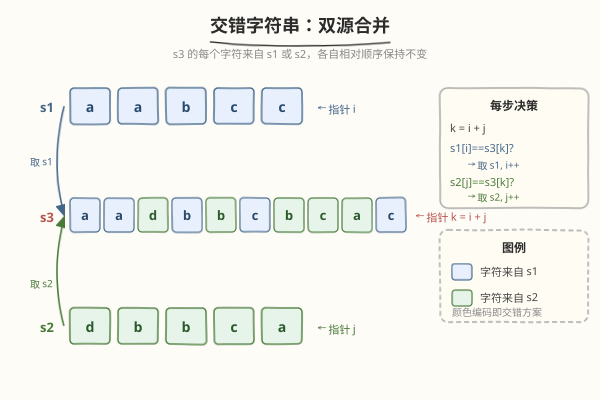
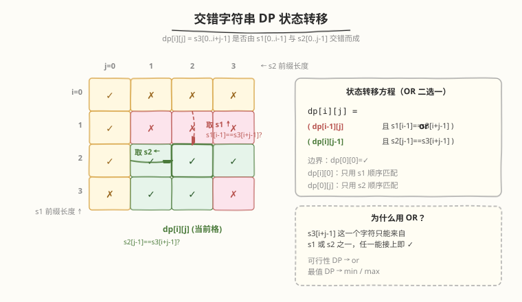
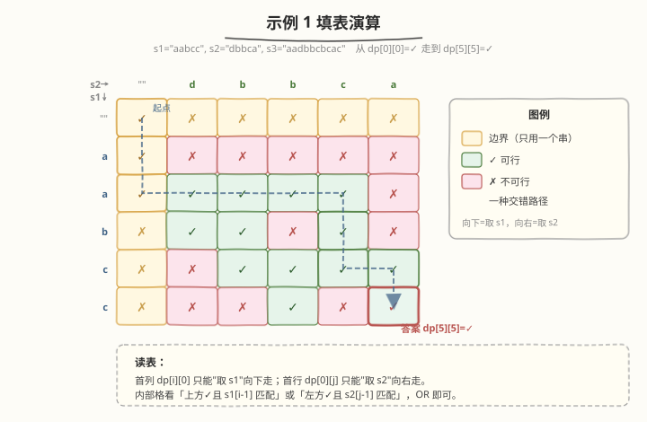

# 交错字符串

- **题目名称**：交错字符串
- **链接**：[97. 交错字符串](https://leetcode.cn/problems/interleaving-string/)
- **难度**：中等
- **标签**：动态规划、二维 DP、字符串

## 1. 题目概述

给定三个字符串 `s1`、`s2`、`s3`，判断 `s3` 是否由 `s1` 和 `s2` **交错组成**。交错定义：将 `s1` 和 `s2` 按某种顺序合并，合并时**各自字符的相对顺序保持不变**，结果恰好等于 `s3`。

**示例 1**：

```text
输入：s1 = "aabcc", s2 = "dbbca", s3 = "aadbbcbcac"
输出：true
解释：s1 = a a   b   c c      s2 =     d b b c a
        ↓ ↓ ↓ ↓ ↓              合并 →  a a d b b c b c a c
                                        ↑ ↑ ↑ ↑ ↑ ↑ ↑ ↑ ↑ ↑
        来自 s1/s2:               1 1 2 1 2 1 2 1 2 1
```

**示例 2**：

```text
输入：s1 = "aabcc", s2 = "dbbca", s3 = "aadbbbaccc"
输出：false
```

**示例 3**：

```text
输入：s1 = "", s2 = "", s3 = ""
输出：true
```

**约束条件**：

- `0 <= s1.length, s2.length <= 100`
- `0 <= s3.length <= 200`
- `s1`、`s2`、`s3` 由小写英文字母组成

> ⚠️ **进阶**：你能做到 `O(m×n)` 时间 + `O(n)` 空间（滚动数组）吗？

---

## 2. 解题思路

### 2.1 暴力思路（递归枚举）

用两个指针 `i`、`j` 分别在 `s1`、`s2` 上走，输出指针 `k = i + j` 指向 `s3`。每一步有两种选择：

- 若 `s1[i] == s3[k]`，取 `s1` 的字符，`i++`
- 若 `s2[j] == s3[k]`，取 `s2` 的字符，`j++`

两条分支都递归尝试，任一成功即返回 true。最坏 `O(2^(m+n))`，严重超时。

### 2.2 核心观察：二维 DP



**关键直觉**：`s3` 的前 `i + j` 个字符能否由 `s1` 的前 `i` 个与 `s2` 的前 `j` 个交错而成，**只取决于这两个前缀长度**，与具体走法无关——具备**最优子结构**，可用 DP 去重。

**定义**：`dp[i][j]` = `s3[0..i+j-1]` 是否能由 `s1[0..i-1]` 与 `s2[0..j-1]` 交错组成（布尔值）。

**边界**：

```text
dp[0][0] = true                                # 空串 + 空串 = 空串
dp[i][0] = dp[i-1][0] && s1[i-1] == s3[i-1]    # 只用 s1 顺序匹配 s3
dp[0][j] = dp[0][j-1] && s2[j-1] == s3[j-1]    # 只用 s2 顺序匹配 s3
```

**转移**（核心）：

```text
dp[i][j] = ( dp[i-1][j] && s1[i-1] == s3[i+j-1] )   # s3 第 i+j 个字符来自 s1
        or ( dp[i][j-1] && s2[j-1] == s3[i+j-1] )   # s3 第 i+j 个字符来自 s2
```

**两个来源的 DP 方向**：

| 来源 | DP 方向 | 含义 |
|------|---------|------|
| **取 s1** | `dp[i-1][j]` ↑ | `s3[i+j-1]` 由 `s1[i-1]` 贡献，`s1` 前进一步 |
| **取 s2** | `dp[i][j-1]` ← | `s3[i+j-1]` 由 `s2[j-1]` 贡献，`s2` 前进一步 |



**答案**：`dp[m][n]`（`m = len(s1)`，`n = len(s2)`）。

> ⚠️ **前置剪枝**：若 `len(s1) + len(s2) != len(s3)`，直接返回 false，无需建表。

### 2.3 示例演算

`s1 = "aabcc"`、`s2 = "dbbca"`、`s3 = "aadbbcbcac"`（`m = n = 5`）：



填表从左上角 `dp[0][0] = ✓` 出发：首列只能"取 s1"向下走，首行只能"取 s2"向右走。逐格判定时，看「上方格 + `s1[i-1]==s3[i+j-1]`」或「左方格 + `s2[j-1]==s3[i+j-1]`」是否成立。最终 `dp[5][5] = ✓`，返回 true。

### 2.4 空间优化：滚动数组

`dp[i][j]` 只依赖**正上方** `dp[i-1][j]` 与**正左方** `dp[i][j-1]`（上一行同列 + 当前行左邻），可压缩到一维：

```text
dp[j] = (dp[j]       && s1[i-1] == s3[i+j-1])    # 旧 dp[j] 即上一行 dp[i-1][j]
     or (dp[j-1]     && s2[j-1] == s3[i+j-1])    # 已更新的 dp[j-1] 即 dp[i][j-1]
```

从左到右更新即可（左邻已就位是"当前行"的值，自身未覆盖是"上一行"的值），无需额外 prev 变量。

---

## 3. 参考代码

### C++

```cpp
// 方法一：标准二维 DP
class Solution {
public:
    bool isInterleave(string s1, string s2, string s3) {
        int m = s1.size(), n = s2.size();
        if (m + n != (int)s3.size()) return false;          // 长度剪枝

        vector<vector<char>> dp(m + 1, vector<char>(n + 1, 0));
        dp[0][0] = 1;
        for (int i = 1; i <= m; i++)
            dp[i][0] = dp[i-1][0] && s1[i-1] == s3[i-1];
        for (int j = 1; j <= n; j++)
            dp[0][j] = dp[0][j-1] && s2[j-1] == s3[j-1];

        for (int i = 1; i <= m; i++)
            for (int j = 1; j <= n; j++)
                dp[i][j] = (dp[i-1][j] && s1[i-1] == s3[i+j-1])
                         | (dp[i][j-1] && s2[j-1] == s3[i+j-1]);

        return dp[m][n];
    }
};

// 方法二：滚动数组 O(n) 空间
class Solution {
public:
    bool isInterleave(string s1, string s2, string s3) {
        int m = s1.size(), n = s2.size();
        if (m + n != (int)s3.size()) return false;

        vector<char> dp(n + 1, 0);
        dp[0] = 1;
        for (int j = 1; j <= n; j++)
            dp[j] = dp[j-1] && s2[j-1] == s3[j-1];

        for (int i = 1; i <= m; i++) {
            dp[0] = dp[0] && s1[i-1] == s3[i-1];            // 首列：只能取 s1
            for (int j = 1; j <= n; j++)
                dp[j] = (dp[j]     && s1[i-1] == s3[i+j-1])
                      | (dp[j-1]   && s2[j-1] == s3[i+j-1]);
        }
        return dp[n];
    }
};
```

### Python

```python
# 方法一：标准二维 DP
def isInterleave(s1: str, s2: str, s3: str) -> bool:
    m, n = len(s1), len(s2)
    if m + n != len(s3):
        return False

    dp = [[False] * (n + 1) for _ in range(m + 1)]
    dp[0][0] = True
    for i in range(1, m + 1):
        dp[i][0] = dp[i-1][0] and s1[i-1] == s3[i-1]
    for j in range(1, n + 1):
        dp[0][j] = dp[0][j-1] and s2[j-1] == s3[j-1]

    for i in range(1, m + 1):
        for j in range(1, n + 1):
            dp[i][j] = (dp[i-1][j] and s1[i-1] == s3[i+j-1]) \
                    or (dp[i][j-1] and s2[j-1] == s3[i+j-1])

    return dp[m][n]


# 方法二：滚动数组 O(n) 空间
def isInterleave_rolling(s1: str, s2: str, s3: str) -> bool:
    m, n = len(s1), len(s2)
    if m + n != len(s3):
        return False

    dp = [False] * (n + 1)
    dp[0] = True
    for j in range(1, n + 1):
        dp[j] = dp[j-1] and s2[j-1] == s3[j-1]

    for i in range(1, m + 1):
        dp[0] = dp[0] and s1[i-1] == s3[i-1]
        for j in range(1, n + 1):
            dp[j] = (dp[j]   and s1[i-1] == s3[i+j-1]) \
                 or (dp[j-1] and s2[j-1] == s3[i+j-1])

    return dp[n]
```

---

## 4. 复杂度分析

| 维度 | 二维 DP | 滚动数组 |
|------|---------|---------|
| **时间** | `O(m × n)` | `O(m × n)` |
| **空间** | `O(m × n)` | `O(n)` |
| **能否还原交错方案** | ✓ 回溯 `dp` 表 | ✗ 只得布尔结论 |
| **适用场景** | 需还原具体交错路径 | 只需判可行性 |

> 💡 **OR **「两选一」的直觉**：`s3` 的每个字符要么来自 `s1`、要么来自 `s2`，二者只要有一个能接上即为 true。这与编辑距离的 `min`（三选一取最小）形成对照——可行性 DP 用 `or`，最值 DP 用 `min/max`。

---

## 5. 扩展：记忆化搜索与 BFS 视角

本题有三条等价思路，面试时常被追问：

1. **记忆化搜索**：把 2.1 的暴力递归加 `memo[(i,j)]` 记忆化，复杂度即降到 `O(m×n)`。自顶向下，状态定义与二维 DP 完全一致，适合讲清"为什么是子问题"。

2. **BFS / 最早到达**：把 `(i, j)` 视作网格点，从 `(0,0)` 走到 `(m,n)`，每步向右（取 `s2`）或向下（取 `s1`），要求字符匹配。用队列 + `visited` 集合做 BFS，问能否到达终点。本质与 DP 同构，但思路来自"网格图最短路"。

3. **方案还原**：在二维 DP 表上从 `dp[m][n]` 回溯——若 `dp[i-1][j] && s1[i-1]==s3[i+j-1]` 成立则向上走（记该字符来自 `s1`），否则向左走（来自 `s2`），即可输出一种具体交错方案。

---

## 6. 面试要点

1. **为什么状态只需要** `(i, j)` **两个维度？**

   - `s3` 的前 `i + j` 个字符由 `s1` 前 `i` 个、`s2` 前 `j` 个组成，`k = i + j` 由二者长度唯一确定
   - 一旦固定 `i`、`j`，"前面怎么走来的"不影响"后面能否接上"，满足无后效性，故二维即可

2. **转移里两个条件为什么用** `or` **而不是** `and`**？**

   - `s3[i+j-1]` 这一个字符**只能来自 `s1` 或 `s2` 之一**，任一来源能接上即整体可行
   - 若用 `and` 会变成"两个来源同时成立"，逻辑错误；可行性 DP 取 `or`，最值 DP 取 `min/max`

3. **滚动数组为什么从左到右更新即可，不需要 prev 变量？**

   - `dp[i][j]` 依赖正上方（`dp[i-1][j]`，旧值）和正左方（`dp[i][j-1]`，新值）
   - 一维数组中：`dp[j]` 覆盖前是上一行同列（正上方），`dp[j-1]` 已被本轮更新为当前行左邻（正左方）
   - 因此从左到右扫一遍，`dp[j]` 和 `dp[j-1]` 自然分别代表"上"和"左"，无需额外暂存

4. **为什么要先做长度剪枝** `m + n != len(s3)`**？**

   - 交错要求字符总数严格相等，长度不等直接 false
   - 既省去建表开销，又避免了 `s3` 越界访问（转移中 `s3[i+j-1]` 下标前提是 `i+j <= len(s3)`）

5. **和编辑距离（72）/最长公共子序列（1143）的二维 DP 有何异同？**

   - 同：都是 `m×n` 二维表，`dp[i][j]` 刻画两个前缀的关系，可滚动数组优化
   - 异：本题是**布尔可行性**（`or` 连接两个来源）；编辑距离是**最值**（`min` 三选一加 1）；LCS 是**最长长度**（`max`，字符相同则 `+1`）
   - 本题 `k = i + j` 由两维确定第三维，而编辑距离/LCS 的两个前缀长度独立——这是交错问题的独特之处

---

## 7. 同类练习题

- [72. 编辑距离](https://leetcode.cn/problems/edit-distance/)（[题解](../0001-0100/72_编辑距离.md)）：二维字符串 DP，`min` 取最值，对照本题 `or` 取可行性
- [1143. 最长公共子序列](https://leetcode.cn/problems/longest-common-subsequence/)（[题解](../1101-1200/1143_最长公共子序列.md)）：二维字符串 DP，`max` 取最长
- [115. 不同的子序列](https://leetcode.cn/problems/distinct-subsequences/)：二维 DP 计数，`s` 中能组成 `t` 的方案数，转移结构与本题神似
- [10. 正则表达式匹配](https://leetcode.cn/problems/regular-expression-matching/)（[题解](../0001-0100/10_正则表达式匹配.md)）：二维 DP + `*` 两分支，更复杂的字符串匹配 DP
