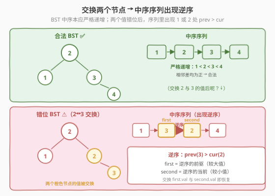
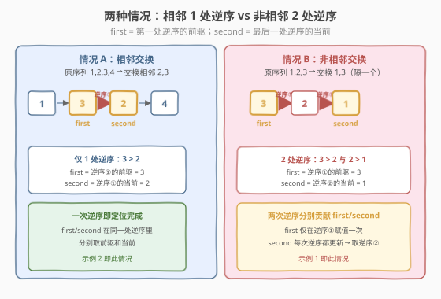
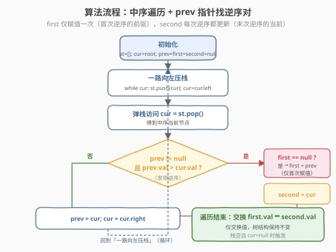
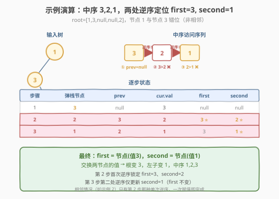

# 恢复二叉搜索树

- **题目名称**：恢复二叉搜索树
- **链接**：[99. 恢复二叉搜索树](https://leetcode.cn/problems/recover-binary-search-tree/)
- **难度**：中等
- **标签**：树、二叉搜索树、深度优先搜索、中序遍历、Morris 遍历

## 1. 题目概述

给你二叉搜索树的根节点 `root`，该树中**恰好有两个节点**的值被错误交换。请在不改变树结构的前提下恢复这棵树。

**进阶**：使用 `O(1)` 空间复杂度的解法（Morris 遍历）。

**示例 1**：

```text
输入：root = [1,3,null,null,2]
输出：[3,1,null,null,2]
解释：节点 1 和节点 3 的值被错误交换。

      1                  3
     /                  /
    3         =>       1
     \                  \
      2                  2
```

**示例 2**：

```text
输入：root = [3,1,4,null,null,2]
输出：[2,1,4,null,null,3]
解释：节点 2 和节点 3 的值被错误交换。

      3                  2
     / \                / \
    1   4      =>      1   4
       /                  /
      2                  3
```

**约束条件**：

- 树中节点数目范围 `[1, 1000]`
- `-2^31 <= Node.val <= 2^31 - 1`

> 💡 这是 [98. 验证二叉搜索树](98_验证二叉搜索树.md) 的「修复版」：98 题用中序遍历**判定**是否递增，99 题用中序遍历**找出逆序对**并交换。两者共享「BST 中序 = 严格递增序列」这条等价性质。难点不在交换本身，而在**正确识别两个错位节点**——它们在中序序列里可能产生 1 处或 2 处逆序。

---

## 2. 解题思路

### 2.1 暴力思路：收集序列再排序

最直觉的暴力：中序遍历收集所有节点值到数组，排序后回写。正确但浪费——`O(n)` 空间存数组 + `O(n log n)` 排序，且完全没利用「恰好两个节点错位」这一约束。

> ⚠️ 暴力法忽略了关键信息：**只有两个值错位**，意味着中序序列里最多两处逆序。利用这点可以一次遍历定位错位节点，`O(n)` 时间 + `O(h)` 栈空间（甚至 `O(1)` Morris）。

### 2.2 核心观察：中序序列的逆序对

合法 BST 的中序序列严格递增：$v_1 < v_2 < \dots < v_n$。交换位置 $i, j$（$i<j$）的两个值后，序列变为 $v_1, \dots, v_{i-1}, v_j, v_{i+1}, \dots, v_{j-1}, v_i, v_{j+1}, \dots$。由于位置 $i$ 变大（换成 $v_j$）、位置 $j$ 变小（换成 $v_i$），必然出现**逆序**：

- **第 1 处逆序**：位置 $i$ 与 $i{+}1$ 之间，$v_j > v_{i+1}$。**第一个错位节点** = 位置 $i$（较大值 $v_j$，它本应排在后面）。
- **第 2 处逆序**：位置 $j{-}1$ 与 $j$ 之间，$v_{j-1} > v_i$。**第二个错位节点** = 位置 $j$（较小值 $v_i$，它本应排在前面）。

**特例**：若 $j = i+1$（两节点在中序里相邻），两处逆序合并成**一处**，第一个错位节点是位置 $i$、第二个是位置 $i{+}1$。



> 💡 **口诀**：第一个错位节点 = **第一处逆序的「前驱」**（较大值）；第二个错位节点 = **最后一处逆序的「当前」**（较小值）。相邻时只有一处逆序，前驱和当前就是两个错位节点。



### 2.3 算法流程图



**中序遍历（迭代版）步骤**：

1. **初始化**：空栈 `st`，`cur = root`，`prev = null`，`first = null`，`second = null`。
2. **一路向左压栈**：`while cur: st.push(cur); cur = cur.left`。
3. **弹栈访问**：`cur = st.pop()`。
   - 若 `prev != null` 且 `prev.val > cur.val`（发现逆序）：
     - 若 `first == null`：`first = prev`（第一处逆序的前驱，仅赋值一次）。
     - `second = cur`（**每次逆序都更新**，最终指向最后一处逆序的当前节点）。
4. `prev = cur`；`cur = cur.right`；回到第 2 步。
5. **遍历结束**：交换 `first.val` 与 `second.val`。

> ⚠️ **`second` 每次逆序都更新**：相邻情况只有一次逆序，`second` 在第 3 步首次赋值即终值；非相邻情况有两次逆序，第一次同时赋 `first`/`second`，第二次只更新 `second`。用「`first` 仅赋值一次、`second` 每次都更新」的写法，两种情况统一处理，无需分支。

> 💡 与 [98 题](98_验证二叉搜索树.md) 的中序迭代模板只差一处：98 题遇 `prev.val >= cur.val` 立即 `return false`，99 题遇 `prev.val > cur.val` 仅记录节点、继续遍历（必须走完整棵树才能确认是 1 处还是 2 处逆序）。

### 2.4 示例演算

以示例 1 `root = [1,3,null,null,2]` 为例，中序序列为 `3, 2, 1`（节点 1 与节点 3 错位，非相邻）：



| 步骤 | 弹栈节点 | prev | cur.val | 逆序? | first | second |
|------|---------|------|---------|-------|-------|--------|
| 1 | 3 | null | 3 | 无前驱 | null | null |
| 2 | 2 | 3 | 2 | ✅ 3 > 2 | **3** ⭐ | **2** |
| 3 | 1 | 2 | 1 | ✅ 2 > 1 | 3 | **1** ⭐ |

第 2 步发现第一处逆序 `3 > 2`，`first = 3`、`second = 2`；第 3 步发现第二处逆序 `2 > 1`，仅更新 `second = 1`。最终交换节点 `3` 与节点 `1` 的值，得到正确 BST（中序 `1, 2, 3`）。

> 💡 对比示例 2 `root = [3,1,4,null,null,2]`，中序 `1, 3, 2, 4`（节点 2 与节点 3 错位，相邻）：只有一处逆序 `3 > 2`，`first = 3`、`second = 2`，一次赋值即定位完成——这正是「相邻 1 处逆序」的特例。

---

## 3. 参考代码

### C++

```cpp
// 恢复二叉搜索树.cpp —— 中序遍历找逆序对，O(h) 栈空间
// 编译: g++ -O2 -std=c++17 恢复二叉搜索树.cpp -o recoverbst
#include <stack>
using namespace std;

struct TreeNode {
    int val;
    TreeNode* left;
    TreeNode* right;
    TreeNode(int x) : val(x), left(nullptr), right(nullptr) {
    }
};

class Solution {
  public:
    void recoverTree(TreeNode* root) {
        stack<TreeNode*> st;
        TreeNode* cur = root;
        TreeNode *prev = nullptr, *first = nullptr, *second = nullptr;

        while (cur != nullptr || !st.empty()) {
            while (cur != nullptr) {     // 一路向左压栈
                st.push(cur);
                cur = cur->left;
            }
            cur = st.top();              // 弹栈访问
            st.pop();

            if (prev != nullptr && prev->val > cur->val) { // 发现逆序
                if (first == nullptr)
                    first = prev;        // 第一处逆序的前驱（较大值）
                second = cur;            // 每次逆序都更新 → 最后一处逆序的当前节点
            }
            prev = cur;
            cur = cur->right;
        }

        if (first != nullptr && second != nullptr)
            swap(first->val, second->val); // 仅交换值，结构不变
    }
};
```

**Morris 遍历版（进阶 `O(1)` 空间）**：

```cpp
class Solution {
  public:
    void recoverTree(TreeNode* root) {
        TreeNode *cur = root, *prev = nullptr, *first = nullptr, *second = nullptr;
        while (cur != nullptr) {
            if (cur->left == nullptr) {
                // 无左子：直接访问 cur
                if (prev != nullptr && prev->val > cur->val) {
                    if (first == nullptr) first = prev;
                    second = cur;
                }
                prev = cur;
                cur = cur->right;
            } else {
                // 找 cur 的中序前驱（左子树最右节点）
                TreeNode* pre = cur->left;
                while (pre->right != nullptr && pre->right != cur)
                    pre = pre->right;
                if (pre->right == nullptr) {
                    pre->right = cur;     // 第一次到 cur：建临时线索
                    cur = cur->left;
                } else {
                    pre->right = nullptr; // 第二次到 cur：拆线索
                    if (prev != nullptr && prev->val > cur->val) {
                        if (first == nullptr) first = prev;
                        second = cur;
                    }
                    prev = cur;
                    cur = cur->right;
                }
            }
        }
        if (first != nullptr && second != nullptr)
            swap(first->val, second->val);
    }
};
```

### Python

```python
class Solution:
    def recoverTree(self, root: TreeNode | None) -> None:
        stack: list[TreeNode] = []
        cur = root
        prev = first = second = None

        while cur or stack:
            while cur:                  # 一路向左压栈
                stack.append(cur)
                cur = cur.left
            cur = stack.pop()

            if prev is not None and prev.val > cur.val:  # 发现逆序
                if first is None:
                    first = prev        # 第一处逆序的前驱
                second = cur            # 每次逆序都更新
            prev = cur
            cur = cur.right

        if first is not None and second is not None:
            first.val, second.val = second.val, first.val
```

> 💡 Python 用 `is None` 判空——这里判的是节点引用是否为 `None`，与节点值（可能为 `0` 或负数）无关，无边界坑。Morris 版只需把 C++ 逻辑直译，同样 `O(1)` 额外空间。

---

## 4. 复杂度分析

| 维度 | 中序迭代 | Morris 遍历 |
|------|---------|-------------|
| **时间复杂度** | `O(n)` | `O(n)`（每条边最多走 2 次） |
| **空间复杂度** | `O(h)`（显式栈，h 为树高） | `O(1)`（仅几个指针） |
| **最坏空间** | `O(n)`（退化为链表） | `O(1)` |
| **是否修改结构** | 否（仅交换值） | 临时建/拆线索，结束后恢复 |
| **实现难度** | 低 | 中（前驱线索易写错） |

> ⚠️ Morris 每条边最多被访问 2 次（一次建线索、一次访问+拆线索），总时间仍 `O(n)`。线索是临时修改 `right` 指针，访问后立即拆除，**结束时树结构与输入完全一致**，不违反「不改变结构」的要求。

---

## 5. 扩展：Morris 遍历原理

Morris 遍历用「**线索化**」把中序的 `O(h)` 递归栈压成 `O(1)`：对每个节点 `cur`，找到它的中序前驱 `pre`（左子树最右节点），临时把 `pre->right` 指向 `cur`，这样左子树遍历完后能顺着线索回到 `cur`，无需栈。

**两种状态**（用 `pre->right` 是否已线索化区分）：

1. `pre->right == nullptr`：**第一次**到 `cur`，建线索 `pre->right = cur`，然后 `cur = cur->left` 进入左子树。
2. `pre->right == cur`：**第二次**到 `cur`（左子树已遍历完），拆线索 `pre->right = nullptr`，访问 `cur`，然后 `cur = cur->right` 进入右子树。

> 💡 Morris 的精髓：用前驱节点的空闲 `right` 指针充当「返回栈」，遍历完即拆——空间 `O(1)`，代价是每条边走两遍（时间常数翻倍但仍是 `O(n)`）。这套模板可迁移到中序、前序，甚至后序（后序稍复杂，需在拆线索时逆序输出左子右链）。是 [94. 二叉树的中序遍历](94_二叉树的中序遍历.md) 三件套里的「空间极简」解法。

---

## 6. 面试要点

1. **为什么最多两处逆序？相邻和非相邻有什么区别？**

   - 交换位置 $i, j$（$i<j$）的两个值后，位置 $i$ 变大（换成 $v_j$）、位置 $j$ 变小（换成 $v_i$）。
   - 位置 $i$ 与 $i{+}1$ 形成第 1 处逆序（$v_j > v_{i+1}$）；位置 $j{-}1$ 与 $j$ 形成第 2 处逆序（$v_{j-1} > v_i$）。
   - $j = i+1$（相邻）时两处重合成 1 处；非相邻时 2 处。

2. **`first` 和 `second` 分别怎么找？**

   - `first` = **第一处**逆序的前驱（较大值，仅赋值一次）。
   - `second` = **最后一处**逆序的当前节点（较小值，每次逆序都更新）。
   - 相邻情况只有一处逆序，`first`/`second` 在同一处逆序里分别取前驱和当前。

3. **为什么只交换值而不交换节点？**

   - 题目要求「不改变结构」。交换两个节点的值等价于交换它们的位置（从中序结果看），但实现简单且不碰指针。
   - 严格说题目语义是「两个节点的值被错误交换」，修值最直接。若面试官要求交换节点对象，需调整父节点指针，复杂得多。

4. **Morris 遍历如何做到 `O(1)` 空间？它修改了树结构吗？**

   - 用前驱节点的空闲 `right` 指针当「返回线索」，无需递归栈。
   - 线索是临时的：建线索后访问完左子树立即拆除，结束时树结构与输入一致，不违反「不改变结构」。

5. **找前驱时为什么判断 `pre->right != cur`？**

   - 防止死循环：若 `pre->right == cur`，说明线索已建（第二次到 `cur`），应拆线索并访问；若不加此判断，会顺着线索绕回 `cur`，在 `cur` 与前驱之间无限循环。

> 💡 **一句话总结**：99 题是 98 题的「逆运算」——98 判定中序是否递增，99 找中序里的逆序对并修复。核心模板：维护 `prev` 指针，遇 `prev.val > cur.val` 即记逆序，`first` 取首次前驱、`second` 取末次当前，最后交换两值。进阶用 Morris 把空间压到 `O(1)`。

---

## 7. 同类练习题

- [98. 验证二叉搜索树](https://leetcode.cn/problems/validate-binary-search-tree/)（[题解](98_验证二叉搜索树.md)）：中序单调性判定，99 题的前置
- [230. 二叉搜索树中第 K 小的元素](https://leetcode.cn/problems/kth-smallest-element-in-a-bst/)：中序遍历到第 K 个停
- [538. 把二叉搜索树转换为累加树](https://leetcode.cn/problems/convert-bst-to-greater-tree/)：反序中序（右→根→左）累加
- [173. 二叉搜索树迭代器](https://leetcode.cn/problems/binary-search-tree-iterator/)：中序遍历的「分步」版，栈 `O(h)` 或 Morris
- [94. 二叉树的中序遍历](https://leetcode.cn/problems/binary-tree-inorder-traversal/)（[题解](94_二叉树的中序遍历.md)）：中序三件套（递归/栈/Morris）的母题
