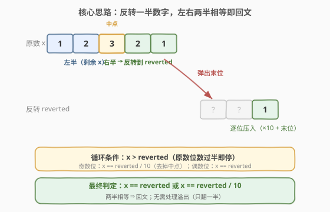
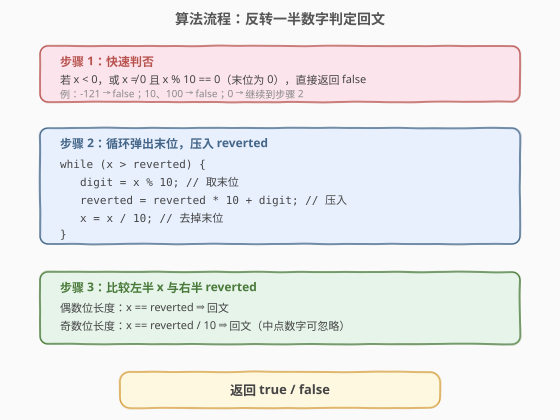
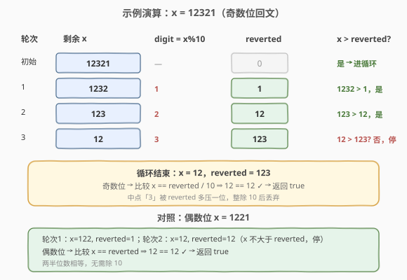

# 回文数

- **题目名称**：回文数
- **链接**：[9. 回文数](https://leetcode.cn/problems/palindrome-number/)
- **难度**：简单
- **标签**：数学

## 1. 题目概述

给你一个整数 `x`，如果 `x` 是一个**回文整数**，返回 `true`；否则返回 `false`。

回文数是指**正序（从左向右）和倒序（从右向左）读都是同一个整数**。例如，`121` 是回文，而 `123` 不是。

**示例 1**：

```text
输入：x = 121
输出：true
```

**示例 2**：

```text
输入：x = -121
输出：false
解释：从左向右读为 -121，从右向左读为 121-，因此它不是回文数。
```

**示例 3**：

```text
输入：x = 10
输出：false
解释：从右向左读为 01，因此它不是回文数。
```

**约束条件**：

- $-2^{31} \le x \le 2^{31} - 1$

> ⚠️ **进阶要求**：你能不将整数转为字符串来解决这个问题吗？（即要求 $O(1)$ 额外空间）

---

## 2. 解题思路

### 2.1 暴力思路：转字符串翻转

最直观的做法是把整数转成字符串 `s`，再比较 `s` 与反转后的 `s[::-1]` 是否相等。写法极简，但需要 $O(n)$ 的额外字符串空间（$n$ 为数字位数），**不满足进阶要求**。

```python
return str(x) == str(x)[::-1]
```

> 💡 字符串法在工程中完全可接受，但面试官通常会追加一句「能不能不用字符串？」来考察对数字本身的理解。下文的核心解法即为不转字符串的 $O(1)$ 空间解法。

### 2.2 核心观察：反转一半数字



回文数的特点是**左右两半对称**。若把整数的**右半部分反转**，得到的新数应与**左半部分**相等（奇数位时中点数字需丢弃）。于是只需反转一半即可判断：

- 维护 `reverted = 0`，每次从 `x` 弹出末位 `digit = x % 10`，压入 `reverted = reverted * 10 + digit`；
- 同时 `x = x / 10` 截短原数；
- **何时停止**？当 `x` 不再大于 `reverted` 时，说明已处理过半——此时 `x` 即左半（含或不含中点），`reverted` 即右半反转。

> 💡 **为何只翻一半**：翻一半既省了一半工作量，又**天然规避溢出**——`reverted` 最多增长到与 `x` 同量级（位数约为原数的一半），不可能超过 `INT_MAX`。这是相比「全量反转」最关键的优势。

**快速判否的两类特例**（提前剪枝，避免无效循环）：

1. **负数**必非回文：`-121` 反过来是 `121-`，符号位破坏对称。
2. **末位为 0 的非零数**必非回文：如 `10`、`100`，整数首位不可能是 `0`，反转后 `01` 不可能与原数对齐。但 `0` 本身是回文。

### 2.3 算法流程图



流程分三步：先特判（负数 / 末位 0），再循环反转过半，最后比较左半与右半。奇数位长度用 `x == reverted / 10`（整除丢中点），偶数位长度用 `x == reverted`。

### 2.4 示例演算



以 `x = 12321`（奇数位）为例：

- 第 1 轮：弹出 `1`，`x = 1232`，`reverted = 1`；
- 第 2 轮：弹出 `2`，`x = 123`，`reverted = 12`；
- 第 3 轮：弹出 `3`，`x = 12`，`reverted = 123`。此时 `x (12) ≤ reverted (123)`，循环停止。
- 奇数位判定：`x == reverted / 10` ⇒ `12 == 12` ✓ 返回 `true`（中点 `3` 被整除丢弃）。

对照偶数位 `x = 1221`：两轮后 `x = 12`，`reverted = 12`，`x ≤ reverted` 停止，偶数位判定 `x == reverted` ⇒ `12 == 12` ✓。

---

## 3. 参考代码

### C++

```cpp
class Solution {
  public:
    bool isPalindrome(int x) {
        // 特判：负数 / 末位为 0 的非零数，必非回文
        if (x < 0 || (x % 10 == 0 && x != 0)) {
            return false;
        }
        int reverted = 0;
        // 只反转一半：x 剩余部分不再大于 reverted 时停止
        while (x > reverted) {
            reverted = reverted * 10 + x % 10;
            x /= 10;
        }
        // 偶数位：x == reverted；奇数位：x == reverted / 10（丢中点）
        return x == reverted || x == reverted / 10;
    }
};
```

### Python

```python
class Solution:
    def isPalindrome(self, x: int) -> bool:
        # 特判：负数 / 末位为 0 的非零数，必非回文
        if x < 0 or (x % 10 == 0 and x != 0):
            return False
        reverted = 0
        # 只反转一半：x 剩余部分不再大于 reverted 时停止
        while x > reverted:
            reverted = reverted * 10 + x % 10
            x //= 10
        # 偶数位：x == reverted；奇数位：x == reverted // 10（丢中点）
        return x == reverted or x == reverted // 10
```

> ⚠️ Python 中整数除法务必用 `//`（地板除），用 `/` 会得到浮点数导致后续比较出错。

---

## 4. 复杂度分析

| 维度 | 复杂度 | 说明 |
|------|--------|------|
| 时间复杂度 | $O(\log_{10} n)$ | 循环次数为数字位数的一半，即 $\frac{1}{2}\lfloor\log_{10} x\rfloor + 1$，随 $x$ 的位数线性增长 |
| 空间复杂度 | $O(1)$ | 仅用 `reverted`、`x` 等常数个整型变量，未转字符串 |

---

## 5. 扩展：全量反转 vs 半量反转

### 5.1 全量反转整型

类似 [7. 整数反转](https://leetcode.cn/problems/reverse-integer/) 的做法：把 `x` 整个反转得到 `rev`，再比较 `rev == x`。逻辑更直观，但有两个缺点：

1. **溢出风险**：`x = 2147483647`（`INT_MAX`）的反转 `7463847412` 超过 32 位有符号整型上界，需用 `long long` 或显式溢出检查；而半量反转的 `reverted` 增长上限约为 $\sqrt{x}$ 量级，**永远不会溢出**。
2. **多做一倍工作**：回文只需比较一半，全量反转多翻了一倍的位数。

### 5.2 字符串双指针

转字符串后用左右双指针 `i`、`j` 向中间逼近，遇到 `s[i] != s[j]` 即返回 `false`。时间 $O(n)$、空间 $O(n)$。适合对空间无要求的场景，写法最接近人的直觉。

> 💡 **三法对比**：字符串双指针（直观，$O(n)$ 空间）< 全量反转（数字版，$O(1)$ 空间但有溢出坑）< 半量反转（最优，$O(1)$ 空间且无溢出）。面试中半量反转为标准答案。

---

## 6. 面试要点

1. **为什么循环条件是 `x > reverted` 而不是 `x > 0`？**

   - `x > 0` 会把整个数翻完，既浪费一半工作量，又让 `reverted` 可能溢出（接近 `INT_MAX` 的数反转后超出上界）。用 `x > reverted` 作停止条件，恰好处理过半即停——既保证两半对齐可比较，又把 `reverted` 的增长限制在原数一半量级，**从根本上消除溢出**。

2. **奇数位和偶数位的判定为什么不同？**

   - 奇数位（如 12321）：循环停止时 `reverted` 比左半多一位（含中点），需 `reverted / 10` 丢掉中点后再比。偶数位（如 1221）：循环停止时两半位数恰好相等，直接比较即可。代码用 `x == reverted || x == reverted / 10` 一行兼容两种情况。

3. **`x % 10 == 0 && x != 0` 这个特判能不能省？**

   - 不能省。若省去，`x = 10` 会进入循环：第 1 轮 `reverted = 0`、`x = 1`，此时 `x > reverted` 仍成立，继续 `reverted = 1`、`x = 0`，最终 `x == reverted` 返回 `true`——这是错的（`10` 不是回文）。特判把所有「末位为 0 的非零数」提前拦掉，是保证正确性的关键。

4. **负数为什么一定是 `false`？**

   - 回文要求正反读一致。负数的符号位 `-` 在最左，反转后会跑到最右（如 `-121` → `121-`），不再是合法整数，对称性被破坏。代码用 `x < 0` 一刀切即可。

5. **0 是回文数吗？**

   - 是。`0` 正反读都是 `0`。代码中 `x = 0` 不满足 `x < 0`，也不满足 `x % 10 == 0 && x != 0`（因 `x == 0`），进入循环条件 `0 > 0` 为假直接跳过，最终 `0 == 0` 返回 `true`，逻辑正确。

---

## 7. 同类练习题

- [7. 整数反转](https://leetcode.cn/problems/reverse-integer/)（[题解](7_整数反转.md)）：弹出末位 / 压入机制的本题基础，重点考察 32 位溢出处理
- [5. 最长回文子串](https://leetcode.cn/problems/longest-palindromic-substring/)（[题解](5_最长回文子串.md)）：字符串版回文判定，中心扩展法
- [125. 验证回文串](https://leetcode.cn/problems/valid-palindrome/)：字符串回文的双指针模板，过滤非字母数字后比较
- [234. 回文链表](https://leetcode.cn/problems/palindrome-linked-list/)：链表版回文判定，快慢指针找中点 + 反转后半段，思路与本题「反转一半」一脉相承
