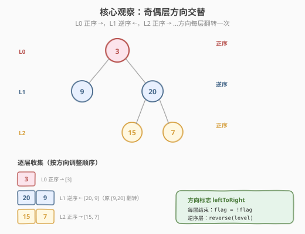
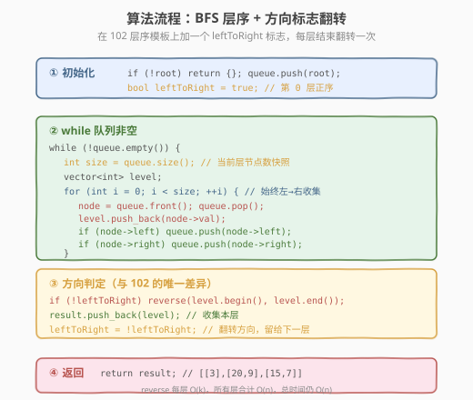
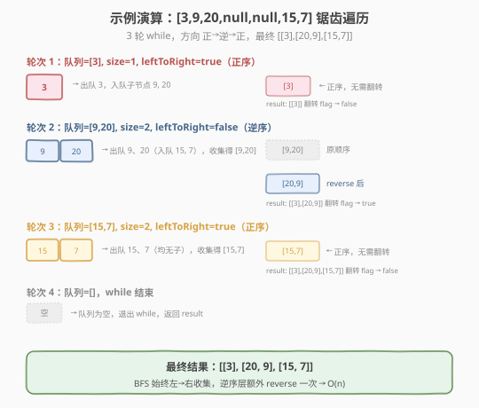

# 二叉树的锯齿形层序遍历

- **题目名称**：二叉树的锯齿形层序遍历
- **链接**：[103. 二叉树的锯齿形层序遍历](https://leetcode.cn/problems/binary-tree-zigzag-level-order-traversal/)
- **难度**：中等
- **标签**：树、二叉树、广度优先搜索（BFS）

## 1. 题目概述

给定二叉树的根节点 `root`，返回其节点值的**锯齿形层序遍历**结果。即先从左到右，再从右到左交替地逐层访问，最后把每一层组成一个子列表。

**示例 1**：

```text
输入：root = [3,9,20,null,null,15,7]
          3
         / \
        9  20
          /  \
         15   7
输出：[[3],[20,9],[15,7]]
```

**示例 2**：

```text
输入：root = [1]
输出：[[1]]
```

**示例 3**：

```text
输入：root = []
输出：[]
```

**约束条件**：

- 树中节点数目在范围 `[0, 2000]` 内
- `-100 <= Node.val <= 100`

> 💡 这是 [102. 二叉树的层序遍历](102_二叉树的层序遍历.md) 的「换皮」题——BFS 队列骨架完全照搬，只在每层收集结果时多了一个**方向标志**。面试中它常作为「你会不会层序遍历」的追问，用来考察你能否在不破坏 BFS 模板的前提下做最小改动。一句话：**层序遍历会了，本题就是加一行 `reverse`**。

---

## 2. 解题思路

### 2.1 暴力思路：DFS 记录层数后翻转

用 DFS 递归，传入层数 `depth`，把节点值存入 `result[depth]`，最后对偶数下标（或奇数层）的子列表逐个 `reverse`。

```text
dfs(node, depth):
    if node == null: return
    result[depth].append(node.val)   // 按层存
    dfs(node.left, depth+1)
    dfs(node.right, depth+1)

// 收集完后：
for i in 1, 3, 5, ...:               // 第 1、3、5… 层翻转
    reverse(result[i])
```

DFS 能得到正确结果，但有两个问题：① 需要「先全部收集，再回头翻转」，两段逻辑分离，容易漏掉层数奇偶的边界；② DFS 天然「深度优先」，不符合「层序」直觉，也不利于迁移到「最短步数」类问题。更自然的方式是沿用 **BFS 队列 + 层分隔** 模板，在每层**当场决定方向**。

> ⚠️ DFS 方案能过本题，但面试官通常期望你直接在 BFS 里处理方向——因为这是「层序遍历家族」的标准解法，能无缝复用 102 的模板，改动最小、最不易错。

### 2.2 核心观察：BFS 队列 + 方向标志翻转

**关键洞察**：BFS 队列始终按「左孩子→右孩子」的顺序入队，所以**每一层天然是「从左到右」收集的**。锯齿形只要求**输出顺序**交替，并不要求**入队顺序**交替。因此最省事的做法是：

1. 照搬 102 的 `while + for(size)` 模板，**照常从左到右收集**每层；
2. 维护一个布尔标志 `leftToRight`，初始为 `true`（第 0 层正序）；
3. 若当前层 `leftToRight == false`，把收集到的 `level` **翻转一次**再存入结果；
4. 每层结束 `leftToRight = !leftToRight`，方向交替。



> 💡 **为什么不改入队顺序，而要 reverse？** 改入队顺序（如逆序层先入右孩子再入左孩子）会让「下一层的入队顺序」和「当前层的输出顺序」耦合在一起，极易出错：当前层倒着出队，子节点入队顺序也会乱，导致再下一层顺序不对。`reverse` 法把「遍历」和「输出方向」彻底解耦——BFS 始终规规矩矩按左到右走，只在最后一步调整输出，逻辑清晰且不会传染到下一层。

### 2.3 算法流程图



**完整步骤**：

1. **特判**：`root == null` 返回空列表
2. **初始化**：队列 `queue = [root]`，结果 `result = []`，方向标志 `leftToRight = true`
3. **while 队列非空**：
   - `size = queue.size()`（当前层节点数快照）
   - `level = []`
   - `for i in 0..size`（**始终从左到右**收集）：
     - `node = queue.pop_front()`
     - `level.append(node.val)`
     - 子节点入队：`if node.left: queue.push_back(node.left)`；`if node.right: queue.push_back(node.right)`
   - **方向判定**：`if not leftToRight: reverse(level)`
   - `result.append(level)`
   - `leftToRight = !leftToRight`
4. 返回 `result`

### 2.4 示例演算

以示例 1 的树 `[3,9,20,null,null,15,7]` 为例：



| 轮次 | 队列初始 | size | leftToRight | 出队收集 | reverse 后 level | result |
|------|---------|------|-------------|----------|------------------|--------|
| 1 | [3] | 1 | true（正序） | [3] | [3]（不翻） | [[3]] |
| 2 | [9, 20] | 2 | false（逆序） | [9, 20] | [20, 9]（翻转） | [[3],[20,9]] |
| 3 | [15, 7] | 2 | true（正序） | [15, 7] | [15, 7]（不翻） | [[3],[20,9],[15,7]] |
| 4 | [] | — | false | 队列空，结束 | — | — |

最终 `result = [[3],[20,9],[15,7]]`。

> 💡 注意第 2 轮：BFS 仍然按 `9 → 20` 的顺序出队收集，得到 `[9, 20]`；只是因为该层 `leftToRight == false`，额外做一次 `reverse` 变成 `[20, 9]`。子节点 `15, 7` 的入队顺序不受影响——它们依然按「20 的左孩子、右孩子」正常入队，留到第 3 轮正序处理。

---

## 3. 参考代码

### C++

```cpp
// 二叉树的锯齿形层序遍历.cpp —— BFS 队列 + 方向标志翻转
// 编译: g++ -O2 -std=c++17 二叉树的锯齿形层序遍历.cpp -o zigzag
#include <vector>
#include <queue>
#include <algorithm>
using namespace std;

struct TreeNode {
    int val;
    TreeNode* left;
    TreeNode* right;
    TreeNode() : val(0), left(nullptr), right(nullptr) {
    }
    TreeNode(int x) : val(x), left(nullptr), right(nullptr) {
    }
    TreeNode(int x, TreeNode* l, TreeNode* r) : val(x), left(l), right(r) {
    }
};

class Solution {
  public:
    vector<vector<int>> zigzagLevelOrder(TreeNode* root) {
        vector<vector<int>> result;
        if (root == nullptr)
            return result; // 特判空树

        queue<TreeNode*> q;
        q.push(root);
        bool leftToRight = true; // 第 0 层正序

        while (!q.empty()) {
            int size = q.size(); // ① 当前层节点数快照
            vector<int> level;
            for (int i = 0; i < size; ++i) { // ② 始终从左到右收集
                TreeNode* node = q.front();
                q.pop();
                level.push_back(node->val);
                if (node->left)
                    q.push(node->left); // ③ 子节点正常入队
                if (node->right)
                    q.push(node->right);
            }
            if (!leftToRight) // ④ 逆序层翻转输出
                reverse(level.begin(), level.end());
            result.push_back(level);
            leftToRight = !leftToRight; // ⑤ 方向交替
        }
        return result;
    }
};
```

### Python

```python
from collections import deque

class Solution:
    def zigzagLevelOrder(self, root: TreeNode | None) -> list[list[int]]:
        result = []
        if not root:
            return result

        queue = deque([root])
        left_to_right = True          # 第 0 层正序

        while queue:
            size = len(queue)         # 当前层节点数
            level = []
            for _ in range(size):     # 始终从左到右收集
                node = queue.popleft()
                level.append(node.val)
                if node.left:
                    queue.append(node.left)
                if node.right:
                    queue.append(node.right)
            if not left_to_right:     # 逆序层翻转
                level.reverse()
            result.append(level)
            left_to_right = not left_to_right   # 方向交替
        return result
```

> 💡 Python 用 `level.reverse()` 原地翻转（`O(k)`），比 `level[::-1]` 创建新列表更省内存。也可写 `result.append(level[::-1])` 一行替代 if，但可读性略差。

---

## 4. 复杂度分析

| 维度 | 复杂度 | 说明 |
|------|--------|------|
| **时间复杂度** | `O(n)` | 每个节点入队/出队 1 次；每层 `reverse` 是 `O(k)`，所有层翻转合计 `O(n)`，总计仍 `O(n)` |
| **空间复杂度** | `O(n)` | 队列最多存一层节点（满二叉树最后一层 `n/2` 个）；结果数组存全部 `n` 个值 |

> ⚠️ 有人担心 `reverse` 会把复杂度变成 `O(n²)`——不会。`reverse` 只翻转**当前层**的 `k` 个元素，所有层的 `k` 加起来等于 `n`，所以翻转总开销是 `O(n)`，与 BFS 本身的 `O(n)` 同阶。

---

## 5. 扩展：双端队列法（避免 reverse）

`reverse` 法最直观，但若面试官追问「能否做到每层 `O(k)` 且不用 reverse」——可以用**双端队列**控制插入位置：

```python
from collections import deque

class Solution:
    def zigzagLevelOrder(self, root):
        result = []
        if not root:
            return result
        q = deque([root])
        left_to_right = True
        while q:
            size = len(q)
            level = deque()
            for _ in range(size):
                node = q.popleft()
                if left_to_right:
                    level.append(node.val)        # 正序：尾插
                else:
                    level.appendleft(node.val)    # 逆序：头插
                if node.left:
                    q.append(node.left)
                if node.right:
                    q.append(node.right)
            result.append(list(level))
            left_to_right = not left_to_right
        return result
```

> ⚠️ **注意一个常见陷阱**：有人想「逆序层就把子节点也反过来入队」来省掉 reverse，这会让**下一层的顺序被当前层输出方向污染**——例如逆序层先入右孩子再入左孩子，结果再下一层的正序收集就错了。**入队顺序必须始终「左孩子→右孩子」**，方向只作用于「本层输出」，不能传染到入队。这是双端队列法和 reverse 法共同的安全前提。

---

## 6. 面试要点

1. **本题和 102 层序遍历的区别是什么？**

   - 唯一区别：**输出方向逐层交替**。102 每层都从左到右；103 第 0、2、4… 层正序，第 1、3、5… 层逆序。
   - 代码层面：在 102 的 `while + for(size)` 模板基础上，加一个 `leftToRight` 标志和一行 `if (!leftToRight) reverse(level)`，每层结束翻转标志即可。BFS 骨架、入队顺序、`size` 快照全部不变。

2. **为什么入队顺序不能跟着方向变？**

   - 入队顺序决定的是**下一层**在队列里的排列。若逆序层把子节点也反向入队，下一层的「正序收集」就会拿到错误顺序——输出方向会「传染」。
   - 正确做法：**入队始终左孩子→右孩子**，方向只作用于「本层收集完毕后的输出调整」。把「遍历」和「输出」解耦，才不会出错。

3. **reverse 会不会让时间复杂度变 O(n²)？**

   - 不会。`reverse` 只翻转当前层的 `k` 个元素，所有层的 `k` 之和等于节点总数 `n`，故翻转总开销 `O(n)`，与 BFS 同阶，整体仍是 `O(n)`。

4. **不用 reverse 怎么做？**

   - 用**双端队列**：正序层 `level.append(val)`（尾插），逆序层 `level.appendleft(val)`（头插），最后转成 `list`。每个操作 `O(1)`，单层 `O(k)`，总计 `O(n)`，且省去显式翻转。
   - 注意头插/尾插只改变**本层输出**，子节点仍按「左→右」正常入队。

5. **如果要求自底向上的锯齿遍历（103 + 107 的结合）怎么做？**

   - 先按 103 得到正序的锯齿结果 `result`，最后 `result.reverse()` 整体翻转一次即可（107 的做法）。
   - 不要试图在 BFS 过程中同时处理「自底向上」和「方向交替」——分层关注点更清晰：BFS 负责按层收集 + 方向调整，最后一步整体反转负责「自底向上」。

> 💡 **一句话总结**：103 是 102 层序遍历的「最小增量」变体——BFS 队列骨架纹丝不动，只多一个方向标志和一行 `reverse`。核心心法是**把「遍历」和「输出方向」解耦**：入队永远按左→右，方向只在本层收集完后调整输出。掌握这一点，所有「层序遍历家族」（102/103/107/199）都能用同一套模板秒杀。

---

## 7. 同类练习题

- [102. 二叉树的层序遍历](https://leetcode.cn/problems/binary-tree-level-order-traversal/)（[题解](102_二叉树的层序遍历.md)）：本题的母模板，`while + for(size)` 骨架的来源
- [107. 二叉树的层序遍历 II](https://leetcode.cn/problems/binary-tree-level-order-traversal-ii/)：自底向上层序，最后整体 `reverse(result)` 即可
- [199. 二叉树的右视图](https://leetcode.cn/problems/binary-tree-right-side-view/)：每层只取最右节点，复用同一 BFS 骨架
- [429. N 叉树的层序遍历](https://leetcode.cn/problems/n-ary-tree-level-order-traversal/)：子节点入队改成遍历 `node.children`，模板同样适用
