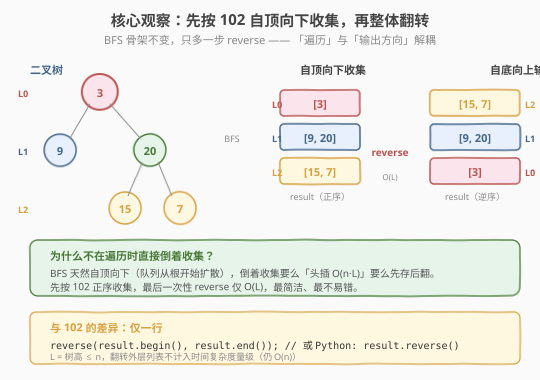
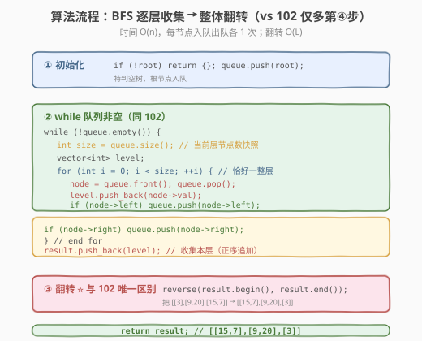
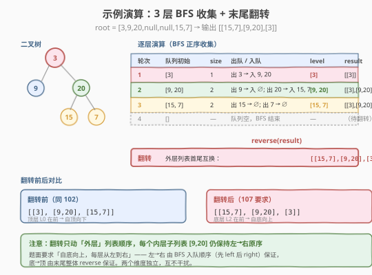

# LeetCode 二叉树的层序遍历II 题解

## 1. 题目概述

- **标题 / 题号**：二叉树的层序遍历 II（#107，medium）
- **链接**：https://leetcode.cn/problems/binary-tree-level-order-traversal-ii/
- **难度**：中等
- **标签**：树、二叉树、广度优先搜索（BFS）

**题意**：给定二叉树的根节点 `root`，返回其节点值的**自底向上的层序遍历**。即按从叶子节点所在层到根节点所在层逐层遍历，每层**从左到右**访问，将同一层的节点值组成一个子列表。

**示例 1**：

```text
输入：root = [3,9,20,null,null,15,7]
          3
         / \
        9  20
          /  \
         15   7
输出：[[15,7],[9,20],[3]]
解释：自底向上：先底层 [15,7]，再中层 [9,20]，最后顶层 [3]。
```

**示例 2**：

```text
输入：root = [1]
输出：[[1]]
```

**示例 3**：

```text
输入：root = []
输出：[]
```

**约束**：

- 树中节点数目在范围 `[0, 2000]` 内
- `-1000 <= Node.val <= 1000`

> 💡 这是 [102. 二叉树的层序遍历](102_二叉树的层序遍历.md) 的「镜像版」——102 自顶向下，107 自底向上。BFS 队列天然从根开始扩散（自顶向下），无法直接倒着遍历。所以 107 的标准解法是：**先按 102 正序收集，最后把外层结果整体翻转一次**。这行 `reverse` 就是 107 与 102 的全部差异。掌握 102，107 几乎是「加一行」的事。

## 2. 解题思路

### 2.1 暴力思路：DFS 记录层数后逆序

用 DFS 递归遍历，传入当前层数 `depth`，把节点值存入 `result[depth]`，最后翻转 `result`。

```text
dfs(node, depth):
    if node == null: return
    result[depth].append(node.val)
    dfs(node.left, depth+1)
    dfs(node.right, depth+1)
// 最后 reverse(result)
```

DFS 能得到正确结果，但有两个问题：① 需要额外维护 `depth` 参数；② 同一层节点的访问顺序不连续（先走左子树到底再回来），不符合「层序」直觉。更自然的方式仍是 **BFS 队列**。

> ⚠️ 无论 DFS 还是 BFS，最后都得做一次翻转——因为任何遍历都只能从根开始（根是唯一入口），无法真正「先访问叶子」。所以核心不在「如何倒着遍历」，而在「正序收集 + 末尾翻转」。

### 2.2 核心观察：BFS 正序收集 + 末尾翻转

BFS 队列从根开始，逐层向下扩散——这是遍历的天然方向，无法逆转。但**遍历方向**和**输出方向**可以解耦：

- **遍历方向**：BFS 自顶向下（队列保证）。
- **输出方向**：自底向上（末尾翻转 `result` 保证）。



**两种实现翻转的方式**：

| 方式 | 写法 | 复杂度 | 评价 |
|------|------|--------|------|
| **末尾整体翻转** | `reverse(result.begin(), result.end())` | `O(L)`（L = 层数） | ✅ 推荐：简洁、一次成型 |
| **头插法** | 每层 `result.insert(result.begin(), level)` | `O(L²)`（每次头插搬移元素） | ⚠️ 不推荐：常数大，Python `list.insert(0, x)` 同理 |

> 💡 **为什么头插法慢？** C++ `vector::insert(begin, ...)` 需要把已有元素全部后移，第 `i` 层插入花 `O(i)`，总共 `O(L²)`。若想头插高效，Python 可用 `collections.deque` 的 `appendleft`（`O(1)`），C++ 可用 `deque` 的 `push_front`（`O(1)`），最后转 `vector`/`list`。但既然末尾翻转只需 `O(L)`，远比折腾双端队列简单。

> ⚠️ **翻转只动外层顺序**：`reverse` 翻转的是「层与层之间」的顺序，每个内层子列表 `[9, 20]` 仍保持左→右的原序。题面要求每层「从左到右」——这由 BFS 入队顺序（先 `left` 后 `right`）保证，与翻转无关。两个维度独立，互不干扰。

### 2.3 算法流程图



**完整步骤**：

1. **特判**：`root == null` 返回空列表
2. **初始化**：队列 `queue = [root]`，结果 `result = []`
3. **while 队列非空**（与 102 完全一致）：
   - `size = queue.size()`（当前层节点数快照）
   - `level = []`
   - `for i in 0..size`：
     - `node = queue.pop_front()`
     - `level.append(node.val)`
     - 子节点入队：`if node.left: queue.push_back(node.left)`；`if node.right: queue.push_back(node.right)`
   - `result.append(level)`（正序追加到末尾）
4. **翻转** ⭐：`reverse(result.begin(), result.end())`（107 与 102 的唯一区别）
5. 返回 `result`

### 2.4 示例演算

以示例 1 的树 `[3,9,20,null,null,15,7]` 为例：



| 轮次 | 队列初始 | size | 出队 / 入队 | level | result（正序） |
|------|---------|------|------------|-------|----------------|
| 1 | [3] | 1 | 出 3 → 入 9, 20 | [3] | [[3]] |
| 2 | [9, 20] | 2 | 出 9 → ∅；出 20 → 入 15, 7 | [9, 20] | [[3],[9,20]] |
| 3 | [15, 7] | 2 | 出 15 → ∅；出 7 → ∅ | [15, 7] | [[3],[9,20],[15,7]] |
| 4 | [] | — | 队列空，BFS 结束 | — | — |

**翻转后**：`[[3],[9,20],[15,7]]` → `[[15,7],[9,20],[3]]`，即为最终输出。

> 💡 注意第 2 轮：队列里有 `[9, 20]`，`size=2`。先出 9（无子），再出 20（入队 15、7）。for 循环只跑 2 次（`size=2`），15 和 7 不会被本轮处理——它们留到第 3 轮。这正是 102 里 `size` 快照的「层边界锁定」作用，107 完全继承。

## 3. 参考代码

### C++

```cpp
// 二叉树的层序遍历 II.cpp —— BFS 正序收集 + 末尾翻转
// 编译: g++ -O2 -std=c++17 二叉树的层序遍历\ II.cpp -o levelorder2
#include <vector>
#include <queue>
#include <algorithm>
using namespace std;

struct TreeNode {
    int val;
    TreeNode* left;
    TreeNode* right;
    TreeNode() : val(0), left(nullptr), right(nullptr) {
    }
    TreeNode(int x) : val(x), left(nullptr), right(nullptr) {
    }
    TreeNode(int x, TreeNode* l, TreeNode* r) : val(x), left(l), right(r) {
    }
};

class Solution {
  public:
    vector<vector<int>> levelOrderBottom(TreeNode* root) {
        vector<vector<int>> result;
        if (root == nullptr)
            return result; // 特判空树

        queue<TreeNode*> q;
        q.push(root);

        while (!q.empty()) {
            int size = q.size(); // ① 当前层节点数快照
            vector<int> level;
            for (int i = 0; i < size; ++i) { // ② 恰好处理一整层
                TreeNode* node = q.front();
                q.pop();
                level.push_back(node->val);
                if (node->left)
                    q.push(node->left); // ③ 子节点入队（下一层）
                if (node->right)
                    q.push(node->right);
            }
            result.push_back(level); // ④ 正序追加本层
        }

        reverse(result.begin(), result.end()); // ⑤ 翻转：与 102 唯一区别
        return result;
    }
};
```

**头插法变体（`deque` 高效版）**：

```cpp
#include <deque>
class Solution {
  public:
    vector<vector<int>> levelOrderBottom(TreeNode* root) {
        deque<vector<int>> dq; // 双端队列，头插 O(1)
        if (!root) return {};
        queue<TreeNode*> q;
        q.push(root);
        while (!q.empty()) {
            int size = q.size();
            vector<int> level;
            for (int i = 0; i < size; ++i) {
                TreeNode* node = q.front(); q.pop();
                level.push_back(node->val);
                if (node->left)  q.push(node->left);
                if (node->right) q.push(node->right);
            }
            dq.push_front(level); // 头插，省去末尾 reverse
        }
        return vector<vector<int>>(dq.begin(), dq.end());
    }
};
```

### Python

```python
from collections import deque

class Solution:
    def levelOrderBottom(self, root: TreeNode | None) -> list[list[int]]:
        result = []
        if not root:
            return result

        queue = deque([root])          # deque 比 list 做 queue 更高效

        while queue:
            size = len(queue)          # 当前层节点数
            level = []
            for _ in range(size):      # 恰好处理一整层
                node = queue.popleft() # O(1) 出队
                level.append(node.val)
                if node.left:
                    queue.append(node.left)
                if node.right:
                    queue.append(node.right)
            result.append(level)

        result.reverse()               # ⑤ 翻转：与 102 唯一区别（原地 O(L)）
        return result
```

**Python `deque` 头插版（省去 `reverse`）**：

```python
from collections import deque

class Solution:
    def levelOrderBottom(self, root: TreeNode | None) -> list[list[int]]:
        dq = deque()                   # 双端队列，appendleft O(1)
        if not root:
            return []
        queue = deque([root])
        while queue:
            size = len(queue)
            level = []
            for _ in range(size):
                node = queue.popleft()
                level.append(node.val)
                if node.left:
                    queue.append(node.left)
                if node.right:
                    queue.append(node.right)
            dq.appendleft(level)       # 头插，省去末尾 reverse
        return list(dq)                # deque → list
```

> 💡 **`result.reverse()` vs `result[::-1]`**：前者**原地**翻转、返回 `None`、空间 `O(1)`；后者创建新列表、空间 `O(n)`。本题两种都能过，但原地 `reverse()` 更省空间，面试时优先选。

## 4. 复杂度分析

| 维度 | 复杂度 | 说明 |
|------|--------|------|
| **时间复杂度** | `O(n)` | BFS 每个节点入队/出队 1 次 `O(n)`；末尾 `reverse` 仅翻外层 `O(L) ≤ O(n)` |
| **空间复杂度** | `O(n)` | 队列最多存一层节点（满二叉树末层 `n/2`）；结果列表存全部 `n` 个值 |

> ⚠️ **翻转的 `O(L)` 不改变整体量级**：`L` 是树高，`L ≤ n`（退化为链表时 `L = n`，平衡时 `L = log n`）。无论哪种，`O(n) + O(L) = O(n)`，与 102 的时间复杂度相同。翻转是「免费」的一步。

> ⚠️ **空间复杂度的 `O(n)` 有两部分**：① BFS 队列 `O(n)`（满二叉树末层 `n/2`）；② 结果列表 `O(n)`（存所有节点值）。两者都是不可避免的开销——队列是 BFS 固有，结果是题目要求返回。

## 5. 扩展：层序遍历家族的「最小增量」改法

107 是层序遍历家族的一员，所有成员都共享 102 的 BFS 骨架，差异只在「输出阶段」的一两行：

| 题目 | 输出要求 | 与 102 的差异 | 改动点 |
|------|---------|--------------|--------|
| 102 层序遍历 | 自顶向下，每层左→右 | — | 母题 |
| **107 层序遍历 II** | **自底向上，每层左→右** | **整体翻转** | **末尾 `reverse(result)`** |
| 103 锯齿形层序 | 之字形，奇正偶反 | 每层方向交替 | 偶数层 `reverse(level)` 或双端队列 |
| 199 二叉树右视图 | 每层最右节点 | 只取最右 | 每层 for 最后记录的 `node.val` |
| 429 N 叉树层序 | N 叉树 | 子节点入队改 `for child` | `node->children` 遍历 |

> 💡 **核心心法：遍历与输出解耦**。BFS 队列永远按「根→下层、左→右」收集，这是遍历的天然方向；输出阶段再按题意调整——翻转（107）、反向（103）、取最右（199）。把「怎么遍历」和「怎么输出」分开想，所有变体都是 102 加一行。

**103 + 107 的结合**：若要求「自底向上的锯齿遍历」，先按 103 得到正序锯齿结果，最后 `result.reverse()` 整体翻转一次即可——两个调整叠加，互不冲突。

## 6. 面试要点

1. **107 和 102 的区别是什么？为什么要翻转而不是直接倒着遍历？**

   - 102 自顶向下输出，107 自底向上输出。
   - BFS 队列从根开始扩散，**根是树的唯一入口**，无法真正「先访问叶子」。任何遍历都得从根出发，所以只能正序收集后翻转。
   - 翻转只动外层列表顺序，`O(L)`，是「免费」的一步。

2. **翻转用 `reverse` 还是头插法？哪个更好？**

   - 推荐末尾 `reverse(result)`：一次成型，`O(L)`，代码最简洁。
   - 头插法 `result.insert(begin, level)` 在 `vector`/`list` 上是 `O(L²)`（每次后移元素），不推荐。
   - 若想头插高效，用 `deque` 的 `push_front`/`appendleft`（`O(1)`），但多一次类型转换，不如直接 `reverse` 简单。

3. **翻转后每层的左右顺序会变吗？**

   - 不会。`reverse` 只翻外层（层与层之间），内层子列表 `[9, 20]` 仍是左→右原序。
   - 题面要求每层「从左到右」——由 BFS 入队顺序（先 `left` 后 `right`）保证，与翻转无关。两个维度独立。

4. **BFS 的 `size = queue.size()` 这行为什么不能省？**

   - for 循环体里会 `push` 子节点，队列长度动态变化。若不固定 `size`，for 会跨层处理，把下一层节点混入当前层。
   - `size` 是「当前层节点数快照」，锁定本层边界。这是 102/107/103/199 全家共享的关键技巧。

5. **时间复杂度为什么还是 `O(n)`？翻转不是 `O(n)` 吗？**

   - BFS 主体 `O(n)`（每节点入队出队各 1 次）。
   - 翻转只翻外层列表（`L` 个元素，`L` = 层数），`O(L) ≤ O(n)`。
   - 总时间 `O(n) + O(L) = O(n)`，与 102 相同。翻转不改变量级。

> 💡 **一句话总结**：107 是 102 的「最小增量」变体——BFS 队列骨架纹丝不动，只末尾多一行 `reverse(result)`。核心心法是**把「遍历方向」与「输出方向」解耦**：BFS 永远自顶向下收集，输出阶段再按题意翻转。掌握这一点，整个层序遍历家族（102/103/107/199）都是同一套模板加一两行调整。

## 同类练习题

| # | 题目 | 与本题的关联 |
|---|------|-------------|
| 102 | [二叉树的层序遍历](https://leetcode.cn/problems/binary-tree-level-order-traversal/)（[题解](102_二叉树的层序遍历.md)） | 107 的母题，自顶向下 BFS |
| 103 | [二叉树的锯齿形层序遍历](https://leetcode.cn/problems/binary-tree-zigzag-level-order-traversal/)（[题解](103_二叉树的锯齿形层序遍历.md)） | BFS + 偶数层反向，与 107 的翻转叠加可得「自底向上锯齿」 |
| 199 | [二叉树右视图](https://leetcode.cn/problems/binary-tree-right-side-view/) | BFS 取每层最右节点，同一套 `size` 快照模板 |
| 429 | [N 叉树的层序遍历](https://leetcode.cn/problems/n-ary-tree-level-order-traversal/) | 二叉树 → N 叉树，子节点入队改成遍历 `children` |
| 637 | [二叉树的层平均值](https://leetcode.cn/problems/average-of-levels-in-binary-tree/) | 同一套 BFS 模板，每层求均值而非收集列表 |
