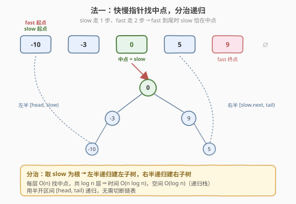
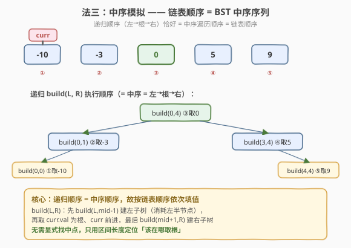
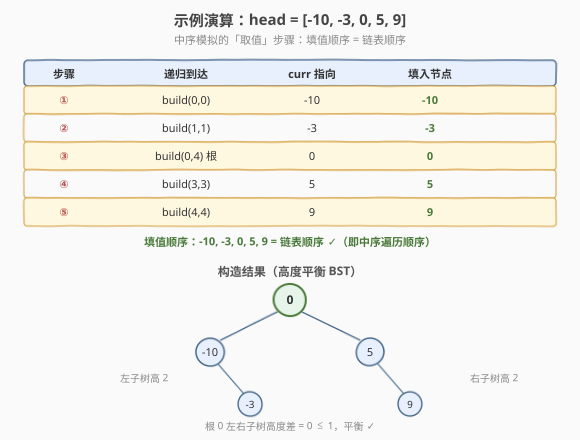

# LeetCode 有序链表转换二叉搜索树 题解

## 1. 题目概述

- **标题 / 题号**：有序链表转换二叉搜索树（#109，medium）
- **链接**：https://leetcode.cn/problems/convert-sorted-list-to-binary-search-tree/
- **难度**：中等
- **标签**：树、BST、链表、分治、快慢指针

**题意**：给定一个**升序排列**的单链表头节点 `head`，请将其转换为一棵**高度平衡**的二叉搜索树（BST）。高度平衡是指每个节点的左右两个子树的高度差不超过 1。

本题是 [108. 将有序数组转换为二叉搜索树](./108_将有序数组转换为二叉搜索树.md) 的链表版：数据结构从「支持 O(1) 随机访问的数组」换成了「只能顺序访问的单链表」，因此无法直接 `nums[mid]` 取中点，需要新的策略。

**示例 1**：

```text
输入：head = [-10,-3,0,5,9]
输出：[0,-3,9,-10,null,5] 或 [0,-10,5,null,-3,null,9] 等
解释：任意一种高度平衡 BST 均可
```

**示例 2**：

```text
输入：head = []
输出：[]
```

**约束**：

- 链表中节点数目范围 `[0, 2 * 10^4]`
- `-10^5 <= Node.val <= 10^5`
- `head` 按 **严格升序** 排列

> 💡 本题核心矛盾：BST 平衡构造需要「取中点为根」，但单链表取中点是 `O(n)`。围绕这一点有三档解法——朴素快慢指针分治 `O(n log n)`、转数组 `O(n)` 空间换时间、中序模拟 `O(n)` 时间 `O(log n)` 空间。掌握第三种，就理解了「利用中序遍历顺序天然有序」这一深层性质。

## 2. 解题思路

### 2.1 朴素思路：快慢指针取中点 + 分治

最直观的做法是照搬 108 的分治框架，只是把「`nums[mid]` 取中点」换成「快慢指针找中点」：

- `slow` 走 1 步、`fast` 走 2 步，`fast` 到尾时 `slow` 恰在中点；
- 以 `slow` 为根，对左半 `[head, slow)` 与右半 `[slow->next, tail)` 递归构造。



问题在于**找中点本身是 `O(n)`**，而递归共有 `O(log n)` 层（平衡树高度），每层都要对相应区间重新走一遍链表找中点，总时间 `O(n log n)`。对于 `n = 2×10^4`，约 `3×10^5` 次操作，能过但非最优。

> ⚠️ 关键浪费：同一批节点在不同层被反复遍历。根层找中点走过 `n` 个节点，第二层两个子区间各找中点又共走 `n` 个节点……每层都 `O(n)`，共 `log n` 层。

### 2.2 改进思路：先转数组，再套用 108

既然链表取中点慢，干脆**一次性把链表转成数组**，再直接调用 108 的分治方法：

```text
1. 遍历链表，把每个值 push 到 vector<int> nums；    O(n)
2. 调用 108 的 build(nums, 0, n-1) 分治构造；         O(n)
```

时间 `O(n)`，但额外开了 `O(n)` 数组空间。代码极简（几乎复用 108），是面试中「快速 AC」的稳妥选择。但若面试官追问「能否 `O(1)` 额外空间（不计递归栈）」，就需要下一节的中序模拟。

### 2.3 核心观察：中序模拟 —— O(n) 时间 O(log n) 空间



最优解依赖一个关键性质：

> **BST 的中序遍历是升序的，而链表本身也是升序的——所以链表顺序就是目标 BST 的中序序列。**

这意味着我们**根本不需要显式找中点**。只要让递归的执行顺序**恰好等于中序顺序**（先左子树 → 根 → 再右子树），并在「访问根」的瞬间从链表头部顺次取值即可。具体地：

1. 先遍历一次链表得到节点数 `n`；
2. 维护一个全局指针 `curr`，初始指向 `head`；
3. 递归 `build(L, R)`：
   - 取 `mid = (L+R)/2`（仅用于**决定左子树大小**，不用于随机访问）；
   - **先** `build(L, mid-1)` 递归左子树——这会消耗掉前 `mid-L` 个链表节点；
   - **再**取 `curr->val` 建根节点，`curr = curr->next` 前进一步；
   - **最后** `build(mid+1, R)` 递归右子树，消耗剩余节点。

> 💡 为什么可行？因为 `mid` 只决定「左子树放几个节点、根排第几、右子树放几个节点」，而中序遍历的取值顺序天然与链表顺序一致。我们用区间的**长度**信息定位「该在哪取根」，却不必真正去「第 `mid` 个位置」读值——值会由 `curr` 按序送上门来。

> ⚠️ 顺序不能错：必须**先递归左子树**（消耗左半节点），**再取根**，**再递归右子树**。若先取根再递归左，`curr` 就会取到错误位置的值，构造出的不再是 BST。

### 2.4 算法流程图

**中序模拟 `build(L, R)` 完整步骤**：

1. **基线**：`L > R` 返回 `nullptr`（空子树）。
2. **算中点**：`mid = (L + R) / 2`（仅定左子树大小）。
3. **建空根**：`root = new TreeNode()`（值暂留空，待左子树建完再填）。
4. **递归左**：`root->left = build(L, mid-1)`——消耗前 `mid-L` 个节点。
5. **填根值**：`root->val = curr->val; curr = curr->next;`——取当前链表节点为根。
6. **递归右**：`root->right = build(mid+1, R)`——消耗剩余节点。
7. **返回** `root`。

> 💡 第 3 步先建一个「空壳」节点很关键：节点对象必须先存在，才能挂上左子树；而它的 `val` 要等到左子树递归回来、`curr` 走到正确位置后才能填。这正是「递归顺序 ≠ 填值顺序」的精髓。

### 2.5 示例演算



以 `head = [-10,-3,0,5,9]`（`n = 5`）为例，中序模拟的「取值」步骤如下：

| 步骤 | 递归到达 | curr 指向 | 填入节点 |
|------|----------|-----------|----------|
| ① | `build(0,0)` | -10 | -10 |
| ② | `build(1,1)` | -3 | -3 |
| ③ | `build(0,4)` 根 | 0 | 0 |
| ④ | `build(3,3)` | 5 | 5 |
| ⑤ | `build(4,4)` | 9 | 9 |

填值顺序 `-10, -3, 0, 5, 9` **恰好等于链表顺序**，也即中序遍历顺序。最终树形（取下中点 `mid = (L+R)/2`）：

```text
        0
       / \
     -10   5
       \    \
       -3    9
```

根 `0` 的左右子树高度均为 2，差为 0；各子树内部高度差也不超过 1，满足平衡。

> 💡 树形取决于中点选取：取下中点 `mid=(L+R)/2` 与取上中点 `mid=(L+R+1)/2` 会得到不同形状的平衡 BST（如 108 示例表用上中点，得到 `0` 的左子 `-3`、右子 `9`）。**答案不唯一**，LeetCode 接受任意合法平衡 BST。

## 3. 参考代码

### C++

#### 法三：中序模拟（最优，推荐）

```cpp
/**
 * Definition for singly-linked list.
 * struct ListNode { int val; ListNode *next; };
 * Definition for a binary tree node.
 * struct TreeNode { int val; TreeNode *left; TreeNode *right;
 *                  TreeNode() : val(0), left(nullptr), right(nullptr) {}
 *                  TreeNode(int x) : val(x), left(nullptr), right(nullptr) {} };
 */
class Solution {
    ListNode* curr;                 // 全局游标：沿链表顺序前进
  public:
    TreeNode* sortedListToBST(ListNode* head) {
        int n = 0;
        for (ListNode* p = head; p; p = p->next) n++;
        curr = head;
        return build(0, n - 1);
    }

  private:
    TreeNode* build(int L, int R) {
        if (L > R) return nullptr;
        int mid = L + (R - L) / 2;          // 仅决定左子树大小
        TreeNode* root = new TreeNode();    // 空壳节点，val 待填
        root->left  = build(L, mid - 1);    // 1. 先递归左子树（消耗前 mid-L 个节点）
        root->val   = curr->val;            // 2. 取当前链表节点为根
        curr        = curr->next;           //    游标前进
        root->right = build(mid + 1, R);    // 3. 再递归右子树
        return root;
    }
};
```

#### 法二：转数组 + 套用 108（最简）

```cpp
class Solution {
  public:
    TreeNode* sortedListToBST(ListNode* head) {
        vector<int> nums;
        for (ListNode* p = head; p; p = p->next) nums.push_back(p->val);
        return build(nums, 0, (int)nums.size() - 1);
    }

  private:
    TreeNode* build(vector<int>& nums, int L, int R) {
        if (L > R) return nullptr;
        int mid = L + (R - L) / 2;
        TreeNode* root = new TreeNode(nums[mid]);
        root->left  = build(nums, L, mid - 1);
        root->right = build(nums, mid + 1, R);
        return root;
    }
};
```

#### 法一：快慢指针分治（半开区间，无需切断链表）

```cpp
class Solution {
  public:
    TreeNode* sortedListToBST(ListNode* head) {
        return build(head, nullptr);        // 半开区间 [head, tail)
    }

  private:
    TreeNode* build(ListNode* head, ListNode* tail) {
        if (head == tail) return nullptr;
        ListNode *slow = head, *fast = head;
        while (fast != tail && fast->next != tail) {
            slow = slow->next;
            fast = fast->next->next;        // fast 走 2 步
        }
        TreeNode* root = new TreeNode(slow->val);
        root->left  = build(head, slow);    // 左半 [head, slow)
        root->right = build(slow->next, tail); // 右半 [slow->next, tail)
        return root;
    }
};
```

> 💡 法一用**半开区间 `[head, tail)`** 递归，以 `slow` 作为左子区间的右边界、`slow->next` 作为右子区间的左边界，**无需切断链表**即可分治，比常见的「切断链表」写法更简洁。

### Python

#### 法三：中序模拟（最优，推荐）

```python
class Solution:
    def sortedListToBST(self, head: Optional[ListNode]) -> Optional[TreeNode]:
        n = 0
        p = head
        while p:
            n += 1
            p = p.next
        self.curr = head                   # 全局游标

        def build(L: int, R: int) -> Optional[TreeNode]:
            if L > R:
                return None
            mid = (L + R) // 2             # 仅决定左子树大小
            root = TreeNode()              # 空壳节点，val 待填
            root.left = build(L, mid - 1)  # 1. 先递归左子树
            root.val = self.curr.val       # 2. 取当前链表节点为根
            self.curr = self.curr.next     #    游标前进
            root.right = build(mid + 1, R) # 3. 再递归右子树
            return root

        return build(0, n - 1)
```

> 💡 Python 用 `self.curr` 作为闭包可写的全局游标（若用普通局部变量，内层 `build` 无法对其 `rebind`）。也可把 `curr` 包成 `[head]` 单元素列表，靠可变对象传引用。

## 4. 复杂度分析

| 解法 | 时间复杂度 | 空间复杂度 | 说明 |
|------|-----------|-----------|------|
| 法一 快慢指针分治 | $O(n \log n)$ | $O(\log n)$ | 每层 `O(n)` 找中点，共 `log n` 层；递归栈 `O(log n)` |
| 法二 转数组 + 108 | $O(n)$ | $O(n)$ | 一次遍历转数组 + 分治；额外数组占 `O(n)` |
| 法三 中序模拟 | $O(n)$ | $O(\log n)$ | 每个节点访问一次；仅递归栈 `O(log n)`，无额外结构 |

> ⚠️ 法三的 $O(\log n)$ 空间前提是**构造出的树平衡**（递归深度 = 平衡树高度）。由于 `mid` 总取区间中点，构造的树必然平衡，递归深度严格 $O(\log n)$，不会退化。法三在时间与空间上**同时达到下界**，是最优解。

## 5. 扩展：与 108 的对比

| 维度 | 108（数组） | 109（链表） |
|------|------------|------------|
| 数据结构 | 支持随机访问 | 仅顺序访问 |
| 取中点 | `nums[mid]`，$O(1)$ | 快慢指针，$O(n)$ |
| 最优解 | 分治取中点 $O(n)$ / $O(\log n)$ | 中序模拟 $O(n)$ / $O(\log n)$ |
| 核心性质 | 数组升序 = BST 中序 | 链表升序 = BST 中序 |

两题共享同一个深层性质：**升序序列即 BST 的中序序列**。108 靠随机访问直接取中点为根；109 因链表无法随机访问，转而**按中序顺序填值**——把「找中点」的负担转化为「按序消费」，用递归结构本身保证平衡。

> 💡 同一思想可推广到 [1382. 将二叉搜索树变平衡](https://leetcode.cn/problems/balance-a-binary-search-tree/)：先中序遍历得到有序数组，再用 108 的方法重建平衡 BST。中序遍历是「把任意 BST 投影回有序序列」的通用桥梁。

## 6. 面试要点

1. **为什么中序模拟不需要显式找中点？**

   - BST 的中序遍历是升序的，链表也是升序的，二者顺序一致。递归 `build(L, R)` 按「左→根→右」执行，恰好是中序顺序；只需在「访问根」时从链表头部顺次取值。`mid = (L+R)/2` 只决定左子树**放几个节点**（即递归几次再取根），并不用于随机访问，因此无需 `O(n)` 走链表找中点。

2. **法一快慢指针分治为什么是 $O(n \log n)$ 而不是 $O(n)$？**

   - 每层递归都要对相应区间用快慢指针走一遍找中点，单层 $O(n)$。平衡树有 $\log n$ 层，每层独立扫描，总计 $n + n + \dots = O(n \log n)$。根因是「同一批节点在不同层被反复遍历」。法三通过把找中点替换为「按序消费」消除了这种重复。

3. **法三里 `root = new TreeNode()` 先建空节点、后填 `val`，为什么不能直接 `new TreeNode(curr->val)`？**

   - 因为取 `curr->val` 的时机必须**在左子树递归返回之后**——左子树递归会消耗掉前 `mid-L` 个节点，使 `curr` 走到正确的根位置。若在递归左子树之前就 `new TreeNode(curr->val)`，取到的是区间第一个节点而非中点，构造出的不再是平衡 BST。先建空壳、再填值，正是为了把「节点存在」与「填值时机」解耦。

4. **三种解法面试时该写哪个？**

   - 先说法一（快慢指针分治）展示思路，再指出其 $O(n \log n)$ 的浪费；进而提出法二（转数组）以 $O(n)$ 空间换时间，快速可写；最后若被追问 $O(1)$ 额外空间，给出法三（中序模拟）。这种「朴素 → 改进 → 最优」的递进展示比一上来就写法三更能体现分析能力。代码默认落法三。

5. **答案不唯一，如何保证判题通过？**

   - 平衡 BST 的形状取决于中点选取（上中点 / 下中点）及偶数长度时的左右分配。LeetCode 用「中序遍历是否升序 + 是否平衡」校验，接受任意合法形状。固定用 `mid = (L+R)/2` 即可稳定构造一种合法答案。

> 💡 **一句话总结**：109 的最优解是「中序模拟」——利用「链表升序 = BST 中序序列」，让递归按中序顺序执行并顺次取链表值，把 $O(n \log n)$ 的快慢指针分治优化到 $O(n)$ 时间 $O(\log n)$ 空间。核心是先建空节点、递归左子树、再填根值、再递归右子树，用区间长度定位取根时机，无需显式找中点。

## 同类练习题

| # | 题目 | 与本题的关联 |
|---|------|-------------|
| 108 | [将有序数组转换为二叉搜索树](https://leetcode.cn/problems/convert-sorted-array-to-binary-search-tree/)（[题解](./108_将有序数组转换为二叉搜索树.md)） | 数组版，本题的直接前身，分治取中点 $O(n)$ |
| 876 | [链表的中间结点](https://leetcode.cn/problems/middle-of-the-linked-list/) | 快慢指针找中点的母题，法一的基础 |
| 148 | [排序链表](https://leetcode.cn/problems/sort-list/)（[题解](./148_排序链表.md)） | 链表归并排序，同样用快慢指针切分区间，分治思想相通 |
| 1382 | [将二叉搜索树变平衡](https://leetcode.cn/problems/balance-a-binary-search-tree/) | 先中序展开为有序数组，再用 108 方法重建，中序桥梁的推广 |
| 94 | [二叉树的中序遍历](https://leetcode.cn/problems/binary-tree-inorder-traversal/) | BST 中序升序的理论基础，中序模拟的理论依据 |
