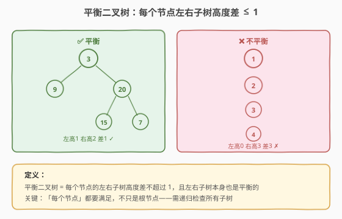
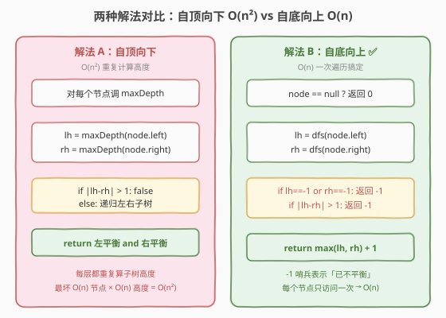
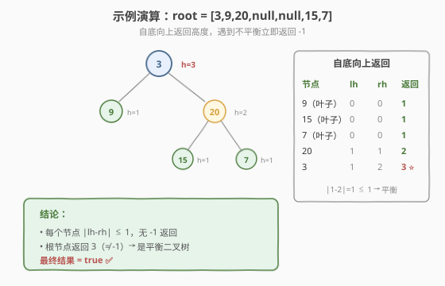

# 平衡二叉树

- **题目名称**：平衡二叉树
- **链接**：[110. 平衡二叉树](https://leetcode.cn/problems/balanced-binary-tree/)
- **难度**：简单
- **标签**：树、DFS

## 1. 题目概述

给定一棵二叉树的根节点 `root`，判断它是否是**高度平衡**的。一棵**高度平衡二叉树**定义为：**每个节点**的左右两个子树的高度差的绝对值不超过 1。

**示例 1**：

```text
输入：root = [3,9,20,null,null,15,7]
        3
       / \
      9  20
        /  \
       15   7
输出：true
```

**示例 2**：

```text
输入：root = [1,2,2,3,3,null,null,4,4]
            1
           / \
          2   2
         / \
        3   3
       / \
      4   4
输出：false
解释：左子树的左子树高度差超过 1（子树 [2,3,3,4,4] 不平衡）。
```

**约束条件**：

- 树中节点数目范围 `[0, 5000]`
- `-10^4 <= Node.val <= 10^4`

> 💡 这道题是 [104. 二叉树的最大深度](104_二叉树的最大深度.md) 的进阶应用——不仅要算高度，还要在算高度的过程中判断平衡。关键陷阱是「每个节点都要平衡」而非只看根节点。掌握自底向上的 `O(n)` 解法，你就理解了「递归返回值兼顾状态与结果」的设计技巧。

---

## 2. 解题思路

### 2.1 暴力思路：自顶向下 O(n²)

最直观的做法：对每个节点，调用 `maxDepth` 算出左右子树高度，判断差是否 ≤ 1，再递归判断左右子树是否也平衡。

```text
isBalanced(node):
    if node == null: return true
    lh = maxDepth(node.left)
    rh = maxDepth(node.right)
    if |lh - rh| > 1: return false
    return isBalanced(node.left) and isBalanced(node.right)
```

问题：`maxDepth` 本身是 `O(n)`，对每个节点都调一次，总共 `O(n²)`。因为**子树高度被重复计算**——每个节点的高度被其所有祖先重复算了一遍。

### 2.2 核心观察：自底向上 O(n)，用 -1 哨兵



优化思路：**一次后序遍历同时算高度 + 判平衡**。递归函数返回子树高度，但若发现不平衡，用一个特殊值 `-1`（哨兵）表示「已不平衡」，直接向上传播，不再继续计算。



> 💡 这是「自底向上」的精髓：先递归拿到左右子树的高度，**再**判断当前节点是否平衡。和「最大深度」的后序汇总同构，只是多了一步「平衡检查」——不平衡时返回 `-1` 提前终止。

### 2.3 算法流程图

**自底向上 DFS 完整步骤**：

1. **特判**：`node == null` 返回 0（空树高度 0，平衡）
2. **递归左**：`lh = dfs(node.left)`；若 `lh == -1`，返回 `-1`（左子树已不平衡，提前返回）
3. **递归右**：`rh = dfs(node.right)`；若 `rh == -1`，返回 `-1`
4. **判平衡**：若 `|lh - rh| > 1`，返回 `-1`
5. **返回高度**：`max(lh, rh) + 1`

> ⚠️ 第 2、3 步的「`-1` 提前返回」很关键——一旦子树不平衡，立即向上传播 `-1`，不再计算另一侧子树。这让整个递归在每个节点处最多访问一次，保证 `O(n)`。

### 2.4 示例演算

以示例 1 `root = [3,9,20,null,null,15,7]` 为例，自底向上：



| 节点 | lh | rh | \|lh-rh\| | 返回值 |
|------|----|----|-----------|--------|
| 9（叶子） | 0 | 0 | 0 | 1 |
| 15（叶子） | 0 | 0 | 0 | 1 |
| 7（叶子） | 0 | 0 | 0 | 1 |
| 20 | 1 | 1 | 0 | 2 |
| 3 | 1 | 2 | 1 | **3** ⭐ |

根节点返回 `3`（非 `-1`），故是平衡二叉树，结果 `true`。

> 💡 每个节点的 `|lh - rh|` 都 ≤ 1，没有任何节点返回 `-1`。最终根返回 3（树高），非 `-1` 即平衡。若任一节点差 > 1，会返回 `-1` 并一路传播到根，根返回 `-1` 即不平衡。

---

## 3. 参考代码

### C++

```cpp
// 平衡二叉树.cpp —— 自底向上 DFS（O(n)）
#include <algorithm>
using namespace std;

struct TreeNode {
    int val;
    TreeNode* left;
    TreeNode* right;
    TreeNode() : val(0), left(nullptr), right(nullptr) {
    }
    TreeNode(int x) : val(x), left(nullptr), right(nullptr) {
    }
    TreeNode(int x, TreeNode* l, TreeNode* r) : val(x), left(l), right(r) {
    }
};

class Solution {
  public:
    bool isBalanced(TreeNode* root) {
        return dfs(root) != -1;          // 返回 -1 表示不平衡
    }

  private:
    int dfs(TreeNode* node) {
        if (node == nullptr) return 0;   // 空树高 0
        int lh = dfs(node->left);
        if (lh == -1) return -1;         // 左子不平衡，提前返回
        int rh = dfs(node->right);
        if (rh == -1) return -1;         // 右子不平衡，提前返回
        if (abs(lh - rh) > 1) return -1; // 当前不平衡
        return max(lh, rh) + 1;          // 返回高度
    }
};

// 自顶向下 O(n²) 解法（对比用）
class SolutionNaive {
  public:
    bool isBalanced(TreeNode* root) {
        if (root == nullptr) return true;
        int lh = maxDepth(root->left);
        int rh = maxDepth(root->right);
        if (abs(lh - rh) > 1) return false;
        return isBalanced(root->left) && isBalanced(root->right);
    }
    int maxDepth(TreeNode* node) {
        if (node == nullptr) return 0;
        return max(maxDepth(node->left), maxDepth(node->right)) + 1;
    }
};
```

### Python

```python
# 自底向上 O(n)
class Solution:
    def isBalanced(self, root: TreeNode | None) -> bool:
        def dfs(node: TreeNode | None) -> int:
            if not node:
                return 0
            lh = dfs(node.left)
            if lh == -1:
                return -1                # 左子不平衡，提前返回
            rh = dfs(node.right)
            if rh == -1:
                return -1                # 右子不平衡，提前返回
            if abs(lh - rh) > 1:
                return -1                # 当前不平衡
            return max(lh, rh) + 1       # 返回高度

        return dfs(root) != -1
```

> 💡 Python 用内部嵌套函数 `dfs` 闭包，代码紧凑。`dfs` 返回 `-1` 哨兵表示「不平衡」，返回非负数表示「子树高度」。根调用只需判断 `!= -1`。

---

## 4. 复杂度分析

| 维度 | 复杂度 | 说明 |
|------|--------|------|
| **时间复杂度** | `O(n)` | 自底向上：每个节点只访问一次 |
| **空间复杂度** | `O(h)` | 递归栈深度 = 树高 `h`；最坏链状 `O(n)` |

> ⚠️ 对比自顶向下的 `O(n²)`：链状树时，自顶向下每个节点都调 `maxDepth` 遍历其后继链，总次数 `n + (n-1) + ... + 1 = O(n²)`。自底向上靠「`-1` 提前返回」+「高度只算一次」降到 `O(n)`。5000 个节点的链状树，`O(n²)` 约 2500 万次操作勉强能过，`O(n)` 仅 5000 次，差距巨大。

---

## 5. 扩展：AVL 树的旋转

平衡二叉树的定义来自 **AVL 树**（自平衡二叉搜索树）。AVL 树在插入/删除后会通过**旋转**（左旋、右旋、左右旋、右左旋）恢复平衡，保证任意节点左右子树高度差 ≤ 1。本题只判断「是否平衡」，不涉及旋转操作——但理解 AVL 的平衡定义有助于理解这道题的背景。

| 不平衡类型 | 描述 | 修复 |
|-----------|------|------|
| LL | 左子树的左子树过高 | 右旋一次 |
| RR | 右子树的右子树过高 | 左旋一次 |
| LR | 左子树的右子树过高 | 先左旋左子，再右旋 |
| RL | 右子树的左子树过高 | 先右旋右子，再左旋 |

> 💡 面试中若被问「如何把一棵普通树调成平衡」，可提 AVL 的旋转。但本题只需判断，不需调整——不要画蛇添足地写旋转逻辑。

---

## 6. 面试要点

1. **为什么自顶向下是 O(n²)？哪里重复计算了？**

   - 自顶向下对每个节点调用 `maxDepth` 算高度。以链状树为例：根调 `maxDepth` 遍历 n 个节点，根的左子调 `maxDepth` 遍历 n-1 个节点……总次数 `O(n²)`。
   - 根源：每个节点的高度被其所有祖先重复计算。自底向上通过后序遍历，每个节点只算一次高度，顺便判平衡，降到 `O(n)`。

2. **为什么用 -1 作为哨兵？用别的值行吗？**

   - 高度一定是非负数，`-1` 不会与任何合法高度冲突。用 `-2`、`-999` 也行，但 `-1` 是约定俗成的写法。
   - 哨兵的作用是「让不平衡的信息向上传播」——一旦某子树返回 `-1`，所有祖先节点检测到后直接返回 `-1`，跳过剩余计算。这保证了 `O(n)`。

3. **「每个节点平衡」和「根节点平衡」有什么区别？**

   - 定义要求**每个节点**的左右子树高度差 ≤ 1，不只是根。示例 2 中根节点 1 的左右子树高度差是 2（左 3、右 1），但即便根平衡，子树 `[2,3,3,4,4]` 内部也不平衡（节点 2 的左高 2、右高 0）。
   - 所以必须递归检查所有子树，不能只看根。自底向上天然做到——每个节点都执行一次 `|lh-rh|` 判断。

4. **能否用 BFS 判断平衡？**

   - 不太自然。BFS 按层遍历，算「高度」需要知道子树的最深叶子在第几层，而 BFS 只能算当前节点的深度（自顶向下），不能直接得到子树高度。
   - 高度是「自底向上」的概念，DFS 后序天然适配。本题推荐 DFS，BFS 只在「求最小深度」类问题（找最近叶子）更有优势。

5. **如果树退化成链表（5000 层），递归会栈溢出吗？**

   - Python 默认递归深度限制 1000，5000 层会 `RecursionError`。C++ 栈空间通常够，但极端情况也可能段错误。
   - 面试中若被问「超深树怎么办」，可改为**迭代后序遍历**（用栈模拟），或先和面试官确认节点规模。LeetCode 本题约束 5000 节点，Python 需 `sys.setrecursionlimit(10000)` 才能过。

> 💡 **一句话总结**：平衡二叉树的核心是「自底向上一次遍历同时算高度 + 判平衡」。用 `-1` 哨兵表示「已不平衡」，一旦发现立即向上传播，跳过剩余计算，把 `O(n²)` 降到 `O(n)`。这是「递归返回值兼顾状态与结果」的经典设计——返回值既携带高度信息，又用特殊值表达「失败」。

---

## 7. 同类练习题

- [104. 二叉树的最大深度](https://leetcode.cn/problems/maximum-depth-of-binary-tree/)：求高度的基础，本题复用（[题解](104_二叉树的最大深度.md)）
- [111. 二叉树的最小深度](https://leetcode.cn/problems/minimum-depth-of-binary-tree/)：求最近叶子，注意单侧为空（[题解](111_二叉树的最小深度.md)）
- [559. N 叉树的最大深度](https://leetcode.cn/problems/maximum-depth-of-n-ary-tree/)：多叉树求深度（[题解](../0501-0600/559_N叉树的最大深度.md)）
- [108. 将有序数组转换为二叉搜索树](https://leetcode.cn/problems/convert-sorted-array-to-binary-search-tree/)（[题解](108_将有序数组转换为二叉搜索树.md)）：构造平衡 BST，平衡思想的应用
- [543. 二叉树的直径](https://leetcode.cn/problems/diameter-of-binary-tree/)：后序 DFS 同时算深度与直径，同套「一次遍历两个信息」技巧
