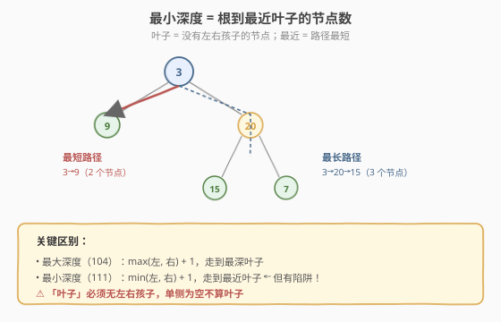
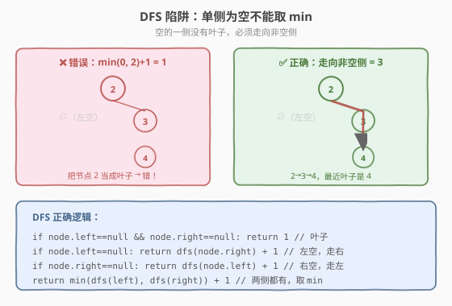
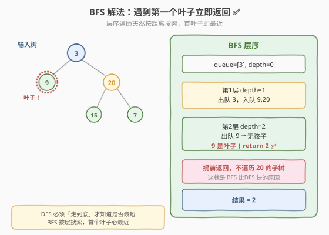

# 二叉树的最小深度

- **题目名称**：二叉树的最小深度
- **链接**：[111. 二叉树的最小深度](https://leetcode.cn/problems/minimum-depth-of-binary-tree/)
- **难度**：简单
- **标签**：树、DFS、BFS

## 1. 题目概述

给定一棵二叉树的根节点 `root`，返回其**最小深度**。最小深度是指从根节点到**最近叶子节点**的最短路径上的节点数量。

> **叶子节点**：没有左右孩子的节点。

**示例 1**：

```text
输入：root = [3,9,20,null,null,15,7]
        3
       / \
      9  20
        /  \
       15   7
输出：2
解释：最近叶子是 9，路径 3 → 9，共 2 个节点。
```

**示例 2**：

```text
输入：root = [2,null,3,null,4,null,5,null,6]
    2
     \
      3
       \
        4
         \
          5
           \
            6
输出：5
解释：唯一叶子是 6，路径 2→3→4→5→6，共 5 个节点。
```

**约束条件**：

- 树中节点数目范围 `[0, 10^5]`
- `-1000 <= Node.val <= 1000`

> 💡 这是 [104. 二叉树的最大深度](../../week6/day2/二叉树的最大深度.md) 的「镜像版」——把 `max` 换成 `min`。但有个**关键陷阱**：单侧为空时不能简单取 `min(0, 另一侧)`，因为空的一侧没有叶子。这道题同时考察 DFS 的边界处理和 BFS 的「首达即最短」特性，是树遍历的经典进阶题。

---

## 2. 解题思路

### 2.1 基础思路：DFS 递归

直觉上，最小深度 = `min(左子树深度, 右子树深度) + 1`，和最大深度把 `max` 换 `min` 即可。但这里有个**陷阱**。

### 2.2 核心观察：单侧为空不能取 min



陷阱在于「叶子」的定义——**必须没有左右孩子**。当一个节点只有一侧有孩子时，空的那侧**没有叶子**，不能算作一条「到叶子的路径」。



> ⚠️ 最常见的错误：`return min(dfs(left), dfs(right)) + 1`。当 `left` 为空、`right` 非空时，`dfs(left)=0`，`min(0, dfs(right))=0`，`+1=1`——这把当前节点当成叶子了，但它明明有右孩子！正确做法是：单侧为空时，必须走向**非空**的那一侧。

**正确的 DFS 逻辑**：

| 情况 | 处理 |
|------|------|
| 叶子（左右都空） | 返回 1 |
| 左空、右非空 | `dfs(right) + 1`（必须走右） |
| 右空、左非空 | `dfs(left) + 1`（必须走左） |
| 左右都非空 | `min(dfs(left), dfs(right)) + 1` |

### 2.3 算法流程图

**方案 A（DFS 递归）**：

1. `node == null` 返回 0
2. `left == null && right == null`（叶子）返回 1
3. `left == null` 返回 `dfs(right) + 1`
4. `right == null` 返回 `dfs(left) + 1`
5. 否则返回 `min(dfs(left), dfs(right)) + 1`

**方案 B（BFS 层序）**：



1. `root == null` 返回 0
2. 队列 `queue = [root]`，`depth = 0`
3. `while` 队列非空：`depth += 1`；`for size` 次：出队 `node`；若 `node` 是叶子（左右都空），**立即返回 `depth`**；否则孩子入队

> 💡 BFS 的优势：层序遍历天然**按距离搜索**，遇到的**第一个叶子一定是最近的叶子**，直接返回当前 `depth` 即可。而 DFS 必须遍历所有叶子才能确定最小值。当最近叶子在浅层、最远叶子在深层时，BFS 能大幅剪枝。

### 2.4 示例演算

以示例 1 `root = [3,9,20,null,null,15,7]` 为例：

**DFS 方式**（需遍历所有叶子）：

| 节点 | 左 | 右 | 情况 | 返回 |
|------|----|----|------|------|
| 9    | null | null | 叶子 | 1 |
| 15   | null | null | 叶子 | 1 |
| 7    | null | null | 叶子 | 1 |
| 20   | 15 | 7 | 都非空 | min(1,1)+1 = 2 |
| 3    | 9 | 20 | 都非空 | min(1,2)+1 = **2** ⭐ |

**BFS 方式**（遇到叶子即停）：

| 轮次 | depth | 队列 | 出队节点 | 是否叶子 |
|------|-------|------|---------|---------|
| 1 | 1 | [3] | 3 | 否（有 9、20） |
| 2 | 2 | [9, 20] | 9 | **是！返回 2** ✅ |

DFS 走了全部 5 个节点才得出 2；BFS 只走到第 2 层就遇到了叶子 9，立即返回。

> 💡 BFS 在第 2 轮出队 9 时就发现它是叶子，直接返回 `depth=2`，根本不遍历 20 的子树。这就是「BFS 求最小/最短」的本质优势——按层搜索，首达即最优。

---

## 3. 参考代码

### C++

```cpp
// 二叉树的最小深度.cpp —— DFS 递归 + BFS 层序
#include <queue>
#include <algorithm>
using namespace std;

struct TreeNode {
    int val;
    TreeNode* left;
    TreeNode* right;
    TreeNode() : val(0), left(nullptr), right(nullptr) {
    }
    TreeNode(int x) : val(x), left(nullptr), right(nullptr) {
    }
    TreeNode(int x, TreeNode* l, TreeNode* r) : val(x), left(l), right(r) {
    }
};

// DFS 递归
class Solution {
  public:
    int minDepth(TreeNode* root) {
        if (root == nullptr) return 0;
        if (root->left == nullptr && root->right == nullptr) return 1; // 叶子
        if (root->left == nullptr)  return minDepth(root->right) + 1;  // 左空走右
        if (root->right == nullptr) return minDepth(root->left)  + 1;  // 右空走左
        return min(minDepth(root->left), minDepth(root->right)) + 1;   // 都有取 min
    }
};

// BFS 层序（遇到叶子即返回，更高效）
class SolutionBFS {
  public:
    int minDepth(TreeNode* root) {
        if (!root) return 0;
        queue<TreeNode*> q;
        q.push(root);
        int depth = 0;
        while (!q.empty()) {
            ++depth;
            int sz = q.size();
            for (int i = 0; i < sz; ++i) {
                TreeNode* node = q.front(); q.pop();
                if (node->left == nullptr && node->right == nullptr) {
                    return depth;                  // 首个叶子，即最近
                }
                if (node->left)  q.push(node->left);
                if (node->right) q.push(node->right);
            }
        }
        return depth;
    }
};
```

### Python

```python
# DFS 递归
class Solution:
    def minDepth(self, root: TreeNode | None) -> int:
        if not root:
            return 0
        if not root.left and not root.right:    # 叶子
            return 1
        if not root.left:                       # 左空走右
            return self.minDepth(root.right) + 1
        if not root.right:                      # 右空走左
            return self.minDepth(root.left) + 1
        return min(self.minDepth(root.left), self.minDepth(root.right)) + 1

# BFS 层序（推荐）
from collections import deque

class SolutionBFS:
    def minDepth(self, root: TreeNode | None) -> int:
        if not root:
            return 0
        q = deque([root])
        depth = 0
        while q:
            depth += 1
            for _ in range(len(q)):
                node = q.popleft()
                if not node.left and not node.right:   # 首个叶子
                    return depth
                if node.left:
                    q.append(node.left)
                if node.right:
                    q.append(node.right)
        return depth
```

> 💡 DFS 和 BFS 的选择：本题 `n` 可达 `10^5`，若树退化为链表，DFS 递归栈深 `10^5` 会栈溢出，BFS 更安全。但若树平衡且最近叶子在浅层，BFS 远快于 DFS。面试中推荐 BFS——既高效又避免栈溢出。

---

## 4. 复杂度分析

| 维度 | 复杂度 | 说明 |
|------|--------|------|
| **时间复杂度** | `O(n)` | DFS 遍历所有节点；BFS 最坏也 `O(n)`，但常能提前返回 |
| **空间复杂度** | `O(h)` / `O(n)` | DFS 栈 = 树高；BFS 队列 = 最宽层 |

> ⚠️ BFS 最坏情况（树退化为链表，唯一叶子在最深）仍需遍历 `n` 个节点，时间 `O(n)`。但平均情况（最近叶子在浅层）能大幅剪枝。DFS 无论何种情况都遍历所有叶子才能确定最小值。空间上，链状树 DFS 栈深 `O(n)` 易溢出，BFS 队列只存一层（链状时每层 1 个），反而更省。

---

## 5. 扩展：DFS 与 BFS 的选择哲学

最小深度是「DFS vs BFS」选择的一个经典案例：

| 场景 | 推荐 | 原因 |
|------|------|------|
| 求**最大**深度 | DFS | 必须遍历所有叶子，DFS 更简洁 |
| 求**最小**深度 | BFS | 首个叶子即答案，可提前返回 |
| 求**是否存在**路径 | DFS | 找到一条即返回，DFS 天然回溯 |
| 求**最短**路径 | BFS | 按层搜索，首达即最优 |

> 💡 本质规律：**求最短/最少用 BFS，求所有/最大用 DFS**。最小深度是「求最短」的树版本——BFS 的层序天然按距离搜索，首达即最优。这个思想迁移到图论就是「无权图最短路径用 BFS」。

---

## 6. 面试要点

1. **最小深度为什么不能简单 `min(left, right) + 1`？**

   - 因为「深度」必须到**叶子**（无左右孩子的节点）。若某节点只有右孩子，左子树为空，`min(0, dfs(right)) = 0`，`+1 = 1`——这把当前节点当叶子了，但它明明有右孩子。
   - 正确做法：单侧为空时，必须走向非空侧（`dfs(非空侧) + 1`）；只有两侧都有孩子时才取 `min`。

2. **BFS 为什么比 DFS 更适合求最小深度？**

   - BFS 按层搜索，遇到的**第一个叶子一定是离根最近的叶子**，立即返回当前层数即可。
   - DFS 必须遍历所有叶子才能确定最小值（无法提前终止）。当最近叶子在浅层、最远叶子在深层时，BFS 能剪掉大量子树，远快于 DFS。

3. **BFS 的「首个叶子」一定是最近叶子吗？**

   - 是的。BFS 按层从浅到深处理，第 `d` 层的所有节点都比第 `d+1` 层更近。在第 `d` 层发现第一个叶子时，第 `d-1` 层及更浅的层都无叶子（否则之前就返回了），所以这个叶子就是最近的。
   - 这是「BFS 求最短路」的核心保证：层序 = 距离序。

4. **空树的最小深度是多少？**

   - 空树（`root == null`）返回 0——没有节点，没有路径。这和最大深度的约定一致。注意「空树」与「叶子」不同：叶子是非空但无孩子的节点，返回 1。

5. **如果树退化成 10^5 层的链表，DFS 会出问题吗？**

   - 会。Python 默认递归深度限制 1000，10^5 层直接 `RecursionError`。C++ 也可能栈溢出。
   - 链状树只有一个叶子（在最深端），DFS 必须走到底；BFS 每层只有 1 个节点，队列空间 `O(1)`，反而更优。本题 `n ≤ 10^5`，**强烈推荐 BFS**。

> 💡 **一句话总结**：二叉树的最小深度有两个关键点——DFS 要小心「单侧为空」的陷阱（不能简单取 min），BFS 则能「遇到首个叶子即返回」高效求解。面试推荐 BFS：既避开了 DFS 的边界坑，又利用了「层序 = 距离序」的提前终止优势。这是「求最短用 BFS」思想在树上的直接体现。

---

## 7. 同类练习题

- [104. 二叉树的最大深度](https://leetcode.cn/problems/maximum-depth-of-binary-tree/)：镜像题，max 换 min，无单侧陷阱（[题解](../../week6/day2/二叉树的最大深度.md)）
- [102. 二叉树的层序遍历](https://leetcode.cn/problems/binary-tree-level-order-traversal/)：BFS 骨架，本题复用（[题解](../../week2/day5/二叉树的层序遍历.md)）
- [110. 平衡二叉树](https://leetcode.cn/problems/balanced-binary-tree/)：后序 DFS 算高度，同套递归（[题解](../day3/平衡二叉树.md)）
- [199. 二叉树的右视图](https://leetcode.cn/problems/binary-tree-right-side-view/)：BFS 取每层最右（[题解](../day7/二叉树的右视图.md)）
- [513. 找树左下角的值](https://leetcode.cn/problems/find-bottom-left-tree-value/)：BFS 最后一层第一个节点
