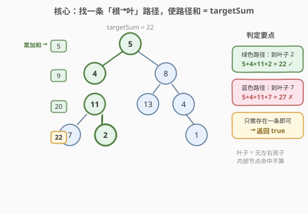
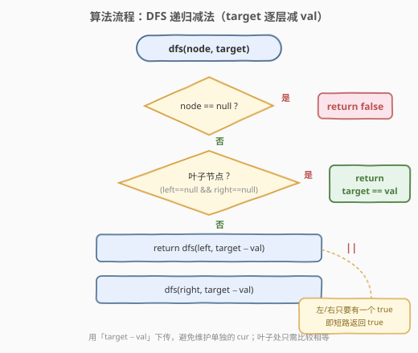
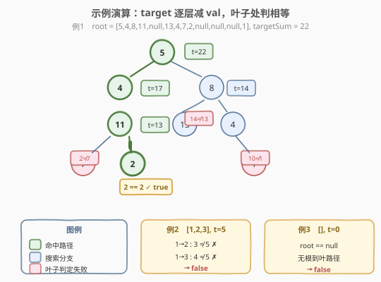

# 路径总和

- **题目名称**：路径总和
- **链接**：[112. 路径总和](https://leetcode.cn/problems/path-sum/)
- **难度**：简单
- **标签**：树、深度优先搜索、二叉树

## 1. 题目概述

给定一棵二叉树的根节点 `root` 和一个整数 `targetSum`，判断树中是否存在一条「从根节点到叶子节点」的路径，使这条路径上所有节点值之和等于 `targetSum`。存在返回 `true`，否则返回 `false`。

> 💡 **叶子节点**：没有左右孩子的节点。路径必须**从根开始、在叶子结束**，中间不能停在内部节点。

**示例 1**：

```text
输入：root = [5,4,8,11,null,13,4,7,2,null,null,null,1], targetSum = 22
输出：true
解释：存在一条根到叶路径 5 → 4 → 11 → 2，和为 5+4+11+2 = 22。
        5
       / \
      4   8
     /   / \
    11  13  4
   /  \      \
  7    2      1
```

**示例 2**：

```text
输入：root = [1,2,3], targetSum = 5
输出：false
解释：只有两条根到叶路径：1→2（和 3）、1→3（和 4），都不等于 5。
```

**示例 3**：

```text
输入：root = [], targetSum = 0
输出：false
解释：空树没有根到叶路径，返回 false。
```

**约束条件**：

- 树中节点数目在范围 `[0, 5000]` 内
- `-1000 <= Node.val <= 1000`
- `-1000 <= targetSum <= 1000`

> 💡 本题是树 DFS 的「判定版」入门题——只问**是否存在**、不要求列出路径。和 [113. 路径总和 II](113_路径总和II.md)（要求列出所有路径）是同一模型，只是把「收集」退化为「布尔短路」。掌握 112 再看 113，相当于把 `||` 升级成「回溯收集 + 拷贝」。

---

## 2. 解题思路

### 2.1 暴力思路

枚举每一条「根到叶」路径，逐一求和判断是否等于 `targetSum`。本质就是一次完整的 DFS 遍历。优化点有两个：**如何避免单独维护一个累加变量**，以及**如何尽早短路返回**。

### 2.2 核心观察：把 target 一路「减」下去



与其在每个节点累加 `cur` 再到叶子比较 `cur == targetSum`，不如换一个视角：**把 `targetSum` 随着递归一路减去当前节点值下传**。

- 进入节点时下传 `target - node.val` 给子节点；
- 当走到叶子时，只需判断**剩下的 `target` 是否恰好等于该叶子的 `val`**——相等说明从根到叶这条路径的和正好是原始 `targetSum`。

> 💡 这是一种「**目标递减**」写法：`dfs(node, target)` 表示「在以 `node` 为根的子树里，是否存在一条到叶路径，使其和等于 `target`」。子问题定义清晰，无需额外变量，也不需要回溯。

### 2.3 算法流程图



**DFS 递归逻辑**：

| 情况 | 处理 |
|------|------|
| `node == null` | 返回 `false`（空子树无路径） |
| 叶子（左右都空） | 返回 `target == node.val` |
| 否则（内部节点） | 返回 `dfs(left, target - val) || dfs(right, target - val)` |

> ⚠️ **必须判叶子**：判定条件是「叶子节点且 `target == val`」，不能只写 `target == val`。否则当某内部节点的根到该节点之和恰好等于 `targetSum` 时会被误判为 true——但它还没走到叶子，不是合法路径。判叶子即 `node.left == null && node.right == null`。

> 💡 **短路优势**：`||` 一旦左侧为 `true` 就不再递归右侧。当命中路径在左子树时，可直接跳过右子树的整段搜索，常数级优化。这与 [111. 二叉树的最小深度](111_二叉树的最小深度.md) 中 BFS「首达即返回」的思想一致——**找到一条即停**。

### 2.4 示例演算

以示例 1（`targetSum = 22`）为例，沿「目标递减」追踪每条根到叶路径：



| 叶子 | 根到叶路径 | target 演变（逐层减） | 叶子处判定 | 结果 |
|------|-----------|----------------------|-----------|------|
| 7  | 5→4→11→7 | 22→17→13→**2** | 2 ≠ 7 | ✗ |
| 2  | 5→4→11→2 | 22→17→13→**2** | 2 == 2 | ✓ true |
| 13 | 5→8→13   | 22→14→**14** | 14 ≠ 13 | ✗ |
| 1  | 5→8→4→1  | 22→14→10→**10** | 10 ≠ 1 | ✗ |

第二条路径在叶子 `2` 处 `target == val`，立即返回 `true`，右侧分支不再展开。

> 💡 注意：若按 DFS 先左后右的顺序，访问到叶子 `2` 即命中并短路返回 `true`，根本不会遍历 `8` 的右子树。这是「判定问题」相较「枚举问题」的本质优势——**存在性可短路，完备性必须全搜**。

---

## 3. 参考代码

### C++

```cpp
/**
 * Definition for a binary tree node.
 * struct TreeNode {
 *     int val;
 *     TreeNode *left;
 *     TreeNode *right;
 *     TreeNode() : val(0), left(nullptr), right(nullptr) {}
 *     TreeNode(int x) : val(x), left(nullptr), right(nullptr) {}
 *     TreeNode(int x, TreeNode *left, TreeNode *right) : val(x), left(left), right(right) {}
 * };
 */
class Solution {
  public:
    bool hasPathSum(TreeNode* root, int targetSum) {
        if (root == nullptr) return false;                       // 空节点：无路径
        if (root->left == nullptr && root->right == nullptr) {   // 叶子：判相等
            return root->val == targetSum;
        }
        // 内部节点：下传 target - val，左右任一命中即 true（|| 短路）
        return hasPathSum(root->left,  targetSum - root->val)
            || hasPathSum(root->right, targetSum - root->val);
    }
};
```

### Python

```python
class Solution:
    def hasPathSum(self, root: Optional[TreeNode], targetSum: int) -> bool:
        if root is None:                              # 空节点：无路径
            return False
        if root.left is None and root.right is None:  # 叶子：判相等
            return root.val == targetSum
        # 内部节点：下传 target - val，左右任一命中即 True（or 短路）
        return (self.hasPathSum(root.left,  targetSum - root.val)
                or self.hasPathSum(root.right, targetSum - root.val))
```

> 💡 也可用「累加版」：维护 `cur`，到叶子比较 `cur == targetSum`。两种写法等价，「目标递减」无需额外参数、无需回溯，代码更简洁，推荐采用。

---

## 4. 复杂度分析

| 维度 | 复杂度 | 说明 |
|------|--------|------|
| **时间复杂度** | $O(n)$ | 最坏遍历所有节点；`||` 短路常能提前返回，但最坏（无命中或命中在最后）仍为 $O(n)$ |
| **空间复杂度** | $O(h)$ | 递归调用栈深度 = 树高 $h$。平衡树 $h = O(\log n)$；链状树 $h = O(n)$ |

> ⚠️ 本题 $n \le 5000$，即便链状树（栈深 5000）Python 默认递归上限 1000 仍可能 `RecursionError`。若担心栈溢出，可改用显式栈的迭代写法（见下扩展），或临时 `sys.setrecursionlimit`。面试中递归写法为主，迭代写法作为「能否转为非递归」的追问准备。

---

## 5. 扩展：迭代写法（显式栈）

把递归栈显式化，避免栈溢出。栈里存 `(node, remain)`，`remain` 表示「从该节点到叶还需凑齐的剩余目标」：

```python
class Solution:
    def hasPathSum(self, root: Optional[TreeNode], targetSum: int) -> bool:
        if not root:
            return False
        stack = [(root, targetSum)]
        while stack:
            node, remain = stack.pop()
            if not node.left and not node.right and node.val == remain:
                return True                     # 叶子命中
            if node.left:
                stack.append((node.left,  remain - node.val))
            if node.right:
                stack.append((node.right, remain - node.val))
        return False
```

> 💡 这是把递归的「调用栈」换成「手动栈」，逻辑完全对应。用 `pop()` 取末尾是 DFS（先入后出），换成 `deque.popleft()` 即变成 BFS——但 BFS 在本题不能像 [111](111_二叉树的最小深度.md) 那样「首达即最优」，因为这里求的是「相等」而非「最短」，BFS 与 DFS 效率同为 $O(n)$，DFS 更省空间。

---

## 6. 面试要点

1. **为什么用「target 减法」而不是「累加 cur」？**

   - 两种等价。「减法」把目标随递归下传，叶子处只需比较 `target == val`，无需额外变量、无需回溯，代码最简洁；「累加」要维护 `cur` 参数，到叶子比较 `cur == targetSum`。面试推荐「减法」——少一个状态、少一处出错点。

2. **为什么必须判叶子，而不能只判 `target == 0` 或 `target == val`？**

   - 题目要求「根到**叶**」路径。若只判 `target == val` 而不判叶子，当某内部节点恰好使剩余 `target` 等于自身值时会被误判 true，但它还有孩子、没到叶。必须加 `node.left == null && node.right == null` 保证终止于叶子。

3. **`||` 短路在本题有什么实际意义？**

   - `||` 左侧为 `true` 时不再求值右侧。当命中路径在左子树时，右子树整段递归被跳过。最坏情况（无命中或命中在右侧最深处）仍遍历全部 $n$ 个节点，但平均/最好情况常数大幅降低。这是「存在性判定」相较「枚举收集」的本质优势。

4. **空树 `root == null` 且 `targetSum == 0`，为什么返回 `false`？**

   - 空树没有任何节点，更没有「根到叶」路径。「路径」至少含一个节点（根即叶的单节点树）。示例 3 正是此情形，返回 `false`。这与「子树为空」的递归 base case 不同——根的空判返回 `false` 是「整棵树无路径」，递归中 `node == null` 返回 `false` 是「该子树不贡献命中」。

5. **节点值可能为负，能剪枝吗？**

   - 不能基于和剪枝。由于节点值可能为负（如 `[-2, null, -3]`，`targetSum = -5`），中途 `remain` 即使偏离目标，后续负值仍可能拉回。本题只能老老实实走到叶子判定。若题目保证**节点值全为正**，则可在 `remain < 0` 时提前 `return false` 剪枝。

> 💡 **一句话总结**：112 是树 DFS 判定问题的母题——「目标递减 + 叶子判等 + `||` 短路」三件套。掌握它，再看 [113](113_路径总和II.md)（收集所有路径）和 [437](../0401-0500/437_路径总和III.md)（任意起点前缀和），都是从「判定」到「枚举/计数」的自然升级。

---

## 7. 同类练习题

- [113. 路径总和 II](https://leetcode.cn/problems/path-sum-ii/)：本题的「枚举版」，要求列出所有合法路径，从 `||` 短路升级为回溯收集（[题解](113_路径总和II.md)）
- [437. 路径总和 III](https://leetcode.cn/problems/path-sum-iii/)：路径不再要求到叶、可从任意节点开始，升级为「树上前缀和 + 哈希计数」（[题解](../0401-0500/437_路径总和III.md)）
- [111. 二叉树的最小深度](https://leetcode.cn/problems/minimum-depth-of-binary-tree/)：同样是「根到叶」判定，求最短路径用 BFS「首达即返回」（[题解](111_二叉树的最小深度.md)）
- [129. 求根节点到叶节点数字之和](https://leetcode.cn/problems/sum-root-to-leaf-numbers/)：把「求和相等」换成「按位拼数后求和」，DFS 模板复用
- [257. 二叉树的所有路径](https://leetcode.cn/problems/binary-tree-paths/)：回溯收集所有根到叶路径，是 112→113 的中间过渡
