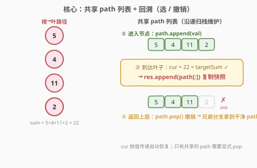
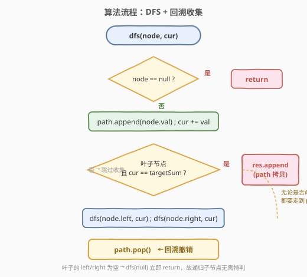
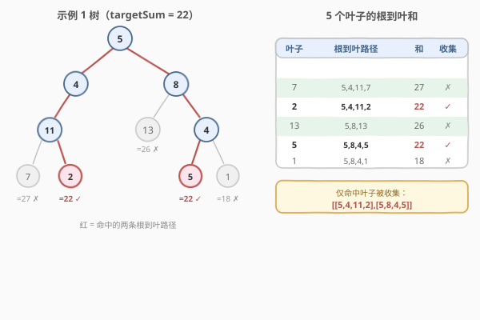

# LeetCode 路径总和II 题解

## 1. 题目概述

- **标题 / 题号**：路径总和II（#113，medium）
- **链接**：https://leetcode.cn/problems/path-sum-ii/
- **难度**：中等
- **标签**：树、深度优先搜索、回溯、二叉树

**题意**：给定一棵二叉树的根节点 `root` 和一个整数 `targetSum`，找出**所有**「从根节点到叶子节点」路径总和等于 `targetSum` 的路径，返回这些路径的列表（顺序不限）。

> 💡 **叶子节点**：没有子节点的节点。路径必须**从根开始、在叶子结束**，中间不能停在内部节点。

**示例 1**：

```text
输入：root = [5,4,8,11,null,13,4,7,2,null,null,5,1], targetSum = 22
输出：[[5,4,11,2],[5,8,4,5]]
解释：存在两条和为 22 的根到叶路径（见下图演算）。
```

**示例 2**：

```text
输入：root = [1,2,3], targetSum = 5
输出：[]
解释：根到叶路径只有 1→2（和 3）与 1→3（和 4），均不为 5。
```

**示例 3**：

```text
输入：root = [1,2], targetSum = 0
输出：[]
```

**约束**：

- 树中节点数目在范围 `[0, 5000]` 内
- `-1000 <= Node.val <= 1000`
- `-1000 <= targetSum <= 1000`

> ⚠️ 本题节点数最多 `5000`、节点值最多 `±1000`，根到叶路径和上限约 $5 \times 10^6$，**在 32 位 `int` 范围内**，无需像 [437. 路径总和 III](../0401-0500/437_路径总和III.md) 那样用 `long long`。

## 2. 解题思路

### 2.1 暴力思路

枚举每一条「根到叶」路径，逐一求和判断是否等于 `targetSum`。本质就是一次完整的 DFS 遍历，关键在于**如何在递归过程中高效维护「当前路径」**。

### 2.2 核心观察：共享 path 列表 + 回溯



递归自顶向下遍历，用一个**共享的** `path` 列表记录「从根到当前节点」的序列，配合一个当前累计和 `cur`：

1. **进入节点**：`path.append(node.val)`，`cur += node.val`。
2. **命中叶子**：若当前节点是叶子（左右孩子都为空）且 `cur == targetSum`，把 `path` 的**一份拷贝**加入结果。
3. **返回上层**：`path.pop()`，撤销当前节点，让兄弟分支拿到干净的 `path`。

> 💡 这就是回溯的「**选 / 撤销**」范式：进入时选择、返回时撤销。和 [46. 全排列](../0001-0100/46_全排列.md)、[39. 组合总和](../0001-0100/39_组合总和.md) 是同一套模板，只是把「在序列里选数」换成了「在树里向下走」。

### 2.3 关键易错点：必须判叶子

> ⚠️ 收集条件必须是「**叶子节点** 且 `cur == targetSum`」，**不能**只写 `cur == targetSum`。

如果只判断 `cur == targetSum`，当某个**内部节点**的根到该节点之和恰好等于 `targetSum` 时，会被错误地当作一条路径收集——但它还没走到叶子，不是合法的「根到叶路径」。例如 `targetSum = 5`、树为 `5 → 3 → 2` 时，到根节点 `5` 本身和就是 5，但 `5` 不是叶子，不能收集。判叶子即 `node.left == null && node.right == null`。

### 2.4 算法流程图



> 💡 注意流程里**没有对叶子特判是否递归子节点**：叶子节点的 `left/right` 为空，调用 `dfs(null)` 会立即在第一步 `return`，天然无害。所以收集逻辑与递归子节点可以统一写，代码更简洁。

### 2.5 示例演算

以示例 1（`targetSum = 22`）为例，树共有 5 个叶子，逐个计算根到叶路径和，只有两条等于 22 被收集：



| 叶子 | 根到叶路径 | 和 | 是否收集 |
|------|-----------|----|----------|
| 7  | 5 → 4 → 11 → 7 | 27 | ✗ |
| 2  | 5 → 4 → 11 → 2 | 22 | ✓ |
| 13 | 5 → 8 → 13      | 26 | ✗ |
| 5  | 5 → 8 → 4 → 5  | 22 | ✓ |
| 1  | 5 → 8 → 4 → 1  | 18 | ✗ |

最终结果 `[[5,4,11,2],[5,8,4,5]]`。注意 `13` 虽然深度较浅，但它是叶子（无孩子），同样参与判定，只是和为 26 不命中。

## 3. 参考代码

### C++

```cpp
/**
 * Definition for a binary tree node.
 * struct TreeNode {
 *     int val;
 *     TreeNode *left;
 *     TreeNode *right;
 *     TreeNode() : val(0), left(nullptr), right(nullptr) {}
 *     TreeNode(int x) : val(x), left(nullptr), right(nullptr) {}
 * };
 */
class Solution {
  public:
    vector<vector<int>> pathSum(TreeNode* root, int targetSum) {
        vector<vector<int>> res;
        vector<int> path;
        dfs(root, targetSum, 0, path, res);
        return res;
    }

  private:
    void dfs(TreeNode* node, int target, int cur,
             vector<int>& path, vector<vector<int>>& res) {
        if (node == nullptr) return;                 // 空节点直接返回
        path.push_back(node->val);                   // 选择：进入
        cur += node->val;
        if (node->left == nullptr && node->right == nullptr && cur == target) {
            res.push_back(path);                     // 命中叶子：push_back 自动拷贝
        }
        dfs(node->left,  target, cur, path, res);
        dfs(node->right, target, cur, path, res);
        path.pop_back();                             // 撤销：回溯
    }
};
```

### Python

```python
class Solution:
    def pathSum(self, root: Optional[TreeNode], targetSum: int) -> List[List[int]]:
        res: List[List[int]] = []
        path: List[int] = []

        def dfs(node: Optional[TreeNode], cur: int) -> None:
            if node is None:
                return                              # 空节点直接返回
            path.append(node.val)                   # 选择：进入
            cur += node.val
            if node.left is None and node.right is None and cur == targetSum:
                res.append(path[:])                 # 命中叶子：必须传拷贝
            dfs(node.left, cur)
            dfs(node.right, cur)
            path.pop()                              # 撤销：回溯

        dfs(root, 0)
        return res
```

> ⚠️ **Python 必须写 `path[:]`（或 `list(path)`）**：`res.append(path)` 存的是引用，后续 `path.pop()` 会把已存入的结果也改掉，最终 `res` 里全是同一个空列表。C++ 的 `res.push_back(path)` 会自动值拷贝，无需额外处理。

## 4. 复杂度分析

| 维度 | 复杂度 | 说明 |
|------|--------|------|
| 时间复杂度 | $O(n^2)$ | 遍历 $O(n)$；每条命中路径需复制，复制开销与路径长度成正比。最坏「梳状树」（每层挂一个叶、深度 $1..n/2$）且全部命中时 $\sum$ 叶深 $= O(n^2)$ |
| 空间复杂度 | $O(n)$ | 递归调用栈 + `path` 列表，最坏（链状树）深 $n$；不计返回结果所占空间 |

## 5. 扩展：剪枝可行性

由于节点值可能为**负数**（如 `[-2, null, -3]`，`targetSum = -5`），**不能**用「`cur` 超过 `targetSum` 就剪枝」——后续的负数可能把和拉回来。因此本题无法做基于和的提前剪枝，只能老老实实走到叶子再判断。若题目保证**节点值全为正**，则可在 `cur > targetSum` 时提前 `return`，降低常数。

## 6. 面试要点

1. **为什么收集时要传拷贝？**
   - `path` 是贯穿整个递归的共享列表。若直接存引用，后续 `pop` 会修改已存入的结果，最终所有结果都变成最后一次的状态（空列表）。Python 用 `path[:]`，C++ 的 `push_back` 自动值拷贝。

2. **为什么必须判叶子，而不能只判 `cur == targetSum`？**
   - 题目要求「根到叶」路径。内部节点的部分和可能恰好等于 `targetSum`，但它还没到叶子，不是合法路径。判叶子即 `left == null && right == null`。

3. **回溯的 `pop` 能省掉吗？**
   - 不能。`path` 在各分支间共享，访问完一棵子树若不弹出当前节点，它会「漏」进兄弟分支的路径里。`pop` 保证 `path` 始终精确表示「从根到当前节点」这条栈路径。

4. **`cur` 为什么不需要手动回溯？**
   - `cur` 作为参数按值传递（Python 的 `int` 不可变、C++ 的 `int cur`），每层递归有独立副本，返回时自动恢复。只有 `path`（可变引用 / 共享对象）需要显式撤销。

5. **和 [437. 路径总和 III](../0401-0500/437_路径总和III.md) 有何区别？**
   - 113 要求路径**从根到叶**，用 DFS + 回溯收集所有合法路径；437 的路径只需**向下**、可从任意节点开始，用「树上前缀和 + 哈希 + 回溯」计数。两者都用回溯，但 437 回溯的是哈希表，113 回溯的是路径列表。

## 同类练习题

| # | 题目 | 与本题的关联 |
|---|------|-------------|
| 112 | [路径总和](https://leetcode.cn/problems/path-sum/) | 本题的「判定版」，只问是否存在、不要求列出路径，DFS 模板入门 |
| 437 | [路径总和 III](https://leetcode.cn/problems/path-sum-iii/) | 路径不再要求到叶、可从任意节点开始，升级为前缀和 + 哈希计数 |
| 257 | [二叉树的所有路径](https://leetcode.cn/problems/binary-tree-paths/) | 同样回溯收集所有根到叶路径，只是判断条件从「和相等」变成「无脑全收」 |
| 46 | [全排列](https://leetcode.cn/problems/permutations/) | 数组版回溯「选/撤销」模板，与本题同构 |
| 124 | [二叉树中的最大路径和](https://leetcode.cn/problems/binary-tree-maximum-path-sum/) | 树形 DFS 的另一经典，返回值是「向下贡献」而非路径列表 |
