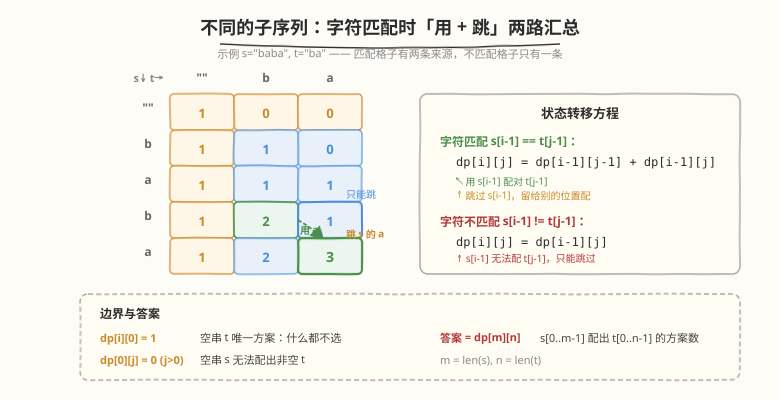

# LeetCode 不同的子序列 题解

## 1. 题目概述

- **标题 / 题号**：不同的子序列（#115，hard）
- **链接**：https://leetcode.cn/problems/distinct-subsequences/
- **难度**：困难
- **标签**：动态规划、二维 DP、字符串

**题意**：给定两个字符串 `s` 和 `t`，返回 `s` 中**不同的子序列**等于 `t` 的个数。

**子序列**：从原字符串中删除若干（也可不删）字符而不改变剩余字符相对顺序得到的新字符串。

**示例 1**：

```text
输入：s = "rabbbit", t = "rabbit"
输出：3
解释：有 3 种方式从 s 中生成 t：
  ra_bb_it   （用第 1、2 个 b，跳过第 3 个）
  rab_b_it   （用第 1、3 个 b，跳过第 2 个）
  rabb_it    （用第 2、3 个 b，跳过第 1 个）
```

**示例 2**：

```text
输入：s = "babgbag", t = "bag"
输出：5
解释：有 5 种方式从 s 中生成 "bag"：
  ba_ g_ _   bab_g___    bab__g__
  _ab_g___   __b_bg__
```

**约束**：

- `1 <= s.length, t.length <= 1000`
- `s` 和 `t` 仅由小写英文字母组成
- 题目数据保证答案在 32 位有符号整数范围内

> 💡 这是**二维计数 DP** 的经典模板，与 [72. 编辑距离](../0001-0100/72_编辑距离.md)、[1143. 最长公共子序列](../1101-1200/1143_最长公共子序列.md)、[10. 正则表达式匹配](../0001-0100/10_正则表达式匹配.md) 同属「两序列逐位置交互」的二维 DP 家族。差别在于：1143 求**最长**（`max`），72 求**最少**（`min`），而本题求**方案数**（`+` 累加）。计数 DP 的核心是「不漏不重」——每个匹配字符都有「用」和「跳」两条路，二者相加即覆盖所有方案。

## 2. 解题思路

### 2.1 暴力思路：递归枚举

对 `s` 的每个字符，决定「用」还是「不用」：若 `s[i] == t[j]` 则可以「用」（两指针同时前进）或「不用」（只跳过 `s[i]`）；若不等则只能「不用」。当 `t` 的指针走到末尾，算找到一种方案。

时间 $O(2^n)$，指数级超时，且有大量重复子问题（同一个 `(i, j)` 被反复递归）。

### 2.2 核心观察：二维计数 DP



**定义**：`dp[i][j]` = `s[0..i-1]` 中能组成 `t[0..j-1]` 的不同子序列个数。

**边界**：

```text
dp[i][0] = 1     # t 为空，唯一方案：什么都不选
dp[0][j] = 0     # s 为空、t 非空，无法组成（j > 0）
dp[0][0] = 1     # 都为空，空串是空串的唯一子序列
```

**转移**（核心）：

```text
若 s[i-1] == t[j-1]：
    dp[i][j] = dp[i-1][j-1] + dp[i-1][j]
              └─ 用 s[i-1] 配 t[j-1] ─┘  └─ 跳过 s[i-1] ┘

若 s[i-1] != t[j-1]：
    dp[i][j] = dp[i-1][j]            # s[i-1] 无法配 t[j-1]，只能跳过
```

**两种转移的直觉**：

| 情况 | DP 来源 | 含义 |
|------|---------|------|
| **字符匹配** | `dp[i-1][j-1] + dp[i-1][j]` | 「用」：`s[i-1]` 配掉 `t[j-1]`，两边各前进一步；「跳」：不用这个 `s[i-1]`，留给前面别的位置去配 |
| **字符不匹配** | `dp[i-1][j]` | `s[i-1]` 与 `t[j-1]` 不同，配不掉，只能跳过 `s[i-1]` |

> 💡 **为什么匹配时要加 `dp[i-1][j]`（跳过项）？** 因为 `s` 中可能有**多个**相同字符能配 `t[j-1]`。比如 `s = "rabbbit"`、`t = "rabbit"`，`t` 的某个 `b` 可以由 `s` 中 3 个 `b` 中任意一个来配。跳过当前 `b` 意味着「这个 `b` 不用，让后面的 `b` 来配」——这会产生不同的子序列方案，必须计入。

> ⚠️ **与 1143 LCS 的关键区别**：LCS 匹配时只取 `dp[i-1][j-1] + 1`（不求方案数，取最长即可）；本题匹配时要**额外加 `dp[i-1][j]`**，因为跳过 `s[i-1]` 的那些方案也需要被计数。这是「计数 DP」与「优化 DP」的本质差异——优化求极值会自动取最优分支，计数必须把所有分支加起来。

**答案**：`dp[m][n]`（`m = len(s)`, `n = len(t)`）。

### 2.3 算法流程图

![算法流程：初始化边界 → 双重循环逐行填表 → 匹配则两路相加、不匹配则继承上方 → 返回 dp[m][n]](../images/distinct_subseq_algorithm_flow.svg)

**完整步骤**：

1. **初始化**：`dp` 为 `(m+1) × (n+1)` 矩阵，第 0 列全 1（空 `t` 的方案数），第 0 行（除 `dp[0][0]`）全 0
2. **逐行填表**：`i` 从 1 到 `m`，`j` 从 1 到 `n`：
   - `s[i-1] == t[j-1]` → `dp[i][j] = dp[i-1][j-1] + dp[i-1][j]`
   - `s[i-1] != t[j-1]` → `dp[i][j] = dp[i-1][j]`
3. **返回** `dp[m][n]`

> ⚠️ **填表顺序**：从左到右、从上到下。`dp[i][j]` 依赖左上 `dp[i-1][j-1]` 和正上 `dp[i-1][j]`，两者在上一行，需先算出。注意**不依赖左方 `dp[i][j-1]`**——这是本题与 LCS、编辑距离的区别（后两者不匹配时要用到左方值）。

### 2.4 示例演算

以 `s = "rabbbit"`, `t = "rabbit"` 为例：

![示例演算：rabbbit 与 rabbit 的 dp 填表，答案 dp[7][6]=3](../images/distinct_subseq_example_walkthrough.svg)

**dp 表**（行 = `s` 字符，列 = `t` 字符，首行/首列为空串边界）：

| | `""` | `r` | `a` | `b` | `b` | `i` | `t` |
|------|------|-----|-----|-----|-----|-----|-----|
| `""` | 1 | 0 | 0 | 0 | 0 | 0 | 0 |
| `r` | 1 | **1** | 0 | 0 | 0 | 0 | 0 |
| `a` | 1 | 1 | **1** | 0 | 0 | 0 | 0 |
| `b` | 1 | 1 | 1 | **1** | 0 | 0 | 0 |
| `b` | 1 | 1 | 1 | **2** | 1 | 0 | 0 |
| `b` | 1 | 1 | 1 | **3** | **3** | 0 | 0 |
| `i` | 1 | 1 | 1 | 3 | 3 | **3** | 0 |
| `t` | 1 | 1 | 1 | 3 | 3 | 3 | **3** |

**关键填表步骤**：

| 格子 | 字符比较 | 转移 | 值 | 说明 |
|------|----------|------|----|------|
| `dp[1][1]` | `r` == `r` | `dp[0][0] + dp[0][1]` | 1 | 用 r 配对 |
| `dp[3][3]` | `b` == `b` | `dp[2][2] + dp[2][3]` | 1 | 第 1 个 b 配 t 第 1 个 b |
| `dp[4][3]` | `b` == `b` | `dp[3][2] + dp[3][3]` | 2 | 第 2 个 b：用(1) + 跳(1) = 2 |
| `dp[5][3]` | `b` == `b` | `dp[4][2] + dp[4][3]` | 3 | 第 3 个 b：用(1) + 跳(2) = 3 |
| `dp[5][4]` | `b` == `b` | `dp[4][3] + dp[4][4]` | 3 | t 第 2 个 b 也累积到 3 |
| `dp[7][6]` | `t` == `t` | `dp[6][5] + dp[6][6]` | 3 | 答案 ✓ |

> 💡 **看 `b` 列的累积过程**：`dp[3][3]=1 → dp[4][3]=2 → dp[5][3]=3`，每多一个 `b`，方案数累加上一行的同列值。这正是「3 个 b 选 2 个 = $\binom{3}{2} = 3$」的 DP 体现。跳过项 `dp[i-1][j]` 把「前面已有的方案」全部继承，用项 `dp[i-1][j-1]` 则是「新开一条配对路径」。

最终 `dp[7][6] = 3`，即 3 种不同的子序列。

## 3. 参考代码

### C++

```cpp
// 不同的子序列.cpp —— 二维计数 DP
// 编译: g++ -O2 -std=c++17 不同的子序列.cpp -o distinct_subseq
class Solution {
public:
    int numDistinct(string s, string t) {
        int m = s.size(), n = t.size();
        // 用 unsigned 防止中间溢出（题保证答案在 32 位内，但中间值可能更大）
        vector<vector<unsigned>> dp(m + 1, vector<unsigned>(n + 1, 0));

        for (int i = 0; i <= m; i++) {
            dp[i][0] = 1;                        // t 为空，唯一方案
        }

        for (int i = 1; i <= m; i++) {
            for (int j = 1; j <= n; j++) {
                if (s[i-1] == t[j-1]) {
                    dp[i][j] = dp[i-1][j-1] + dp[i-1][j];   // 用 + 跳
                } else {
                    dp[i][j] = dp[i-1][j];                  // 只能跳
                }
            }
        }
        return dp[m][n];
    }
};
```

### Python

```python
class Solution:
    def numDistinct(self, s: str, t: str) -> int:
        m, n = len(s), len(t)
        dp = [[0] * (n + 1) for _ in range(m + 1)]

        for i in range(m + 1):
            dp[i][0] = 1                       # t 为空，唯一方案

        for i in range(1, m + 1):
            for j in range(1, n + 1):
                if s[i-1] == t[j-1]:
                    dp[i][j] = dp[i-1][j-1] + dp[i-1][j]   # 用 + 跳
                else:
                    dp[i][j] = dp[i-1][j]                  # 只能跳

        return dp[m][n]
```

> 💡 **实现细节**：① `dp` 矩阵 `(m+1)×(n+1)`，首行首列是空串边界。② 只需初始化第 0 列为 1（第 0 行除 `dp[0][0]` 外天然为 0）。③ C++ 中用 `unsigned` 存储可避免中间累加溢出——题目保证最终答案在 32 位有符号范围内，但 `dp[i-1][j-1] + dp[i-1][j]` 的中间值可能短暂超出 `INT_MAX`。④ `s[i-1]` 对应 `dp[i]` 行——下标偏移 1 是因为 `dp[0]` 代表空串。

## 4. 复杂度分析

| 维度 | 二维 DP | 滚动数组 |
|------|---------|---------|
| **时间** | $O(m \times n)$ | $O(m \times n)$ |
| **空间** | $O(m \times n)$ | $O(n)$ |
| **能否还原方案** | ✓ 回溯 dp 表 | ✗ 只得计数 |

> ⚠️ 时间 $O(m \times n)$：双重循环遍历 `(m+1)×(n+1)` 个格子，每个格子 $O(1)$ 转移。`m, n ≤ 1000` 时约 $10^6$ 次操作，可接受。

## 5. 扩展：滚动数组空间优化

`dp[i][j]` 只依赖**上一行**的 `dp[i-1][j-1]`（左上）和 `dp[i-1][j]`（正上），不依赖当前行左方。因此可用**一维数组 + prev 变量**压缩到 $O(n)$ 空间：

```python
class Solution:
    def numDistinct(self, s: str, t: str) -> int:
        m, n = len(s), len(t)
        dp = [0] * (n + 1)
        dp[0] = 1                               # dp[i][0] = 1

        for i in range(1, m + 1):
            prev = dp[0]                         # 保存 dp[i-1][0]（恒为 1）
            for j in range(1, n + 1):
                temp = dp[j]                     # 保存 dp[i-1][j]
                if s[i-1] == t[j-1]:
                    dp[j] = prev + dp[j]         # dp[i-1][j-1] + dp[i-1][j]
                else:
                    dp[j] = dp[j]                # dp[i-1][j]（不变，可省略）
                prev = temp                      # 滚动 prev
        return dp[n]
```

> 💡 **prev 的作用**：计算 `dp[j]` 需要左上角 `dp[i-1][j-1]`，但一维数组中此时 `dp[j-1]` 已被更新为当前行值。`prev` 在覆盖前保存旧值（上一行的 `dp[j]`），下一轮 `j+1` 时作为新的左上角使用。**注意内层必须从左到右**（`j` 递增），这样 `prev` 恰好是 `dp[i-1][j-1]`。

> ⚠️ **为什么不匹配时可以写 `dp[j] = dp[j]`（即不变）？** 因为不匹配时 `dp[i][j] = dp[i-1][j]`，而一维数组中 `dp[j]` 此时还存着上一行的值 `dp[i-1][j]`，天然继承。实际代码可省略该分支。

### 与同族二维 DP 的对比

| 问题 | 匹配时转移 | 不匹配时转移 | 目标 |
|------|-----------|-------------|------|
| **1143 LCS** | `dp[i-1][j-1] + 1` | `max(dp[i-1][j], dp[i][j-1])` | 求**最长** |
| **72 编辑距离** | `dp[i-1][j-1]` | `1 + min(左上, 上, 左)` | 求**最少** |
| **115 不同的子序列** | `dp[i-1][j-1] + dp[i-1][j]` | `dp[i-1][j]` | 求**方案数** |
| **10 正则匹配** | 依赖 `*` 语义（匹配零次/多次） | 依 `*` 而定 | 求**能否匹配** |

> 💡 **规律**：优化型 DP（1143/72）匹配时取「最优分支」，计数型 DP（115）匹配时取「所有分支之和」。这是区分两类 DP 的核心标志。

## 6. 面试要点

1. **`dp[i][j]` 的定义是什么？为什么匹配时要加 `dp[i-1][j]`？**

   > `dp[i][j]` = `s[0..i-1]` 组成 `t[0..j-1]` 的方案数。匹配时，`s[i-1]` 可以「用来配 `t[j-1]`」（`dp[i-1][j-1]`），也可以「跳过不用」（`dp[i-1][j]`，让 `s` 前面别的字符去配 `t[j-1]`）。两种选择产生不同的子序列，必须都计入。

2. **为什么不像 LCS 那样取 `max`？**

   > LCS 求「最长长度」，取 `max` 是因为只要最优解，次优分支自动丢弃。本题求「方案总数」，每条分支都是一种独立方案，必须**相加**而非取 `max`。这是计数 DP 与优化 DP 的本质区别。

3. **不匹配时为什么只看 `dp[i-1][j]` 而不看 `dp[i][j-1]`？**

   > 不匹配意味着 `s[i-1]` 无法配 `t[j-1]`，只能跳过 `s[i-1]`，`t` 指针不动，所以来源是 `dp[i-1][j]`。LCS 不匹配时看 `dp[i][j-1]` 是因为它可以「跳过 `t[j-1]`」来延长公共子序列；而本题 `t` 是**目标**，必须被完整匹配，不能跳过 `t` 的任何字符。

4. **边界条件 `dp[i][0] = 1` 的含义？**

   > `t` 为空串时，`s` 的任何前缀（包括空串本身）都恰好有一种方案组成空串——「什么都不选」。而 `s` 为空、`t` 非空时方案数为 0，因为空串无法配出非空串。

5. **滚动数组优化时，内层循环方向有什么讲究？**

   > 必须从左到右（`j` 递增）。因为 `dp[i][j]` 依赖左上角 `dp[i-1][j-1]`，用 `prev` 变量缓存。若从右到左，`dp[j]` 被覆盖后会影响后续计算。这与 01 背包的「倒序」恰好相反——01 背包依赖当前行左方（`dp[i][j-w]`），所以倒序避免重复使用；本题只依赖上一行，所以正序。

> 💡 **一句话总结**：115 是二维计数 DP 的招牌题——`dp[i][j]` 表示 `s` 前缀组成 `t` 前缀的方案数，匹配时「用 + 跳」两路相加（`dp[i-1][j-1] + dp[i-1][j]`），不匹配时只跳 `s`（`dp[i-1][j]`）。$O(m \times n)$ 时间，滚动数组可压到 $O(n)$ 空间。与 1143/72 同构但目标是「计数」而非「优化」，因此用「加法」而非「max/min」。这个「匹配时分两路、不匹配时只跳 `s`」的模板是所有子序列计数问题的基石。

## 同类练习题

| # | 题目 | 与本题的关联 |
|---|------|-------------|
| 1143 | [最长公共子序列](https://leetcode.cn/problems/longest-common-subsequence/)（[题解](../1101-1200/1143_最长公共子序列.md)） | 同族二维 DP，但求最长（`max`）而非计数（`+`），不匹配时双向跳过 |
| 72 | [编辑距离](https://leetcode.cn/problems/edit-distance/)（[题解](../0001-0100/72_编辑距离.md)） | 同族二维 DP，求最少操作（`min`），不匹配时三向取最小 |
| 940 | [不同的子序列 II](https://leetcode.cn/problems/distinct-subsequences-ii/) | 计数 DP 进阶，求 `s` 的所有不同子序列个数（不含空串），需处理重复子序列去重 |
| 583 | [两个字符串的删除操作](https://leetcode.cn/problems/delete-operation-for-two-strings/) | LCS 直接应用，`m + n - 2 × LCS` 次删除 |
| 10 | [正则表达式匹配](https://leetcode.cn/problems/regular-expression-matching/)（[题解](../0001-0100/10_正则表达式匹配.md)） | 二维 DP + `*` 通配符，匹配语义更复杂但骨架相同 |
