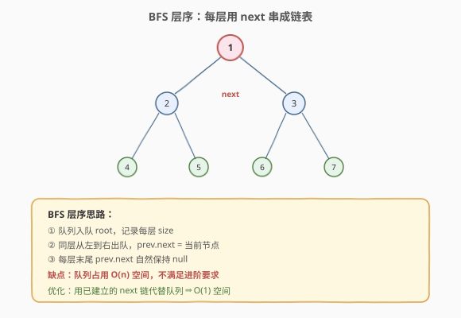
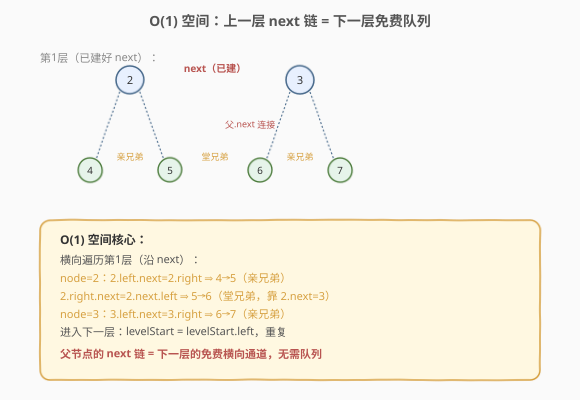
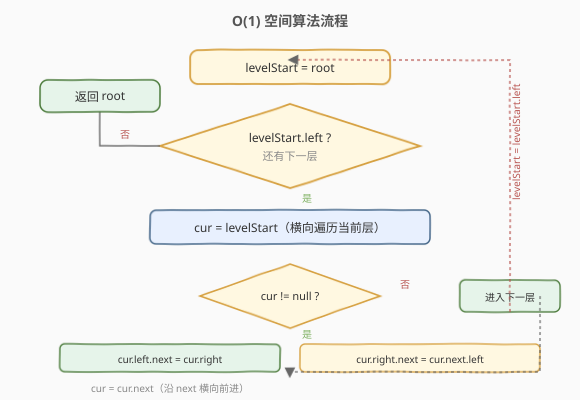

# LeetCode 填充每个节点的下一个右侧节点指针 题解

## 1. 题目概述

- **标题 / 题号**：填充每个节点的下一个右侧节点指针（#116，medium）
- **链接**：https://leetcode.cn/problems/populating-next-right-pointers-in-each-node/
- **难度**：中等
- **标签**：树、BFS、二叉树

**题意**：给定一棵**完美二叉树**（所有非叶子节点都有两个孩子，所有叶子在同一层），其每个节点有 `val`、`left`、`right`、`next` 四个指针。`next` 初始为 `null`。请将每个节点的 `next` 指向它**同一层右侧的下一个节点**；若没有右侧节点，`next` 保持 `null`。

**示例 1**：

```text
输入：root = [1,2,3,4,5,6,7]
输出：[1,#,2,3,#,4,5,6,7,#]
解释：每层末尾的 next 为 null，用 # 表示
```

**示例 2**：

```text
输入：root = []
输出：[]
```

**约束**：

- 树中节点数在 `[0, 2^12 - 1]` 范围内
- `-1000 <= Node.val <= 1000`
- **进阶**：只能使用常量级额外空间（递归栈不算额外空间）

## 2. 解题思路

### 2.1 暴力思路：BFS 层序遍历

用队列做层序 BFS，每一层从左到右出队，前一个节点的 `next` 指向后一个节点。直观易懂，但队列占用 `O(n)` 额外空间，不满足进阶的「常量空间」要求。

### 2.2 核心观察：利用已建立的 next 指针横向遍历



完美二叉树的特殊性：第 `i` 层的 `next` 链建好后，可以用它**横向遍历**第 `i` 层，同时为第 `i+1` 层建立 `next` 链，无需队列：

1. 从第 0 层的 `root` 开始。
2. 对当前层最左节点 `levelStart`，沿 `next` 横向遍历每个节点 `node`：
   - `node.left.next = node.right`（亲兄弟，必相邻）。
   - `node.right.next = node.next.left`（堂兄弟，靠父节点的 `next` 连接）。
3. 进入下一层：`levelStart = levelStart.left`，直到叶子层。



> 💡 关键洞察：**上一层已建好的 `next` 链就是下一层横向移动的「免费队列」**。父节点的 `next` 天然连接了相邻两棵子树，让堂兄弟节点得以相连。

### 2.3 算法流程图



### 2.4 示例演算

以 `root = [1,2,3,4,5,6,7]` 为例：

| 步骤 | 当前层 | 横向遍历 | 建立的 next |
|------|--------|----------|-------------|
| 1    | 第0层 [1] | 1 → null | 2→3（1.left.next=1.right） |
| 2    | 第1层 [2,3] | 2→3→null | 4→5（2.left.next=2.right）；5→6（2.right.next=2.next.left=3.left）；6→7（3.left.next=3.right） |
| 3    | 第2层 [4,5,6,7] | 全是叶子，无孩子，结束 | — |

最终每层节点通过 `next` 串成链表：`1` → `#`；`2` → `3` → `#`；`4` → `5` → `6` → `7` → `#`。

## 3. 参考代码

### C++

```cpp
class Solution {
  public:
    Node* connect(Node* root) {
        if (!root) return root;
        Node* levelStart = root;
        while (levelStart->left) {                  // 还有下一层
            Node* cur = levelStart;
            while (cur) {                            // 横向遍历当前层
                cur->left->next = cur->right;        // 亲兄弟
                if (cur->next) {
                    cur->right->next = cur->next->left;  // 堂兄弟
                }
                cur = cur->next;                     // 沿 next 前进
            }
            levelStart = levelStart->left;           // 进入下一层最左
        }
        return root;
    }
};
```

### Python

```python
class Solution:
    def connect(self, root: 'Optional[Node]') -> 'Optional[Node]':
        if not root:
            return root
        level_start = root
        while level_start.left:                      # 还有下一层
            cur = level_start
            while cur:                                # 横向遍历当前层
                cur.left.next = cur.right             # 亲兄弟
                if cur.next:
                    cur.right.next = cur.next.left    # 堂兄弟
                cur = cur.next                        # 沿 next 前进
            level_start = level_start.left            # 进入下一层最左
        return root
```

> 💡 外层 `while` 沿左边界下降（树高 `O(log n)`），内层 `while` 沿 `next` 横向走（每层节点数）。总访问 `O(n)`，**额外空间 `O(1)`**（仅用几个指针变量，递归栈不计）。

**BFS 层序版（不满足进阶，但直观）**：

```cpp
Node* connect(Node* root) {
    if (!root) return root;
    queue<Node*> q;
    q.push(root);
    while (!q.empty()) {
        int size = q.size();
        Node* prev = nullptr;
        for (int i = 0; i < size; ++i) {
            Node* node = q.front(); q.pop();
            if (prev) prev->next = node;
            prev = node;
            if (node->left)  q.push(node->left);
            if (node->right) q.push(node->right);
        }
    }
    return root;
}
```

## 4. 复杂度分析

| 维度 | 复杂度 | 说明 |
|------|--------|------|
| 时间复杂度 | O(n) | 每个节点访问一次（横向遍历累计覆盖所有节点） |
| 空间复杂度 | O(1) | 仅用 levelStart、cur 等常数指针；BFS 版为 O(n) |

## 5. 扩展：任意二叉树版（117）

[117. 填充每个节点的下一个右侧节点指针 II](https://leetcode.cn/problems/populating-next-right-pointers-in-each-node-ii/) 把「完美二叉树」放宽为「任意二叉树」。难点在于：节点可能没有左孩子或右孩子，堂兄弟连接需跳过空孩子。

做法仍是「用上一层 `next` 链横向遍历，为下一层建链」，但下一层的「头节点」和「前驱」需要动态寻找（不一定是 `left`）。维护一个 `dummy` 哨兵节点串起下一层链表即可，仍可做到 `O(1)` 空间。

> ⚠️ 116 的代码**不能**直接用于 117，因为 `cur->left` 和 `cur->right` 可能为空。117 需要更通用的「下一层链表构造」逻辑。但 117 的通用解法可用于 116。

## 6. 面试要点

1. **为什么 O(1) 空间可行？**
   - 完美二叉树每层节点通过 `next` 串成链表后，这条链表本身就是遍历下一层的「天然队列」。无需额外数据结构，只用 `next` 横向移动即可。

2. **亲兄弟和堂兄弟的区别？**
   - 亲兄弟：同一个父节点的左右孩子，`node.left.next = node.right` 必然成立。堂兄弟：相邻父节点的孩子，`node.right.next = node.next.left`，依赖父节点的 `next` 是否已建立。

3. **外层循环为什么沿左边界下降？**
   - 完美二叉树每层最左节点一定是上一层最左节点的 `left`。沿 `levelStart = levelStart.left` 下降就能依次访问每层最左节点，作为该层横向遍历的起点。

4. **递归解法行不行？**
   - 行。递归 `connect(node)`：先 `node.left.next = node.right`，再若 `node.next` 则 `node.right.next = node.next.left`，然后递归 `connect(node.left)`、`connect(node.right)`。空间 `O(log n)` 递归栈，不算 `O(1)`。

5. **为什么 116 不直接用 117 的通用解法？**
   - 116 的完美二叉树性质让代码更简洁（`left`/`right` 必存在）。117 需处理空孩子，代码更复杂但更通用。面试若题目是 116，写简洁版即可。

## 同类练习题

| # | 题目 | 与本题的关联 |
|---|------|-------------|
| 117 | [填充每个节点的下一个右侧节点指针 II](https://leetcode.cn/problems/populating-next-right-pointers-in-each-node-ii/) | 任意二叉树版，需通用解法 |
| 102 | [二叉树的层序遍历](https://leetcode.cn/problems/binary-tree-level-order-traversal/)（[题解](102_二叉树的层序遍历.md)） | BFS 层序的基础 |
| 199 | [二叉树的右侧视图](https://leetcode.cn/problems/binary-tree-right-side-view/)（[题解](199_二叉树的右视图.md)） | 每层最右节点，BFS 或 next 指针 |
| 104 | [二叉树的最大深度](https://leetcode.cn/problems/maximum-depth-of-binary-tree/)（[题解](104_二叉树的最大深度.md)） | 层序遍历求深度 |
