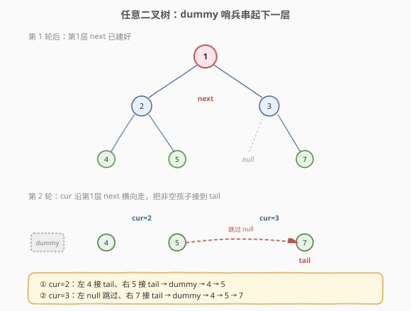
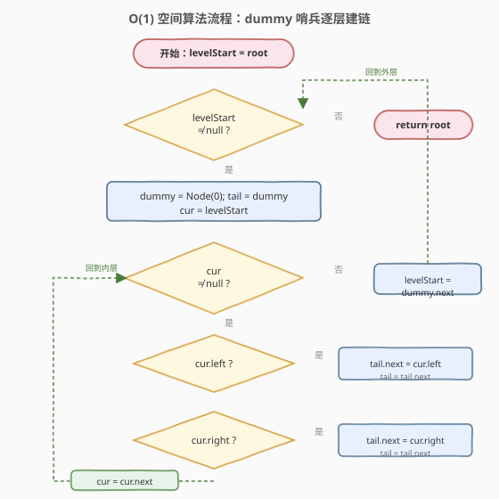
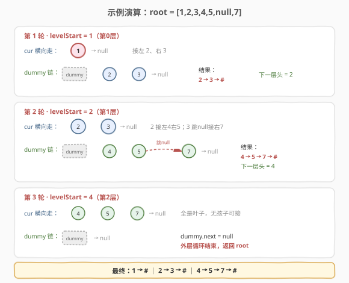

# LeetCode 填充每个节点的下一个右侧节点指针 II 题解

## 1. 题目概述

- **标题 / 题号**：填充每个节点的下一个右侧节点指针 II（#117，medium）
- **链接**：https://leetcode.cn/problems/populating-next-right-pointers-in-each-node-ii/
- **难度**：中等
- **标签**：树、BFS、二叉树、链表

**题意**：给定一棵**任意二叉树**（不要求完美、不要求完全），每个节点有 `val`、`left`、`right`、`next` 四个指针，`next` 初始为 `null`。请将每个节点的 `next` 指向它**同一层右侧的下一个节点**；若没有右侧节点，`next` 保持 `null`。

**示例 1**：

```text
输入：root = [1,2,3,4,5,null,7]
输出：[1,#,2,3,#,4,5,7,#]
解释：第0层 1；第1层 2→3；第2层 4→5→7。注意节点 3 没有左孩子，
      7 是 3 的右孩子，靠 2→3 的 next 链与 4、5 连成一层。
```

```text
      1                    1 → #
     / \                  / \
    2   3       ⇒       2 → 3 → #
   / \   \             / \   \
  4   5   7           4 → 5 → 7 → #
```

**示例 2**：

```text
输入：root = []
输出：[]
```

**约束**：

- 树中节点数在 `[0, 6000]` 范围内
- `-100 <= Node.val <= 100`
- **进阶**：只能使用常量级额外空间（递归栈不算额外空间）

> ⚠️ 本题是 [116. 填充每个节点的下一个右侧节点指针](116_填充每个节点的下一个右侧节点指针.md) 的**进阶版**：116 限定完美二叉树（每个非叶子节点必有左右两个孩子），本题放宽为**任意二叉树**——节点可能只有左孩子、只有右孩子、或是叶子。这一放宽让 116 那套「沿左边界下降 + `left`/`right` 必存在」的简洁写法直接失效。

## 2. 解题思路

### 2.1 暴力思路：BFS 层序遍历

用队列做层序 BFS：每一层从左到右出队，前一个节点的 `next` 指向后一个节点。直观易懂，但队列占用 $O(n)$ 额外空间，不满足进阶的「常量空间」要求。对任意二叉树而言，BFS 层序版和 116 完全相同（不依赖完美性），但我们要追求 $O(1)$ 空间。

### 2.2 核心观察：dummy 哨兵 + 上一层 next 链横向遍历



116 的核心思想是「**上一层已建好的 `next` 链就是下一层横向移动的免费队列**」。这个思想在任意二叉树下依然成立——难点只在于**下一层链表怎么构造**：

| 难点 | 116（完美树） | 117（任意树） |
|------|---------------|---------------|
| 下一层头节点 | 必是 `levelStart.left` | 不确定，可能是某个节点的 `left` 或 `right` |
| 亲兄弟连接 | `node.left.next = node.right`（两者必存在） | `left`/`right` 可能为空，需逐个判断 |
| 堂兄弟连接 | `node.right.next = node.next.left` | 下一层前驱不一定是 `right`，需动态跟踪 |

**解法**：引入一个 `dummy` **哨兵节点**作为下一层链表的虚拟头，用 `tail` 指针跟踪下一层链表的当前末尾。横向遍历当前层时，把每个节点的**非空孩子**依次接到 `tail` 后面——无论这个孩子是 `left` 还是 `right`，也无论前一个孩子来自哪个父节点。



> 💡 **关键洞察**：`dummy` 哨兵把「下一层的头在哪」这个不确定性彻底消除了——不管第一个非空孩子是某个节点的左孩子还是右孩子，它都会被接到 `dummy.next`。遍历完当前层后，`dummy.next` 就是下一层的最左节点。这正是 117 相比 116 多出来的那一行核心抽象。

### 2.3 算法流程

1. `levelStart = root`（当前层最左节点）。
2. **外层循环** `while levelStart != null`：
   - 创建 `dummy` 哨兵节点（值无所谓），`tail = dummy`（下一层链表尾指针）。
   - `cur = levelStart`（当前层横向遍历指针）。
   - **内层循环** `while cur != null`（沿 `next` 横向走当前层）：
     - 若 `cur.left` 非空：`tail.next = cur.left`，`tail = tail.next`。
     - 若 `cur.right` 非空：`tail.next = cur.right`，`tail = tail.next`。
     - `cur = cur.next`（走向当前层下一个节点）。
   - 内层结束：当前层遍历完毕，`dummy.next` 即下一层最左节点。
   - `levelStart = dummy.next`（进入下一层）。
3. 外层结束（`levelStart` 为 `null`，说明上一层全是叶子，无下一层）：返回 `root`。

### 2.4 示例演算

以 `root = [1,2,3,4,5,null,7]` 为例：



| 轮次 | levelStart | 横向遍历 cur | 接到 tail 的孩子 | dummy 链（下一层） | 建立的 next |
|------|-----------|-------------|------------------|--------------------|-------------|
| 1 | 1（第0层） | 1 → null | 1 的左 2、右 3 | dummy → 2 → 3 | 2 → 3 |
| 2 | 2（第1层） | 2 → 3 → null | 2 的左 4、右 5；3 的左 null(跳)、右 7 | dummy → 4 → 5 → 7 | 4 → 5 → 7 |
| 3 | 4（第2层） | 4 → 5 → 7 → null | 全是叶子，无孩子 | dummy → null | — |

第 3 轮 `dummy.next = null`，外层循环退出。最终每层：`1` → `#`；`2` → `3` → `#`；`4` → `5` → `7` → `#`。

> 💡 **关注第 2 轮**：`cur = 3` 时，它的 `left` 是 `null`（题目里的那个 `null` 占位），直接跳过；接着处理 `right = 7`，把 7 接到 tail 后面。7 之所以能和 4、5 连成一层，正是因为 `cur = 2` 处理完后沿 `2.next = 3` 走到了 3——这条 `next` 链是第 1 轮刚建好的。**上一层的成果就是下一层的脚手架**。

## 3. 参考代码

### C++

```cpp
/*
// Definition for a Node.
class Node {
public:
    int val;
    Node* left;
    Node* right;
    Node* next;
    Node() : val(0), left(nullptr), right(nullptr), next(nullptr) {}
    Node(int _val) : val(_val), left(nullptr), right(nullptr), next(nullptr) {}
    Node(int _val, Node* _left, Node* _right, Node* _next)
        : val(_val), left(_left), right(_right), next(_next) {}
};
*/
class Solution {
  public:
    Node* connect(Node* root) {
        if (!root) return root;
        Node* levelStart = root;
        while (levelStart) {                 // 还有下一层待处理
            Node dummy(0);                   // 栈上哨兵，自动释放
            Node* tail = &dummy;             // 下一层链表尾指针
            Node* cur = levelStart;          // 当前层横向遍历指针
            while (cur) {                    // 沿 next 横向走当前层
                if (cur->left) {
                    tail->next = cur->left;
                    tail = tail->next;
                }
                if (cur->right) {
                    tail->next = cur->right;
                    tail = tail->next;
                }
                cur = cur->next;
            }
            levelStart = dummy.next;         // 进入下一层最左节点
        }
        return root;
    }
};
```

### Python

```python
"""
# Definition for a Node.
class Node:
    def __init__(self, val=0, left=None, right=None, next=None):
        self.val = val
        self.left = left
        self.right = right
        self.next = next
"""
class Solution:
    def connect(self, root: 'Node') -> 'Node':
        if not root:
            return root
        level_start = root
        while level_start:                   # 还有下一层待处理
            dummy = Node(0)                  # 哨兵节点
            tail = dummy                     # 下一层链表尾指针
            cur = level_start                # 当前层横向遍历指针
            while cur:                       # 沿 next 横向走当前层
                if cur.left:
                    tail.next = cur.left
                    tail = tail.next
                if cur.right:
                    tail.next = cur.right
                    tail = tail.next
                cur = cur.next
            level_start = dummy.next         # 进入下一层最左节点
        return root
```

> 💡 **实现细节**：① `dummy` 只是个临时头，`tail` 从它出发，第一个接上的非空孩子成为 `dummy.next`。② `tail = tail.next` 而非 `tail = cur.left`——前者让 `tail` 始终指向链表真实末尾，写法统一（不必区分接的是 `left` 还是 `right`）。③ C++ 版用栈上 `Node dummy(0)` 避免堆分配，循环结束时自动析构；`levelStart = dummy.next` 在析构前已拷走指针值，安全。④ 本解法**通用**——把 116 的树喂给它也完全正确，所以面试若被追问「116 能不能用这版代码」，答案是「能，但 116 有更简洁的特化解法」。

**BFS 层序版（不满足进阶，但最直观）**：

```cpp
Node* connect(Node* root) {
    if (!root) return root;
    queue<Node*> q;
    q.push(root);
    while (!q.empty()) {
        int size = q.size();
        Node* prev = nullptr;
        for (int i = 0; i < size; ++i) {
            Node* node = q.front(); q.pop();
            if (prev) prev->next = node;
            prev = node;
            if (node->left)  q.push(node->left);
            if (node->right) q.push(node->right);
        }
    }
    return root;
}
```

> BFS 版对任意二叉树天然适用（入队前判空），只是空间 $O(n)$。面试可先写 BFS 讲清思路，再优化到 $O(1)$ 的哨兵版。

## 4. 复杂度分析

| 维度 | 复杂度 | 说明 |
|------|--------|------|
| 时间复杂度 | $O(n)$ | 每个节点被访问一次：内层 `while` 沿 `next` 横向遍历当前层，累计覆盖全部节点；外层沿 `levelStart` 逐层下降 |
| 空间复杂度 | $O(1)$ | 仅用 `levelStart`、`cur`、`tail`、`dummy` 等常数个指针变量；C++ 栈上哨兵不占堆空间。BFS 版为 $O(n)$ 队列空间 |

> ⚠️ 虽然每轮外层循环都创建一个 `dummy`，但它是**常数大小**的单个节点（不是数组/队列），且随循环体结束即释放。空间复杂度按「任意时刻额外占用的最大空间」计，始终是 $O(1)$。

## 5. 扩展：递归解法与 follow-up

**递归解法**（空间 $O(h)$ 递归栈，不满足进阶，但思路清晰）：

对每个节点，先处理它自身的两个孩子连接，再递归处理下一层。难点是「堂兄弟连接」——`node.right`（或 `node` 唯一的孩子）要接到 `node.next` 那一侧的最左非空孩子上。这需要在 `node` 的 `next` 链上往后找第一个有孩子的节点：

```cpp
Node* connect(Node* root) {
    if (!root) return root;
    Node* nxt = root->next;
    while (nxt && !nxt->left && !nxt->right)  // 沿 next 找下一个有孩子的兄弟
        nxt = nxt->next;
    Node* target = nxt ? (nxt->left ? nxt->left : nxt->right) : nullptr;
    if (root->right) {
        root->right->next = target;
        if (root->left) root->left->next = root->right;
    } else if (root->left) {
        root->left->next = target;
    }
    connect(root->right);   // 先右后左，保证 next 链已建好
    connect(root->left);
    return root;
}
```

> ⚠️ 递归顺序需**先右后左**：处理左子树时，右侧兄弟的 `next` 链必须已建好，否则 `target` 会找不全。递归栈深度 $O(h)$，最坏退化链 $O(n)$，不算 $O(1)$。

**Follow-up**：能否只用 $O(1)$ 空间？——能，本文第 3 节的 `dummy` 哨兵迭代版即为答案，这也是面试官最想听到的解法。

## 6. 面试要点

1. **117 和 116 的核心区别是什么？**
   - 116 是完美二叉树，每个非叶子节点必有左右孩子，所以 `node.left.next = node.right` 必然成立，下一层头必是 `levelStart.left`，代码极简。117 是任意二叉树，孩子可能缺失，下一层头和前驱都需要动态寻找——引入 `dummy` 哨兵统一处理。

2. **dummy 哨兵的作用是什么？**
   - 它是下一层链表的虚拟头节点，`tail` 从 `dummy` 出发。不管第一个非空孩子是某节点的 `left` 还是 `right`，都会被接到 `dummy.next`。这样遍历完当前层后，`dummy.next` 直接给出下一层最左节点，无需单独处理「头节点」的边界情况——这是链表题里「哑节点」思想在树上的迁移。

3. **为什么内层循环沿 `cur.next` 走就是遍历当前层？**
   - 因为当前层的 `next` 链在**处理上一层时已经建好**了。我们处理第 $i$ 层时，第 $i$ 层的 `next` 链已由第 $i-1$ 层的处理过程串好。所以 `cur = cur.next` 能横向遍历整个当前层，无需队列——这正是「用上一层成果当下一层脚手架」的递推本质。

4. **`tail = tail.next` 和 `tail = cur.left` 有什么区别？**
   - 两者在接 `left` 时效果相同，但接 `right` 时 `tail = cur.left` 会错（`cur.left` 是 `null` 或别的节点）。统一写 `tail = tail.next` 不必区分接的是 `left` 还是 `right`，代码更简洁且不易出错。

5. **能不能用递归做到 $O(1)$ 空间？**
   - 不能。递归必然消耗 $O(h)$ 栈空间（$h$ 为树高，最坏 $O(n)$）。进阶要求 $O(1)$ 必须用迭代。但递归版思路清晰，面试可先讲递归再优化到迭代哨兵版。

## 同类练习题

| # | 题目 | 与本题的关联 |
|---|------|-------------|
| 116 | [填充每个节点的下一个右侧节点指针](https://leetcode.cn/problems/populating-next-right-pointers-in-each-node/)（[题解](116_填充每个节点的下一个右侧节点指针.md)） | 完美二叉树版，本题的简化版，对比学习「特解 vs 通解」 |
| 102 | [二叉树的层序遍历](https://leetcode.cn/problems/binary-tree-level-order-traversal/)（[题解](102_二叉树的层序遍历.md)） | BFS 层序的基础模板，本题的暴力版即基于它 |
| 199 | [二叉树的右视图](https://leetcode.cn/problems/binary-tree-right-side-view/)（[题解](199_二叉树的右视图.md)） | 每层最右节点，可用 `next` 链横向遍历到层尾 |
| 662 | [二叉树最大宽度](https://leetcode.cn/problems/maximum-width-of-binary-tree/)（[题解](../0601-0700/662_二叉树最大宽度.md)） | 层序遍历 + 节点编号，与本题同属「按层处理二叉树」家族 |
