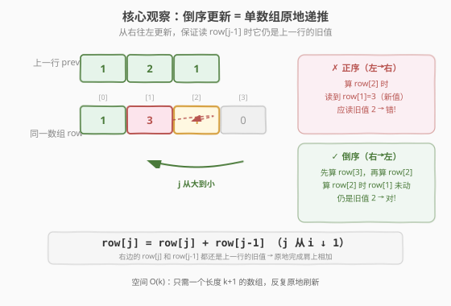
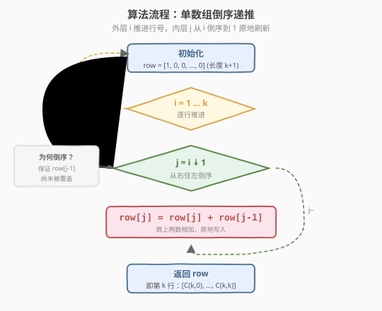
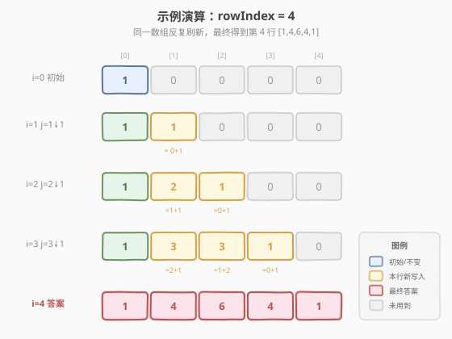

# 杨辉三角II

- **题目名称**：杨辉三角 II
- **链接**：[119. 杨辉三角 II](https://leetcode.cn/problems/pascals-triangle-ii/)
- **难度**：简单
- **标签**：数组、动态规划

## 1. 题目概述

给定一个非负整数 `rowIndex`，生成「杨辉三角」的第 `rowIndex` 行（行号从 0 开始）。

> ⚠️ 注意行号从 0 开始：`rowIndex = 0` 返回 `[1]`，`rowIndex = 1` 返回 `[1,1]`，`rowIndex = 4` 返回 `[1,4,6,4,1]`。

在「杨辉三角」中，每个数是它**左上方**和**右上方**两个数的和。每行的首尾两个数固定为 `1`。

**进阶要求**：能否将算法的空间复杂度优化到 $O(\text{rowIndex})$？

**示例 1**：

```text
输入：rowIndex = 3
输出：[1,3,3,1]
```

**示例 2**：

```text
输入：rowIndex = 0
输出：[1]
```

**示例 3**：

```text
输入：rowIndex = 1
输出：[1,1]
```

**约束条件**：

- `0 <= rowIndex <= 33`

> 💡 本题是 [118. 杨辉三角](../0001-0100/118_杨辉三角.md) 的进阶版：118 要求返回**整个三角形**（`O(n²)` 输出不可避免），而 119 只返回**第 `k` 行**——这让「单数组原地递推」成为可能，把额外空间从 `O(n²)` 压到 `O(k)`。两题共享同一条递推式 `triangle[i][j] = triangle[i-1][j-1] + triangle[i-1][j]`，区别仅在于「要不要保留前面的行」。

---

## 2. 解题思路

### 2.1 暴力思路：复用 118 生成整三角

最直接的做法是照搬 [118. 杨辉三角](../0001-0100/118_杨辉三角.md) 的代码，先生成前 `rowIndex+1` 行的完整三角形，再取最后一行返回：

```text
1. 调用 118 的 generate(rowIndex + 1) 生成整三角；   O(k²) 空间
2. 返回 res[rowIndex]。
```

时间 $O(k^2)$，空间 $O(k^2)$（要存整个三角形）。

> ⚠️ 问题在于：本题**只需要一行**，却为前面的 `k` 行各存了一份完整数据，纯属浪费。第 `i` 行算完后，第 `i-1` 行就再也不会被用到——除「上一行」之外的历史行全是冗余。这正是空间优化的切入点。

### 2.2 核心观察：单数组倒序递推

**关键定义**：设 `row[j]` 表示当前正在构造的行的第 `j` 个元素（`j` 从 0 开始）。

**核心思考**：第 `i` 行的每个中间值 `row[j]` 只依赖第 `i-1` 行的 `j-1` 和 `j` 两个位置。如果我们**只用一个数组**反复刷新，让它在刷新前始终保存着「上一行」的值，就能原地完成递推。

难点在于：**更新顺序**。若从左到右（`j=1,2,…`）更新，算 `row[2]` 时 `row[1]` 已被新值覆盖，读到的不再是「上一行」的旧值。

> 💡 破局点：**从右到左（倒序）更新**。令 `j` 从 `i` 递减到 `1`，执行 `row[j] = row[j] + row[j-1]`。因为 `j` 从大到小走，算 `row[j]` 时 `row[j-1]` 还没轮到更新——它仍是「上一行」的旧值。于是一对旧值相加写入新值，互不干扰。



对照正序（错误）与倒序（正确）：

- **正序 `j=1→i`**：算 `row[2]` 时 `row[1]` 已是新值 → `row[2] = old[2] + new[1]` ✗
- **倒序 `j=i→1`**：算 `row[2]` 时 `row[1]` 尚未更新 → `row[2] = old[2] + old[1]` ✓

> 💡 这与 [118. 杨辉三角](../0001-0100/118_杨辉三角.md) 的「整行初始化为 1 + 逐行构造」是同一条递推式的两种实现：118 用二维表显式存下每一行；119 用单数组反复刷新，靠**倒序**保证读旧写新。本质都是 `triangle[i][j] = triangle[i-1][j-1] + triangle[i-1][j]`，只是空间策略不同。

### 2.3 算法流程图

有了「单数组 + 倒序」的框架，流程极简：



**四步法**：

1. **初始化**：`row = [1, 0, 0, …, 0]`（长度 `k+1`，首元素为 1，其余为 0）。
2. **外层循环**：`i` 从 `1` 到 `k`，逐行推进。
3. **内层循环**：对每个 `i`，`j` 从 `i` **倒序**到 `1`，执行 `row[j] = row[j] + row[j-1]`。
4. **返回** `row`，即为第 `k` 行。

> ⚠️ 内层必须倒序：`for (int j = i; j >= 1; --j)`。若写成 `for (int j = 1; j <= i; ++j)`，`row[j-1]` 已被本轮更新覆盖，结果全错。这是本题唯一也是最容易踩的坑。

### 2.4 示例演算

以 `rowIndex = 4`（`k = 4`）为例，观察单数组如何逐行刷新成最终的第 4 行：



| 行号 i | 刷新后 row | 内层倒序步骤（j 从 i ↓ 1） |
|--------|-----------|---------------------------|
| 0 | `[1, 0, 0, 0, 0]` | 初始，无需刷新 |
| 1 | `[1, 1, 0, 0, 0]` | `j=1`: `row[1]=0+1=1` |
| 2 | `[1, 2, 1, 0, 0]` | `j=2`: `row[2]=0+1=1`；`j=1`: `row[1]=1+1=2` |
| 3 | `[1, 3, 3, 1, 0]` | `j=3`: `1=0+1`；`j=2`: `3=1+2`；`j=1`: `3=2+1` |
| 4 | `[1, 4, 6, 4, 1]` | `j=4`: `1=0+1`；`j=3`: `4=1+3`；`j=2`: `6=3+3`；`j=1`: `4=3+1` |

最终输出 `[1,4,6,4,1]`。

> 💡 观察每一步的「肩上相加」：例如 `i=4, j=2` 时 `row[2] = row[2] + row[1] = 3 + 3 = 6`，右边的 `3` 是上一行（`i=3`）的 `row[2]`，左边的 `3` 是上一行的 `row[1]`——正是 [118](../0001-0100/118_杨辉三角.md) 里「肩上两数相加」的原地版。

---

## 3. 参考代码

### C++

#### 法一：单数组倒序递推（推荐，满足进阶要求）

```cpp
// 杨辉三角 II.cpp —— 单数组倒序递推，O(k) 空间
// 编译: g++ -O2 -std=c++17 杨辉三角II.cpp -o pascal2
#include <vector>
using namespace std;

class Solution {
  public:
    vector<int> getRow(int rowIndex) {
        vector<int> row(rowIndex + 1, 0);
        row[0] = 1;                       // 第 0 行：[1]
        for (int i = 1; i <= rowIndex; ++i) {
            for (int j = i; j >= 1; --j) { // 倒序：保证 row[j-1] 仍是上一行旧值
                row[j] = row[j] + row[j - 1];
            }
        }
        return row;
    }
};
```

#### 法二：组合数递推（O(k) 时间，O(1) 额外空间）

```cpp
class Solution {
  public:
    vector<int> getRow(int rowIndex) {
        vector<int> row(rowIndex + 1);
        row[0] = 1;                       // C(k, 0) = 1
        for (int j = 1; j <= rowIndex; ++j) {
            // C(k, j) = C(k, j-1) * (k - j + 1) / j
            row[j] = (long long)row[j - 1] * (rowIndex - j + 1) / j;
        }
        return row;
    }
};
```

> ⚠️ 法二的除法 `/ j` 在数学上是整除（结果必为整数）。C++ 中直接写整数除法要**先乘后除**，且用 `long long` 暂存乘积以防中间结果溢出：`rowIndex ≤ 33` 时 `C(33,16)` 约 $1.17 \times 10^9$，乘以 `rowIndex` 后会超过 `int` 上限。

### Python

#### 法一：单数组倒序递推（推荐，满足进阶要求）

```python
class Solution:
    def getRow(self, rowIndex: int) -> List[int]:
        row = [0] * (rowIndex + 1)
        row[0] = 1
        for i in range(1, rowIndex + 1):
            for j in range(i, 0, -1):      # 倒序：保证 row[j-1] 仍是上一行旧值
                row[j] = row[j] + row[j - 1]
        return row
```

#### 法二：组合数递推（O(k) 时间，Python 大数天然不溢出）

```python
class Solution:
    def getRow(self, rowIndex: int) -> List[int]:
        row = [1] * (rowIndex + 1)
        for j in range(1, rowIndex + 1):
            row[j] = row[j - 1] * (rowIndex - j + 1) // j
        return row
```

> 💡 Python 的整数无上限，法二无需担心溢出，可直接写 `row[j-1] * (rowIndex - j + 1) // j`。两种语言都推荐**法一**作为主答：它直接复用 118 的递推骨架，只多了一个「倒序」的细节，思路最连贯；法二作为「还能更快」的进阶展示。

---

## 4. 复杂度分析

| 维度 | 法一 倒序递推 | 法二 组合数递推 | 说明 |
|------|--------------|----------------|------|
| **时间复杂度** | $O(k^2)$ | $O(k)$ | 法一算 $\frac{k(k+1)}{2}$ 次加法；法二只算 `k` 次乘除 |
| **空间复杂度（含输出）** | $O(k)$ | $O(k)$ | 输出本身占 `k+1` 个整数，这是题目硬性要求 |
| **空间复杂度（不含输出）** | $O(1)$ | $O(1)$ | 仅用循环变量，原地刷新输出数组 |

> ⚠️ 注意：本题**必须返回第 `k` 行**，所以 $O(k)$ 的输出空间是题目硬性要求，无法压缩。所谓「$O(k)$ 额外空间」指的是**除输出之外**的辅助空间为 $O(1)$——法一在输出数组上原地操作，正好满足进阶要求。

---

## 5. 扩展：与 118 的对比及组合数视角

### 5.1 118 vs 119：同一递推，不同空间策略

| 维度 | 118 杨辉三角 | 119 杨辉三角 II |
|------|-------------|-----------------|
| 输出 | 整个三角形（`n` 行） | 单行（第 `k` 行） |
| 输出空间 | $O(n^2)$（不可避免） | $O(k)$（不可避免） |
| 最优空间策略 | 二维表逐行构造 | 单数组倒序递推 |
| 时间 | $O(n^2)$ | $O(k^2)$（法一）/ $O(k)$（法二） |

两题共享递推式 `triangle[i][j] = triangle[i-1][j-1] + triangle[i-1][j]`。118 因要保留所有行，必须存二维表；119 只要最后一行，便可用单数组反复刷新——**「要不要保留历史行」决定了能否压缩空间**。

### 5.2 组合数视角：第 k 行即二项式系数

第 `k` 行的第 `j` 个元素（从 0 开始）恰好是组合数 $C_k^j$，即二项式 $(1+x)^k$ 展开式的系数：

$$C_k^j = \frac{k!}{j! \cdot (k-j)!}$$

相邻两项满足递推：

$$C_k^j = C_k^{j-1} \times \frac{k - j + 1}{j}$$

这就是法二的依据——从 $C_k^0 = 1$ 出发，**从左到右递推一行只需 `O(k)`**，无需保留上一行。它比法一的 $O(k^2)$ 更快，但需要理解组合数递推且注意整数溢出。

> 💡 这条递推在 [118. 杨辉三角](../0001-0100/118_杨辉三角.md) 第 5.2 节已铺垫，这里正是其落地。掌握它，你就把「二维表格递推」和「组合数一维递推」两条线打通了。

### 5.3 倒序技巧的通用性

「单数组 + 倒序更新」是**一维滚动数组优化二维 DP** 的通用范式：凡状态依赖「上一行的左方和正上方」且只需最后一行，都可如此压缩。例如：

- [62. 不同路径](https://leetcode.cn/problems/unique-paths/)：`dp[j] = dp[j] + dp[j-1]`（上方 + 左方），倒序或正序皆可（因为只读 `j` 和 `j-1`，正序时 `dp[j-1]` 已更新为本行值恰好是「左方」所需）；
- [64. 最小路径和](https://leetcode.cn/problems/minimum-path-sum/)：原地修改输入矩阵即可做到 $O(1)$ 额外空间。

> ⚠️ 注意方向依赖：本题依赖「上一行的 `j-1`」故必须**倒序**；而不同路径依赖「本行的 `j-1`」故正序才对。方向的取舍取决于「要读旧值还是新值」，是滚动数组最微妙之处。

---

## 6. 面试要点

1. **为什么内层循环必须倒序？**

   - 递推式 `row[j] = row[j] + row[j-1]` 右边两个值都必须是**上一行**的旧值。若 `j` 从小到大走，算 `row[j]` 时 `row[j-1]` 已被本轮更新成新值，相当于 `new[j] = old[j] + new[j-1]`，结果错误。倒序（`j` 从大到小）保证算 `row[j]` 时 `row[j-1]` 尚未轮到更新，仍是旧值。

2. **法一和法二各自的时间和空间是多少？哪个更优？**

   - 法一（倒序递推）时间 $O(k^2)$、额外空间 $O(1)$；法二（组合数递推）时间 $O(k)$、额外空间 $O(1)$。法二更快，但需理解组合数递推并处理整数溢出（C++ 用 `long long`）。面试中先讲法一（思路承接 118，最连贯），再引出法二（更快）作为进阶。

3. **「$O(k)$ 额外空间」的进阶要求，法一满足吗？**

   - 满足。法一在长度为 `k+1` 的输出数组上原地操作，除输出本身外只用循环变量，额外空间 $O(1)$。题目要求的 $O(k)$ 空间指的是含输出在内的总空间，正好是输出数组本身的大小。

4. **法二的除法 `/ j` 为什么不会出错？**

   - 数学上 $C_k^j$ 是整数，所以 `row[j-1] * (k-j+1)` 必然被 `j` 整除。但 C++ 整数除法会截断，必须**先乘后除**且用 `long long` 暂存乘积，避免中间结果溢出导致错误截断。`rowIndex ≤ 33` 时中间乘积最大约 $1.17 \times 10^9 \times 33 \approx 3.9 \times 10^{10}$，超过 `int` 上限，故必须用 `long long`。Python 整数无上限，无需担心。

5. **第 `k` 行和组合数 $C_k^j$ 是什么关系？**

   - 第 `k` 行的第 `j` 个元素（从 0 开始）恰好等于 $C_k^j$（从 `k` 个里选 `j` 个的组合数），即二项式 $(1+x)^k$ 的系数。这是帕斯卡恒等式 $C_k^j = C_{k-1}^{j-1} + C_{k-1}^j$ 的直接体现——选第 `j` 个元素要么包含某固定元素（$C_{k-1}^{j-1}$），要么不包含（$C_{k-1}^j$）。法二正是利用相邻组合数的递推 $C_k^j = C_k^{j-1} \times \frac{k-j+1}{j}$ 直接生成一行。

> 💡 **一句话总结**：119 是 118 的空间优化版——只返一行，便可用「单数组 + 倒序更新」把额外空间压到 $O(1)$。核心是让内层 `j` 从大到小走，保证读 `row[j-1]` 时它仍是上一行旧值。进阶可用组合数递推把时间也降到 $O(k)$。

---

## 7. 同类练习题

- [118. 杨辉三角](https://leetcode.cn/problems/pascals-triangle/)（[题解](../0001-0100/118_杨辉三角.md)）：返回整个三角形，本题的直接前身，二维递推骨架相同
- [62. 不同路径](https://leetcode.cn/problems/unique-paths/)：网格路径计数，`dp[j]=dp[j]+dp[j-1]`，单数组滚动优化的同构题
- [64. 最小路径和](https://leetcode.cn/problems/minimum-path-sum/)：网格最小路径和，原地修改矩阵做到 $O(1)$ 额外空间
- [922. 按奇偶排序数组 II](https://leetcode.cn/problems/sort-array-by-parity-ii/)：原地双指针填充，同样是「读旧写新」的原地技巧
- [283. 移动零](https://leetcode.cn/problems/move-zeroes/)：单数组原地重排，体会「覆盖与保留」的方向取舍
