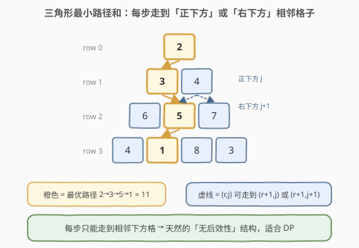
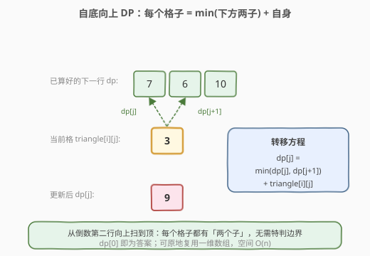

# 三角形最小路径和

- **题目名称**：三角形最小路径和
- **链接**：[120. 三角形最小路径和](https://leetcode.cn/problems/triangle/)
- **难度**：中等
- **标签**：数组、动态规划、网格 DP

## 1. 题目概述

给定一个非空二维数组 `triangle`，第 `i` 行有 `i+1` 个元素。自顶向下走，每一步只能移动到**下一行相邻**的格子：从 `(i, j)` 可以走到 `(i+1, j)`（正下方）或 `(i+1, j+1)`（右下方）。求自顶向下的**最小路径和**。

> ⚠️ 每一步只能走到相邻下方格，不能横跨或回退。

**示例 1**：

```text
输入：triangle = [[2],[3,4],[6,5,7],[4,1,8,3]]
输出：11
解释：自顶向下的最小路径和为 2 + 3 + 5 + 1 = 11。
```

**示例 2**：

```text
输入：triangle = [[-10]]
输出：-10
```

**约束条件**：

- $1 \leq \text{triangle.length} \leq 200$
- $\text{triangle}[i].\text{length} = \text{triangle}[i-1].\text{length} + 1$
- $-10^4 \leq \text{triangle}[i][j] \leq 10^4$

> 💡 本题是 [64. 最小路径和](../0001-0100/64_最小路径和.md) 的「三角形变体」：同样是只能向下方走的网格 DP，但形状是三角形、且每格有**两个子**而非「上/左两个父」。本题的优雅解法是**自底向上**，可避开所有边界特判。

---

## 2. 解题思路

### 2.1 暴力思路

从顶点 `(0,0)` 出发 DFS，每步分两支走向正下方或右下方，走到最后一行时记录路径和取最小。路径数约 $2^{n-1}$，$n=200$ 时指数爆炸。

> 💡 大量重复计算「从 `(i,j)` 走到底的最小和」——这是**重叠子问题**信号 → 上 DP。

### 2.2 核心观察：自底向上 DP



设 $dp[j]$ 表示「从某行第 $j$ 列走到底的**最小路径和**」。如果**从下往上**填表，那么处理第 $i$ 行时，第 $i+1$ 行的 $dp$ 已经算好。此时第 $i$ 行第 $j$ 格的答案只依赖它正下方 $(j)$ 与右下方 $(j+1)$ 两个子：

$$
dp[j] = \min(dp[j],\ dp[j+1]) + \text{triangle}[i][j]
$$



> 💡 **为什么自底向上比自顶向下优雅？**
> 自顶向下时，首格 $(0,0)$ 只有自身、其余每行的**首列只能从正上方来、末列只能从左上方来**，需特判两条边界；而自底向上时，每个格子都**恰好有两个子**（下方与右下方），转移公式全局统一，**零边界特判**。最终顶点 `dp[0]` 即为答案。

### 2.3 算法流程图


1. 把 `dp` 初始化为 `triangle` 最后一行。
2. 行下标 `i` 从 $n-2$ **倒序**到 $0`：
   - 列下标 `j` 从 `0` 到 `i`（顺序）：
     - `dp[j] = min(dp[j], dp[j+1]) + triangle[i][j]`
3. 返回 `dp[0]`。

> ⚠️ **顺序细节**：行必须**倒序**（先算底行），列**正序**即可。因为更新 `dp[j]` 用到 `dp[j+1]`（右下子），而 `dp[j+1]` 属于下一行、本轮尚未被覆盖，仍是有效值；若把列也倒序则会先覆盖 `dp[j+1]`，导致读到错误值。

### 2.4 示例演算

以 `triangle = [[2],[3,4],[6,5,7],[4,1,8,3]]` 为例，自底向上填表：


逐行计算过程：

| 阶段 | 处理行 | 计算 | dp 数组（前 i+1 位有效） |
|------|--------|------|--------------------------|
| ① | 初始 | dp ← row 3 | [4, 1, 8, 3] |
| ② | row 2 `[6,5,7]` | min(4,1)+6 · min(1,8)+5 · min(8,3)+7 | [7, 6, 10, 3] |
| ③ | row 1 `[3,4]` | min(7,6)+3 · min(6,10)+4 | [9, 10, 10, 3] |
| ④ | row 0 `[2]` | min(9,10)+2 | **[11], …** |

最终 `dp[0] = 11`，回溯最优路径为 `2 → 3 → 5 → 1`。

---

## 3. 参考代码

### C++（一维 DP，$O(n)$ 空间）

```cpp
class Solution {
  public:
    int minimumTotal(vector<vector<int>>& triangle) {
        int n = triangle.size();
        vector<int> dp(triangle.back());          // dp ← 最后一行
        for (int i = n - 2; i >= 0; --i) {        // 自底向上
            for (int j = 0; j <= i; ++j) {
                dp[j] = min(dp[j], dp[j + 1]) + triangle[i][j];
            }
        }
        return dp[0];
    }
};
```

### C++（原地修改，$O(1)$ 额外空间）

```cpp
class Solution {
  public:
    int minimumTotal(vector<vector<int>>& triangle) {
        int n = triangle.size();
        for (int i = n - 2; i >= 0; --i) {
            for (int j = 0; j <= i; ++j) {
                triangle[i][j] += min(triangle[i + 1][j], triangle[i + 1][j + 1]);
            }
        }
        return triangle[0][0];
    }
};
```

### Python

```python
class Solution:
    def minimumTotal(self, triangle: List[List[int]]) -> int:
        dp = triangle[-1][:]                     # dp ← 最后一行（拷贝）
        for i in range(len(triangle) - 2, -1, -1):
            for j in range(i + 1):
                dp[j] = min(dp[j], dp[j + 1]) + triangle[i][j]
        return dp[0]
```

---

## 4. 复杂度分析

| 维度 | 复杂度 | 说明 |
|------|--------|------|
| 时间复杂度 | $O(n^2)$ | 每个格子计算一次，总格子数 $1+2+\dots+n = \frac{n(n+1)}{2}$ |
| 空间复杂度（一维） | $O(n)$ | `dp` 长度等于最后一行长度 $n$ |
| 空间复杂度（原地） | $O(1)$ | 直接在 `triangle` 上累加，仅常数额外变量 |

---

## 5. 扩展：自顶向下 DP

自顶向下时设 $dp[i][j]$ 为「从顶到 `(i,j)` 的最小和」，转移为：

$$
dp[i][j] = \begin{cases}
\text{triangle}[0][0], & i=0,\ j=0 \\
dp[i-1][0] + \text{triangle}[i][0], & j=0 \quad(\text{首列只能从正上方来}) \\
dp[i-1][j-1] + \text{triangle}[i][j], & j=i \quad(\text{末列只能从左上方来}) \\
\min(dp[i-1][j-1],\ dp[i-1][j]) + \text{triangle}[i][j], & 0 < j < i
\end{cases}
$$

答案为 $\min_{j} dp[n-1][j]$（最后一行的最小值）。注意需特判**首列**与**末列**两条边界，且答案要再对最后一行取 `min`，比自底向上啰嗦得多。

```cpp
int minimumTotal(vector<vector<int>>& triangle) {
    int n = triangle.size();
    vector<vector<int>> dp(n, vector<int>(n, 0));
    dp[0][0] = triangle[0][0];
    for (int i = 1; i < n; ++i) {
        dp[i][0] = dp[i - 1][0] + triangle[i][0];            // 首列
        for (int j = 1; j < i; ++j) {
            dp[i][j] = min(dp[i - 1][j - 1], dp[i - 1][j]) + triangle[i][j];
        }
        dp[i][i] = dp[i - 1][i - 1] + triangle[i][i];        // 末列
    }
    return *min_element(dp[n - 1].begin(), dp[n - 1].begin() + n);
}
```

> 💡 面试时先讲清自顶向下的思路与边界，再抛出「自底向上可消除所有边界特判」作为优化，是典型的加分递进。

---

## 6. 面试要点

1. **为什么自底向上更优雅？**
   - 自顶向下首列、末列各缺一个父，需两处特判；自底向上时每个格子都恰好有「正下方、右下方」两个子，转移公式全局统一，零边界特判，且答案直接是顶点 `dp[0]` 无需再取 `min`。

2. **滚动到一维后，为什么列正序、行倒序？**
   - 更新 `dp[j]` 依赖 `dp[j+1]`（右下子，属于下一行）。列正序时 `dp[j+1]` 本轮尚未被覆盖，仍是下一行有效值；行倒序保证处理第 `i` 行时第 `i+1` 行的 `dp` 已就绪。若列也倒序，会先覆盖 `dp[j+1]` 而读到错误值。

3. **能否原地修改输入？**
   - 可以，直接在 `triangle[i][j]` 上累加即可，空间降到 $O(1)$。但会破坏原始数据，**面试需主动询问「能否修改输入」**；若调用方后续仍需 `triangle`，应使用一维 `dp` 拷贝。

4. **和 [64. 最小路径和](../0001-0100/64_最小路径和.md) 的异同？**
   - 都是「只能向下方走」的网格最短路径 DP，共享无后效性 + 最优子结构。区别：64 是矩形、每格有「上/左」两个父（自顶向下无末列边界问题）；120 是三角形、自底向上时每格有「下/右下」两个子，方向倒过来看更自然。

5. **若允许走到「左下方」也行（三个方向），还能这么 DP 吗？**
   - 仍可，只要方向是「向下」的（不回头），无后效性保持。转移改为 `dp[j] = min(dp[j-1], dp[j], dp[j+1]) + triangle[i][j]`，但需注意列扫描顺序以保证用到的都是下一行未覆盖值。

---

## 7. 同类练习题

- [64. 最小路径和](https://leetcode.cn/problems/minimum-path-sum/)（[题解](../0001-0100/64_最小路径和.md)）：矩形网格版最小路径和，对比「上/左」与「下/右下」的转移方向选择
- [62. 不同路径](https://leetcode.cn/problems/unique-paths/)（[题解](../0001-0100/62_不同路径.md)）：网格 DP 计数版，巩固无后效性 + 最优子结构的判定
- [931. 下降路径最小和](https://leetcode.cn/problems/minimum-falling-path-sum/)：方形矩阵下降路径，三子取 min，本题的自然扩展
- [174. 地下城游戏](https://leetcode.cn/problems/dungeon-game/)：网格 DP **反向**（自底向上且含负数），强化「方向选择」与边界处理
- [118. 杨辉三角](https://leetcode.cn/problems/pascals-triangle/)（[题解](../0001-0100/118_杨辉三角.md)）：三角形结构的递推母题，理解三角形坐标体系
