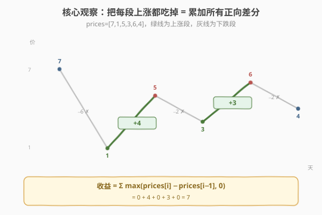
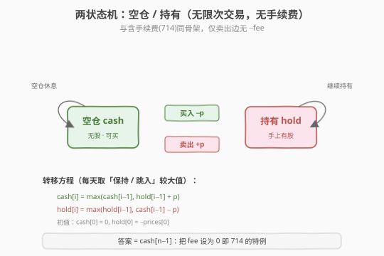

# 买卖股票的最佳时机II

- **题目名称**：买卖股票的最佳时机 II
- **链接**：[122. 买卖股票的最佳时机 II](https://leetcode.cn/problems/best-time-to-buy-and-sell-stock-ii/)
- **难度**：中等
- **标签**：贪心、动态规划、状态机

## 1. 题目概述

给定一个整数数组 `prices`，其中 `prices[i]` 表示第 `i` 天的股票价格。你可以**尽可能多地完成交易**（多次买卖一支股票），但任意时刻**最多只能持有一股**股票。求能获得的最大利润。

> 💡 与 [121. 买卖股票的最佳时机](121_买卖股票的最佳时机.md) 的唯一区别：121 只允许**至多一次**交易，而本题允许**无限次**交易。限制一旦放开，最优策略就从一个「区间最大差」变成了「把每一段上涨都吃掉」——这是整个股票系列里最干净、最值得记的一题。

**示例 1**：

```text
输入：prices = [7,1,5,3,6,4]
输出：7
解释：第 1 天买入（1），第 2 天卖出（5）→ 收益 4；
     第 3 天买入（3），第 4 天卖出（6）→ 收益 3。
     总收益 = 4 + 3 = 7。
```

**示例 2**：

```text
输入：prices = [1,2,3,4,5]
输出：4
解释：第 0 天买入（1），第 4 天卖出（5）→ 收益 4。
     （等价于每天涨 1 都吃掉：1+1+1+1 = 4）
```

**示例 3**：

```text
输入：prices = [7,6,4,3,1]
输出：0
解释：价格单调递减，任何交易都亏，不交易即最大利润。
```

**约束条件**：

- `1 <= prices.length <= 3 * 10^4`
- `0 <= prices[i] <= 10^4`

> 💡 本题是「股票系列」的**贪心模板题**，也是 [714. 含手续费](../0701-0800/714_买卖股票的最佳时机含手续费.md) 在 `fee = 0` 时的特例。**一道题学两个模板**：一步到位的贪心（累加正向差分）+ 通用的两状态机 DP（可迁移到 123/188/309/714）。

---

## 2. 解题思路

### 2.1 暴力思路：DFS 枚举每天操作

每天有三种选择：买入（前提未持仓）、卖出（前提持仓）、休息。用 DFS 枚举所有合法操作序列：

```text
dfs(i, holding):
    if i == n: return 0
    best = dfs(i+1, holding)                       # 休息
    if holding:
        best = max(best, prices[i] + dfs(i+1, false))  # 卖出
    else:
        best = max(best, -prices[i] + dfs(i+1, true))  # 买入
    return best
```

状态空间 $O(n \times 2)$，记忆化后是 $O(n)$，但递归栈深、常数大，且没有提炼出「累加差分」的最优结构——本题其实可以一行循环解决。

> ⚠️ 暴力法的价值在于点出一个事实：**「持有 / 不持有」是唯一需要记录的历史**。无限次交易且无手续费时，过去买在哪个价并不影响未来（每次买卖独立结算），所以这个二维状态能被进一步压缩成一个直接的贪心。

### 2.2 核心观察：累加每一段上涨



把相邻两天的价差记为 $\Delta_i = \text{prices}[i] - \text{prices}[i-1]$。由于**无限次交易、无手续费**，一段从谷底 $a$ 涨到峰顶 $b$ 的总涨幅，可以拆成这段里每一天的差分之和：

$$b - a = (\text{prices}[i] - \text{prices}[i-1]) + (\text{prices}[i+1] - \text{prices}[i]) + \dots = \sum \Delta_k$$

也就是说，**「在谷底买入、峰顶卖出」赚到的钱 = 这段里所有正向差分之和**。而下跌段的差分是负的，不参与（不交易即可）。所以最大利润就是**把所有正的差分加起来**：

$$\text{profit} = \sum_{i=1}^{n-1} \max(\text{prices}[i] - \text{prices}[i-1],\ 0)$$

> ⚠️ **关键洞察**：允许无限次交易时，一次大买卖可被拆成多个小买卖而不损失收益（因为没有手续费）。所以「抓住每一次上涨」与「在波谷买、波峰卖」**完全等价**。一旦加上手续费（714）或交易次数限制（188/123），这种拆分就会增加成本/次数，贪心不再成立——这也是 714 需要状态机 DP 的根本原因。

### 2.3 算法流程

**贪心解法（一步到位）**：

1. 初始化 `profit = 0`；
2. 从 $i = 1$ 遍历到 $n-1$；
3. 若 `prices[i] > prices[i-1]`，则 `profit += prices[i] - prices[i-1]`；
4. 返回 `profit`。

**DP 状态机解法（通解骨架）**：



1. **状态定义**：`cash[i]` / `hold[i]` 表示第 $i$ 天结束时处于「空仓 / 持有」的最大收益。
2. **转移方程**（`fee = 0`，即 714 的特例）：

   $$\text{cash}[i] = \max(\text{cash}[i-1],\ \text{hold}[i-1] + \text{prices}[i])$$

   $$\text{hold}[i] = \max(\text{hold}[i-1],\ \text{cash}[i-1] - \text{prices}[i])$$

3. **初始条件**：`hold[0] = -prices[0]`、`cash[0] = 0`。
4. **计算顺序**：$i = 1 \to n-1$；两个变量滚动即 $O(1)$ 空间。
5. **答案**：`cash[n-1]`（末日持仓未变现不优）。

> 💡 **为什么贪心与 DP 等价？** 把 DP 转移展开后，`cash` 的每次「跳升」恰好发生在价格上涨日，且跳升量正好等于当天差分——这与贪心「累加正向差分」逐项对应。`fee = 0` 时两者数学等价；`fee > 0` 时 DP 会自动「合并相邻上涨段以省手续费」，而贪心必须改写成带「撤回卖出」的形式（见 714）。

### 2.4 示例演算

以 `prices = [7,1,5,3,6,4]` 为例，同时追踪贪心差分与 DP 状态机：

![示例演算：贪心与 DP 殊途同归，cash[5]=7](../images/stock2_walkthrough.svg)

| $i$ | price | $\Delta$ | cash | hold | 操作 | 说明 |
|-----|-------|----------|------|------|------|------|
| 0 | 7 | — | 0 | −7 | 歇 | 初值：买入花 7 不划算 |
| 1 | 1 | −6 | 0 | **−1** | 买 | hold=max(−7, 0−1)=−1（换更低买点） |
| 2 | 5 | **+4** | **4** | −1 | 卖 | cash=max(0, −1+5)=4（卖在 5） |
| 3 | 3 | −2 | 4 | **1** | 买 | hold=max(−1, 4−3)=1（用利润在低点重建仓位） |
| 4 | 6 | **+3** | **7** | 1 | 卖 | cash=max(4, 1+6)=7（卖在 6） |
| 5 | 4 | −2 | 7 | 3 | 歇 | cash 不动（卖在 4 反亏） |

最终 `cash[5] = 7`，对应操作序列：**买@1 → 卖@5 → 买@3 → 卖@6**，收益 $(5-1) + (6-3) = 4 + 3 = 7$。贪心侧：$\max(-6,0)+\max(4,0)+\max(-2,0)+\max(3,0)+\max(-2,0) = 4+3 = 7$，两者一致。

> 💡 看第 3 天：`hold` 从 `−1` 跳到 `1`，是因为 `cash[2]=4`（前面那笔交易的利润）减去 `prices[3]=3`——**用前面的利润在低点重新建仓**。这正是无限次交易复利的关键，状态机把「先用利润再投入」自然编码进 `cash - prices[i]`。

---

## 3. 参考代码

### C++

```cpp
// 版本 1：贪心 —— 累加所有正向差分（推荐，最简）
class Solution {
  public:
    int maxProfit(vector<int>& prices) {
        int profit = 0;
        for (int i = 1; i < (int)prices.size(); ++i) {
            if (prices[i] > prices[i - 1]) {
                profit += prices[i] - prices[i - 1];
            }
        }
        return profit;
    }
};

// 版本 2：两状态机 DP + 两变量滚动（通解骨架，fee=0 特例）
class Solution2 {
  public:
    int maxProfit(vector<int>& prices) {
        int cash = 0;                 // 空仓
        int hold = -prices[0];        // 持有
        for (int i = 1; i < (int)prices.size(); ++i) {
            int prev_cash = cash, prev_hold = hold;
            cash = max(prev_cash, prev_hold + prices[i]); // 保持空仓 / 卖出
            hold = max(prev_hold, prev_cash - prices[i]); // 保持持有 / 买入建仓
        }
        return cash;
    }
};
```

### Python

```python
class Solution:
    def maxProfit(self, prices: list[int]) -> int:
        return sum(max(prices[i] - prices[i - 1], 0) for i in range(1, len(prices)))


class Solution2:
    """两状态机 DP（通解骨架，fee=0 特例）"""
    def maxProfit(self, prices: list[int]) -> int:
        cash, hold = 0, -prices[0]    # 空仓 / 持有
        for p in prices[1:]:
            # 同时赋值：右侧用旧值计算，避免引入临时变量
            cash, hold = (
                max(cash, hold + p),    # 保持空仓 / 卖出
                max(hold, cash - p),    # 保持持有 / 买入建仓
            )
        return cash
```

> ⚠️ **易错点**：
> - 贪心判断是 `prices[i] > prices[i-1]`（相邻日比较），不是找全局峰谷；累加的是**单日差分**，不是整段涨幅——但两者之和恰好相等。
> - Python 元组同时赋值 `a, b = expr1, expr2` 右侧整体用旧值，等价于 C++ 先存 `prev_*`；若写成两行顺序赋值，`hold = max(hold, cash - p)` 就会用到刚更新的 `cash`，结果出错。
> - DP 答案是 `cash`，不是 `hold`——末日还持仓未变现显然不优。

---

## 4. 复杂度分析

| 维度 | 复杂度 | 说明 |
|------|--------|------|
| **时间复杂度** | $O(n)$ | 单层循环，每天一次比较/累加（贪心）或两次状态计算（DP） |
| **空间复杂度（贪心）** | $O(1)$ | 只用一个 `profit` 变量 |
| **空间复杂度（DP 滚动版）** | $O(1)$ | 只用 `cash / hold` 两个变量；数组版为 $O(n)$ |

---

## 5. 扩展：贪心与 DP 的等价性证明

为什么「累加正向差分」与「波谷买、波峰卖」收益相同？设第 $i$ 天处于某上涨段中，把「波谷 $a$（下标 $l$）→ 波峰 $b$（下标 $r$）」这笔交易拆开：

$$b - a = \text{prices}[r] - \text{prices}[l] = \sum_{k=l+1}^{r} (\text{prices}[k] - \text{prices}[k-1])$$

这是一个**望远镜和**：中间项两两抵消，只剩首尾之差。又因为上涨段内每个 $\Delta_k > 0$，所以 $\sum_{k=l+1}^{r} \max(\Delta_k, 0) = \sum_{k=l+1}^{r} \Delta_k = b - a$。对所有上涨段求和即得贪心公式。

> ⚠️ 这个等价性**仅在「无交易成本」时成立**。一旦每次交易有固定手续费 `fee`（714），把一笔大交易拆成多笔会多付多次 `fee`，此时「累加正向差分」会**高估**收益——必须改用状态机 DP，或带「撤回卖出」的贪心（把 `fee` 算进买入成本）。同理，限制交易次数（188/123）时拆分也会耗尽次数额度。所以**贪心是 122 的特权，DP 是整个系列的通用钥匙**。

---

## 6. 面试要点

1. **贪心为什么正确？和「波谷买波峰卖」等价吗？**
   - 等价。上涨段的总涨幅是一个望远镜和，等于该段内每日正向差分之和。无限次交易且无手续费时，把一次大买卖拆成多个相邻日的小买卖不损失收益，所以「累加所有正向差分」=「抓住每一段上涨」=「波谷买波峰卖」。

2. **贪心在哪些情况下会失效？**
   - 三种：① 有固定手续费（714）——拆分会多付手续费；② 有冷冻期（309）——拆分可能违反「卖后不能买」；③ 限制交易次数（188/123）——拆分会耗尽次数。本质都是「拆分有代价」，此时回到状态机 DP。

3. **本题的两状态机和 714 有何关系？**
   - 122 是 714 在 `fee = 0` 时的特例。把 714 转移方程里的 `- fee` 去掉就是 122 的 DP：`cash[i] = max(cash[i-1], hold[i-1] + p)`、`hold[i] = max(hold[i-1], cash[i-1] - p)`。掌握 714 的状态机，122 的 DP 自动会写；反过来 122 的贪心是 714 贪心（带撤回机制）的简化版。

4. **如何把 DP 空间优化到 $O(1)$？**
   - 两个状态都只依赖前一天的同名状态，无更远依赖。用 `cash / hold` 两个变量滚动即可。C++ 先存 `prev_*` 再更新；Python 用元组同时赋值 `a, b = ...`（右侧整体求值后再绑定），天然避免顺序依赖。

5. **面试该讲贪心还是 DP？**
   - **先讲贪心**（一步到位、最直观），再点出它是 714 状态机 `fee=0` 的特例，并说明贪心在加手续费/冷冻期/次数限制时失效、需回到 DP。这样既展示本题最优解，又自然串起整个股票系列，体现思维深度。

> 💡 **一句话总结**：122 是股票系列的贪心模板——「无限次交易 + 无成本」让一次大买卖可无损拆成每日小买卖，于是最大利润就是所有正向差分之和。它的进阶是两状态机 DP（714 的 `fee=0` 特例），后者是整个股票系列（123/188/309/714）的通用钥匙。

---

## 7. 同类练习题

- [121. 买卖股票的最佳时机](https://leetcode.cn/problems/best-time-to-buy-and-sell-stock/)（[题解](121_买卖股票的最佳时机.md)）：至多一次交易，一次遍历维护历史最低价；对比「受限 → 维护极值」与「无限 → 累加差分」
- [714. 买卖股票的最佳时机含手续费](https://leetcode.cn/problems/best-time-to-buy-and-sell-stock-with-transaction-fee/)（[题解](../0701-0800/714_买卖股票的最佳时机含手续费.md)）：本题加固定手续费，贪心失效，回到两状态机 DP + 撤回贪心
- [309. 买卖股票的最佳时机含冷冻期](https://leetcode.cn/problems/best-time-to-buy-and-sell-stock-with-cooldown/)（[题解](../0301-0400/309_买卖股票的最佳时机含冷冻期.md)）：加冷冻期升到三状态机，骨架相同状态更多
- [188. 买卖股票的最佳时机 IV](https://leetcode.cn/problems/best-time-to-buy-and-sell-stock-iv/)（[题解](188_买卖股票的最佳时机IV.md)）：加「交易次数」维度，状态机通用版
- [123. 买卖股票的最佳时机 III](https://leetcode.cn/problems/best-time-to-buy-and-sell-stock-iii/)：至多两次交易，是 188 在 `k=2` 时的特例，体会状态机如何处理次数上限
