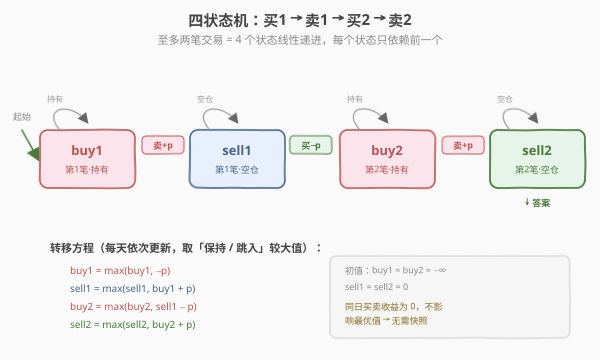
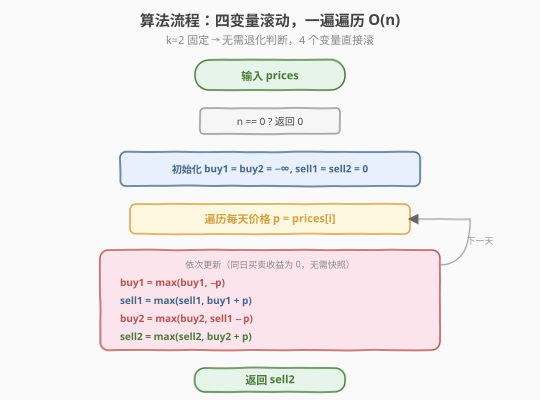
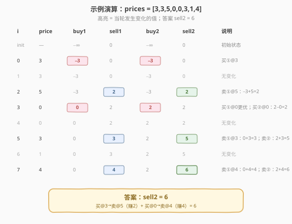

# 买卖股票的最佳时机III

- **题目名称**：买卖股票的最佳时机III
- **链接**：[123. 买卖股票的最佳时机 III](https://leetcode.cn/problems/best-time-to-buy-and-sell-stock-iii/)
- **难度**：困难
- **标签**：动态规划、状态机

## 1. 题目概述

给定一个整数数组 `prices`，`prices[i]` 表示第 `i` 天的股票价格。你最多可以完成 **两笔交易**（一笔交易 = 一次买入 + 一次卖出），且同一时刻最多持有一股股票（卖出后才能再次买入）。求能获得的最大利润。

**示例 1**：

```text
输入：prices = [3,3,5,0,0,3,1,4]
输出：6
解释：第 4 天买入（0），第 6 天卖出（3）→ 收益 3；
     第 7 天买入（1），第 8 天卖出（4）→ 收益 3。总收益 = 3 + 3 = 6。
```

**示例 2**：

```text
输入：prices = [1,2,3,4,5]
输出：4
解释：第 1 天买入（1），第 5 天卖出（5）→ 收益 4。（只做一笔即最优）
```

**示例 3**：

```text
输入：prices = [7,6,4,3,1]
输出：0
解释：价格单调递减，不交易即最大利润。
```

**约束条件**：

- `1 <= prices.length <= 10^5`
- `0 <= prices[i] <= 10^5`

> 💡 这是「股票系列」中**承上启下**的一题——比 [121. 只做一次](121_买卖股票的最佳时机.md) 多一笔交易，比 [188. 至多 k 次](188_买卖股票的最佳时机IV.md) 少一个维度。因为 `k=2` 固定，无需退化判断和数组滚动，**4 个变量一遍遍历**即可解决，是面试中最常考的股票题。

---

## 2. 解题思路

### 2.1 暴力思路：DFS 枚举每天操作

每天三选一：买入、卖出、休息，同时维护「剩余可用次数」和「是否持有」。DFS 枚举所有合法序列取最大收益：

```text
dfs(i, holding, left):
    if i == n: return 0
    best = dfs(i+1, holding, left)              # 休息
    if holding:
        best = max(best, prices[i] + dfs(i+1, false, left))      # 卖出
    elif left > 0:
        best = max(best, -prices[i] + dfs(i+1, true, left-1))    # 买入（消耗一次）
    return best
```

状态空间 $O(n \times 2 \times 3)$，记忆化后时间 $O(n)$。但递归写法常数大，且把「持有」和「次数」当作两个松散标记拼凑，没有提炼出状态的线性递进关系——而本题的固定 `k=2` 恰好让状态数压缩到 4 个，可以一行循环解决。

> ⚠️ 暴力法点出的关键事实：**至多两笔交易 = 4 个关键决策点**——第一次买入、第一次卖出、第二次买入、第二次卖出。每个决策点只依赖前一个的状态，是一条**线性链**而非树形搜索。

### 2.2 核心观察：四状态机——买1/卖1/买2/卖2

把两笔交易的生命周期拆成 4 个状态，它们**线性递进**：

| 状态 | 含义 | 对应 188 中的 |
|------|------|--------------|
| **`buy1`** | 第一次买入后、尚未卖出时的最大收益（负数=花费） | `hold[1]` |
| **`sell1`** | 完成第一笔交易后的最大收益 | `free[1]` |
| **`buy2`** | 第二次买入后的最大净收益（含第一笔利润） | `hold[2]` |
| **`sell2`** | 完成第二笔交易后的最大收益 | `free[2]` |

> 关键洞察：`buy2` 的值是 `sell1 - prices[i]`——**用第一笔赚的利润为第二笔建仓**。状态链 `buy1 → sell1 → buy2 → sell2` 把「利润再投入」自然编码进每次转移，无需额外的次数计数器。



四个状态的转移方程（每天依次更新，取「保持现状」与「跳入此状态」的较大值）：

$$\text{buy1} = \max(\text{buy1},\ -\text{prices}[i])$$

$$\text{sell1} = \max(\text{sell1},\ \text{buy1} + \text{prices}[i])$$

$$\text{buy2} = \max(\text{buy2},\ \text{sell1} - \text{prices}[i])$$

$$\text{sell2} = \max(\text{sell2},\ \text{buy2} + \text{prices}[i])$$

> 💡 **为什么同日买卖不会出错？** 更新顺序是 `buy1 → sell1 → buy2 → sell2`，`sell1` 用的是**今天**的 `buy1`。若今天刚买入又卖出，收益 $-p + p = 0$，不会超过已有的 `sell1`（$\geq 0$）。同理，同日 `sell1 → buy2 → sell2` 的净效果是 `sell1 - p + p = sell1`，也不会虚假抬升 `sell2`。因此**无需快照**，直接顺序更新即可——这是 `k=2` 固定时的简化优势，[188](188_买卖股票的最佳时机IV.md) 的通用版则需要快照 `prev_free`。

### 2.3 算法流程图



**三步法**：

1. **初始化**：`buy1 = buy2 = −∞`（持有是非法起点），`sell1 = sell2 = 0`（空仓基准收益为 0）。
2. **遍历更新**：对每个价格 `p`，依次执行 4 条转移方程。
3. **返回**：`sell2`（末日必不持有，且最多用 2 笔）。

> ⚠️ C++ 中 `−∞` 用 `INT_MIN / 2` 而非 `INT_MIN`：因为 `buy1 + p` 和 `buy2 + p` 可能下溢。Python 的 `float('-inf')` 无此问题。

### 2.4 示例演算

以 `prices = [3,3,5,0,0,3,1,4]` 为例：



| $i$ | price | buy1 | sell1 | buy2 | sell2 | 说明 |
|-----|-------|------|-------|------|-------|------|
| init | — | $-\infty$ | 0 | $-\infty$ | 0 | 初始状态 |
| 0 | 3 | **−3** | 0 | **−3** | 0 | 买①@3 |
| 1 | 3 | −3 | 0 | −3 | 0 | 无变化 |
| 2 | 5 | −3 | **2** | −3 | **2** | 卖①@5：−3+5=2 |
| 3 | 0 | **0** | 2 | **2** | 2 | 买①@0更优；买②@0：2−0=2 |
| 4 | 0 | 0 | 2 | 2 | 2 | 无变化 |
| 5 | 3 | 0 | **3** | 2 | **5** | 卖①@3：0+3=3；卖②：2+3=5 |
| 6 | 1 | 0 | 3 | 2 | 5 | 无变化 |
| 7 | 4 | 0 | **4** | 2 | **6** | 卖②@4：2+4=6 |

最终 `sell2 = 6`。对应操作序列：**买@3 → 卖@5（赚2）→ 买@0 → 卖@4（赚4）**，总收益 `2 + 4 = 6`。

> 💡 看第 3 天：`buy1` 从 `−3` 跳到 `0`（找到更低的买点 @0），同时 `buy2` 从 `−3` 跳到 `2`——这是因为 `sell1=2`（第一笔赚的 2 块）减去 `prices[3]=0`，**用第一笔利润在零成本点为第二笔建仓**。这正是多笔交易复利的关键，四状态机把「利润再投入」自然编码进 `sell1 - p`。
>
> 第 7 天 `sell1` 也跳到 `4`（买@0 卖@4），但 `buy2` 不变（`4−4=0 < 2`）——因为第二笔已在第 3 天以更优价格建仓，无需重来。最终 `sell2 = buy2 + 4 = 6`。

---

## 3. 参考代码

### C++

```cpp
// 买卖股票的最佳时机III.cpp —— 四状态机 DP + 四变量滚动
// 编译: g++ -O2 -std=c++17 买卖股票的最佳时机III.cpp -o stock3
#include <vector>
#include <algorithm>
#include <climits>
using namespace std;

class Solution {
  public:
    int maxProfit(vector<int>& prices) {
        int buy1 = INT_MIN / 2;   // 第1笔·持有（非法起点，防溢出）
        int sell1 = 0;            // 第1笔·空仓
        int buy2 = INT_MIN / 2;   // 第2笔·持有
        int sell2 = 0;            // 第2笔·空仓

        for (int p : prices) {
            buy1  = max(buy1,  -p);           // 买入第1笔
            sell1 = max(sell1, buy1 + p);     // 卖出第1笔
            buy2  = max(buy2,  sell1 - p);    // 买入第2笔（用第1笔利润）
            sell2 = max(sell2, buy2 + p);     // 卖出第2笔
        }
        return sell2;
    }
};
```

### Python

```python
class Solution:
    def maxProfit(self, prices: list[int]) -> int:
        buy1 = sell1 = 0          # 先统一初始化
        buy2 = sell2 = 0
        # buy1/buy2 需要设为 -inf：第一次 max(-inf, -p) = -p
        buy1 = float('-inf')
        buy2 = float('-inf')

        for p in prices:
            buy1  = max(buy1,  -p)           # 买入第1笔
            sell1 = max(sell1, buy1 + p)     # 卖出第1笔
            buy2  = max(buy2,  sell1 - p)    # 买入第2笔
            sell2 = max(sell2, buy2 + p)     # 卖出第2笔
        return sell2
```

> ⚠️ **易错点**：
> - C++ 用 `INT_MIN / 2` 而非 `INT_MIN`：`buy + p` 会下溢。Python 的 `float('-inf')` 无此问题。
> - 更新顺序必须是 `buy1 → sell1 → buy2 → sell2`：同日买卖净收益为 0 不影响最优值，但如果打乱顺序（如先 `sell1` 再 `buy1`），`sell1` 会用到昨天的 `buy1`，虽然结果相同但语义不一致。
> - 答案是 `sell2`，不是 `sell1`——两笔交易可能比一笔更优（如示例 1），`sell2 ≥ sell1` 恒成立（`sell2 = max(sell2, buy2 + p)` 而 `buy2` 初始可取 `sell1 - p`）。

---

## 4. 复杂度分析

| 维度 | 复杂度 | 说明 |
|------|--------|------|
| **时间复杂度** | $O(n)$ | 单层循环，每天 4 次 `max` 计算 |
| **空间复杂度** | $O(1)$ | 仅 4 个变量，无额外数组 |

> 💡 本题是股票系列中**空间最优**的写法——188 的通用版需 $O(k)$ 空间，而本题利用 `k=2` 固定，退化到 4 个标量变量。时间复杂度与 121/122 相同，都是 $O(n)$ 一遍遍历。

---

## 5. 扩展：与 188(k=2) 的统一视角

本题是 [188. 买卖股票的最佳时机 IV](188_买卖股票的最佳时机IV.md) 在 `k=2` 时的特例。188 的通用状态 `free[j] / hold[j]` 在 `k=2` 时展开为 5 个状态（`free[0..2]` + `hold[1..2]`），其中 `free[0] ≡ 0` 是常数基底，可消去。剩余 4 个正好对应本题：

| 188 通用状态 | 本题变量 | 含义 |
|-------------|---------|------|
| `hold[1]` | `buy1` | 第 1 笔·持有 |
| `free[1]` | `sell1` | 第 1 笔·空仓 |
| `hold[2]` | `buy2` | 第 2 笔·持有 |
| `free[2]` | `sell2` | 第 2 笔·空仓 |

转移方程也完全一致——188 中 `hold[j] = max(hold[j], free[j-1] - p)` 在 `j=1` 时 `free[0]=0`，即 `buy1 = max(buy1, -p)`；`j=2` 时即 `buy2 = max(buy2, sell1 - p)`。卖出方程 `free[j] = max(free[j], hold[j] + p)` 直接对应 `sell1 / sell2`。

> 💡 **为什么本题不需要快照？** 188 通用版中，买入用 `free[j-1]` 需要快照防止同日跨层。但本题 4 个变量**顺序更新**时，同日买卖的净收益恒为 0（$-p + p = 0$），不会虚假抬升任何状态。这是因为 `k=2` 固定，状态链是线性的 4 步，不存在「跨多层」的风险。通用版中 `j` 可以很大，同日跨多层（`free[1] → hold[3]`）的语义错误才需要快照来避免。

---

## 6. 面试要点

1. **为什么用 4 个变量而不是 188 的通用框架？**

   - `k=2` 固定，通用框架的 `free[0..2]` + `hold[1..2]` 共 5 个状态中 `free[0] ≡ 0` 是常数，消去后恰好 4 个。直接用 4 个标量变量，代码更简洁、空间 $O(1)$、无需快照——这是面试官最期望的写法。

2. **同日买卖不会出错吗？为什么不需要快照？**

   - 更新顺序 `buy1 → sell1 → buy2 → sell2` 中，`sell1` 用今天的 `buy1`：若今天刚买又卖，$-p + p = 0 \leq \text{sell1}$（$\geq 0$），不会抬升。同理 `buy2 = sell1 - p` 后立即 `sell2 = buy2 + p = sell1`，也不会抬升 `sell2`。同日操作净效果为零，**天然安全**。
   - 这与 188 通用版不同：188 中 `j` 升序更新会让 `free[j-1]` 被今天覆盖，允许「同日先卖第 `j-1` 笔再买第 `j` 笔」跨层，虽然收益层面等价但语义错乱，在加冷冻期/手续费等变体中会出真实错误。

3. **`buy1` 和 `buy2` 初值为什么是 $-\infty$？**

   - `buy1 / buy2` 表示「持有」状态，开仓前不可能持有，是**非法状态**。用 $-\infty$ 让 `max` 永远取不到它，强制第一次持有只能来自真实买入。若初值为 0，则 `sell1 = max(0, 0 + p) = p` 会白捡一个非法利润。

4. **如果只做一笔交易比两笔更优怎么办？**

   - 不需要特殊处理。`sell2 ≥ sell1` 恒成立：`buy2 = max(buy2, sell1 - p)`，之后 `sell2 = max(sell2, buy2 + p) ≥ sell1 - p + p = sell1`。所以即使只做一笔最优（如示例 2），`sell2` 也会自动等于 `sell1`。

5. **这题和股票系列其它题怎么联系？**

   - 都是状态机 DP：先列约束（次数/冷冻/手续费），再定状态维度。本题是 188 的 `k=2` 特例，用 4 个标量变量替代通用版的 $O(k)$ 数组。`k=1` 即 [121](121_买卖股票的最佳时机.md)，`k=∞` 即 [122](122_买卖股票的最佳时机II.md)，加冷冻期即 [309](../0301-0400/309_买卖股票的最佳时机含冷冻期.md)，加手续费即 [714](../0701-0800/714_买卖股票的最佳时机含手续费.md)。**面试遇到股票题，先问清约束，再选对应框架**。

> 💡 **一句话总结**：买卖股票 III 是股票系列的「黄金分割点」——`k=2` 固定让 188 的通用框架退化成 4 个标量变量，一遍遍历 $O(n)$ 时间、$O(1)$ 空间，同日买卖天然安全无需快照。掌握它，你就理解了状态机如何用「线性链」编码多笔交易的利润再投入，并能自然迁移到 121（`k=1`）、188（`k=∞`）乃至 309/714 的变体。

---

## 7. 同类练习题

- [188. 买卖股票的最佳时机 IV](https://leetcode.cn/problems/best-time-to-buy-and-sell-stock-iv/)（[题解](188_买卖股票的最佳时机IV.md)）：本题的通用版，至多 k 笔交易，需 $O(k)$ 数组 + 快照 + 退化判断
- [121. 买卖股票的最佳时机](https://leetcode.cn/problems/best-time-to-buy-and-sell-stock/)（[题解](121_买卖股票的最佳时机.md)）：本题 `k=1` 特例，一次遍历维护历史最低价
- [122. 买卖股票的最佳时机 II](https://leetcode.cn/problems/best-time-to-buy-and-sell-stock-ii/)（[题解](122_买卖股票的最佳时机II.md)）：无限次交易，贪心累加正向差分
- [309. 买卖股票的最佳时机含冷冻期](https://leetcode.cn/problems/best-time-to-buy-and-sell-stock-with-cooldown/)（[题解](../0301-0400/309_买卖股票的最佳时机含冷冻期.md)）：加冷冻期升到三状态机，骨架相同状态更多
- [714. 买卖股票的最佳时机含手续费](https://leetcode.cn/problems/best-time-to-buy-and-sell-stock-with-transaction-fee/)（[题解](../0701-0800/714_买卖股票的最佳时机含手续费.md)）：无限次 + 卖出减手续费，两状态机 DP
