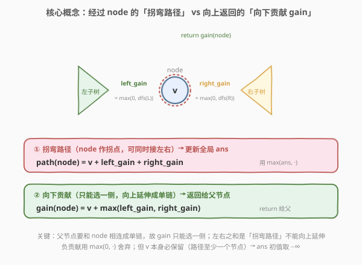
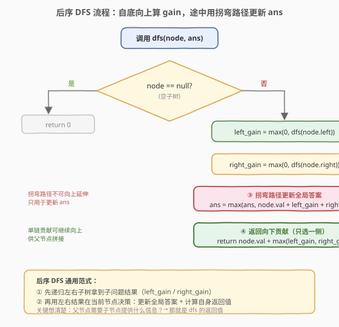

# LeetCode 二叉树中的最大路径和 题解

## 1. 题目概述

- **标题 / 题号**：二叉树中的最大路径和（#124，hard）
- **链接**：https://leetcode.cn/problems/binary-tree-maximum-path-sum/
- **难度**：困难
- **标签**：树、二叉树、深度优先搜索、动态规划、树形 DP

**题意**：二叉树中的**路径**被定义为一条节点序列，序列中每对相邻节点之间都存在一条边。同一个节点在一条路径序列中**至多出现一次**。该路径**至少包含一个**节点，且不一定经过根节点。

**路径和**是路径中各节点值的总和。给定二叉树的根节点 `root`，返回其**最大路径和**。

**示例 1**：

```text
输入：root = [1,2,3]
输出：6
解释：最优路径是 2 -> 1 -> 3，路径和为 2 + 1 + 3 = 6。
```

**示例 2**：

```text
输入：root = [-10,9,20,null,null,15,7]
输出：42
解释：最优路径是 15 -> 20 -> 7，路径和为 15 + 20 + 7 = 42。
```

**约束**：

- 树中节点数目范围 `[1, 3 * 10^4]`
- `-1000 <= Node.val <= 1000`

## 2. 解题思路

### 2.1 暴力思路：枚举拐点

一种直观做法是：枚举每个节点作为路径的「最高点」（即拐点），分别向左右子树各取一条向下的最大路径，拼成「左半 + 当前节点 + 右半」。但「向下的最大路径」本身又需要递归求解，朴素实现会让同一段子路径被重复计算，复杂度退化到 `O(n^2)`。

关键在于：**「以某节点为起点的向下最大路径和」只需算一次，且父节点能直接复用**。这正是树形 DP 的切入点。

### 2.2 核心观察：树形 DP（后序 DFS + 全局答案）



定义递归函数 `dfs(node)` 的返回值为：

> 以 `node` 为起点、**向下**（至多走一条分支）的最大路径和，记为 `gain(node)`。

对每个节点 `node`，先拿到左右子树的贡献：

- `left_gain = max(0, dfs(node.left))`：左子树能提供的向下路径和，若为负则**直接舍弃**（贡献 0，即不走左子树）。
- `right_gain = max(0, dfs(node.right))`：同理。

由此得到两条结论：

1. **经过 `node` 的最大路径**（`node` 作为拐点，可同时接左右两半）：
   $$\text{path}(node) = node.val + left\_gain + right\_gain$$
   用它去更新全局答案 `ans = max(ans, path(node))`。
2. **`node` 向父节点提供的贡献**（只能选一侧，否则无法继续向上延伸成单链）：
   $$gain(node) = node.val + \max(left\_gain, right\_gain)$$
   把它返回给父节点拼接。

> 💡 **为什么贡献只能选一侧？** 父节点要和 `node` 相连形成一条向下的链，而链不能「分叉」。若 `node` 同时把左右两半都接上，就变成在 `node` 处拐弯的完整路径——这种路径无法再向上延伸，只能用来更新 `ans`，不能作为 `gain` 返回。

> ⚠️ **为什么用 `max(0, ...)` 舍弃负贡献？** 节点值可能为负。若某侧子树的向下路径和为负，接上它只会让总和变小，不如「在 `node` 处截断、不走向那侧」。但 `node.val` 本身**必须保留**（路径至少含一个节点），所以即便 `node.val` 为负，`ans` 也可能取到它——这也是 `ans` 初值设为 $-\infty$ 而非 `0` 的原因。

### 2.3 算法流程图



整体是标准后序遍历：先递归左右子树拿到 `gain`，再在当前节点做「更新答案 + 计算自身 gain 并返回」。递归终止条件是 `node` 为空，返回 `0`（空子树无贡献）。

### 2.4 示例演算

以示例 2（`root = [-10,9,20,null,null,15,7]`）为例，后序遍历自底向上计算每个节点的 `gain`，并在拐点处更新 `ans`：

![示例演算：[-10,9,20,15,7] 逐节点算 gain，最终 ans=42](../images/btmps_walkthrough.svg)

| 节点 | left_gain | right_gain | 拐弯路径 (更新 ans) | gain(返回父) |
|------|-----------|------------|---------------------|--------------|
| 9    | 0         | 0          | 9 + 0 + 0 = 9 → ans=9  | 9 + max(0,0) = 9 |
| 15   | 0         | 0          | 15 + 0 + 0 = 15 → ans=15 | 15 |
| 7    | 0         | 0          | 7 + 0 + 0 = 7 → ans=15 | 7 |
| 20   | 15        | 7          | 20 + 15 + 7 = 42 → ans=42 ⭐ | 20 + max(15,7) = 35 |
| -10  | 9         | 35         | -10 + 9 + 35 = 34 → ans=42 | -10 + max(9,35) = 25 |

关键在节点 `20`：左右子树贡献均为正（`15` 与 `7`），同时接上形成 `15 → 20 → 7 = 42`，这是全局最优。节点 `-10` 虽然能拼出 `9 → -10 → 35 = 34` 的拐弯路径，但不及 42，`ans` 不变；它向父节点（此处为根，无父）返回 `25`。

> 💡 注意叶子节点 `9/15/7`：左右子树为空，`left_gain = right_gain = 0`，拐弯路径就是自身值。这保证了「路径至少含一个节点」。

## 3. 参考代码

### C++

```cpp
/**
 * Definition for a binary tree node.
 * struct TreeNode {
 *     int val;
 *     TreeNode *left;
 *     TreeNode *right;
 *     TreeNode() : val(0), left(nullptr), right(nullptr) {}
 *     TreeNode(int x) : val(x), left(nullptr), right(nullptr) {}
 * };
 */
class Solution {
  public:
    int maxPathSum(TreeNode* root) {
        int ans = INT_MIN;                 // 节点值可能为负，初值取 -∞
        dfs(root, ans);
        return ans;
    }

  private:
    // 返回以 node 为起点向下的最大路径和（单链贡献）
    int dfs(TreeNode* node, int& ans) {
        if (node == nullptr) {
            return 0;
        }
        int left_gain  = max(0, dfs(node->left,  ans)); // 负贡献舍弃
        int right_gain = max(0, dfs(node->right, ans));
        // 以 node 为拐点的完整路径，更新全局答案
        ans = max(ans, node->val + left_gain + right_gain);
        // 向上只能选一侧，返回单链贡献
        return node->val + max(left_gain, right_gain);
    }
};
```

### Python

```python
class Solution:
    def maxPathSum(self, root: Optional[TreeNode]) -> int:
        ans = float('-inf')          # 节点值可能为负，初值取 -∞

        def dfs(node: Optional[TreeNode]) -> int:
            nonlocal ans
            if node is None:
                return 0
            left_gain  = max(0, dfs(node.left))   # 负贡献舍弃
            right_gain = max(0, dfs(node.right))
            # 以 node 为拐点的完整路径，更新全局答案
            ans = max(ans, node.val + left_gain + right_gain)
            # 向上只能选一侧，返回单链贡献
            return node.val + max(left_gain, right_gain)

        dfs(root)
        return ans
```

> ⚠️ **两个易错点**：(1) `ans` 初值必须是 $-\infty$ 而非 `0`，否则全是负数的树（如单节点 `-3`）会错误返回 `0`；(2) `gain` 返回时取 `max(left_gain, right_gain)` 而非两者之和——和是拐弯路径，不能继续向上延伸。

## 4. 复杂度分析

| 维度 | 复杂度 | 说明 |
|------|--------|------|
| 时间复杂度 | O(n) | 每个节点访问一次，后序遍历整棵树 |
| 空间复杂度 | O(h) | 递归调用栈深度 = 树高 `h`；最坏（链状树）O(n)，平衡树 O(log n) |

> ⚠️ 本题没有用额外数组存储状态，`gain` 通过返回值自底向上传递，空间就是递归栈深度。若树退化为链表，递归深度达 `n`，极端情况下需警惕栈溢出（题目 `n <= 3*10^4`，一般可接受）。

## 5. 扩展：输出最大路径和的具体路径

题目只要求和。若要求输出取得最大路径和的那条路径，可在 `dfs` 中额外记录「取得 `gain` 走的是左还是右」，并在更新 `ans` 的拐点处保存一个快照（拐点 + 左半路径 + 右半路径）。由于 `ans` 可能被多次更新，需在每次刷新最优时记录对应节点，最后从该拐点向左右各回溯一次拼接即可。复杂度仍为 `O(n)`，但常数与实现复杂度显著上升。

## 6. 面试要点

1. **递归函数 `dfs` 的返回值含义是什么？为什么不能直接返回「拐弯路径」？**

   - 返回值 = 以当前节点为起点、**向下走一条分支**的最大路径和（单链贡献）。父节点要和当前节点相连形成更长的链，而链不能分叉，所以必须返回「单侧最大」而非「左右之和」。左右之和是「在此拐弯的完整路径」，无法继续向上延伸，只能用来更新全局 `ans`。

2. **为什么用 `max(0, dfs(child))` 舍弃负贡献？会不会漏掉必经的负节点？**

   - 不会。`max(0, ...)` 只决定「要不要走向那棵子树」。若子树整体贡献为负，接上只会让和变小，不如在当前节点截断。当前节点 `node.val` 本身**始终保留**，所以即便全树为负，`ans` 也能取到最大的那个负数（单节点路径）。

3. **`ans` 初值为什么是 $-\infty$ 而不是 `0`？**

   - 节点值范围 `[-1000, 1000]`，全树可能都是负数（如 `root = [-3]`），此时最优解就是 `-3`。初值取 `0` 会让答案错误地返回 `0`（对应「空路径」），但题目要求路径至少含一个节点。

4. **本题和 [二叉树的最近公共祖先](../0201-0300/236_二叉树的最近公共祖先.md) 都是后序 DFS，递归设计上有何不同？**

   - 236 的返回值是「子树中是否含 p/q 的节点」，决策维度是「左右是否都非空」；124 的返回值是「子树向下的最大路径和」，决策维度是「左右贡献谁更大、是否为负」。两者骨架都是「先递归左右 → 再用左右结果在当前节点决策」，区别在**返回值的语义**与**决策规则**——这是后序 DFS 类问题的通用范式：先想清楚「父节点需要子节点提供什么信息」。

5. **能否改成迭代法？**

   - 可以。用栈模拟后序遍历（入栈时记录节点与是否访问过），出栈时按「左右子已处理」的顺序计算 `gain` 并更新 `ans`。逻辑等价，但代码更繁琐。除非树极深担心递归栈溢出，否则面试首选递归。

## 同类练习题

| # | 题目 | 与本题的关联 |
|---|------|-------------|
| 543 | [二叉树的直径](https://leetcode.cn/problems/diameter-of-binary-tree/) | 同骨架，`gain` 返回向下深度，拐弯处用 `left + right` 更新答案，是把「路径和」换成「边数」的入门版 |
| 687 | [最长同值路径](https://leetcode.cn/problems/longest-univalue-path/) | 在 543 基础上加「同值才能延伸」的剪枝，进一步巩固树形 DP 模板 |
| 2246 | [相邻字符不同最长路径](https://leetcode.cn/problems/longest-path-with-different-adjacent-characters/) | 树形 DP 进阶，维护子节点贡献的前两大值来更新答案 |
| 337 | [打家劫舍 III](https://leetcode.cn/problems/house-robber-iii/) | 树形 DP 经典，返回值变成「选/不选当前节点」的二元状态，与 124 的「单链贡献」形成对比 |
| 124 | [二叉树中的最大路径和](https://leetcode.cn/problems/binary-tree-maximum-path-sum/) | 本题自身，可作为「后序 DFS + 全局答案」模板的标准实现 |
