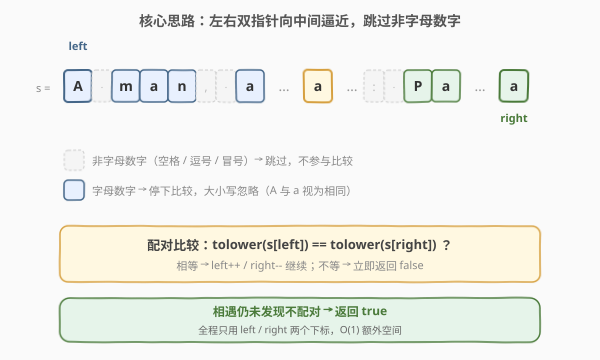
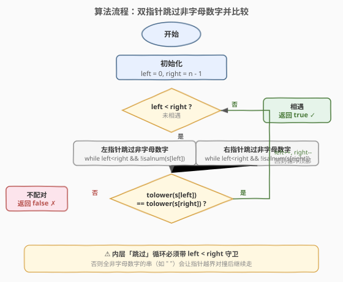
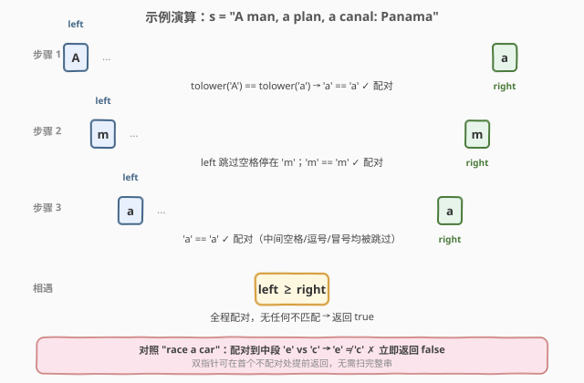

# 验证回文串

- **题目名称**：验证回文串
- **链接**：[125. 验证回文串](https://leetcode.cn/problems/valid-palindrome/)
- **难度**：简单
- **标签**：双指针、字符串

## 1. 题目概述

给定一个字符串 `s`，验证它是否是**回文串**：只考虑其中的**字母和数字字符**，**忽略字母大小写**，并跳过所有非字母数字字符。是回文串返回 `true`，否则返回 `false`。

> 💡 **回文串**：正读与反读都相同的字符串。过滤后空串也视为回文（正反读都是空）。

**示例 1**：

```text
输入：s = "A man, a plan, a canal: Panama"
输出：true
解释："amanaplanacanalpanama" 是回文串
```

**示例 2**：

```text
输入：s = "race a car"
输出：false
解释："raceacar" 不是回文串
```

**示例 3**：

```text
输入：s = " "
输出：true
解释：过滤非字母数字后为空串 ""，空串视为回文
```

**约束条件**：

- `1 <= s.length <= 2 * 10^5`
- `s` 由 ASCII 字符组成

> ⚠️ **进阶要求**：能否做到 $O(1)$ 额外空间？（即不构造过滤后的新字符串）

---

## 2. 解题思路

### 2.1 暴力思路：过滤后反转比较

最直观的做法：扫一遍 `s`，挑出所有字母数字字符、统一转小写拼成新串 `t`，再比较 `t == t[::-1]`。

```python
t = ''.join(ch.lower() for ch in s if ch.isalnum())
return t == t[::-1]
```

写法极简，但需要 $O(n)$ 额外空间存 `t`——**不满足进阶要求**。问题在于：回文判定只需**首尾两两配对**比较，根本不必把整串搬出来再翻转。

> 💡 字符串法在工程中完全可接受，但面试官通常会追加一句「能不能用 $O(1)$ 空间？」来考察对**双指针**的掌握。下文的核心解法即为原地双指针。

### 2.2 核心观察：左右双指针原地比较



回文的本质是**左右对称**：第 `i` 个有效字符与倒数第 `i` 个有效字符必须相同。于是用**左右双指针**从两端向中间逼近：

- `left` 从 `0` 出发向右走，遇到**非字母数字**就跳过；
- `right` 从 `n-1` 出发向左走，遇到**非字母数字**就跳过；
- 二者都停在有效字符上时，比较**忽略大小写后**是否相等；不等即返回 `false`；
- 相等则 `left++`、`right--`，继续逼近，直到 `left >= right` 相遇。

> 💡 **为何 $O(1)$ 空间**：全程只用 `left`、`right` 两个下标，**不构造任何新字符串**，原地比较。相比暴力法省去了 `t` 的 $O(n)$ 空间，这是双指针相对过滤法的核心优势。

**两个关键细节**：

1. **跳过非字母数字**：用 `isalnum()`（Python）/ `isalnum()`（C++ `<cctype>`）判定字符是否为字母或数字。空格、逗号、冒号等一律跳过。
2. **忽略大小写**：比较前用 `tolower()` 统一转小写。注意**只需在比较时转**，不必预先把整个串转一遍——又是省空间的体现。

### 2.3 算法流程图



**四步法**：

1. **初始化**：`left = 0`，`right = len(s) - 1`。
2. **外层循环**：`while left < right`，未相遇就继续。
3. **跳过无效字符**：
   - `while left < right && !isalnum(s[left])`：`left++`；
   - `while left < right && !isalnum(s[right])`：`right--`。
4. **比较与推进**：若 `tolower(s[left]) != tolower(s[right])` 返回 `false`；否则 `left++`、`right--`。
5. **循环正常结束**：相遇仍未发现不配对，返回 `true`。

> ⚠️ 内层「跳过」循环必须带 `left < right` 守卫，否则全非字母数字的串（如 `"   "`）会让指针越界对撞后还继续走。这是本题最易踩的坑。

### 2.4 示例演算

以 `s = "A man, a plan, a canal: Panama"` 为例，观察双指针如何逐对配对：



| 步骤 | left 字符 | right 字符 | 比较小写 | 结果 |
|------|-----------|------------|----------|------|
| 1 | `A` | `a`（末尾） | `a` vs `a` | ✓ 配对，双双内移 |
| 2 | `m`（跳过空格） | `m`（跳过 `am`） | `m` vs `m` | ✓ |
| 3 | `a` | `a` | `a` vs `a` | ✓ |
| 4 | `n` | `n` | `n` vs `n` | ✓ |
| 5 | `a` | `a` | `a` vs `a` | ✓ |
| … | … | … | … | … |
| 相遇 | — | — | — | 全程配对 → `true` |

注意首步：`left=0` 指向 `A`，`right` 先跳过末尾的 `a` 之后……实际上末尾字符就是 `a`，故直接比较 `tolower('A') == tolower('a')` 即 `'a' == 'a'` ✓。中间的空格、逗号、冒号均被跳过逻辑忽略。

> 💡 对照示例 2 `"race a car"`：过滤后 `"raceacar"`，双指针配对到中间 `e` 与 `c` 时 `'e' != 'c'`，立即返回 `false`。

---

## 3. 参考代码

### C++

```cpp
// 验证回文串.cpp —— 左右双指针原地比较，O(1) 空间
// 编译: g++ -O2 -std=c++17 验证回文串.cpp -o validpal
#include <string>
#include <cctype>
using namespace std;

class Solution {
  public:
    bool isPalindrome(string s) {
        int left = 0, right = (int)s.size() - 1;
        while (left < right) {
            // 左指针跳过非字母数字
            while (left < right && !isalnum((unsigned char)s[left])) ++left;
            // 右指针跳过非字母数字
            while (left < right && !isalnum((unsigned char)s[right])) --right;
            // 比较忽略大小写
            if (tolower((unsigned char)s[left]) != tolower((unsigned char)s[right])) {
                return false;
            }
            ++left;
            --right;
        }
        return true;
    }
};
```

> ⚠️ C++ 中 `isalnum` / `tolower` 的参数需为 `int` 且落在 `0~UCHAR_MAX` 或 `EOF`。直接传 `char`（可能是负值，如中文 UTF-8 字节）会触发**未定义行为**，务必先转 `(unsigned char)`。

### Python

```python
class Solution:
    def isPalindrome(self, s: str) -> bool:
        left, right = 0, len(s) - 1
        while left < right:
            # 左指针跳过非字母数字
            while left < right and not s[left].isalnum():
                left += 1
            # 右指针跳过非字母数字
            while left < right and not s[right].isalnum():
                right -= 1
            # 比较忽略大小写
            if s[left].lower() != s[right].lower():
                return False
            left += 1
            right -= 1
        return True
```

> 💡 Python 的 `str.isalnum()` 对 Unicode 字母数字也返回 `True`（如中文、希腊字母），但题目用 ASCII 字符即可对齐官方判定。若追求与 C++ 一致的 ASCII 行为，可用 `ch.isascii() and ch.isalnum()`。

**一行式（暴力过滤法，工程用法）**：

```python
class Solution:
    def isPalindrome(self, s: str) -> bool:
        t = ''.join(ch.lower() for ch in s if ch.isalnum())
        return t == t[::-1]
```

> 💡 面试中先讲双指针法（满足进阶 $O(1)$ 空间），再提一行式作为「工程上更 Pythonic」的对照——展示两种视角。

---

## 4. 复杂度分析

| 维度 | 双指针法 | 暴力过滤法 | 说明 |
|------|----------|------------|------|
| **时间复杂度** | $O(n)$ | $O(n)$ | 两个指针合计最多各扫一遍 `s`，过滤法也是一遍扫描 + 一次反转 |
| **空间复杂度** | $O(1)$ | $O(n)$ | 双指针仅用两个下标；过滤法需构造长度至多 `n` 的新串 `t` |

> ⚠️ 双指针法虽与过滤法同为 $O(n)$ 时间，但**常数更小**：过滤法要构造新串并整体反转，涉及一次 $O(n)$ 拷贝；双指针只要不匹配可**提前返回**，最优情况（首尾字符不等）只需 $O(1)$ 次比较。

---

## 5. 扩展：回文家族的判定变体

### 5.1 数字版回文：[9. 回文数](../0001-0100/9_回文数.md)

9 题要求判定**整数**是否回文，且进阶要求不转字符串。核心技巧是「反转一半数字」：从 `x` 末位弹出压入 `reverted`，处理过半后比较左半与右半反转。与本题的「双指针从两端逼近」**思想同源**——都是首尾配对比较，只是数字不能按下标访问，故用「反转一半」模拟「右指针左移」。

> 💡 本题的右指针是 `right--`，9 题的「右指针」是「弹出末位并压入 reverted」——两种实现，一个本质。

### 5.2 链表版回文：234. 回文链表

链表无法按下标随机访问，故「右指针」无法直接定位。解法是**快慢指针找中点 + 反转后半段 + 双指针比较**：先用快慢指针找到链表中点，反转后半段后，从头和中点同时出发逐节点比较。空间 $O(1)$。

### 5.3 子串回文：[5. 最长回文子串](../0001-0100/5_最长回文子串.md)

本题判定**整个串**是否回文；5 题要求找出**最长回文子串**。核心是「中心扩展法」：枚举每个位置（及每对相邻位置）作为回文中心，向两端扩展。判定回文的逻辑与本题完全一致——两端字符忽略大小写后比较——只是从「固定两端」变成了「动态扩张两端」。

### 5.4 删除至多一个字符：680. 验证回文串 II

本题要求严格回文；680 题允许**至多删除一个字符**后是否回文。双指针配对到不等时，分两种尝试：删左字符（`left++` 后继续比）或删右字符（`right--` 后继续比），二者其一能全程配对即返回 `true`。是本题双指针框架的直接延伸。

> 💡 **回文判定三件套**：125（字符串严格回文，双指针）→ 680（允许删一个，双指针 + 贪心分支）→ 234（链表回文，快慢指针 + 反转）。掌握 125 的双指针骨架，后两题只是「在不等处分支」与「换数据结构」。

---

## 6. 面试要点

1. **为什么内层跳过循环要带 `left < right` 守卫？**

   - 若全串无非字母数字字符之外的内容倒无妨，但考虑 `s = "   "`（全是空格）：外层 `left < right` 成立进入循环，内层左跳过循环若不带守卫会一路 `++left` 直到越界。更常见的情况是字符串中段全是分隔符——守卫确保两个指针在相遇时立即停止跳过，避免「穿过彼此」后继续比较造成错误。简单说：**守卫保证跳过逻辑不破坏外层相遇条件**。

2. **为什么比较时只转小写，不预先把整串转小写？**

   - 预先转小写需 $O(n)$ 额外空间存新串（或在原串上修改，C++ `string` 可改但 Python `str` 不可变），违背 $O(1)$ 空间目标。**比较时按需 `tolower`** 只在每次比较的两个字符上操作，常数空间。这是「惰性求值」思想的体现——只在需要时才做转换。

3. **空串或全非字母数字的串，为何返回 `true`？**

   - 题目定义：过滤后空串视为回文。逻辑上空串正反读都是空，自然相等。代码层面：`s = " "` 时外层 `left=0 < right=1` 进入，内层左跳过把 `left` 推到 `1`，此时 `left < right` 不成立跳出，外层判定 `left < right` 也不成立退出循环，返回 `true`。语义与代码一致。

4. **双指针法和过滤法时间都是 $O(n)$，哪个更快？**

   - 双指针法常数更小且可提前返回：若首尾有效字符不等，仅 $O(1)$ 次比较即返回 `false`；过滤法无论如何都要先扫完整串构造 `t` 再反转比较。但工程中过滤法写法更简洁、更不易出错，若题目不强制 $O(1)$ 空间，过滤法是首选。面试中**先写双指针满足进阶，再提过滤法作对照**最稳妥。

5. **C++ 中 `isalnum(s[left])` 直接传 `char` 有什么风险？**

   - `isalnum` / `tolower` 等 `<cctype>` 函数要求参数为 `EOF` 或 `0~UCHAR_MAX` 的 `int`。若 `char` 为有符号且值是负数（如 UTF-8 中文字节 `0xE4` 作为有符号 `char` 是 `-28`），传入会触发**未定义行为**，可能崩溃或返回错误结果。必须先转 `(unsigned char)s[left]` 再传入。Python 无此问题。

> 💡 **一句话总结**：125 是回文判定的**字符串双指针模板**——首尾指针向中间逼近，跳过非字母数字、忽略大小写逐对比较。$O(n)$ 时间、$O(1)$ 空间满足进阶。它是 680（删一个字符）、234（链表回文）、5（最长回文子串）等回文家族题的共同基础。

---

## 7. 同类练习题

- [9. 回文数](https://leetcode.cn/problems/palindrome-number/)（[题解](../0001-0100/9_回文数.md)）：整数版回文判定，「反转一半数字」模拟右指针左移，$O(1)$ 空间不转字符串
- [680. 验证回文串 II](https://leetcode.cn/problems/valid-palindrome-ii/)：允许至多删一个字符，双指针配对到不等时贪心分支尝试删左或删右，本题的直接延伸
- [234. 回文链表](https://leetcode.cn/problems/palindrome-linked-list/)：链表版回文，快慢指针找中点 + 反转后半段 + 双指针比较，数据结构换型
- [5. 最长回文子串](https://leetcode.cn/problems/longest-palindromic-substring/)（[题解](../0001-0100/5_最长回文子串.md)）：中心扩展法找最长回文子串，回文判定的「动态扩张两端」变体
- [344. 反转字符串](https://leetcode.cn/problems/reverse-string/)：原地双指针交换翻转字符数组，同为本章双指针模板的基础练习
