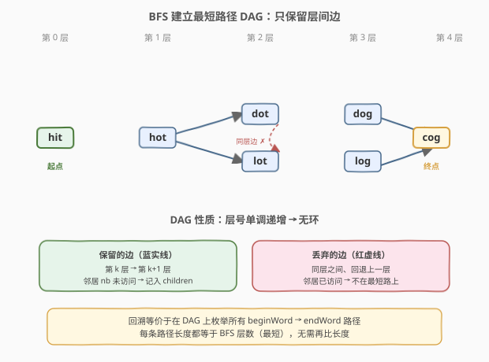
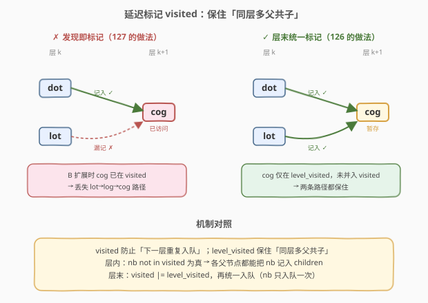
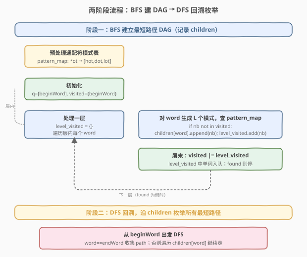
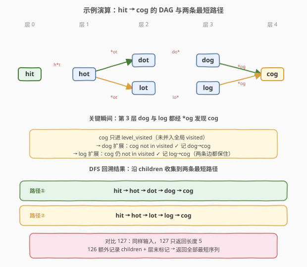

# 单词接龙 II

- **题目名称**：单词接龙 II
- **链接**：[126. 单词接龙 II](https://leetcode.cn/problems/word-ladder-ii/)
- **难度**：困难
- **标签**：广度优先搜索、哈希表、字符串、回溯

## 1. 题目概述

给定两个单词 `beginWord` 和 `endWord`，以及一个词典 `wordList`。按如下规则，返回**所有**从 `beginWord` 到 `endWord` 的**最短**转换序列：

1. 每次只能改变一个字母
2. 转换序列中的每个中间单词必须在 `wordList` 中
3. `endWord` 必须在 `wordList` 中

> 💡 **与 [127. 单词接龙](../0101-0200/127_单词接龙.md) 的区别**：127 只问最短转换序列的**长度**（首次到达 `endWord` 即返回层数）；126 要求返回**所有**最短序列。从「求一个最短长度」升级为「枚举全部最短路径」，解法从单纯 BFS 变为 **BFS 建图 + 回溯枚举**。

**示例 1**：

```text
输入：beginWord = "hit", endWord = "cog", wordList = ["hot","dot","dog","lot","log","cog"]
输出：[["hit","hot","dot","dog","cog"],["hit","hot","lot","log","cog"]]
解释：存在两条长度为 5 的最短转换序列
```

**示例 2**：

```text
输入：beginWord = "hit", endWord = "cog", wordList = ["hot","dot","dog","lot","log"]
输出：[]
解释：endWord "cog" 不在 wordList 中，无解
```

**约束条件**：

- `1 <= beginWord.length <= 5`
- `endWord.length == beginWord.length`
- `1 <= wordList.length <= 1000`
- `wordList[i].length == beginWord.length`
- `beginWord`、`endWord`、`wordList[i]` 仅由小写英文字母组成
- `beginWord != endWord`
- `wordList` 中所有单词互不相同

---

## 2. 解题思路

### 2.1 暴力思路：枚举所有路径

最朴素的想法：把单词转换关系画成无向图，DFS 枚举 `beginWord` 到 `endWord` 的所有路径，再挑出最短的。

问题：路径数量随层数**指数爆炸**。例如分支因子为 $b$、深度为 $d$ 时，路径数可达 $O(b^d)$；而且非最短路径会被白白搜索。即使像 127 那样用通配符模式把建图降到 $O(N \cdot L^2)$，盲目 DFS 仍会搜出大量「绕远路」的序列。

> 💡 必须先用 **BFS 锁定最短层数**，只在「只往下一层走」的边上回溯，才能把搜索空间压到只含最短路径。

### 2.2 核心观察：BFS 建「最短路径 DAG」+ 回溯枚举



关键洞察分两步：

**第一步：BFS 不只求层数，而是记录「最短路径上的父子边」**

127 的 BFS 用 `visited` 一旦发现就标记，首次到达 `endWord` 即返回——它只关心「能不能到」。126 需要还原路径，故要在 BFS 中记录每个单词的「下一层邻居」`children[word]`，构成一张**有向无环图（DAG）**：所有边都从第 $k$ 层指向第 $k+1$ 层。

> 💡 **为什么是 DAG**：BFS 逐层扩展，只把「未访问」的邻居连边并入下一层。同层之间、回退到上一层的边都不保留——它们不可能出现在任何最短路径上。剩下的边天然分层、单向，无环。

**第二步：在 DAG 上从 `beginWord` 回溯到 `endWord`，枚举所有路径**

有了 `children` 映射，从 `beginWord` 出发做 DFS：每一步沿 `children[word]` 走向下一层，走到 `endWord` 即收集一条路径。由于 DAG 分层且只含最短边，**搜出的每条路径长度都等于最短层数**，无需再比较长度。

> ⚠️ 注意与「暴力 DFS 枚举所有路径」的区别：这里的回溯**只在 DAG 边上走**，绝不走回头路、绝不走同层边，因此每条搜出的路径必然是最短的，搜索量被压缩到「最短路径条数」级别。

### 2.3 关键细节：延迟标记 visited，保住多条最短路径



这是本题**最易踩的坑**。考虑示例 1 中 `dog` 和 `log` 都在第 3 层、都能到 `cog`：

- 若像 127 那样「发现即标记 `visited`」：`dot` 先扩展到 `dog` 标记之，`lot` 扩展时查 `*og` 模式发现 `dog` 已访问——但 `lot` 想扩展的是 `log`，不影响。然而**真正出问题**的场景是：同一层的两个单词 A、B 都能到同一个下一层单词 C（C 是 `endWord` 或路径分叉点）。若 A 先把 C 标记 `visited`，B 扩展时看到 C 已访问，**不会**把 `B→C` 这条边记入 `children`，于是回溯时丢失「经过 B 的最短路径」。

- **正确做法**：用「**层内暂存 + 层末统一标记**」——本层新发现的单词先放进 `level_visited` 临时集合，**不立即**并入全局 `visited`；这样同层所有单词扩展时都能看到 C 仍未访问，各自把 `A→C`、`B→C` 都记入 `children`；待整层处理完，再把 `level_visited` 一次性并入 `visited`。

> 💡 **一句话**：`visited` 防的是「下一层重复入队」；`level_visited` 保的是「同层多父共子」。两者分工不同，缺一不可。代价是 C 会被多条边指向（这正是我们想要的），但只会入队一次（由 `level_visited` 去重，层末统一入队）。

### 2.4 算法流程图



**阶段一：BFS 建 `children` DAG**

1. 预处理通配符模式表 `pattern_map`（同 127）。
2. 队列初始 `{beginWord}`，`visited = {beginWord}`。
3. `while` 每轮处理一层：`level_visited = {}`；对层内每个 `word`，生成 $L$ 个模式查表得邻居 `nb`：
   - 若 `nb not in visited`：`children[word].append(nb)`，`level_visited.add(nb)`；若 `nb == endWord` 置 `found = True`。
4. 层末：`visited |= level_visited`，把 `level_visited` 中单词入队；`found` 为真则停止（**整层处理完再停**，确保同层所有指向 `endWord` 的边都记下）。

**阶段二：DFS 回溯收集路径**

从 `beginWord` 出发，沿 `children` 走到 `endWord` 即收集 `path` 副本。

### 2.5 示例演算



以 `beginWord = "hit"`, `endWord = "cog"`, `wordList = ["hot","dot","dog","lot","log","cog"]` 为例：

**BFS 建图过程**（关键看第 2 层如何保住两条分叉）：

| 层 | 取出 | 模式 | 新发现邻居 | children 记录 | level_visited |
|----|------|------|-----------|---------------|---------------|
| 0 | hit | `h*t` | hot | `hit → [hot]` | {hot} |
| 1 | hot | `*ot` | dot, lot | `hot → [dot, lot]` | {dot, lot} |
| 2 | dot | `do*` | dog | `dot → [dog]` | {dog}（暂未并入 visited） |
| 2 | lot | `lo*` | log | `lot → [log]` | {dog, log} |
| 3 | dog | `*og` | **cog** | `dog → [cog]` | {cog} → found |
| 3 | log | `*og` | **cog** | `log → [cog]` | {cog}（层末并入，停止） |

> ⚠️ 看第 3 层：`dog` 与 `log` 同层，都经 `*og` 发现 `cog`。因为 `cog` 只进 `level_visited`、层末才并入 `visited`，所以 `log` 扩展时 `cog not in visited` 仍成立，`log → [cog]` 这条边被成功记下。若提前标记，会丢掉 `log → cog`，最终只返回一条路径。

**最终 DAG**：

```text
hit → hot → dot → dog → cog
            ↘ lot → log ↗
```

**DFS 回溯**：从 `hit` 出发走 `children`，到 `cog` 收集路径，得到两条：

```text
["hit","hot","dot","dog","cog"]
["hit","hot","lot","log","cog"]
```

> 💡 对比 127：同样的输入，127 只返回 `5`（最短长度）；126 返回这两条序列。BFS 阶段几乎一致，区别仅在「记不记 `children`」与「要不要层末才标记 visited」。

---

## 3. 参考代码

### C++

```cpp
// 单词接龙II.cpp —— BFS 建最短路径 DAG + 回溯枚举所有最短序列
// 编译: g++ -O2 -std=c++17 单词接龙II.cpp -o wordladder2
#include <vector>
#include <string>
#include <unordered_set>
#include <unordered_map>
#include <queue>
using namespace std;

class Solution {
  public:
    vector<vector<string>> findLadders(string beginWord, string endWord,
                                       vector<string>& wordList) {
        unordered_set<string> wordSet(wordList.begin(), wordList.end());
        if (!wordSet.count(endWord)) return {};

        int L = beginWord.size();
        // 通配符模式 → 单词列表（同 127）
        unordered_map<string, vector<string>> patternMap;
        for (string& w : wordList) {
            for (int i = 0; i < L; ++i) {
                string key = w; key[i] = '*';
                patternMap[key].push_back(w);
            }
        }

        // 阶段一：BFS 建立 children DAG（最短路径上的父子边）
        unordered_map<string, vector<string>> children;
        unordered_set<string> visited{beginWord};
        queue<string> q;
        q.push(beginWord);
        bool found = false;

        while (!q.empty() && !found) {
            unordered_set<string> levelVisited;   // 层内暂存，层末统一标记
            int size = q.size();
            for (int k = 0; k < size; ++k) {
                string word = q.front(); q.pop();
                for (int i = 0; i < L; ++i) {
                    string key = word; key[i] = '*';
                    for (const string& nb : patternMap[key]) {
                        if (nb == word) continue;
                        if (!visited.count(nb)) {            // 未访问 → 下一层
                            children[word].push_back(nb);    // 记最短路径边
                            levelVisited.insert(nb);
                            if (nb == endWord) found = true;
                        }
                    }
                }
            }
            // 层末统一并入 visited 并入队（保住同层多父共子）
            for (const string& w : levelVisited) {
                visited.insert(w);
                q.push(w);
            }
        }

        // 阶段二：DFS 回溯，沿 children 枚举所有最短路径
        vector<vector<string>> res;
        vector<string> path{beginWord};
        backtrack(beginWord, endWord, children, path, res);
        return res;
    }

  private:
    void backtrack(const string& word, const string& endWord,
                   unordered_map<string, vector<string>>& children,
                   vector<string>& path, vector<vector<string>>& res) {
        if (word == endWord) {
            res.push_back(path);
            return;
        }
        auto it = children.find(word);
        if (it == children.end()) return;
        for (const string& nb : it->second) {
            path.push_back(nb);
            backtrack(nb, endWord, children, path, res);
            path.pop_back();
        }
    }
};
```

> ⚠️ **停止时机**：`found` 置 `true` 后不立即 `break`，而是让当前层的 `for (k)` 循环跑完——确保同层所有指向 `endWord` 的边（如 `dog→cog` 与 `log→cog`）都被记入 `children`。层末 `while` 条件 `!found` 生效，停止下一层扩展。

### Python

```python
class Solution:
    def findLadders(self, beginWord: str, endWord: str,
                    wordList: List[str]) -> List[List[str]]:
        word_set = set(wordList)
        if endWord not in word_set:
            return []

        L = len(beginWord)
        # 通配符模式 → 单词列表（同 127）
        pattern_map = collections.defaultdict(list)
        for w in wordList:
            for i in range(L):
                pattern_map[w[:i] + '*' + w[i+1:]].append(w)

        # 阶段一：BFS 建立 children DAG
        children = collections.defaultdict(list)
        visited = {beginWord}
        q = collections.deque([beginWord])
        found = False

        while q and not found:
            level_visited = set()                # 层内暂存
            for _ in range(len(q)):
                word = q.popleft()
                for i in range(L):
                    key = word[:i] + '*' + word[i+1:]
                    for nb in pattern_map[key]:
                        if nb == word:
                            continue
                        if nb not in visited:    # 未访问 → 下一层
                            children[word].append(nb)
                            level_visited.add(nb)
                            if nb == endWord:
                                found = True
            # 层末统一并入 visited 并入队
            visited |= level_visited
            for w in level_visited:
                q.append(w)

        # 阶段二：DFS 回溯，沿 children 枚举所有最短路径
        res = []
        path = [beginWord]

        def backtrack(word: str) -> None:
            if word == endWord:
                res.append(path[:])
                return
            for nb in children[word]:
                path.append(nb)
                backtrack(nb)
                path.pop()

        backtrack(beginWord)
        return res
```

> 💡 **`children` 用 `defaultdict(list)`**：回溯时 `children[word]` 对未在 BFS 中扩展的单词（如叶子 `endWord`）返回空列表，自然终止递归，无需额外判空。

---

## 4. 复杂度分析

| 维度 | 复杂度 | 说明 |
|------|--------|------|
| 时间 | $O(N \cdot L^2 + P \cdot L)$ | BFS 建图同 127 为 $O(N \cdot L^2)$；回溯代价 $P \cdot L$，$P$ 为最短路径条数（每条路径长 $O(L)$，路径数最坏指数级，但题目数据下可控） |
| 空间 | $O(N \cdot L + P \cdot L)$ | `pattern_map` $O(N \cdot L)$；`children` DAG 最多 $O(N \cdot L)$ 条边；答案存储 $P$ 条路径各 $O(L)$ |

> ⚠️ **最坏路径数**：最短路径条数 $P$ 理论上可达指数级（如完全二分 DAG），故最坏时间复杂度含指数项——这是「输出所有最短路径」问题的固有下界（答案本身就那么大）。本题 $N \le 1000$、$L \le 5$ 的约束保证了输出规模可控。

> 💡 **对比 127**：127 只求长度，$O(N \cdot L^2)$ 一步到位；126 多了回溯枚举，多出的 $P \cdot L$ 是「输出全部答案」的必要代价。BFS 建图部分两者完全同构。

---

## 5. 扩展：DFS 回溯 vs BFS 反向溯源

上面的两阶段做法是「**正向 BFS 建正向 DAG → 正向 DFS**」。还有一种对称写法：BFS 时记录每个单词的「**父节点列表**」`parents[nb]`（而非 children），建完后从 `endWord` **反向**回溯到 `beginWord`。两者等价，区别仅在建图方向：

- **正向 children**：BFS 时 `children[word].append(nb)`，回溯从 `beginWord` 出发，路径顺序天然正向，无需反转。
- **反向 parents**：BFS 时 `parents[nb].append(word)`，回溯从 `endWord` 出发，收集到的路径需 `reverse` 后输出。

> 💡 反向法的优势：从 `endWord` 回溯天然只在「能到达终点」的子图上走，**不会误入死分支**；正向法若 DAG 中存在「向下分叉但走不到 `endWord`」的分支，DFS 会进去再回退（多花一点时间，但因 DAG 分层，分支有限）。工程上两者皆可，正向法代码更直观（路径不用反转），本文采用正向。

### 双向 BFS 建图

当 $N$ 较大、图较深时，可借鉴 127 的双向 BFS：从 `beginWord` 和 `endWord` 两端同时扩展，相遇时拼接路径。但 126 要枚举**所有**最短路径，双向相遇时需处理「两端 DAG 拼接」的细节（相遇层的每个单词都要枚举「正向入边 × 反向入边」的组合），实现复杂度显著上升。面试中除非明确追问大数据优化，正向 BFS + 回溯已足够。

---

## 6. 面试要点

1. **为什么不能像 127 那样「发现即标记 visited」？**

   - 127 只求长度，首个父节点到达即可，多余的边无用。126 要还原**所有**最短路径，必须保留同层多个父节点指向同一子节点的边。若发现即标记，后到的同层父节点会因 `nb in visited` 而漏记 `children`，丢失路径。**层内暂存 + 层末统一标记**是保住多父共子的关键。

2. **BFS 建出的图为什么一定是 DAG？**

   - 只把「未访问（即下一层）」的邻居连边，同层之间、回退上一层的边都不保留。层号单调递增 → 不可能成环。DAG 性质保证回溯必然终止，且每条搜出的路径长度都等于最短层数。

3. **`found` 置真后为什么不立刻 `break`？**

   - 同层可能有多个单词都能到 `endWord`（如 `dog→cog` 与 `log→cog`）。立即 `break` 会漏掉后续同层单词的 `children` 记录，丢失路径。必须让当前层 `for` 循环跑完，层末再由 `while !found` 停止下一层——这是「保住同层多父共子」在停止逻辑上的体现。

4. **回溯阶段会不会搜出非最短路径？**

   - 不会。`children` 只含「层 $k$ → 层 $k+1$」的最短边，DAG 中任意 `beginWord → endWord` 路径长度都等于 BFS 层数（最短）。回溯等价于在 DAG 上枚举所有 `beginWord → endWord` 路径，无需额外长度判断。

5. **通配符模式为什么必须用？**

   - 朴素建图 $O(N^2 \cdot L)$ 在 $N=1000$ 时约 $10^7$，勉强可行；但 $N$ 更大时超时。通配符把边发现降到 $O(N \cdot L^2)$，且建出的 `pattern_map` 同时服务于 BFS 扩展，是 127/126 共用的核心优化。本题 $L \le 5$，模式数至多 $5N$，哈希查询极快。

> 💡 **一句话总结**：126 = 127 的 BFS 骨架 + 「记 `children` 建最短路径 DAG」+ 「层末标记保多父共子」+ 「DFS 回溯枚举」。难度从困难升到困难+，核心增量是**延迟标记 visited** 这一细节——它决定了能否保住全部最短路径。

---

## 7. 同类练习题

- [127. 单词接龙](https://leetcode.cn/problems/word-ladder/)（[题解](../0101-0200/127_单词接龙.md)）：本题的「求长度」版，BFS 首次到达即返回。掌握 127 的通配符 + BFS 后，126 只需加「记 children + 层末标记 + 回溯」三步
- [433. 最小基因变化](https://leetcode.cn/problems/minimum-genetic-mutation/)：与 127 完全同构，基因串代替单词、ACGT 四字符。改成「返回所有最短序列」即为 126 的基因版变体
- [752. 打开转盘锁](https://leetcode.cn/problems/open-the-lock/)：隐式图 BFS 求最短步数，状态是 4 位数字锁。若要枚举所有最短拨法序列，思路同 126：BFS 建 DAG + 回溯
- [797. 所有可能的路径](https://leetcode.cn/problems/all-paths-from-source-to-target/)：在给定 DAG 上枚举所有 `0 → n-1` 路径，纯 DFS 回溯。可视为 126 去掉「BFS 建图」阶段、DAG 直接给定的简化版
- [301. 删除无效的括号](https://leetcode.cn/problems/remove-invalid-parentheses/)：BFS 锁定最少删除数后，枚举所有等价最短删法。同样是「BFS 定最短 + 回溯枚举全部」的两阶段范式
