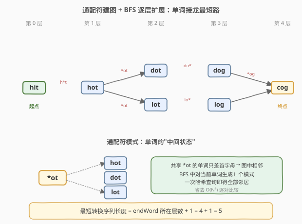
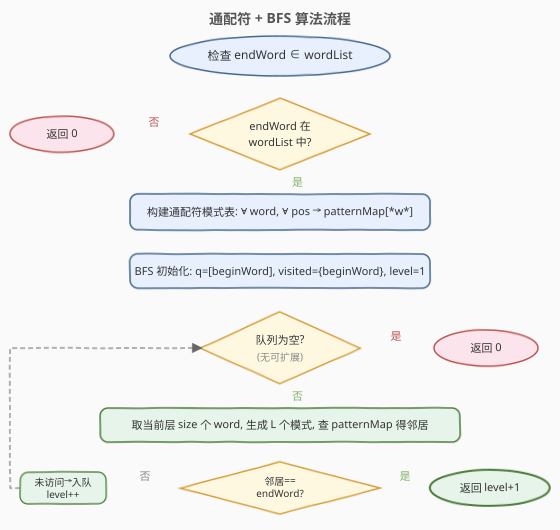
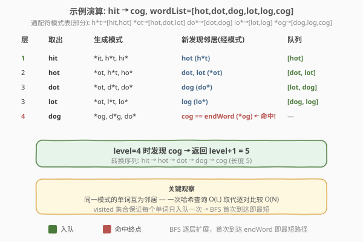
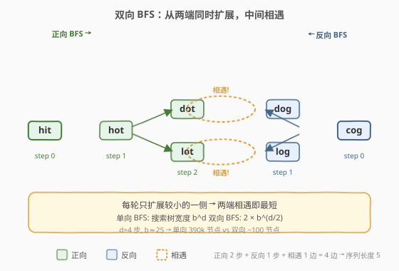

# 单词接龙

- **题目名称**：单词接龙
- **链接**：[127. 单词接龙](https://leetcode.cn/problems/word-ladder/)
- **难度**：困难
- **标签**：广度优先搜索、哈希表、字符串、双向 BFS

## 1. 题目概述

给定两个单词 `beginWord` 和 `endWord`，以及一个词典 `wordList`。找到从 `beginWord` 到 `endWord` 的**最短转换序列**的长度，规则：

1. 每次只能改变一个字母
2. 转换序列中的每个中间单词必须在 `wordList` 中
3. `endWord` 必须在 `wordList` 中

返回转换序列的**长度**（含 `beginWord` 和 `endWord`）；若不存在返回 `0`。

**示例 1**：

```text
输入：beginWord = "hit", endWord = "cog", wordList = ["hot","dot","dog","lot","log","cog"]
输出：5
解释：最短转换序列为 "hit" -> "hot" -> "dot" -> "dog" -> "cog"，长度 5
```

**示例 2**：

```text
输入：beginWord = "hit", endWord = "cog", wordList = ["hot","dot","dog","lot","log"]
输出：0
解释：endWord "cog" 不在 wordList 中，无法完成转换
```

**约束条件**：

- `1 <= beginWord.length <= 10`
- `endWord.length == beginWord.length`
- `1 <= wordList.length <= 5000`
- `wordList[i].length == beginWord.length`
- `beginWord`、`endWord`、`wordList[i]` 仅由小写英文字母组成
- `beginWord != endWord`
- `wordList` 中所有单词互不相同

---

## 2. 解题思路

### 2.1 暴力思路：枚举所有词对建图

将每个单词视为图节点，两单词仅差一个字母则连边。朴素做法：双重循环枚举所有词对，逐字符比较判断是否恰好差一个字母，建邻接表后 BFS。

复杂度：建图 $O(N^2 \cdot L)$（$N$ 为词数，$L$ 为词长），BFS $O(N+E)$。当 $N=5000$、$L=10$ 时，建图需 $2.5 \times 10^8$ 次字符比较，**超时**。

优化方向：不显式建图，用**通配符模式**将 $O(N^2)$ 的边发现降到 $O(N \cdot L)$。

### 2.2 核心观察：通配符建图 + BFS 求最短路



关键洞察：

- **通配符模式**：对每个单词，将每个位置的字母替换为 `*`，得到 $L$ 个模式。如 `hot` → `*ot`、`h*t`、`ho*`。
- **同一模式下的单词互相只差一个字母**，即它们在图中彼此相邻。
- 用哈希表 `pattern → [word1, word2, ...]` 存储所有单词的模式映射。
- BFS 时，对当前单词生成 $L$ 个模式，查哈希表即可得到所有邻居——无需逐对比较。

> 💡 **直觉**：通配符模式相当于"中间状态"。`hot` 和 `dot` 都映射到 `*ot`，说明它们只差首字母不同。通过模式做"跳板"，一次哈希查询就能找到所有邻居。

BFS 求最短路：

- 从 `beginWord` 出发 BFS，每层代表转换一步
- `beginWord` 在第 0 层（序列长度 1），邻居在第 1 层（序列长度 2），...
- 首次到达 `endWord` 时的层数 + 1 即为最短转换序列长度
- BFS 天然求最短路：无权图首次访问即最短

### 2.3 算法流程图



流程核心是一重 `while` 循环，每轮处理当前层的所有单词。每个单词生成 $L$ 个模式，每个模式查哈希表得邻居列表。发现 `endWord` 立即返回 `level + 1`。

### 2.4 示例演算



以 `beginWord = "hit"`, `endWord = "cog"`, `wordList = ["hot","dot","dog","lot","log","cog"]` 为例：

| 层 | 取出 | 生成模式 | 新发现邻居(经模式) | 队列 |
|----|------|----------|-------------------|------|
| 1 | hit | `*it, h*t, hi*` | hot (经 `h*t`) | `[hot]` |
| 2 | hot | `*ot, h*t, ho*` | dot, lot (经 `*ot`) | `[dot, lot]` |
| 3 | dot | `*ot, d*t, do*` | dog (经 `do*`) | `[lot, dog]` |
| 3 | lot | `*ot, l*t, lo*` | log (经 `lo*`) | `[dog, log]` |
| 4 | dog | `*og, d*g, do*` | **cog == endWord** (经 `*og`) | — |

`level = 4` 时发现 `cog`，返回 `level + 1 = 5`。转换序列：`hit → hot → dot → dog → cog`。

> 💡 注意 `log` 也会在第 4 层发现 `cog`，但此时 `cog` 已被 `dog` 先一步加入 `visited`，不会重复处理。BFS 的 `visited` 集合保证每个单词只入队一次，首次到达即最短。

---

## 3. 参考代码

### 方法一：通配符 + BFS（推荐）

### C++

```cpp
class Solution {
public:
    int ladderLength(string beginWord, string endWord, vector<string>& wordList) {
        unordered_set<string> wordSet(wordList.begin(), wordList.end());
        if (!wordSet.count(endWord)) return 0;

        int L = beginWord.size();
        // 通配符模式 → 单词列表
        unordered_map<string, vector<string>> patternMap;
        for (string& w : wordList) {
            for (int i = 0; i < L; ++i) {
                string key = w;
                key[i] = '*';
                patternMap[key].push_back(w);
            }
        }

        queue<string> q;
        q.push(beginWord);
        unordered_set<string> visited{beginWord};
        int level = 1;                          // beginWord 计为序列长度 1

        while (!q.empty()) {
            int size = q.size();
            for (int k = 0; k < size; ++k) {
                string word = q.front(); q.pop();
                for (int i = 0; i < L; ++i) {
                    string key = word;
                    key[i] = '*';
                    for (string& nb : patternMap[key]) {
                        if (nb == endWord) return level + 1;
                        if (!visited.count(nb)) {
                            visited.insert(nb);
                            q.push(nb);
                        }
                    }
                }
            }
            level++;
        }
        return 0;
    }
};
```

### Python

```python
class Solution:
    def ladderLength(self, beginWord: str, endWord: str,
                     wordList: List[str]) -> int:
        word_set = set(wordList)
        if endWord not in word_set:
            return 0

        L = len(beginWord)
        pattern_map = collections.defaultdict(list)
        for w in wordList:
            for i in range(L):
                pattern_map[w[:i] + '*' + w[i+1:]].append(w)

        q = collections.deque([beginWord])
        visited = {beginWord}
        level = 1

        while q:
            for _ in range(len(q)):
                word = q.popleft()
                for i in range(L):
                    key = word[:i] + '*' + word[i+1:]
                    for nb in pattern_map[key]:
                        if nb == endWord:
                            return level + 1
                        if nb not in visited:
                            visited.add(nb)
                            q.append(nb)
            level += 1
        return 0
```

> 💡 **为什么 `beginWord` 不需要加入 `patternMap`？** BFS 处理 `beginWord` 时，我们生成它的模式并查 `patternMap`——这些模式由 `wordList` 中的单词贡献，已经包含了与 `beginWord` 差一个字母的邻居。`beginWord` 自身只需加入 `visited` 避免重复访问。

---

## 4. 复杂度分析

| 维度 | 复杂度 | 说明 |
|------|--------|------|
| 时间复杂度 | $O(N \cdot L^2)$ | 建模式表 $O(N \cdot L^2)$（每个词 $L$ 个模式，切片 $O(L)$）；BFS 每词出队一次，生成 $L$ 个模式各 $O(L)$，总 $O(N \cdot L^2)$ |
| 空间复杂度 | $O(N \cdot L)$ | 模式哈希表存 $N \cdot L$ 个键值对，`visited` 与队列 $O(N)$ |

> 💡 **对比暴力建图** $O(N^2 \cdot L)$：当 $N=5000$、$L=10$ 时，通配符法 $\approx 5 \times 10^5$ vs 暴力 $\approx 2.5 \times 10^8$，快约 **500 倍**。

---

## 5. 扩展：双向 BFS



当 `beginWord` 和 `endWord` 都已知时，可以**从两端同时 BFS**：

- 维护两个前沿集合 `front` 和 `back`，分别从起点和终点扩展
- 每轮只扩展**较小的一侧**（保证搜索空间最小）
- 当某侧扩展发现邻居已在另一侧的 `visited` 中时，两路相遇，找到最短路

双向 BFS 将搜索树从宽度 $b^d$ 缩小到两次 $b^{d/2}$，对分支因子大的图提升显著（本题 $b$ 可达 25，$d$ 约 5 层）。

### C++

```cpp
class Solution {
public:
    int ladderLength(string beginWord, string endWord, vector<string>& wordList) {
        unordered_set<string> wordSet(wordList.begin(), wordList.end());
        if (!wordSet.count(endWord)) return 0;

        int L = beginWord.size();
        unordered_map<string, vector<string>> patternMap;
        for (string& w : wordList) {
            for (int i = 0; i < L; ++i) {
                string key = w; key[i] = '*';
                patternMap[key].push_back(w);
            }
        }

        unordered_set<string> front{beginWord}, back{endWord};
        unordered_set<string> visFront{beginWord}, visBack{endWord};
        int level = 1;

        while (!front.empty() && !back.empty()) {
            if (front.size() > back.size()) {       // 总扩展较小侧
                swap(front, back);
                swap(visFront, visBack);
            }
            unordered_set<string> nextFront;
            for (const string& word : front) {
                for (int i = 0; i < L; ++i) {
                    string key = word; key[i] = '*';
                    for (const string& nb : patternMap[key]) {
                        if (visBack.count(nb))      // 两端相遇
                            return level + 1;
                        if (!visFront.count(nb)) {
                            visFront.insert(nb);
                            nextFront.insert(nb);
                        }
                    }
                }
            }
            front = move(nextFront);
            level++;
        }
        return 0;
    }
};
```

> ⚠️ **level 计数**：每次扩展（无论哪侧）`level++`。相遇时返回 `level + 1`——因为相遇边本身算一步，但还未计入 `level`。以 `hit→cog` 为例：正向 2 步 + 反向 1 步 + 相遇 1 边 = 4 边 → 序列长度 5。

---

## 6. 面试要点

1. **为什么不直接枚举所有词对建图？**

   - $O(N^2 \cdot L)$ 的建图代价在 $N=5000$ 时约 $2.5 \times 10^8$，超时
   - 通配符模式将边发现降到 $O(N \cdot L^2)$，本质是用哈希表避免逐对比较

2. **BFS 为什么能求最短转换序列？**

   - 单词转换图是无权图（每条边权重 1），BFS 逐层扩展首次到达终点即为最短路径
   - `visited` 集合保证每个单词只入队一次，首次访问时层数最小

3. **通配符模式的本质是什么？**

   - 把"两个单词差一个字母"转化为"它们共享同一个模式"
   - 模式是"中间状态"：`hot` 和 `dot` 都映射到 `*ot`，说明只差首字母
   - 类比邻接表：模式是"超级节点"，通过它一次查询连接所有只差一位的单词

4. **双向 BFS 何时有优势？**

   - 图较深、分支因子大时，双向将搜索量从 $O(b^d)$ 降到 $O(b^{d/2})$
   - 本题 $b$ 可达 25（26 个字母替换），$d$ 约 5 层，双向提升明显
   - 每轮扩展较小一侧，保证两边搜索树均衡

5. **`beginWord` 不在 `wordList` 中怎么办？**

   - 不影响：BFS 从 `beginWord` 出发生成其模式，查 `patternMap` 即可找到邻居
   - `beginWord` 无需加入 `patternMap`（邻居通过共享模式找到），但必须加入 `visited` 避免重复

---

## 7. 同类练习题

- [126. 单词接龙 II](https://leetcode.cn/problems/word-ladder-ii/)：在 BFS 求最短长度基础上，还需记录路径并输出所有最短转换序列
- [433. 最小基因变化](https://leetcode.cn/problems/minimum-genetic-mutation/)：完全同构的题，基因串代替单词，仅 A/C/G/T 四种字符
- [752. 打开转盘锁](https://leetcode.cn/problems/open-the-lock/)：隐式图 BFS 求最短步数，状态是 4 位数字锁，同样可用双向 BFS 优化（已有题解）
- [301. 删除无效的括号](https://leetcode.cn/problems/remove-invalid-parentheses/)：BFS 逐层删除括号求最少删除数，类似隐式图最短路径搜索
