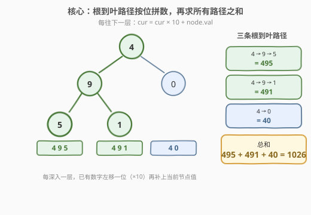
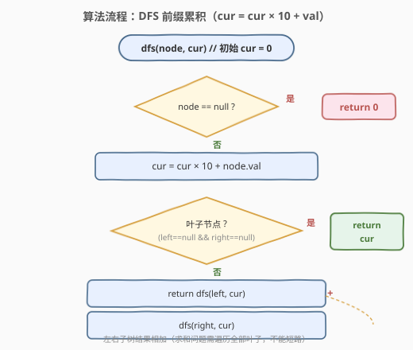
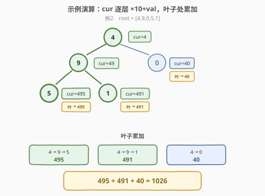

# 求根节点到叶节点数字之和

- **题目名称**：求根节点到叶节点数字之和
- **链接**：[129. 求根节点到叶节点数字之和](https://leetcode.cn/problems/sum-root-to-leaf-numbers/)
- **难度**：中等
- **标签**：树、深度优先搜索、二叉树

## 1. 题目概述

给定一棵二叉树的根节点 `root`，树上每个节点存放一位数字 `0`~`9`。每条「从根节点到叶子节点」的路径代表一个数字：把路径上从根到叶的各节点值**按顺序拼接**成一个整数。求所有根到叶路径所表示的**数字之和**。

> 💡 **叶子节点**：没有左右孩子的节点。拼接规则即「每往下一层，已有数字左移一位（×10）再补当前节点值」。例如路径 `4 → 9 → 5` 表示数字 $495$。

**示例 1**：

```text
输入：root = [1,2,3]
输出：25
解释：两条根到叶路径：
  1 → 2 表示数字 12
  1 → 3 表示数字 13
  总和 = 12 + 13 = 25
      1
     / \
    2   3
```

**示例 2**：

```text
输入：root = [4,9,0,5,1]
输出：1026
解释：三条根到叶路径：
  4 → 9 → 5 表示数字 495
  4 → 9 → 1 表示数字 491
  4 → 0     表示数字 40
  总和 = 495 + 491 + 40 = 1026
        4
       / \
      9   0
     / \
    5   1
```

**约束条件**：

- 树中节点数目在范围 `[1, 1000]` 内
- `0 <= Node.val <= 9`
- 树的深度不超过 `10`
- **保证**答案 ≤ $2^{31} - 1$（32 位有符号整数范围内）

> 💡 本题是 [112. 路径总和](112_路径总和.md) 的「数字版」变体：112 是把路径上的值**相加**后判断是否等于目标，129 是把路径上的值**按位拼接**成数字再**求和累加**。二者共享同一套「DFS 一路下传」骨架，区别只在「下传的运算」从 `target − val` 换成了 `cur × 10 + val`，以及「汇总方式」从 `||` 短路判定换成了 `+` 求和。

---

## 2. 解题思路

### 2.1 暴力思路

枚举每一条「根到叶」路径，把路径上的数字拼成一个整数，最后把所有路径的数字加起来。问题归结为：**如何在 DFS 过程中高效地维护「当前已拼出的数字」**，避免每条路径都从头重新拼接。

### 2.2 核心观察：前缀累积 —— cur 一路「×10 + val」下去



关键观察是**数字的十进制拼接本质**：从根走到当前节点时，路径上已经形成的数字 `cur`，每深入一层就执行一次 `cur = cur × 10 + node.val`。

- 进入根节点时，`cur` 从 `0` 开始，变为 `0 × 10 + root.val = root.val`；
- 每往子节点走一层，已有数字左移一位（×10），再补上当前节点值；
- **走到叶子时**，`cur` 就是这条根到叶路径所表示的完整数字，直接把它累加进答案。

> 💡 这是一种「**前缀累积**」写法：`dfs(node, cur)` 表示「在以 `node` 为根的子树里，所有从根到叶路径所表示数字之和，其中 `cur` 是从根到 `node` 的父节点已经拼出的前缀」。子问题定义清晰，`cur` 作为参数随递归下传，无需额外数组、无需回溯。

> ⚠️ **为什么不需要回溯？** 因为 `cur` 是**按值传递**的函数参数（C++ 的 `int`、Python 的 `int` 都是不可变值）。每次递归调用 `dfs(child, cur × 10 + val)` 时，新调用拿到的是一份新的 `cur` 值，调用返回后当前层的 `cur` 不受影响——天然就是「向下传副本」，省去了手动「撤销选择」的步骤。这与需要维护可变 `path` 数组的 [113. 路径总和 II](113_路径总和II.md) 不同。

### 2.3 算法流程图



**DFS 递归逻辑**：

| 情况 | 处理 |
|------|------|
| `node == null` | 返回 `0`（空子树不贡献任何数字） |
| 先更新前缀 | `cur = cur × 10 + node.val` |
| 叶子（左右都空） | 返回 `cur`（这条路径的完整数字） |
| 否则（内部节点） | 返回 `dfs(left, cur) + dfs(right, cur)` |

> ⚠️ **必须判叶子**：累加只能发生在**叶子节点**。若在内部节点就返回 `cur`，会把「未走到叶的半截路径」也计入答案——例如根 `4` 有孩子 `9`，若根处就返回 `4`，则多算了一个不合法的数字。判叶子即 `node.left == null && node.right == null`。

> 💡 **求和 vs 判定**：和 [112](112_路径总和.md) 的 `||` 短路不同，本题是**求和问题**——必须遍历**所有**叶子并把它们的数字相加，**不能短路**。左子树的结果无论大小都要加上右子树的结果，因此递归式是 `dfs(left, cur) + dfs(right, cur)` 而非 `||`。这是「枚举/求和问题需全搜」的体现。

### 2.4 示例演算

以示例 2（`root = [4,9,0,5,1]`）为例，沿「前缀累积」追踪每条根到叶路径：



| 根到叶路径 | cur 演变（逐层 ×10+val） | 叶子处数字 | 累计和 |
|-----------|--------------------------|------------|--------|
| 4 → 9 → 5 | 0→**4**→**49**→**495** | 495 | 495 |
| 4 → 9 → 1 | 0→4→49→**491** | 491 | 986 |
| 4 → 0     | 0→4→**40** | 40 | 1026 |

三条路径全部走完后，总和 $495 + 491 + 40 = 1026$。

> 💡 注意 `cur` 在每个节点处独立演变：进入 `9` 时左路 `cur=49`、右路（`0` 分支）`cur=40`，二者互不干扰——这正是「按值传递、天然免回溯」的好处。若改用「全局变量 + 手动回溯」，则需在进入/退出节点时显式 `push/pop` 当前数字，容易出错。

---

## 3. 参考代码

### C++

```cpp
/**
 * Definition for a binary tree node.
 * struct TreeNode {
 *     int val;
 *     TreeNode *left;
 *     TreeNode *right;
 *     TreeNode() : val(0), left(nullptr), right(nullptr) {}
 *     TreeNode(int x) : val(x), left(nullptr), right(nullptr) {}
 *     TreeNode(int x, TreeNode *left, TreeNode *right) : val(x), left(left), right(right) {}
 * };
 */
class Solution {
  public:
    int sumNumbers(TreeNode* root) {
        return dfs(root, 0);
    }
  private:
    int dfs(TreeNode* node, int cur) {
        if (node == nullptr) return 0;                       // 空节点：不贡献数字
        cur = cur * 10 + node->val;                          // 前缀累积：左移一位再补当前值
        if (node->left == nullptr && node->right == nullptr) // 叶子：返回这条路径的完整数字
            return cur;
        return dfs(node->left, cur) + dfs(node->right, cur); // 内部节点：左右子树求和（不能短路）
    }
};
```

### Python

```python
class Solution:
    def sumNumbers(self, root: Optional[TreeNode]) -> int:
        def dfs(node: Optional[TreeNode], cur: int) -> int:
            if node is None:                              # 空节点：不贡献数字
                return 0
            cur = cur * 10 + node.val                     # 前缀累积：左移一位再补当前值
            if node.left is None and node.right is None:  # 叶子：返回这条路径的完整数字
                return cur
            return dfs(node.left, cur) + dfs(node.right, cur)  # 左右子树求和（不能短路）

        return dfs(root, 0)
```

> 💡 也可写成「返回值不累加在递归里、而在叶子处把 `cur` 加到一个外部 `self.ans`」的非纯写法，但需注意 `self.ans` 是可变状态、要在进入 `sumNumbers` 时重置。上面这种「递归返回值即子树之和」的纯函数写法更易推理，面试推荐。

---

## 4. 复杂度分析

| 维度 | 复杂度 | 说明 |
|------|--------|------|
| **时间复杂度** | $O(n)$ | 每个节点恰好访问一次，每次做 $O(1)$ 的乘加运算；求和问题需遍历全部叶子，无法短路 |
| **空间复杂度** | $O(h)$ | 递归调用栈深度 = 树高 $h$。平衡树 $h = O(\log n)$；链状树 $h = O(n)$。本题保证 $h \le 10$，栈开销极小 |

> 💡 本题 $n \le 1000$ 且树深 $\le 10$，递归完全安全，无需担心栈溢出。约束「树深 $\le 10$」也保证了拼出的数字最多 10 位（$< 2^{31}$），无需用 `long long` 防溢出——但若面试官追问「节点值改为多位数 / 树更深怎么办」，可答：改用 `long long` 累积并对结果取模。

---

## 5. 扩展：迭代写法（显式栈）

把递归栈显式化，栈里存 `(node, cur)`，`cur` 表示「从根到该节点已拼出的前缀数字」。遇到叶子就把 `cur` 累加进答案：

```python
class Solution:
    def sumNumbers(self, root: Optional[TreeNode]) -> int:
        if not root:
            return 0
        ans = 0
        stack = [(root, root.val)]
        while stack:
            node, cur = stack.pop()
            if not node.left and not node.right:      # 叶子：累加
                ans += cur
                continue
            if node.left:
                stack.append((node.left,  cur * 10 + node.left.val))
            if node.right:
                stack.append((node.right, cur * 10 + node.right.val))
        return ans
```

> 💡 这是把递归的「调用栈」换成「手动栈」，逻辑完全对应。注意入栈时就把 `cur` 算好（`cur * 10 + child.val`），与递归版在「进入子节点前」更新前缀一致。用 `pop()` 取末尾是 DFS；换成 `deque.popleft()` 即变 BFS，但 BFS 会在还没走到叶时就把中间节点都入队，空间更费，本题 DFS 更合适。

---

## 6. 面试要点

1. **为什么用「cur × 10 + val」而不是「字符串拼接」？**

   - 两者等价，但「数字乘加」更高效：字符串拼接需 $O(\text{路径长})$ 拷贝，而 `cur × 10 + val` 是 $O(1)$ 整数运算。此外数字写法天然按值传递、免回溯，代码最简洁。字符串写法要把可变 `str`/`list` 当状态传，还得手动回溯，容易出错。面试推荐「数字乘加」。

2. **为什么必须判叶子，而不能在 `node == null` 时累加 `cur`？**

   - 若改为「左空且右空时累加」，需要先更新 `cur` 再判——这是本题的正确做法。但**不能**在 `node == null` 这个 base case 里累加：因为一个叶子有左右两个 `null` 孩子，会在 `null` 处把同一条路径的数字**重复累加两次**。正确做法是在**叶子节点本身**（`node.left == null && node.right == null`）返回 `cur`，`node == null` 只返回 `0`。

3. **为什么本题用 `+` 而 112 用 `||`？能短路吗？**

   - 112 是「判定是否存在」，存在即可停，所以 `||` 能短路。129 是「求所有路径数字之和」，**每条路径都要计入**，缺一不可，因此必须用 `+` 全搜、不能短路。这是「枚举/求和问题」与「存在性判定问题」的本质区别。

4. **`cur` 需要回溯吗？为什么？**

   - 不需要。`cur` 是按值传递的整数参数（C++ `int`、Python `int` 均不可变）。每次递归调用 `dfs(child, cur × 10 + val)` 时，子调用拿到的是计算后的新值，**当前层的 `cur` 不被子调用修改**。调用返回后当前层继续用原来的 `cur` 处理另一个孩子，天然隔离。这与 [113](113_路径总和II.md) 中维护可变 `path` 列表必须手动 `pop` 回溯的情形形成对比。

5. **节点值都为 0~9 有什么用？答案会溢出吗？**

   - 节点值是一位数字，保证了 `cur × 10 + val` 就是标准的十进制拼接。题目保证树深 $\le 10$，所以单条路径数字最多 10 位（$< 10^{10} < 2^{31}$ 用 `int` 装不下？实际上 $2^{31}-1 \approx 2.1 \times 10^{9}$ 是 10 位数上限，而所有路径之和题目已保证 $\le 2^{31}-1$）。实践中用 `int` 即可；若不放心或约束放宽，可改 `long long` / Python 的任意精度整数。

> 💡 **一句话总结**：129 是树 DFS「前缀累积」的母题——「`cur × 10 + val` 下传 + 叶子返回 `cur` + `+` 求和」三件套。掌握它，再看 [112](112_路径总和.md)（判定版，`||` 短路）、[113](113_路径总和II.md)（收集版，回溯）、[257. 二叉树的所有路径](https://leetcode.cn/problems/binary-tree-paths/)（字符串版路径收集），都是从同一骨架换「下传运算」与「汇总方式」的自然变体。

---

## 7. 同类练习题

- [112. 路径总和](https://leetcode.cn/problems/path-sum/)：把「拼数求和」换成「加值判等」，DFS 骨架相同，汇总用 `||` 短路判定（[题解](112_路径总和.md)）
- [113. 路径总和 II](https://leetcode.cn/problems/path-sum-ii/)：要求列出所有合法路径，从「数值参数免回溯」升级为「可变 `path` 列表 + 手动回溯」（[题解](113_路径总和II.md)）
- [437. 路径总和 III](https://leetcode.cn/problems/path-sum-iii/)：路径不再要求到叶、可从任意节点开始，升级为「树上前缀和 + 哈希计数」（[题解](../0401-0500/437_路径总和III.md)）
- [257. 二叉树的所有路径](https://leetcode.cn/problems/binary-tree-paths/)：收集所有根到叶路径的字符串形式，是 112→113→129 的中间过渡，练习字符串版回溯
