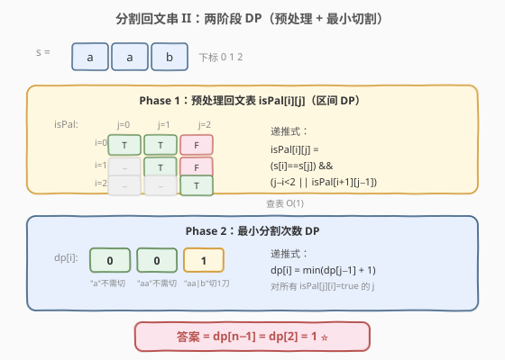
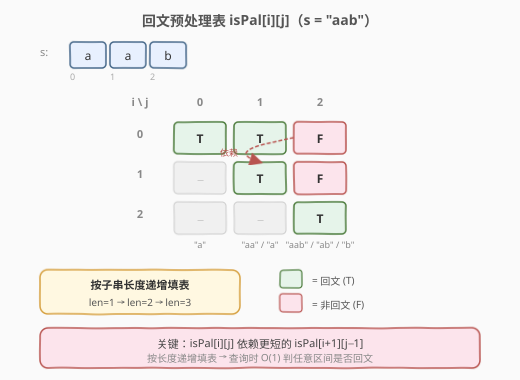
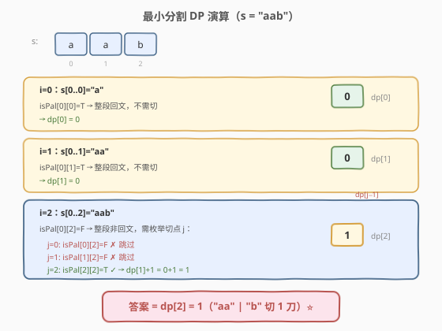

# LeetCode 分割回文串 II 题解

## 1. 题目概述

- **标题 / 题号**：分割回文串 II（#132，hard）
- **链接**：https://leetcode.cn/problems/palindrome-partitioning-ii/
- **难度**：困难
- **标签**：字符串、动态规划

**题意**：给你一个字符串 `s`，请你将 `s` 分割成若干子串，使**每个子串都是回文串**。返回符合要求的**最少分割次数**。

**示例 1**：

```text
输入：s = "aab"
输出：1
解释：只需一次分割即可将 s 分割成两个回文子串 ["aa","b"]。
```

**示例 2**：

```text
输入：s = "a"
输出：0
```

**示例 3**：

```text
输入：s = "ab"
输出：1
```

**约束**：

- `1 <= s.length <= 2000`
- `s` 仅由小写英文字母组成

> ⚠️ 本题求**最少分割次数**（最优值），与 [131. 分割回文串](https://leetcode.cn/problems/palindrome-partitioning/)（枚举**所有方案**）问法不同。131 用回溯，132 用动态规划——这正是「求方案集合」与「求最优值」的分水岭。

## 2. 解题思路

### 2.1 暴力思路：枚举所有分割 + 取最小

长度为 $n$ 的字符串有 $n-1$ 个间隙，每个间隙可切或不切，共 $2^{n-1}$ 种分割方案。逐一验证每段是否回文并记录刀数最小值。当 $n = 2000$ 时 $2^{1999}$ 完全不可行。

### 2.2 核心观察：两阶段 DP（预处理回文表 + 最小切割 DP）



本题的关键在于：**判断任意子串是否回文**这件事会被反复用到，与其每次双指针 $O(n)$ 判定，不如**一次性预处理成表**，之后 $O(1)$ 查询。

> 💡 这是 DP 题中常见的「**辅助预处理 + 主 DP**」范式：先用一个 DP 把反复使用的中间信息算好，再用另一个 DP 解决最终问题。类似的思路出现在「最长回文子序列」「最长有效括号」等题中。

**Phase 1：预处理回文表** `isPal[i][j]`

定义 `isPal[i][j]` 表示 `s[i..j]` 是否为回文串。递推式：

$$
isPal[i][j] = (s[i] = s[j]) \land (j - i < 2 \lor isPal[i+1][j-1])
$$

- $j - i < 2$ 覆盖长度为 1（单字符）和 2（两字符相同）的 base case。
- 长度 $\geq 3$ 时，两端字符相同且中间子串也是回文。
- **填表顺序**：按子串长度从小到大（len=1 → 2 → 3 → …），保证查 `isPal[i+1][j-1]` 时已填好。



**Phase 2：最小分割次数 DP** `dp[i]`

定义 `dp[i]` 为把 `s[0..i]` 分成全回文段的**最少分割次数**。

$$
dp[i] = \min_{\substack{0 \leq j \leq i \\ isPal[j][i] = \text{true}}} \begin{cases} 0 & \text{若 } j = 0 \\ dp[j-1] + 1 & \text{若 } j > 0 \end{cases}
$$

- 若 `isPal[0][i]` 为 true，说明 `s[0..i]` 整段就是回文，无需切割，`dp[i] = 0`。
- 否则枚举**最后一刀的位置** $j$：在 $j$ 前面切一刀，使 `s[j..i]` 是回文（`isPal[j][i]` 为 true），则 `dp[i] = dp[j-1] + 1`。
- 取所有可行 $j$ 中的最小值。

最终答案为 `dp[n-1]`。

### 2.3 示例演算



以 `s = "aab"` 为例：

| 步骤 | i | 子串 | 判定 | dp[i] |
|------|---|------|------|-------|
| 1 | 0 | `"a"` | `isPal[0][0]=T` → 整段回文 | 0 |
| 2 | 1 | `"aa"` | `isPal[0][1]=T` → 整段回文 | 0 |
| 3 | 2 | `"aab"` | `isPal[0][2]=F` → 枚举切点：`j=2` 时 `isPal[2][2]=T` → `dp[1]+1=1` | 1 |

- **i=0**：`"a"` 是回文，`dp[0] = 0`。
- **i=1**：`"aa"` 是回文，`dp[1] = 0`。
- **i=2**：`"aab"` 整段非回文。枚举 $j$：
  - $j=0$：`isPal[0][2]=F`，跳过。
  - $j=1$：`isPal[1][2]=F`（`"ab"` 非回文），跳过。
  - $j=2$：`isPal[2][2]=T`（`"b"` 回文）→ `dp[1] + 1 = 0 + 1 = 1`。
  - `dp[2] = 1`。

答案 = `dp[2] = 1`（`"aa" | "b"`，切 1 刀）。

### 2.4 算法流程图

**Phase 1**（填回文表）：外层按子串长度 `len` 从 1 到 $n$ 递增，内层枚举起点 $i$，计算 `j = i + len - 1`，代入递推式填 `isPal[i][j]`。也可等价地用 $i$ 从 $n-1$ 到 0、$j$ 从 $i$ 到 $n-1$ 的双重循环（如参考代码所示），效果相同——都保证了查 `isPal[i+1][j-1]` 时该值已填好。

**Phase 2**（填 dp 数组）：从 $i=0$ 到 $n-1$ 依次填 `dp[i]`。先检查 `isPal[0][i]`，若为 true 则 `dp[i]=0`；否则初始化 `dp[i]=i`（最坏情况），再枚举 $j$ 从 1 到 $i$，凡 `isPal[j][i]` 为 true 就尝试 `dp[i] = min(dp[i], dp[j-1]+1)`。最终返回 `dp[n-1]`。

## 3. 参考代码

### C++

```cpp
class Solution {
public:
    int minCut(string s) {
        int n = s.size();
        // Phase 1: 预处理回文表
        vector<vector<char>> isPal(n, vector<char>(n, 0));
        for (int i = n - 1; i >= 0; --i) {
            for (int j = i; j < n; ++j) {
                isPal[i][j] = (s[i] == s[j]) &&
                              (j - i < 2 || isPal[i + 1][j - 1]);
            }
        }
        // Phase 2: 最小分割 DP
        vector<int> dp(n, 0);
        for (int i = 0; i < n; ++i) {
            if (isPal[0][i]) {
                dp[i] = 0;  // 整段回文，无需切割
            } else {
                dp[i] = i;  // 最坏情况：每个字符切一刀，共 i 刀
                for (int j = 1; j <= i; ++j) {
                    if (isPal[j][i]) {
                        dp[i] = min(dp[i], dp[j - 1] + 1);
                    }
                }
            }
        }
        return dp[n - 1];
    }
};
```

### Python

```python
class Solution:
    def minCut(self, s: str) -> int:
        n = len(s)
        # Phase 1: 预处理回文表
        isPal = [[False] * n for _ in range(n)]
        for i in range(n - 1, -1, -1):
            for j in range(i, n):
                isPal[i][j] = (s[i] == s[j]) and \
                              (j - i < 2 or isPal[i + 1][j - 1])
        # Phase 2: 最小分割 DP
        dp = [0] * n
        for i in range(n):
            if isPal[0][i]:
                dp[i] = 0
            else:
                dp[i] = i  # 最坏情况
                for j in range(1, i + 1):
                    if isPal[j][i]:
                        dp[i] = min(dp[i], dp[j - 1] + 1)
        return dp[n - 1]
```

> 💡 **初始化技巧**：`dp[i] = i` 是「每个字符单独成段」的最坏情况（共 $i$ 刀）。这样内层循环只需在找到更优切点时更新，无需额外设 `INT_MAX`。

## 4. 复杂度分析

| 维度 | 复杂度 | 说明 |
|------|--------|------|
| 时间复杂度 | $O(n^2)$ | Phase 1 填表 $O(n^2)$ + Phase 2 双重循环 $O(n^2)$ |
| 空间复杂度 | $O(n^2)$ | 回文表 `isPal` 占 $O(n^2)$；`dp` 数组占 $O(n)$ |

## 5. 扩展：中心扩展法优化空间至 O(n)

预处理的 `isPal` 表占 $O(n^2)$ 空间，当 $n = 2000$ 时约 4MB，多数场景可接受。若要求更优空间，可用**中心扩展**在 Phase 2 中动态发现回文，省去整张表：

```cpp
class Solution {
public:
    int minCut(string s) {
        int n = s.size();
        vector<int> dp(n);
        for (int i = 0; i < n; ++i)
            dp[i] = i;  // 最坏情况：i 刀

        for (int mid = 0; mid < n; ++mid) {
            // 奇数长度回文：以 mid 为中心向两侧扩展
            for (int l = 0; mid - l >= 0 && mid + l < n &&
                            s[mid - l] == s[mid + l]; ++l) {
                dp[mid + l] = min(dp[mid + l],
                    (mid - l == 0 ? 0 : dp[mid - l - 1] + 1));
            }
            // 偶数长度回文：以 mid, mid+1 为中心向两侧扩展
            for (int l = 0; mid - l >= 0 && mid + 1 + l < n &&
                            s[mid - l] == s[mid + 1 + l]; ++l) {
                dp[mid + 1 + l] = min(dp[mid + 1 + l],
                    (mid - l == 0 ? 0 : dp[mid - l - 1] + 1));
            }
        }
        return dp[n - 1];
    }
};
```

**思路**：对每个中心位置 `mid`，向两侧扩展找出所有以 `mid` 为中心的回文串 `[mid-l, mid+l]`（奇数）和 `[mid-l, mid+1+l]`（偶数）。每发现一个回文右端点 `right`，就尝试更新 `dp[right] = min(dp[right], dp[left-1] + 1)`。

| 方法 | 时间 | 空间 | 特点 |
|------|------|------|------|
| 两阶段 DP（预处理表） | $O(n^2)$ | $O(n^2)$ | 直观，预处理表可复用（如同时做 131 题） |
| 中心扩展 + DP | $O(n^2)$ | $O(n)$ | 空间更优，但逻辑稍复杂 |

> 💡 **面试推荐**：先讲两阶段 DP（思路清晰，易于实现），再提中心扩展优化（展示空间优化意识）。如果面试官要求 $O(n)$ 空间，直接写中心扩展版本。

## 6. 面试要点

1. **132 和 131 的核心区别是什么？**

   - 131 要求**枚举所有分割方案**，方案数本身可能是指数级，适合用**回溯**。
   - 132 要求**最少分割次数**（最优值），适合用**动态规划**。两者共用同一张回文预处理表，但求解范式不同。

2. **为什么需要预处理回文表？**

   - Phase 2 的 DP 中，每次枚举切点 $j$ 都需要判断 `s[j..i]` 是否回文。若不预处理，每次双指针判定 $O(n)$，总复杂度退化为 $O(n^3)$，$n = 2000$ 时超时。预处理后查询 $O(1)$，总复杂度 $O(n^2)$。

3. **`dp[i]` 的状态定义和转移方程是什么？**

   - `dp[i]` = 把 `s[0..i]` 分成全回文段的**最少分割次数**。
   - 转移：若 `isPal[0][i]` 为 true，`dp[i] = 0`；否则 `dp[i] = min(dp[j-1] + 1)`，对所有满足 `isPal[j][i]` 为 true 的 $j$（$1 \leq j \leq i$）。
   - 这里的 $j$ 表示「最后一刀切在 $j$ 前面」，使 `s[j..i]` 单独成为最后一段回文。

4. **回文表的填表顺序为什么是按长度递增？**

   - `isPal[i][j]`（长度 $L = j - i + 1$）依赖 `isPal[i+1][j-1]`（长度 $L - 2$）。只有先填完更短的子串，才能正确推导更长的。代码中可以按 $i$ 从大到小、$j$ 从小到大遍历，等价于按长度递增。

5. **中心扩展法为什么能把空间降到 $O(n)$？**

   - 中心扩展不预先存储所有区间的回文结果，而是在遍历 DP 时**动态发现**以每个位置为中心的所有回文串，并即时更新 `dp`。省去了 $O(n^2)$ 的 `isPal` 表，只保留 $O(n)$ 的 `dp` 数组。时间复杂度不变（每个中心最多扩展 $O(n)$ 次，共 $n$ 个中心），但常数可能略大。

## 同类练习题

| # | 题目 | 与本题的关联 |
|---|------|-------------|
| 131 | [分割回文串](https://leetcode.cn/problems/palindrome-partitioning/)（[题解](131_分割回文串.md)） | 回溯枚举所有方案，与 132 共用回文预处理表 |
| 139 | [单词拆分](https://leetcode.cn/problems/word-break/)（[题解](139_单词拆分.md)） | 同为「字符串分割 DP」，将回文判定换成字典查找 |
| 1278 | [分割回文串 III](https://leetcode.cn/problems/palindrome-partitioning-iii/) | 允许修改字符使分段回文，求最小修改次数（区间 DP + 分组 DP） |
| 1745 | [分割回文串 IV](https://leetcode.cn/problems/palindrome-partitioning-iv/) | 判断能否恰好分成 3 段回文（预处理表 + 双重枚举切点） |
| 5 | [最长回文子串](https://leetcode.cn/problems/longest-palindromic-substring/)（[题解](../0001-0100/5_最长回文子串.md)） | 同样的回文预处理 / 中心扩展模板 |
