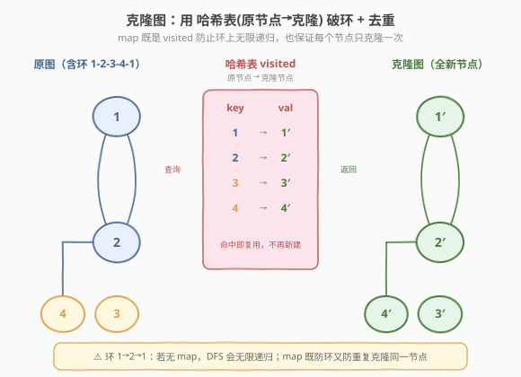
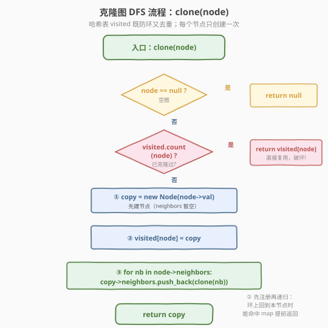
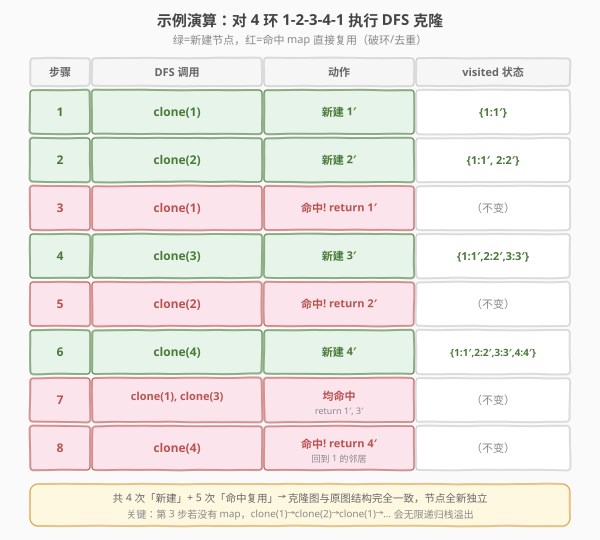

# LeetCode 克隆图 题解

## 1. 题目概述

- **标题 / 题号**：克隆图（#133，medium）
- **链接**：https://leetcode.cn/problems/clone-graph/
- **难度**：中等
- **标签**：图、DFS、BFS、哈希表、深拷贝

**题意**：给你无向**连通**图中一个节点的引用，请你返回该图的**深拷贝**（clone）。

图中的每个节点都包含它的值 `val`（`int`）和其邻居的列表 `neighbors`（`vector<Node*>`）。

```text
class Node {
public:
    int val;
    vector<Node*> neighbors;
};
```

> 💡 **深拷贝**：新建一组完全独立的节点，结构与原图相同，但内存地址全不同——对克隆图的任何修改都不影响原图。

**示例 1**：

```text
输入：adjList = [[2,4],[1,3],[2,4],[1,3]]
输出：[[2,4],[1,3],[2,4],[1,3]]
解释：4 个节点构成 4 环 1-2-3-4-1：
  节点 1 的邻居是 2 和 4；
  节点 2 的邻居是 1 和 3；
  节点 3 的邻居是 2 和 4；
  节点 4 的邻居是 1 和 3。
返回一个结构与原图一致的全新克隆图。
```

**示例 2**：

```text
输入：adjList = [[]]
输出：[[]]
解释：只有 1 个节点，无邻居。返回单个新节点。
```

**示例 3**：

```text
输入：adjList = []
输出：[]
解释：空图，返回 null。
```

**约束**：

- 节点数 `n` 在范围 `[1, 100]` 内
- `1 <= Node.val <= 100`，每个节点值唯一
- 无重复边、无自环
- 图是连通的，可从给定节点访问到所有节点

## 2. 解题思路

### 2.1 暴力思路：为什么"直接复制"会出问题？

朴素想法是遍历图、给每个节点 `new` 一个副本并把邻居指针照搬过去。但图里**有环**——例如示例 1 的 4 环 `1→2→1`，若直接递归复制：`clone(1) → clone(2) → clone(1) → clone(2) → …`，会**无限递归栈溢出**。

即便只想着"加个 visited 数组防环"也不够：环上回到已访问节点时，我们需要拿到**那个节点对应的克隆体**来正确接线，否则克隆图的邻居关系会断掉。所以必须记录「原节点 → 克隆节点」的映射。

> ⚠️ 核心难点是**环**与**重复克隆**：同一个节点不能被 `new` 两次（否则一个原节点对应两个克隆体，结构错乱），但它的邻居指针又必须被多次引用。解决这两个问题的同一把钥匙就是**哈希表**。

### 2.2 核心观察：DFS + 哈希表（原节点→克隆节点）



核心思路：用一个哈希表 `visited`（`unordered_map<Node*, Node*>`）同时承担两个职责：

1. **破环**：递归进入某节点前先查表，若已存在直接返回其克隆体，切断无限递归；
2. **去重**：每个节点只在「第一次访问」时 `new` 一次并登记入表，后续都复用同一克隆体，保证**一一对应**。

> 💡 这正是 [138. 复制带随机指针的链表](../0101-0200/138_复制带随机指针的链表.md) 的推广：链表里用 `map<原节点, 克隆节点>` 处理 `random` 指针的「回指」；本题把"链表 + 一个 random 指针"换成"图 + 任意多个邻居指针"，套路完全一致——**先建节点登记入表，再递归填充邻居**。

### 2.3 算法流程图



要点：**先 `new` 节点并登记入 `visited`，再去递归邻居**。这个顺序至关重要——必须保证当环上的边指回「正在克隆的祖先节点」时，该祖先已存在于表中，能被命中并提前返回。

### 2.4 示例演算

以示例 1 的 4 环 `1-2-3-4-1` 为例，从节点 1 出发执行 DFS。下图展示每次 `clone` 调用的动作与 `visited` 表的演进：绿色行表示「新建节点」，红色行表示「命中 map 直接复用」（破环/去重）。



| 步骤 | DFS 调用 | 动作 | visited 变化 |
|------|----------|------|--------------|
| 1 | clone(1) | 新建 1′ | {1:1′} |
| 2 | clone(2) | 新建 2′ | {1:1′, 2:2′} |
| 3 | clone(1) | **命中!** return 1′（破环） | 不变 |
| 4 | clone(3) | 新建 3′ | {1:1′, 2:2′, 3:3′} |
| 5 | clone(2) | **命中!** return 2′（去重） | 不变 |
| 6 | clone(4) | 新建 4′ | {1:1′, 2:2′, 3:3′, 4:4′} |
| 7 | clone(1), clone(3) | **均命中** return 1′, 3′ | 不变 |
| 8 | clone(4) | **命中!** return 4′ | 不变 |

最终共 4 次「新建」+ 5 次「命中复用」，克隆图结构与原图完全一致且节点全新独立。

> 💡 第 3 步是关键：若没有 `visited` 表，`clone(1)→clone(2)→clone(1)→…` 会在环上无限递归。正是「先登记再递归」让祖先节点 1 在被回指时已被登记，命中后立即返回，环就此被切断。

## 3. 参考代码

### C++

```cpp
class Solution {
    unordered_map<Node*, Node*> visited;

  public:
    Node* cloneGraph(Node* node) {
        if (!node) return nullptr;                 // 空图
        if (visited.count(node)) return visited[node]; // 命中：破环 + 去重
        Node* copy = new Node(node->val);          // 先建节点（neighbors 暂空）
        visited[node] = copy;                      // 关键：登记入表后再递归
        for (Node* nb : node->neighbors)
            copy->neighbors.push_back(cloneGraph(nb));
        return copy;
    }
};
```

### Python

```python
class Solution:
    def cloneGraph(self, node: 'Node') -> 'Node':
        visited = {}

        def dfs(n: 'Node') -> 'Node':
            if not n:
                return None
            if n in visited:                       # 命中：破环 + 去重
                return visited[n]
            clone = Node(n.val)                    # 先建节点
            visited[n] = clone                     # 关键：登记后再递归
            for nb in n.neighbors:
                clone.neighbors.append(dfs(nb))
            return clone

        return dfs(node)
```

> 💡 **写法细节**：`visited[n] = clone` 必须放在 `for nb in n.neighbors` **之前**。若放在递归之后，环上回指本节点时它尚未入表，仍会无限递归。这是本题最易踩的坑。

## 4. 复杂度分析

| 维度 | 复杂度 | 说明 |
|------|--------|------|
| 时间复杂度 | `O(V + E)` | 每个节点只在首次访问时新建一次（`V` 次），每条边在递归遍历邻居时被访问一次（无向图每条边走两次，共 `2E`） |
| 空间复杂度 | `O(V)` | `visited` 表存 `V` 个映射；DFS 递归栈深度最坏 `O(V)`（图退化为链时），BFS 则为队列 `O(V)` |

> ⚠️ 递归栈最坏深度是 `V`（图呈长链状）。本题 `V ≤ 100` 安全；若 `V` 很大且图可能很"深"，用 BFS（见扩展）可避免栈溢出。

## 5. 扩展：BFS 写法

DFS 递归简洁，但图很深时可能栈溢出。BFS 用队列替代递归，思路一致——只是**建节点**与**接线**分两步走：

1. 弹出当前节点 `cur`，遍历其邻居 `nb`；
2. 若 `nb` 未克隆，`new` 一个并入队；
3. 无论 `nb` 是否新建，都把 `visited[nb]` 接到 `visited[cur]->neighbors` 上（保证环上回指边也能正确接线）。

```cpp
Node* cloneGraphBFS(Node* node) {
    if (!node) return nullptr;
    unordered_map<Node*, Node*> visited;
    queue<Node*> q;
    visited[node] = new Node(node->val);   // 起点先克隆入队
    q.push(node);
    while (!q.empty()) {
        Node* cur = q.front(); q.pop();
        for (Node* nb : cur->neighbors) {
            if (!visited.count(nb)) {       // 未克隆：新建 + 入队
                visited[nb] = new Node(nb->val);
                q.push(nb);
            }
            visited[cur]->neighbors.push_back(visited[nb]); // 接线
        }
    }
    return visited[node];
}
```

> 💡 **DFS vs BFS**：两者时间空间同为 `O(V + E)` / `O(V)`。DFS 写起来短、贴近思维过程；BFS 无递归栈、适合深图。面试先写 DFS 讲清「先登记再递归」，再口述 BFS 作为延伸即可。

## 6. 面试要点

1. **为什么要用哈希表？它解决了哪两个问题？**

   - 图里有环，直接递归会无限循环；同一节点还会被多条边指向，若每次都 `new` 会产生重复克隆体、破坏一一对应。
   - 哈希表 `visited[原节点] = 克隆节点` 同时**破环**（命中即返回）与**去重**（每点只 `new` 一次），是一把钥匙开两把锁。

2. **为什么必须"先登记入表，再递归邻居"？**

   - 若先递归再登记，当环上的边回指当前正在克隆的节点时，它还没入表，无法被命中，会继续深入造成无限递归。
   - 先登记保证了祖先节点在回指时已存在于表中，递归能在环处被正确终止。

3. **DFS 和 BFS 的时空复杂度分别是多少？**

   - 都是 `O(V + E)` 时间、`O(V)` 空间。空间差异在细节：DFS 是递归栈（最坏 `O(V)` 链状图），BFS 是队列（最坏 `O(V)`）。`visited` 表两者都需要 `O(V)`。

4. **这题和 138（复制带随机指针的链表）有什么关系？**

   - 完全同构的套路：都是「深拷贝一个带额外指针的结构」，都用 `map<原节点, 克隆节点>` 处理「回指」指针。
   - 138 是「链表 + 一个 random 指针」，random 指向链表内任意节点（含已访问的，形成环）；133 把它推广到「图 + 任意多个邻居指针」。会一道就会一类。

5. **如果题目改成「可能不连通」的图，给一个节点引用，怎么办？**

   - 本题保证连通，从给定节点出发能访问到全部节点。若不连通，仅靠一个节点引用无法触达其他连通分量——题目会改用「给节点列表」的形式，此时遍历所有节点、对每个未访问节点各跑一次 DFS 即可（即「连通分量计数 + 克隆」的复合）。

6. **为什么无向图每条边访问两次，复杂度还是 `O(V + E)`？**

   - 无向图存为两条有向边，遍历邻居时每条无向边被两个端点各扫一次，共 `2E` 次操作，仍是 `O(E)`。故总时间为 `O(V + E)`，`E` 按无向边条数计。

## 同类练习题

| # | 题目 | 与本题的关联 |
|---|------|-------------|
| 138 | [复制带随机指针的链表](https://leetcode.cn/problems/copy-list-with-random-pointer/) | 哈希表克隆「带回指指针」的结构，本题的链表版前身 |
| 207 | [课程表](https://leetcode.cn/problems/course-schedule/) | 图的遍历 + visited 状态标记（0/1/2 三态防环），拓扑排序判定 |
| 200 | [岛屿数量](https://leetcode.cn/problems/number-of-islands/) | DFS 遍历 + 原地标记防重复访问，连通分量计数 |
| 133 | [克隆图](https://leetcode.cn/problems/clone-graph/) | 哈希表深拷贝图（本题） |
| 430 | [扁平化多级双向链表](https://leetcode.cn/problems/flatten-a-multilevel-doubly-linked-list/) | 带 child 指针的深结构遍历，DFS/栈处理「回指」连接 |
