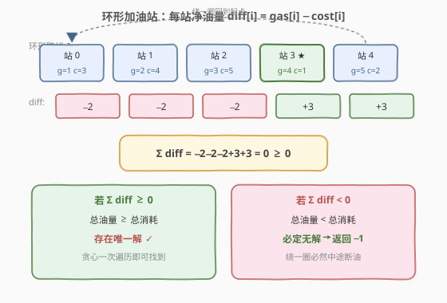
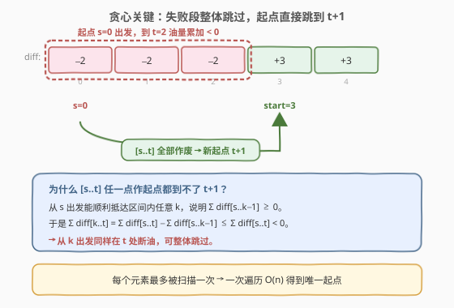
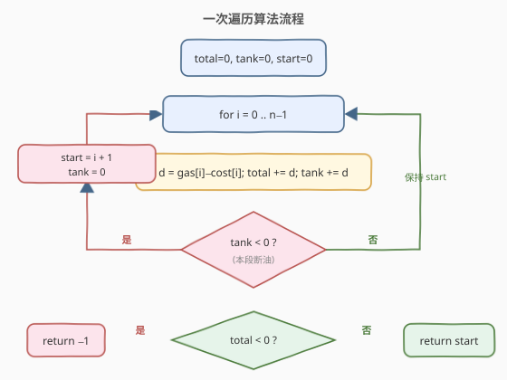
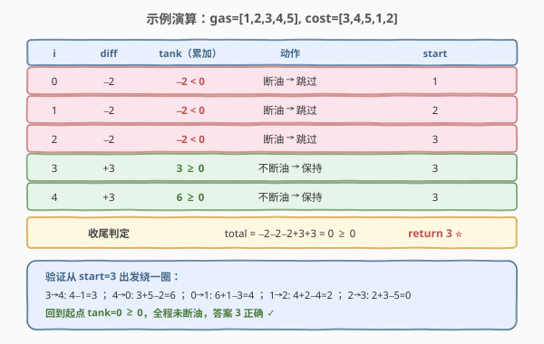

# 加油站

- **题目名称**：加油站
- **链接**：[134. 加油站](https://leetcode.cn/problems/gas-station/)
- **难度**：中等
- **标签**：贪心、数组、一次遍历

## 1. 题目概述

在一条**环形路线**上有 `n` 个加油站，其中 `gas[i]` 是第 `i` 个加油站的油量，`cost[i]` 是从第 `i` 个站开到第 `i+1` 个站需要的油量（`cost[n-1]` 对应回到 `0`）。你的油箱无限大，初始为空。请返回**能让你按顺序绕环路行驶一周的出发加油站编号**；若不存在，返回 `-1`。

> ⚠️ 题目保证：**若存在解，则解唯一**。

**示例 1**：

```text
输入：gas = [1,2,3,4,5], cost = [3,4,5,1,2]
输出：3
解释：从 3 号加油站出发，油量变化为：
  3→4: 4−1=3 ; 4→0: 3+5−2=6 ; 0→1: 6+1−3=4 ; 1→2: 4+2−4=2 ; 2→3: 2+3−5=0
  能绕一圈回到 3，故返回 3。
```

**示例 2**：

```text
输入：gas = [2,3,4], cost = [3,4,3]
输出：-1
解释：总油量 9 < 总消耗 10，无论从哪出发都会中途断油。
```

**约束条件**：

- $n == \text{gas.length} == \text{cost.length}$
- $1 \leq n \leq 10^5$
- $0 \leq \text{gas[i]}, \text{cost[i]} \leq 10^4$

> 💡 **进阶要求**：能否给出 $O(n)$ 的一次遍历解法？答案是**贪心**：先用「总油量 − 总消耗」判定可行性，再用「累加断油即整体跳过」一次性定位唯一起点。

---

## 2. 解题思路

### 2.1 暴力思路

枚举每个站作为起点，模拟绕一圈：累计 `gas[i] − cost[i]`，一旦某步累加值 `< 0` 就说明此起点不行，换下一个。两重循环，最坏 $O(n^2)$，在 $n = 10^5$ 时会超时。能否避免「把已失败的区段再扫一遍」？这就是贪心的切入点。

### 2.2 核心观察：净油量 diff 与「整体跳过」



记**净油量** $\text{diff}[i] = \text{gas}[i] - \text{cost}[i]$，它表示「在第 $i$ 站加油并开往下一站」后油箱的净变化。于是：

- **可行性判据**：若 $\sum \text{diff}[i] < 0$，即总油量不足以覆盖总消耗，则**任何起点都不可能跑完一圈**，直接返回 `-1`；
- **存在性**：若 $\sum \text{diff}[i] \geq 0$，题目又保证解唯一，则**解一定存在**，问题只剩「定位起点」。

> ⚠️ 关键在于：一旦确定了「总和不小于 0」，就不必担心整体能否跑完，只需找到那个「从它出发不会中途断油」的局部起点。

### 2.3 贪心策略：失败段整体跳过



设当前候选起点为 $s$，从 $s$ 开始把 $\text{diff}$ 逐站累加进 `tank`。若累加到第 $t$ 站后 `tank < 0`（即 $\sum_{i=s}^{t}\text{diff}[i] < 0$，在 $t$ 处断油），则有如下**关键引理**：

> 💡 **引理**：从 $s$ 出发在 $t$ 处断油，则 $[s, t]$ 中**任意**一站 $k$ 作起点，同样到不了 $t+1$。

**证明**：从 $s$ 出发能顺利抵达 $k$（$s \leq k \leq t$），说明此前累加值 $\sum_{i=s}^{k-1}\text{diff}[i] \geq 0$。于是

$$
\sum_{i=k}^{t}\text{diff}[i] \;=\; \sum_{i=s}^{t}\text{diff}[i] \;-\; \sum_{i=s}^{k-1}\text{diff}[i] \;\leq\; \sum_{i=s}^{t}\text{diff}[i] \;<\; 0
$$

即从 $k$ 出发同样在 $t$ 处断油。故 $[s, t]$ **整体作废**，新起点直接跳到 $t+1$，无需重新扫描。

由于每次断油都把一整段跳过，每个元素最多被累加一次，整趟扫描为 $O(n)$。

### 2.4 算法流程图



维护三个量：

- `total`：全部 $\text{diff}$ 之和，用于结尾的可行性判定；
- `tank`：以当前 `start` 为起点的局部累加油量；
- `start`：候选起点，初始 `0`。

**主循环**（`i` 从 `0` 到 `n-1`）：

1. 计算 `d = gas[i] - cost[i]`，`total += d`，`tank += d`；
2. 若 `tank < 0`：说明 `[start, i]` 整段断油，令 `start = i + 1`，`tank = 0`；
3. 否则继续。

循环结束后：`total < 0` 返回 `-1`，否则返回 `start`。

> ⚠️ **顺序细节**：`total` 必须**始终累加**（不论是否断油），它代表全局总油量；而 `tank` 在断油时**清零**，因为它只服务于「当前候选起点能否撑到下一个站」。两者用途不同，不能混为一谈。

### 2.5 示例演算

以 `gas = [1,2,3,4,5], cost = [3,4,5,1,2]` 为例，`diff = [-2,-2,-2,3,3]`：



| i | diff[i] | tank（累加） | 动作 | start |
|---|---------|--------------|------|-------|
| 0 | −2 | −2 < 0 | 断油 → 跳过 | 1 |
| 1 | −2 | −2 < 0 | 断油 → 跳过 | 2 |
| 2 | −2 | −2 < 0 | 断油 → 跳过 | 3 |
| 3 | +3 | 3 ≥ 0 | 不断油 → 保持 | 3 |
| 4 | +3 | 6 ≥ 0 | 不断油 → 保持 | 3 |

收尾：`total = 0 ≥ 0`，返回 `start = 3`。从 3 出发绕一圈 `tank` 依次为 `3,6,4,2,0`，全程非负，答案正确。

---

## 3. 参考代码

### C++

```cpp
class Solution {
  public:
    int canCompleteCircuit(vector<int>& gas, vector<int>& cost) {
        int total = 0, tank = 0, start = 0;
        for (int i = 0; i < (int)gas.size(); ++i) {
            int d = gas[i] - cost[i];
            total += d;
            tank  += d;
            if (tank < 0) {            // 本段断油，整体跳过
                start = i + 1;
                tank = 0;
            }
        }
        return total < 0 ? -1 : start;
    }
};
```

### Python

```python
class Solution:
    def canCompleteCircuit(self, gas: List[int], cost: List[int]) -> int:
        total = tank = start = 0
        for i in range(len(gas)):
            d = gas[i] - cost[i]
            total += d
            tank += d
            if tank < 0:              # 本段断油，整体跳过
                start = i + 1
                tank = 0
        return -1 if total < 0 else start
```

> ⚠️ **易错点**：
> - 别把 `total` 和 `tank` 合并成一个变量：`total` 要贯穿全程，`tank` 在断油时清零。
> - `start = i + 1` 而非 `i`：第 `i` 步断油，意味着从当前 `start` 到 `i` 都不行，下一个候选应是 `i + 1`。若 `i + 1 == n`，说明前缀全断油，此时真正起点在「全局后缀」，由 `total ≥ 0` 保证它存在（循环数组视角下即从 `0` 重新开始的某段，但代码无需显式回绕）。
> - 不要写成 `if (tank < 0) start++;` 之类逐个推进，那就退化回 $O(n^2)$ 了。

---

## 4. 复杂度分析

| 维度 | 复杂度 | 说明 |
|------|--------|------|
| 时间复杂度 | $O(n)$ | 单层循环，`i` 从 `0` 走到 `n-1`，每个元素只被累加一次；断油时直接跳过整段，不回退 |
| 空间复杂度 | $O(1)$ | 仅用 `total`/`tank`/`start` 三个变量，与输入规模无关 |

---

## 5. 扩展：环形数组上的前缀和视角

把 `diff` 数组**首尾相接复制一份**得到长度 $2n$ 的序列，则「能否从 $s$ 出发绕一圈」等价于「所有长度为 $n$、起点为 $s$ 的区间和都非负」，即对 $k = s, \dots, s+n-1$ 有 $\sum_{i=s}^{k}\text{diff}[i \bmod n] \geq 0$。这等价于「在 $2n$ 的前缀和数组上，区间 $[s, s+n-1]$ 内的最小前缀和减去 $\text{prefix}[s-1]$ 仍 $\geq 0$」，可用**线段树 / 单调队列维护区间最小前缀和**在 $O(n)$ 内求出所有合法起点，适合「解不唯一、要求列出所有起点」的变体。

> 💡 本题由于保证解唯一，贪心一次遍历已是最优；前缀和 + 区间最小值的方法更通用，是处理「环形 + 任意起点」的标准套路之一，与 [918. 环形子数组的最大和](https://leetcode.cn/problems/maximum-sum-circular-subarray/) 同源。

---

## 6. 面试要点

1. **为什么 `total ≥ 0` 就一定有解？**
   - 直觉：总油量够覆盖总消耗，把「亏油段」的亏空由「盈油段」补上即可。严格地说，设贪心最后选定的 `start` 之后所有局部累加都非负，而 `total ≥ 0` 保证「`start` 之前那段总亏空」能被「`start` 之后的盈余」整体填平——因为 `tank` 在 `start` 处清零后一路非负，且绕回前缀时盈余恰好不小于前缀的负累加。

2. **为什么断油时可以直接把 `start` 跳到 `i + 1`，而不必检查中间各点？**
   - 由引理，`[start, i]` 内任意 $k$ 作起点都会在 $i$ 处断油（因为从 `start` 抵达 $k$ 时的累加值 $\geq 0$，故从 $k$ 出发的累加只会更小）。所以中间点全部作废，新候选只能是 $i+1$。

3. **`total` 和 `tank` 为什么不能合并？**
   - `total` 是全局总和，用于结尾判定「是否无解」；`tank` 是当前候选起点的局部累加，断油时必须清零。若合并，清零会丢失全局信息，导致无法判定无解情形（如 `gas=[2,3,4], cost=[3,4,3]` 会错误地返回某个起点而非 `-1`）。

4. **解唯一这一条件用在哪里？**
   - 它让我们只需返回**任意一个**合法起点，贪心找到的第一个即可。若无此保证（如要求返回所有合法起点），就要用第 5 节的「前缀和 + 区间最小值」方案逐一验证，复杂度仍 $O(n)$ 但代码更重。

5. **如果 `gas[i]`、`cost[i]` 可为负或含 0 会怎样？**
   - 本题约束 `gas[i], cost[i] ≥ 0`，但 `diff` 可正可负。贪心引理只依赖「累加和的正负」，对 `diff` 是否含负数无要求，因此即便 `gas/cost` 取负，只要重新定义 `diff`，算法仍然成立；真正破坏贪心的是「断油判据失效」，本题不存在此问题。

---

## 7. 同类练习题

- [918. 环形子数组的最大和](https://leetcode.cn/problems/maximum-sum-circular-subarray/)：同样是环形数组 + 前缀和/单调队列，对比「求最大」与「判定可行起点」的视角差异
- [53. 最大子数组和](https://leetcode.cn/problems/maximum-subarray/)（[题解](../0001-0100/53_最大子数组和.md)）：贪心累加遇负即弃的思路同源，本题把「断油清零」换成「前缀和归零」
- [135. 分发糖果](https://leetcode.cn/problems/candy/)：另一道经典贪心，需两次遍历（左→右、右→左）取最大值，对比贪心策略的构造方式
- [406. 根据身高重建队列](https://leetcode.cn/problems/queue-reconstruction-by-height/)：贪心 + 排序 + 插入，体会「先排序确定顺序、再贪心放置」的通用套路
- [714. 买卖股票的最佳时机含手续费](https://leetcode.cn/problems/best-time-to-buy-and-sell-stock-with-transaction-fee/)：贪心状态机，对比「局部最优累加」在不同场景下的转移方式
