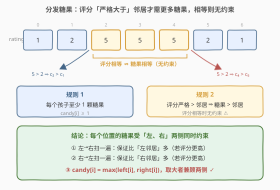
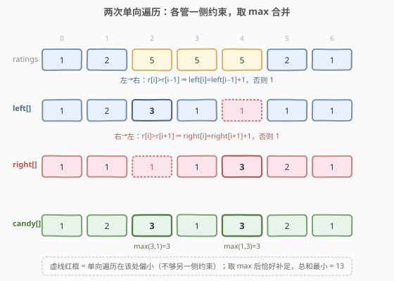
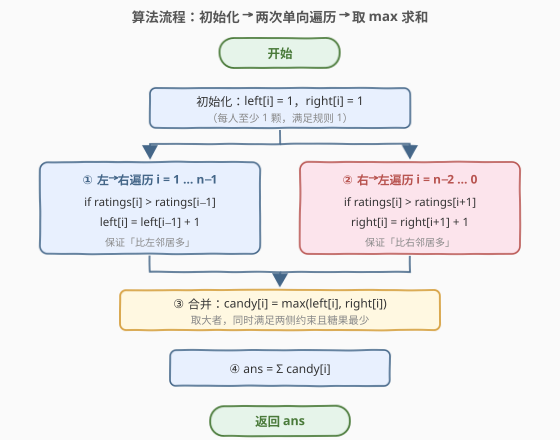
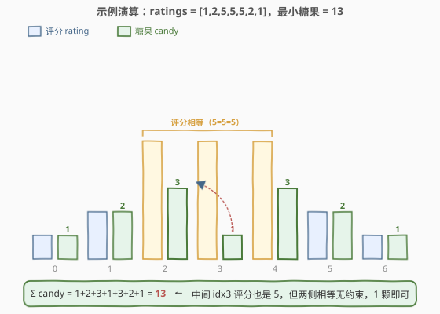

# 分发糖果

- **题目名称**：分发糖果
- **链接**：[135. 分发糖果](https://leetcode.cn/problems/candy/)
- **难度**：困难
- **标签**：贪心、数组、两次遍历

## 1. 题目概述

`n` 个孩子站成一排。给你一个整数数组 `ratings` 表示每个孩子的评分。你需要把这些孩子按下列规则分发糖果：

- 每个孩子**至少**分配到 `1` 颗糖果；
- 相邻两个孩子中，**评分更高**的孩子必须获得**更多**的糖果。

返回满足上述条件的**最少糖果总数**。

> ⚠️ 注意第二条规定的是「评分更高 ⇒ 糖果更多」，是**严格大于**的单向约束。若相邻两个孩子评分**相等**，则**没有任何约束**——糖果数可以不等，也可以相等。

**示例 1**：

```text
输入：ratings = [1,0,2]
输出：5
解释：分别分配 [2,1,2] 颗糖果。idx0 评分 1>0 故多于 idx1；idx2 评分 2>0 故多于 idx1。
```

**示例 2**：

```text
输入：ratings = [1,2,2]
输出：4
解释：分别分配 [1,2,1] 颗糖果。idx1 评分 2>1 故多于 idx0；
      idx1 与 idx2 评分相等（2==2），无约束，idx2 给 1 颗即可。第三个孩子分到 1 颗也满足规则。
```

**约束条件**：

- $n == \text{ratings.length}$
- $1 \leq n \leq 2 \times 10^4$
- $-1000 \leq \text{ratings}[i] \leq 1000$

> 💡 难点不在「每人至少 1 颗」，而在「一个孩子同时受左、右两个邻居约束」。单向扫一遍只能保证一侧，必须**双向各扫一次再取最大值**。这是经典的**两次遍历贪心**模板。

---

## 2. 解题思路

### 2.1 暴力思路

从「每人 1 颗」开始，反复扫描：只要发现某相邻对违反约束（评分高的反而糖果少），就把高的那边的糖果数加到「低的 + 1」。最坏情况下每次只修一处，共需 $O(n)$ 轮扫描、每轮 $O(n)$，总计 $O(n^2)$，$n=2\times10^4$ 时会超时。

> 💡 暴力的低效源于「左修右坏、右修左坏」的反复横跳。能否**一次定稿**？关键观察是：把「左侧约束」和「右侧约束」**分别**用一次单向遍历独立求出，再合并。

### 2.2 核心观察：双向约束与「相等无约束」



每个位置 `i` 的糖果数 `candy[i]` 被**两条独立的规则**同时要求：

- **左约束**：若 `ratings[i] > ratings[i-1]`，则 `candy[i] > candy[i-1]`，最小需 `candy[i-1] + 1`；
- **右约束**：若 `ratings[i] > ratings[i+1]`，则 `candy[i] > candy[i+1]`，最小需 `candy[i+1] + 1`。

两者**互不相干**，且题目只要求**严格大于**才生效：

> ⚠️ 评分相等时（如 `[5,5,5]`）**无任何约束**——这正是示例 2 `[1,2,2]` 中 `idx2` 只给 1 颗的原因，也是本题最易踩的坑：误以为「评分相等 ⇒ 糖果相等」会多分糖果。

于是策略自然浮现：分别求出「只看左约束」的最小数组 `left[]` 和「只看右约束」的最小数组 `right[]`，再令 `candy[i] = max(left[i], right[i])`。**取 max 既满足两侧约束，又取到了各自的最小值**，因此总和最小。

### 2.3 两次遍历取最大



定义：

- `left[i]`：仅考虑「比左邻居多」时，`i` 处所需的最小糖果数；
- `right[i]`：仅考虑「比右邻居多」时，`i` 处所需的最小糖果数。

**左→右遍历**（`i = 1 … n-1`）：

$$
\text{left}[i] = \begin{cases} \text{left}[i-1] + 1, & \text{ratings}[i] > \text{ratings}[i-1] \\ 1, & \text{ otherwise} \end{cases}
$$

**右→左遍历**（`i = n-2 … 0`）：

$$
\text{right}[i] = \begin{cases} \text{right}[i+1] + 1, & \text{ratings}[i] > \text{ratings}[i+1] \\ 1, & \text{ otherwise} \end{cases}
$$

> 💡 **为什么必须右→左？** 右约束 `candy[i] > candy[i+1]` 依赖 `i+1` 的值，所以要从右往左算，才能用到「已经算好的右侧结果」。方向选反就退化成暴力。

最后 $\text{candy}[i] = \max(\text{left}[i], \text{right}[i])$，答案 $= \sum_i \text{candy}[i]$。

### 2.4 算法流程图



整体三步：① 初始化两数组全 1；② 左→右、右→左各扫一次填入递增值；③ 逐位取 max 求和。

### 2.5 示例演算

以 `ratings = [1,2,5,5,5,2,1]` 为例（含三连相等评分，最能体现「相等无约束」）：



**左→右遍历**（只看左邻居）：

| i | ratings[i] | 与左邻居比 | left[i] |
|---|------------|-----------|---------|
| 0 | 1 | — | 1 |
| 1 | 2 | 2 > 1 ↑ | left[0]+1 = 2 |
| 2 | 5 | 5 > 2 ↑ | left[1]+1 = 3 |
| 3 | 5 | 5 == 5 | 1（相等，重置） |
| 4 | 5 | 5 == 5 | 1（相等，重置） |
| 5 | 2 | 2 < 5 | 1 |
| 6 | 1 | 1 < 2 | 1 |

`left = [1,2,3,1,1,1,1]`。注意它在 `idx4` 给了 `1`，但 `idx4` 评分 5 > `idx5` 评分 2，**右约束要求 `candy[4] > candy[5]`**——`left` 单独看违反了，这正是需要第二次遍历的原因。

**右→左遍历**（只看右邻居）：

| i | ratings[i] | 与右邻居比 | right[i] |
|---|------------|-----------|----------|
| 6 | 1 | — | 1 |
| 5 | 2 | 2 > 1 ↑ | right[6]+1 = 2 |
| 4 | 5 | 5 > 2 ↑ | right[5]+1 = 3 |
| 3 | 5 | 5 == 5 | 1（相等，重置） |
| 2 | 5 | 5 == 5 | 1（相等，重置） |
| 1 | 2 | 2 < 5 | 1 |
| 0 | 1 | 1 < 2 | 1 |

`right = [1,1,1,1,3,2,1]`。它在 `idx2` 给了 `1`，但 `idx2` 评分 5 > `idx1` 评分 2，**左约束要求 `candy[2] > candy[1]`**——`right` 单独看也违反了。

**取 max 合并**：`candy[i] = max(left[i], right[i])`：

| i | left[i] | right[i] | candy[i] |
|---|---------|----------|----------|
| 0 | 1 | 1 | 1 |
| 1 | 2 | 1 | 2 |
| 2 | 3 | 1 | 3 |
| 3 | 1 | 1 | 1 |
| 4 | 1 | 3 | 3 |
| 5 | 1 | 2 | 2 |
| 6 | 1 | 1 | 1 |

`candy = [1,2,3,1,3,2,1]`，$\text{ans} = 1+2+3+1+3+2+1 = 13$。可见 `idx2` 由 `left` 兜底（3），`idx4` 由 `right` 兜底（3），`idx3` 因两侧评分都相等只取 1——两侧约束同时满足，且总和最小 ✓。

---

## 3. 参考代码

### C++

```cpp
class Solution {
  public:
    int candy(vector<int>& ratings) {
        int n = ratings.size();
        vector<int> left(n, 1), right(n, 1);
        for (int i = 1; i < n; ++i)
            if (ratings[i] > ratings[i - 1])
                left[i] = left[i - 1] + 1;
        for (int i = n - 2; i >= 0; --i)
            if (ratings[i] > ratings[i + 1])
                right[i] = right[i + 1] + 1;
        int ans = 0;
        for (int i = 0; i < n; ++i)
            ans += max(left[i], right[i]);
        return ans;
    }
};
```

### Python

```python
class Solution:
    def candy(self, ratings: List[int]) -> int:
        n = len(ratings)
        left = [1] * n
        right = [1] * n
        for i in range(1, n):
            if ratings[i] > ratings[i - 1]:
                left[i] = left[i - 1] + 1
        for i in range(n - 2, -1, -1):
            if ratings[i] > ratings[i + 1]:
                right[i] = right[i + 1] + 1
        return sum(max(l, r) for l, r in zip(left, right))
```

> ⚠️ **易错点**：
> - 比较必须用**严格大于** `>`，切勿写成 `>=`。写成 `>=` 会把「评分相等」也当作需要更多糖果，导致 `idx3` 这样的位置被错误抬升、答案偏大。
> - 右→左遍历的循环方向是 `i` 从 `n-2` 递减到 `0`，且依赖 `right[i+1]`（已算好的右侧）。若误写成左→右方向，`right[i+1]` 还没算，结果全错。
> - `left`/`right` 初值必须为 `1`（规则 1 的下界），不是 `0`。

> 💡 **空间优化**：`right` 数组可以滚动成一个变量，边算边累加答案，省到 $O(n)$ 空间中的「一个数组」；进一步还能做到 $O(1)$ 空间（见第 5 节）。

---

## 4. 复杂度分析

| 维度 | 复杂度 | 说明 |
|------|--------|------|
| 时间复杂度 | $O(n)$ | 左→右、右→左、求和三趟线性扫描，每趟 $O(n)$ |
| 空间复杂度 | $O(n)$ | 额外维护 `left[]`、`right[]` 两个长度为 $n$ 的数组 |

> 💡 时间已是下界（每个元素至少要看一次）；空间可优化到 $O(1)$，见下节。

---

## 5. 扩展：$O(1)$ 空间单遍扫描

两次遍历法用了两个数组。观察 candy 序列的形态：它由若干「上升坡」和「下降坡」拼接而成，坡上糖果数依次 $+1$。可在**一次遍历**中用「上升/下降长度」直接累加，做到 $O(1)$ 空间。

维护三个量：当前上升坡长 `up`、下降坡长 `down`、最近的上升坡峰值 `peak`。对相邻对 `ratings[i-1] → ratings[i]`：

- **上升**（`ratings[i] > ratings[i-1]`）：`up += 1; peak = up; down = 0`；累加 `up + 1`（本位处于上升坡，糖果数 = `up+1`）。
- **下降**（`ratings[i] < ratings[i-1]`）：`down += 1; up = 0`；累加 `down`（下降坡每位贡献 `down`），若下降坡长 `down` 超过了前一个上升峰 `peak`，则峰本身需要再抬高 1，额外 `+= 1`。
- **相等**：`up = down = peak = 0`；累加 1（重置坡，本位只给 1）。

```python
class Solution:
    def candy(self, ratings: List[int]) -> int:
        n = len(ratings)
        if n <= 1:
            return n
        total = up = down = peak = 0
        for i in range(1, n):
            if ratings[i] > ratings[i - 1]:
                up += 1
                peak = up
                down = 0
                total += up + 1
            elif ratings[i] < ratings[i - 1]:
                down += 1
                up = 0
                total += down + (1 if down > peak else 0)
            else:
                up = down = peak = 0
                total += 1
        return total + 1   # +1 补上第一个孩子那 1 颗
```

以 `[1,2,5,5,5,2,1]` 验证：`total` 依次累加 `2,3,1,1,2,3` 并在 `down>peak` 时各 `+1`，最终 `total+1 = 13` ✓。该写法常数小、空间 $O(1)$，但逻辑较精巧；**面试中先讲清两次遍历版**，再提此优化作为加分项即可。

---

## 6. 面试要点

1. **为什么取 `max(left[i], right[i])` 而不是相加或取 min？**
   - 取 `max` 才能同时满足两侧约束：左约束要求 `≥ left[i]`，右约束要求 `≥ right[i]`，故下界是两者的较大者；取 `max` 恰好达到这个下界，因此总和最小。取 `min` 会违反某一侧；相加会超出下界、浪费糖果。

2. **评分相等的两个孩子，糖果数必须相等吗？**
   - 不必。题目只在「评分**严格大于**邻居」时要求糖果更多，相等时**无约束**。所以 `[1,2,2]` 中末位给 1 颗合法，`[5,5,5]` 中间那位给 1 颗也合法。误把相等当约束是最常见错误，会得到偏大的答案。

3. **为什么右→左遍历要从右往左扫？**
   - 右约束 `candy[i] > candy[i+1]` 的最小取值依赖 `candy[i+1]`，必须先算出右侧再回推左侧，故方向是 `i = n-2 … 0`。若从左往右算，`right[i+1]` 尚未确定，递推无法成立。

4. **两次遍历法为什么是最优解？**
   - 它在每个位置都取到了「满足两侧约束的严格下界」`max(left[i], right[i])`，因此总和等于理论最小值；时间 $O(n)$ 已是下界（每个元素至少访问一次）。唯一可改进的是空间，可用第 5 节的 $O(1)$ 写法。

5. **如果题目改成「评分相等也要求糖果相等」会怎样？**
   - 则相等段构成一个「等值 plateau」，整段糖果数须取该段所需的最大值（通常由两侧更高评分的邻居拉高），需要把 plateau 内部统一抬升。两次遍历法仍可用，但 `left`/`right` 在相等处要「继承」而非重置为 1，最后再对 plateau 内部取段内最大值统一。

---

## 7. 同类练习题

- [134. 加油站](https://leetcode.cn/problems/gas-station/)（[题解](../0101-0200/134_加油站.md)）：同样是「一次遍历贪心」，但思路是「失败段整体跳过」，对比两种贪心策略的构造方式
- [406. 根据身高重建队列](https://leetcode.cn/problems/queue-reconstruction-by-height/)（[题解](../0401-0500/406_根据身高重建队列.md)）：贪心 + 排序 + 插入，体会「先排序确定顺序、再贪心放置」的通用套路
- [42. 接雨水](https://leetcode.cn/problems/trapping-rain-water/)（[题解](../0001-0100/42_接雨水.md)）：同样可用「左右两次遍历取 min」求解（左右最大高度），与本题「取 max」对称，对比双向遍历的两种典型用法
- [321. 拼接最大数](https://leetcode.cn/problems/create-maximum-number/)：贪心 + 单调栈，体会贪心在不同结构上的应用
- [881. 救生艇](https://leetcode.cn/problems/boats-to-save-people/)：贪心 + 双指针，最简单的贪心入门，对比「排序后两端配对」与「两次遍历」的差异
