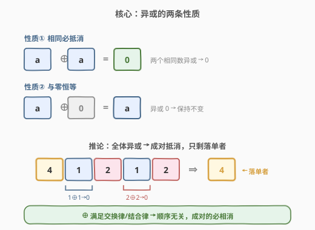
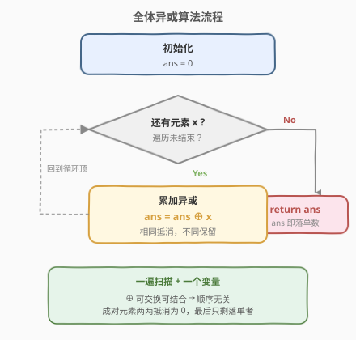
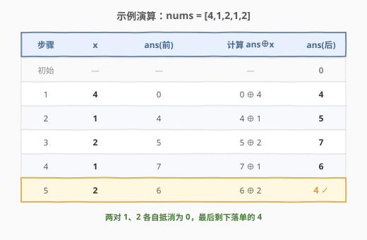

# 只出现一次的数字

- **题目名称**：只出现一次的数字
- **链接**：[136. 只出现一次的数字](https://leetcode.cn/problems/single-number/)
- **难度**：简单
- **标签**：位运算、数组、异或

## 1. 题目概述

给你一个**非空**整数数组 `nums`，除了某个元素**只出现一次**以外，其余每个元素均**出现两次**。找出那个只出现了一次的元素。

要求：算法应该具有线性时间复杂度，且**不使用额外空间**（$O(1)$ 空间）。

**示例 1**：

```text
输入：nums = [2,2,1]
输出：1
解释：1 只出现一次，2 出现两次。
```

**示例 2**：

```text
输入：nums = [4,1,2,1,2]
输出：4
解释：4 只出现一次，1、2 各出现两次。
```

**示例 3**：

```text
输入：nums = [1]
输出：1
```

**约束条件**：

- $1 \le \text{nums.length} \le 3 \times 10^4$
- $-3 \times 10^4 \le \text{nums}[i] \le 3 \times 10^4$
- 除某个元素只出现一次外，其余每个元素均出现两次

> 💡 **关键前提**：其余元素**恰好出现两次**——「偶数次重复」正是异或得以抵消的根基。若改成出现三次（[137. 只出现一次的数字 II](../0101-0200/137_只出现一次的数字II.md)），异或就失效，需要改用「逐位统计模 $k$」。

---

## 2. 解题思路

### 2.1 暴力思路：哈希表计数

用哈希表统计每个数出现次数，再扫一遍取出次数为 `1` 的数。

```python
from collections import Counter
freq = Counter(nums)
return next(x for x in nums if freq[x] == 1)
```

时间 $O(n)$，空间 $O(n)$。能过，但**不满足 $O(1)$ 空间**的要求，面试会被追问能否优化空间。也可排序后扫描相邻对（时间 $O(n \log n)$、空间 $O(\log n)$），同样非最优。

> ⚠️ 哈希表把「是否成对」的信息存在外部容器里，浪费了「相同数本就相同」这一性质。利用异或，相同数自身就能在运算中相互抵消，无需额外存储。

### 2.2 核心观察：异或的自抵消性质



异或（`⊕`，C++/Python 中均为 `^`）有两条关键性质：

1. **相同必抵消**：$a \oplus a = 0$——两个相同的数异或结果为 $0$。
2. **与零恒等**：$a \oplus 0 = a$——任何数异或 $0$ 保持不变。

再加上异或满足**交换律**和**结合律**（运算顺序可任意打乱）。于是把数组所有元素**全体异或**起来：成对的元素两两配对抵消为 $0$，而落单的那个与 $0$ 异或后原样保留——最终结果就是它本身。

> 💡 **关键转化**：不必关心谁和谁配对，也不必关心顺序，只需把所有数「累加异或」进同一个累加器 `ans`，相同的自然抵消，落单者自然留下。

### 2.3 全体异或算法



算法只需一遍扫描、一个变量：

1. `ans = 0`（异或单位元）。
2. 对每个 `x`：`ans = ans ^ x`。
3. 扫描结束，`ans` 即落单数。

> ⚠️ **正确性**：由交换律/结合律，全体异或等价于「成对元素先各自异或为 0，再与落单数异或」，即 $0 \oplus 0 \oplus \cdots \oplus \text{single} = \text{single}$。

### 2.4 示例演算

以 `nums = [4,1,2,1,2]` 为例：



| 步骤 | 元素 x | ans(前) | 计算 | ans(后) |
|------|--------|---------|------|---------|
| 初始 | — | — | — | 0 |
| 1 | 4 | 0 | $0 \oplus 4$ | 4 |
| 2 | 1 | 4 | $4 \oplus 1$ | 5 |
| 3 | 2 | 5 | $5 \oplus 2$ | 7 |
| 4 | 1 | 7 | $7 \oplus 1$ | 6 |
| 5 | 2 | 6 | $6 \oplus 2$ | 4 |

扫描结束，`ans = 4` 即落单数 ✓。注意中间结果 `5/7/6` 看似「乱跳」，但成对的 `1、2` 各自抵消后，最终必然回到落单的 `4`——这正是交换律/结合律的威力，**顺序无关**。

---

## 3. 参考代码

### C++

```cpp
class Solution {
  public:
    int singleNumber(vector<int>& nums) {
        int ans = 0;
        for (int x : nums) ans ^= x;
        return ans;
    }
};
```

### Python

```python
class Solution:
    def singleNumber(self, nums: List[int]) -> int:
        ans = 0
        for x in nums:
            ans ^= x
        return ans
```

也可用 `functools.reduce` 一行表达（语义等价）：

```python
from functools import reduce
from operator import xor

class Solution:
    def singleNumber(self, nums: List[int]) -> int:
        return reduce(xor, nums, 0)
```

---

## 4. 复杂度分析

| 维度 | 复杂度 | 说明 |
|------|--------|------|
| 时间复杂度 | $O(n)$ | 只遍历数组一次，每次一次 `^` 运算 |
| 空间复杂度 | $O(1)$ | 仅用一个累加变量 `ans` |

> 💡 这是该题的最优解：时间已达下界 $O(n)$（必须至少看一遍所有元素），空间为常数。题目给的 $O(1)$ 空间限制正是把人引向异或解法的「提示」。

---

## 5. 扩展：其余元素出现 $k$ 次的推广

「除一个元素外其余都出现 $k$ 次」的通用套路：

- **$k$ 为偶数**（如本题 $k=2$）：全体异或仍成立——成对数两两抵消为 $0$，落单者保留。
- **$k$ 为奇数**（如 $k=3$）：$x \oplus x \oplus x = x \ne 0$，异或失效。改为**逐位统计**：对每个二进制位，统计所有数在该位的 `1` 的个数 `cnt`，则 $\text{cnt} \bmod k$ 恰好是落单数在该位的值。详见 [137. 只出现一次的数字 II](../0101-0200/137_只出现一次的数字II.md)。

> 💡 若数组中有**两个**落单数（其余均出现两次），全体异或会得到这两个数的异或和（非 $0$）。由于二者不同，异或和至少有一位为 $1$，可按该位把数组分成两组——落单数被分到不同组，每组内部都退化为本题。详见 [260. 只出现一次的数字 III](../0201-0300/260_只出现一次的数字III.md)。

---

## 6. 面试要点

1. **为什么全体异或能得到落单数？**
   - 异或满足交换律、结合律，且 $a \oplus a = 0$、$a \oplus 0 = a$。把所有数异或起来，等价于成对元素先抵消为 $0$，最后剩下 $0 \oplus \text{single} = \text{single}$，顺序无关。

2. **`ans` 初始化为 $0$ 还是别的值？为什么？**
   - 必须初始化为 $0$。因为 $0$ 是异或运算的**单位元**（$x \oplus 0 = x$），从 $0$ 开始累加才不会改变最终结果。若初始化为其他值 $v$，最终结果会多出一个 $v \oplus$ 的偏差。

3. **异或解法依赖什么前提？不满足时会怎样？**
   - 依赖「其余元素恰好出现两次（偶数次）」。若某元素出现奇数次（如三次），$x \oplus x \oplus x = x \ne 0$，无法抵消，结果错误。此时需改用「逐位模 $k$」或状态机解法。

4. **能否不用异或、仍做到 $O(n)$ 时间 $O(1)$ 空间？**
   - 仅在「其余出现两次」这一前提下，异或是最自然的 $O(1)$ 空间解法。其他如数学法 $2 \cdot \sum(\text{集合元素}) - \sum(\text{数组})$ 也 $O(n)$，但需额外处理集合去重且对溢出敏感，不如异或简洁通用。

5. **异或运算有哪些常考点？**
   - 四条性质：交换律、结合律、$a \oplus a = 0$、$a \oplus 0 = a$；以及可逆性 $a \oplus b \oplus b = a$（可用于简单加密/还原）。面试常由此延伸到 137（模 $k$）、260（分组异或）、268（丢失的数字）等题。

---

## 7. 同类练习题

- [137. 只出现一次的数字 II](https://leetcode.cn/problems/single-number-ii/)（[题解](../0101-0200/137_只出现一次的数字II.md)）：其余元素出现三次，异或失效，改用「逐位统计模 3」
- [260. 只出现一次的数字 III](https://leetcode.cn/problems/single-number-iii/)（[题解](../0201-0300/260_只出现一次的数字III.md)）：有两个落单数，全体异或得两者异或和，再按一个为 1 的位分组各做一次异或
- [268. 丢失的数字](https://leetcode.cn/problems/missing-number/)：把 $0..n$ 与数组全体异或，成对的抵消，剩下的是缺失的那个，本题的等差版变体
- [面试题 17.04. 消失的数字](https://leetcode.cn/problems/missing-number-lcci/)：与 268 同款，异或法标准应用
