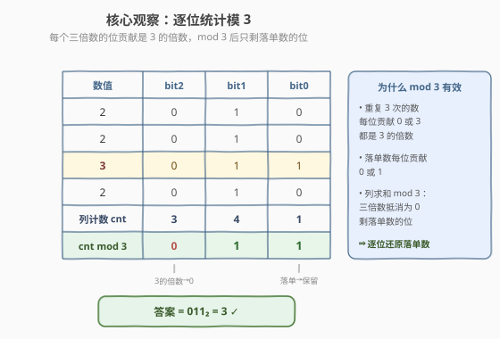
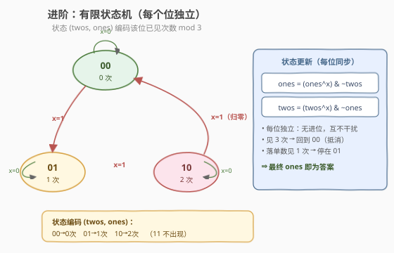

# 只出现一次的数字 II

- **题目名称**：只出现一次的数字 II
- **链接**：[137. 只出现一次的数字 II](https://leetcode.cn/problems/single-number-ii/)
- **难度**：中等
- **标签**：位运算、状态机、数组

## 1. 题目概述

给你一个整数数组 `nums`，除**某个元素只出现一次**外，其余每个元素都**出现三次**。找出那个只出现了一次的元素。要求算法具有线性时间复杂度且**不使用额外空间**（$O(1)$ 空间）。

**示例 1**：

```text
输入：nums = [2,2,3,2]
输出：3
解释：3 只出现一次，2 出现三次。
```

**示例 2**：

```text
输入：nums = [0,1,0,1,0,1,99]
输出：99
解释：99 只出现一次，0、1 各出现三次。
```

**约束条件**：

- $1 \leq \text{nums.length} \leq 3 \times 10^4$
- $-2^{31} \leq \text{nums}[i] \leq 2^{31}-1$
- 除某个元素只出现一次外，`nums` 中其余每个元素都出现三次

> 💡 这是「只出现一次的数字」三部曲的中间一题。[136](https://leetcode.cn/problems/single-number/)（其余出现两次）用「全体异或」一步搞定，因为 $x \oplus x = 0$ 能抵消偶数次重复。但本题其余元素出现**三次**，$x \oplus x \oplus x = x \neq 0$，异或无法直接抵消——突破口是改看**每一个二进制位**：出现三次的数对每一位的贡献要么是 $0$、要么是 $3$（都是 $3$ 的倍数），而落单数的贡献是 $0$ 或 $1$。于是「逐位统计、模 $3$」即可还原落单数。

---

## 2. 解题思路

### 2.1 暴力思路：哈希表计数

用哈希表统计每个数出现次数，再扫一遍取出次数为 `1` 的数。

```text
freq = Counter(nums)
return next(x for x in nums if freq[x] == 1)
```

时间 $O(n)$，空间 $O(n)$。能过，但**不满足 $O(1)$ 空间**的要求，面试会被追问能否优化空间。

> ⚠️ 哈希表把「出现次数」整存在外部容器里，浪费了「二进制位」这个天然的计数维度。把目光从「整个数」下沉到「单个 bit」，就能在 $O(1)$ 空间内完成统计。

### 2.2 核心观察：逐位统计模 3

把所有数写成二进制，**按位列对齐**。对每一位统计所有数在该位的 `1` 的个数 `cnt`：

- 出现三次的数，在某位为 `1` 时贡献 $3$，为 `0` 时贡献 $0$——都是 $3$ 的倍数；
- 落单数在某位为 `1` 时贡献 $1$，为 `0` 时贡献 $0$。

因此 $\text{cnt} \bmod 3$ 恰好等于落单数在该位的值。把 $32$ 位各自模 $3$ 的结果拼起来，就是答案。

以 `nums = [2,2,3,2]`（落单数 $3$）为例，只用 $3$ 位展示：



> 💡 **为什么是模 3 而不是模 2？** 模 2 对应「出现两次抵消」（异或的本质就是无进位模 2 加法）。本题出现三次，故用模 $3$。一般地：若其余元素出现 $k$ 次，则逐位统计后模 $k$ 即可还原落单数。

> ⚠️ **逐位统计需要扫描 $32$ 位**，每位遍历一次数组，共 $32n$ 次运算，时间 $O(n)$（$32$ 是常数）。仅用 `ans` 和计数变量，空间 $O(1)$。这是满足题意约束的最直接解法。

### 2.3 进阶解法：有限状态机（ones / twos）

逐位统计要扫 $32$ 遍数组，能否**一趟**搞定？答案是「有限状态机」。

对**每一个二进制位**，维护它「当前累计见过几次（模 $3$）」的状态，用两个变量 `ones`、`twos` 编码（每位独立，互不进位）：

| 状态 (twos, ones) | 含义（该位已见次数 mod 3） |
|------------------|--------------------------|
| `00` | $0$ 次 |
| `01` | $1$ 次 |
| `10` | $2$ 次 |
| `11` | 不出现（出现第 3 次即归零回 `00`） |

输入下一位 `x`（`0` 或 `1`）时：`x=0` 状态不变；`x=1` 状态沿 `00 → 01 → 10 → 00` 循环。把它写成位运算（**对所有位同时**执行，因为 XOR/AND 无进位、位间独立）：

$$
\text{ones} = (\text{ones} \oplus x)\ \&\ \sim\text{twos}
$$

$$
\text{twos} = (\text{twos} \oplus x)\ \&\ \sim\text{ones}
$$



**算法流程**：

1. 初始化 `ones = 0`、`twos = 0`。
2. 遍历每个 `x`：
   - `ones = (ones ^ x) & ~twos`
   - `twos = (twos ^ x) & ~ones`（注意用**更新后**的 `ones`）
3. 出现三次的位最终回到 `00`（抵消），落单数的位停在 `01`，故 `ones` 即为答案，返回 `ones`。

> 💡 **关键理解**：`ones`、`twos` 不是两个「数」，而是 $32$ 个独立状态机的**打包**。每一位在 `ones` 的对应 bit 和 `twos` 的对应 bit 上记录自己的计数。由于位运算不产生进位，各位互不干扰，所以一次遍历就能同时更新所有 $32$ 个状态机。

> ⚠️ **更新顺序**：必须先用旧 `twos` 算新 `ones`，再用新 `ones` 算新 `twos`。这正是「出现 3 次归零」的逻辑——当某位第 3 次到来时，`ones` 会被 `& ~twos` 清零，随后 `twos` 也被 `& ~ones`（此时 `ones` 已为 0）配合归零。若调换顺序或用旧 `ones`，状态机语义就错了。

### 2.4 示例演算

以 `nums = [2,2,3,2]` 为例（$3$ 位展示），用状态机一趟处理，每步记录 `(ones, twos)`：

![示例演算：状态机处理 [2,2,3,2]，bit1 满 3 归零，最终 ones=011=3](../images/snum2_example_walkthrough.svg)

**逐步解读**：

- **第 1 步** `x=2(010)`：`bit1` 第一次见，`ones` 的 `bit1` 置 `1` → `ones=010`。
- **第 2 步** `x=2(010)`：`bit1` 第二次见，从 `01` 推进到 `10`，状态迁移到 `twos` → `ones=000, twos=010`。
- **第 3 步** `x=3(011)`：`bit1` 第三次见，满 $3$ 归零（`ones`、`twos` 的 `bit1` 都清 `0`）；同时 `bit0` 第一次见 → `ones=001`。
- **第 4 步** `x=2(010)`：`bit1` 又见一次（落单数的 `bit1`），`ones` 的 `bit1` 置 `1`，与 `bit0` 合并 → `ones=011`。

最终 `ones = 011 = 3`，即落单数 ✓。注意 `bit1` 总共出现 $4$ 次（三个 `2` 各贡献一次 + 落单数 `3` 的 `bit1` 一次），$4 \bmod 3 = 1$，正确保留在 `ones` 中。

---

## 3. 参考代码

### 解法一：逐位统计模 3（直观）

### C++

```cpp
// 137. 只出现一次的数字 II —— 逐位统计模 3
// 编译: g++ -O2 -std=c++17 只出现一次的数字II.cpp -o snum2
class Solution {
  public:
    int singleNumber(vector<int>& nums) {
        int ans = 0;
        for (int i = 0; i < 32; ++i) {
            int cnt = 0;
            for (int x : nums) cnt += (x >> i) & 1;  // 第 i 位的 1 的个数
            if (cnt % 3) ans |= (1u << i);           // 1u 避免 1<<31 的有符号溢出 UB
        }
        return ans;
    }
};
```

### Python

```python
from typing import List


class Solution:
    def singleNumber(self, nums: List[int]) -> int:
        ans = 0
        for i in range(32):
            cnt = sum((x >> i) & 1 for x in nums)   # 第 i 位的 1 的个数
            if cnt % 3:
                ans |= (1 << i)
        # Python 整数无固定位宽，需手动还原 32 位补码
        if ans >= (1 << 31):
            ans -= (1 << 32)
        return ans
```

### 解法二：有限状态机（一趟，面试首选）

### C++

```cpp
// 137. 只出现一次的数字 II —— 有限状态机 ones/twos
class Solution {
  public:
    int singleNumber(vector<int>& nums) {
        int ones = 0, twos = 0;
        for (int x : nums) {
            ones = (ones ^ x) & ~twos;
            twos = (twos ^ x) & ~ones;
        }
        return ones;
    }
};
```

### Python

```python
from typing import List


class Solution:
    def singleNumber(self, nums: List[int]) -> int:
        ones = twos = 0
        for x in nums:
            ones = (ones ^ x) & ~twos
            twos = (twos ^ x) & ~ones
        return ones
```

> ⚠️ **负数的处理**：
> - **C++**：`int` 为 $32$ 位补码，`ones`、`twos` 的位运算对负数天然正确（位间独立），最终 `ones` 的符号位即落单数的符号位，无需额外处理。
> - **Python**：整数是任意精度补码。状态机法因每位独立、高位一致抵消，`ones` 会自动还原落单数的正确符号，**直接 `return ones` 即可**；而逐位法需手动把超过 $2^{31}$ 的结果减回 $2^{32}$ 还原负数（如上）。

> 💡 **`1u << i` 的意义**：C++ 中 `1 << 31` 是对有符号 `int` 移入符号位，属于未定义行为。改用无符号 `1u << i` 再与 `ans` 进行 `|=`，由无符号转回 `int` 时按补码解释，可正确得到负数答案。

---

## 4. 复杂度分析

| 维度 | 逐位统计模 3 | 有限状态机 | 哈希表计数 |
|------|-------------|-----------|-----------|
| **时间复杂度** | $O(n)$（$32n$ 次位运算） | $O(n)$（一趟 $n$ 次） | $O(n)$ |
| **空间复杂度** | $O(1)$ | $O(1)$ | $O(n)$ |
| **遍历趟数** | $32$ 趟 | $1$ 趟 | $2$ 趟 |
| **推荐度** | ✅ 直观易讲 | ✅ 面试首选（最优雅） | ❌ 空间不达标 |

> ⚠️ 两种位运算解法都满足 $O(n)$ 时间、$O(1)$ 空间。逐位统计胜在思路直观、容易在白板上讲清楚；状态机胜在单趟扫描、代码极简。面试建议：**先讲逐位统计建立直觉，再引出状态机作为优化**，展示从「$32$ 趟」到「$1$ 趟」的思考过程。

---

## 5. 扩展：「只出现一次」三部曲与通用「出现 k 次」

「找特殊数」系列的差异在于「落单数个数」与「其余数的重复次数」，对应不同工具：

| 题号 | 设定 | 核心技法 |
|------|------|----------|
| [136](https://leetcode.cn/problems/single-number/) | 1 个落单，其余出现 2 次 | 全体异或一步出结果（模 2 抵消） |
| **137（本题）** | 1 个落单，其余出现 3 次 | 逐位统计模 3 / 状态机（模 3 抵消） |
| [260](https://leetcode.cn/problems/single-number-iii/) | 2 个落单，其余出现 2 次 | 全体异或 + 取区分位 + 分组 |

**通用公式（其余出现 $k$ 次）**：若其余元素都出现 $k$ 次、仅一个落单，则逐位统计后模 $k$ 即可还原落单数。当 $k=3$ 时，状态机用 $2$ 个变量（$\lceil \log_2 k \rceil = 2$）；一般地，模 $k$ 需要 $\lceil \log_2 k \rceil$ 个打包变量来编码 $0\sim k-1$ 的计数状态。

```python
# 通用：其余元素出现 k 次，找落单数（k 次抵消）
def singleNumber_k(nums, k):
    ans = 0
    for i in range(32):
        cnt = sum((x >> i) & 1 for x in nums)
        if cnt % k:
            ans |= (1 << i)
    if ans >= (1 << 31):
        ans -= (1 << 32)
    return ans
```

> 💡 把三部曲串起来记：**异或抵消处理「偶数次重复」，逐位取模处理「任意次重复」，分组处理「多个落单数」**。这是一套覆盖「找特殊数」类问题的完整工具箱。

---

## 6. 面试要点

1. **为什么异或不能直接用？**

   > 异或的本质是「无进位模 2 加法」，只能抵消出现**偶数**次的数（$x \oplus x = 0$）。本题其余数出现 $3$ 次，$x \oplus x \oplus x = x \neq 0$，所以全体异或得到的是「所有数模 2 的和」，无法分离出落单数。需要改用模 $3$ 的逐位统计。

2. **逐位统计为什么 mod 3 就能得到答案？**

   > 出现三次的数在某位的贡献要么是 $0$（该位为 0）要么是 $3$（该位为 1），都是 $3$ 的倍数；落单数的贡献是 $0$ 或 $1$。列求和后模 $3$，三倍数部分被抵消为 $0$，剩下落单数在该位的值。把 $32$ 位拼起来即答案。

3. **状态机法中 `ones`、`twos` 为什么能同时处理所有位？**

   > 位运算（XOR、AND、NOT）按位独立、不产生进位，所以 `ones`、`twos` 的每一位各自运行一个独立的状态机，互不干扰。一次遍历中对整个整数做位运算，等价于同时对 $32$ 个位更新状态，从而把逐位法的 $32$ 趟压缩成 $1$ 趟。

4. **状态更新公式里为什么用「更新后的 ones」算 twos？**

   > 这对应状态机 `00 → 01 → 10 → 00` 的转移。当某位第 3 次到来时，先用旧 `twos` 把 `ones` 清零（`ones = (ones^x) & ~twos`，此时 `twos` 该位为 1，`ones` 归 0），再用新 `ones=0` 让 `twos = (twos^x) & ~ones` 也归 0，实现「满 3 归零」。若用旧 `ones`，归零逻辑会被破坏，状态会卡在 `11`。

5. **Python 中负数为什么状态机法不需要额外处理，逐位法却要？**

   > 状态机法每位独立、且负数的高位全为 1，重复 3 次的高位贡献 $3$ 模 $3$ 为 $0$ 而抵消，落单负数的高位贡献 $1$ 被保留，`ones` 自动呈现正确的无限精度补码。逐位法只构造了低 $32$ 位，得到的是无符号值（最高位为 1 时 $\geq 2^{31}$），需手动减 $2^{32}$ 还原成负数。

> 💡 **一句话总结**：137 题的核心是「模 3 抵消」——把异或的「模 2」推广到「模 3」。逐位统计直观但跑 $32$ 趟，状态机 `ones/twos` 用两个变量把 $32$ 个独立模 3 计数器打包，单趟 $O(n)$、$O(1)$ 空间搞定。掌握「逐位取模」即可迁移到所有「其余出现 $k$ 次」的找特殊数问题。

---

## 7. 同类练习题

- [136. 只出现一次的数字](https://leetcode.cn/problems/single-number/)：本系列入门题，其余出现 2 次，全体异或一步出结果，是理解「模 2 抵消」的基础
- [260. 只出现一次的数字 III](https://leetcode.cn/problems/single-number-iii/)：两个落单数 + 其余出现 2 次，异或分组法，与 137 互补「偶数次重复」的处理
- [268. 丢失的数字](https://leetcode.cn/problems/missing-number/)：把 `0..n` 与数组全体异或，成对抵消后剩丢失的数，巩固异或抵消
- [191. 位 1 的个数](https://leetcode.cn/problems/number-of-1-bits/)：位运算基础练习，巩固按位统计与 `n & (n-1)` 技巧
- [600. 不含连续 1 的非负整数](https://leetcode.cn/problems/non-negative-integers-without-consecutive-ones/)：位运算 + 状态机进阶练习，巩固「按位独立状态」的建模思路
